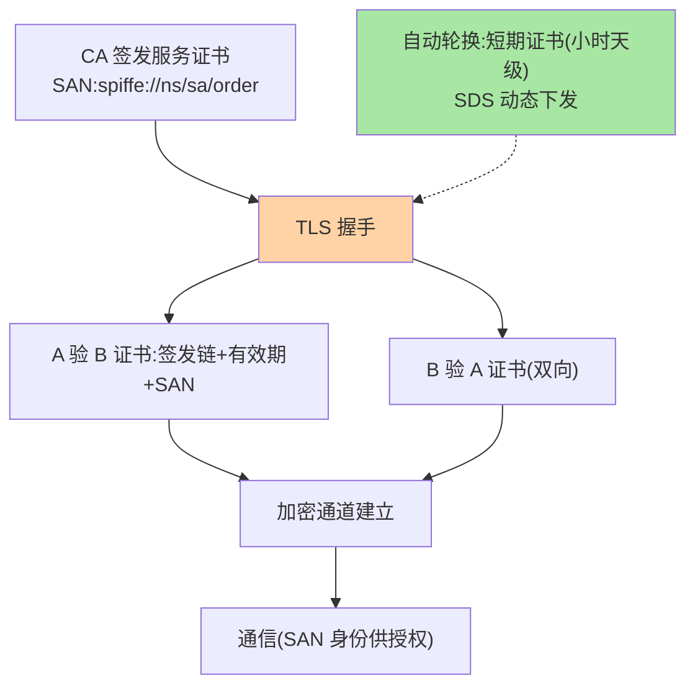
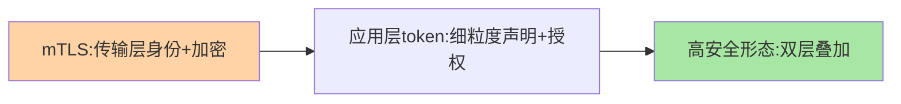

# mTLS 双向认证：每一跳都验明正身

> 普通 TLS 只验证服务端（客户端不知道对面是不是真的），**mTLS 双向验证**——双方互出证书验明正身，再加通道加密，是服务间认证的最强形态。这篇讲证书链、握手流程与证书管理的工程面。

> **本文核心**：mTLS = 双向证书认证 + 通道加密。**机制链**：CA（证书颁发机构）签发服务证书 → 握手时双方互出证书 → 各自校验对方证书（签发链 + 有效期 + 身份匹配 SAN）→ 建立加密通道 → 通信。**工程核心在证书管理**：签发（自动化签发，CSR 流程）、轮换（短期证书 + 自动轮换，吊销压力骤降）、信任链分发（根证书/中间证书的托管）——**「证书管理自动化」是 mTLS 能否落地的决定因素**，手工证书运维在百服务规模必崩。

## 一句话摘要

mTLS 的三层价值：**双向身份**（客户端验服务端防钓鱼、服务端验客户端防未授权调用——双向都比单向 TLS 多出客户端侧的确定性）、**通道加密**（传输防窃听/防篡改，与认证一体解决）、**身份可编程**（证书 SAN/CN 携带服务身份，授权判定直接读——身份与传输合体）。**服务网格的加持**：Istio 类把 mTLS 下沉到 sidecar（应用零改造获得 mTLS），证书签发轮换由网格托管（SDS 接口）——**「网格化 mTLS」让最强认证的落地成本大幅下降**，是 mTLS 从「金融专属」走向普及的转折。

## 一、为什么 mTLS 是服务认证的天花板

对比 token 类方案：token 证明「持有某个凭证」，mTLS 证明「持有对应私钥」（私钥不出机器）——**不可转移性**是 mTLS 的本质优势（token 被偷即被冒用，私钥偷不走除非攻破主机）；通道加密与认证一体（token 方案还依赖下层 TLS）。代价对应：证书体系（CA、签发、轮换、吊销）的重运维——**安全上限与运维下限并存**，网格托管正是化解运维下限的手段。

## 5W 速记卡

| 维度 | 一句话 |
|---|---|
| What | 双向证书认证 + 通道加密的服务间认证机制 |
| Why | 不可转移的私钥证明 + 通道加密一体，服务认证最强形态 |
| When | 核心数据链路、零信任成熟期、合规强要求场景 |
| Where | SDK TLS 层 / 服务网格 sidecar |
| How | CA 签发 → 双向握手验证书 → 加密通道 → SAN 身份授权 |

## 二、握手与证书管理全景

**证书管理的三个工程要件**：① **自动化签发**——服务启动向 CA/网格代理请求证书（CSR 流程全自动）；② **短期轮换**——证书有效期从「年级」降到「小时/天级」，泄露窗口随之骤减，轮换自动化是前提；③ **信任链分发**——根证书/中间证书的安全分发与托管（信任根泄露 = 全域失守，信任根的防护等级最高）。

## 三、与短期 token 的区别：方案对照

| 维度 | mTLS | 短期 token/JWT（互指篇 2） |
|---|---|---|
| 身份证明 | 私钥持有（不可转移） | 凭证持有（可转移） |
| 通道加密 | 一体解决 | 依赖下层 TLS |
| 管理重量 | CA 体系重 | 授权服务轻 |
| 适用 | 核心链路/零信任成熟态 | 通用场景起步 |

两者非互斥：mTLS 通道上仍可携带应用层 token（双层防御）——**核心链路 mTLS + 应用层细粒度授权**是高安全形态。

mTLS 与 token 的双层防御组合：

## 四、典型场景与误区

**典型场景**：支付/账务链路 mTLS 化（合规与安全双驱动）、多集群跨机房调用（跨不可信网络段的 mTLS）、服务网格全局 mTLS（Istio STRICT 模式，全流量强制双向认证）。

**误区与不适用**：① mTLS 一次配置永久安全——证书轮换停摆 = 全域定时失效；SAN 身份不更新 = 授权失真——**证书管理是持续运营**；② 信任根与普通证书同库管理——根证书泄露不可挽回（只能重建整个信任体系），根证书离线/高防护是铁律；③ 忽视性能影响——TLS 握手成本（连接复用可摊薄）、加解密 CPU（现代硬件可接受）——量级评估后多数场景无感，但高 QPS 链路要测。

## 五、💡 实战提示

- 💡 mTLS 落地的第一立项是「证书管理自动化」，不是第一份证书
- 💡 短期证书（24h 内）+ 自动轮换是网格时代的新默认，长期证书逐步退役
- 💡 信任根离线保管 + 分级 CA（根离线、中间在线签发）是标准架构
- 💡 落地决策口径：何时用什么——核心链路 mTLS（网格托管优先），一般链路短期 token，mTLS+token 双层留给支付级

## 六、你们可能会问

**Q1：证书轮换会导致调用中断吗？**
正确实现不会——轮换是「新连接用新证书」（存量连接继续到自然结束）；SDS 动态下发无缝切换；中断都来自「轮换流程缺陷」（如共享证书文件替换时的读冲突）。

**Q2：SAN 身份怎么与授权对接？**
SAN 携带标准化服务身份（如 SPIFFE ID）——服务端授权策略按身份匹配（`order 服务可调我`），身份→授权的映射集中策略化管理（互指篇 2 的策略引擎）。

**Q3：小团队做不了 CA 体系怎么办？**
两级路径：服务网格托管（Istio 类自带 CA 与 SDS，零 CA 建设）；或云厂商证书服务（托管私有 CA）——「自建 CA」不是 mTLS 的前提，「自动化」才是——mTLS 与 token 的取舍最终落在运维能力与安全等级的权衡上。

## 七、开放问题

- 后量子密码对现有证书体系的冲击（现有签名算法的可破解远景）——密码敏捷性（算法可替换的证书体系）是未来十年 mTLS 体系的隐藏工程题。

## 八、自测三问

1. mTLS 相对 token 方案的本质优势（不可转移性）？
2. 证书管理的三个工程要件？
3. 信任根为什么必须最高防护等级？

## 📎 核心带走

- **核心一句话**：mTLS = 双向证书认证 + 通道加密，安全天花板，成败在证书管理自动化
- **机制链**：CA 签发 → 双向握手验证（链/期/身份） → 加密通道 → SAN 身份供授权 → 自动轮换持续
- **失效点/边界**：轮换停摆即定时失效；信任根最高防护；性能需按链路实测但多数无感

## 📌 数据与事实声明

- 写于 2026-09-08，机制以 TLS 1.3/Istio SDS 的公开口径归纳
- 免责：以 RFC 与网格官方文档为准

## 📚 参考资料

| 类型 | 标题 | 来源 |
|---|---|---|
| 公开标准 | RFC 8446 (TLS 1.3) / SPIFFE X.509 SVID | ietf.org、spiffe.io |
| 官方文档 | Istio mTLS 与 SDS | istio.io |
| 关联系列 | 本系列篇 2 凭证谱系 | docs/architecture/service-governance/ |
