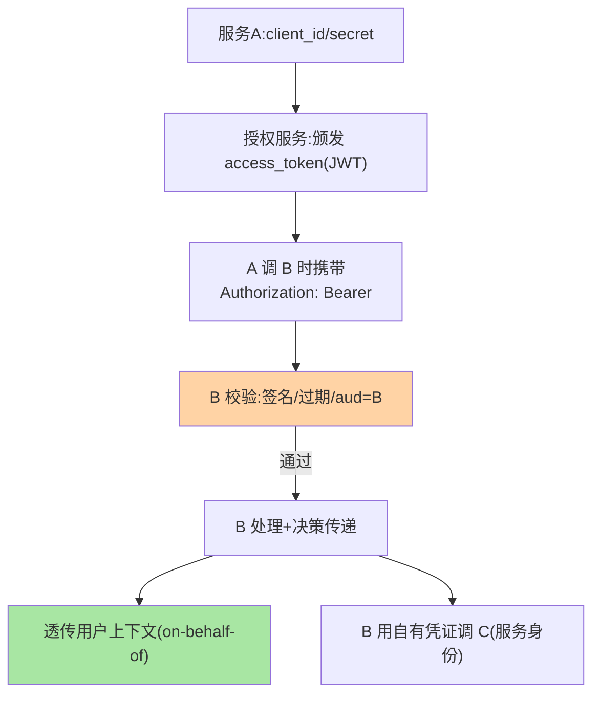
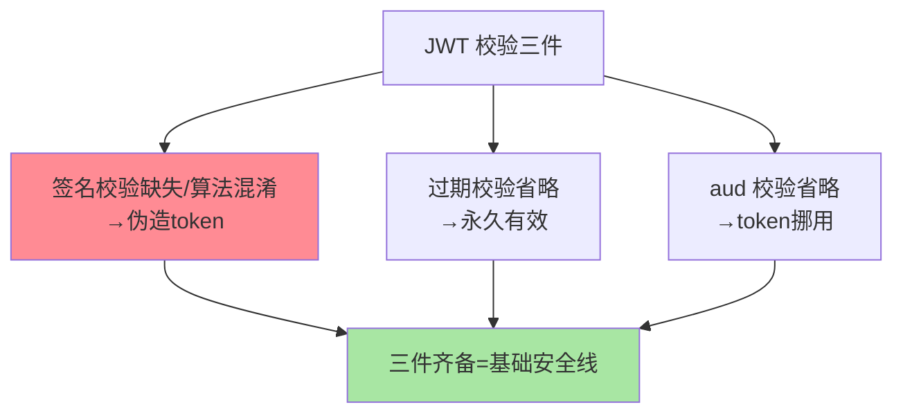

# Token 鉴权：JWT、OAuth2 与令牌传递

> Token 是服务间鉴权的通用形态：授权服务签发、服务携带校验、跨服务传递。这篇讲 JWT 的结构与取舍、OAuth2 的服务间流程、以及 token 在多跳调用中的传递语义。

> **本文核心**：三块——**JWT 结构**（Header.Payload.Signature：签名保证不可篡改、payload 自含声明免查库，无状态是优势、吊销难是代价）；**OAuth2 client_credentials**（服务间标准流程：client_id/secret 换 access_token，短期使用自动续期）；**令牌传递语义**（服务 A 拿用户 token 调 B，B 再调 C 时传什么——on-behalf-of 透传 vs 服务自有凭证，两种语义的安全边界不同）。**机制链**：申请凭证 → 携带 → 校验（签名/过期/受众 aud） → 传递决策（透传/换新）。

## 一句话摘要

JWT 的双刃：**自含声明**（payload 携带身份与权限声明，校验方本地验签免查授权服务——性能与解耦的红利）与**不可吊销**（签出即有效到过期，主动作废要黑名单/短有效期补偿——篇 2 的结论）。**aud（受众）校验**是常被漏掉的安全点：token 签发给 A 服务的，B 服务不应接受（aud 匹配校验防「token 挪用」）。**传递语义的选择**：用户上下文透传（on-behalf-of，下游知道真实用户）适合审计与数据权限；服务自有凭证（每跳换服务 token）适合零信任最小权限——**混合形态**（服务凭证 + 用户上下文声明分离）是工业主流。

## 一、为什么 token 是通用形态

token 的通用性来自「凭证与校验解耦」：授权服务集中发放（生命周期管理集中）、各服务本地校验签名（免每次查授权服务，性能解耦）、跨语言跨平台（JWT 是开放标准）——**集中管理 + 分布校验**的架构恰好匹配微服务的拓扑。mTLS 更强但不通用（CA 体系建设重），静态 Key 更简单但不安全——token 占据「通用与安全的平衡点」。

## 5W 速记卡

| 维度 | 一句话 |
|---|---|
| What | JWT 结构 + OAuth2 服务间流程 + 多跳传递语义 |
| Why | 集中发放 + 分布校验匹配微服务拓扑 |
| When | 服务间鉴权的默认实现、跨服务身份传递设计 |
| Where | 授权服务 + 各服务校验中间件 |
| How | 申请 → 携带 → 验签/过期/aud 校验 → 传递决策 |

## 二、签发、校验与传递全景

**传递语义的深度对照**：透传用户 token（B 拿用户的 token 调 C）——C 看到「真实用户」，但用户的 token 被扩散到 B 不该代表其访问的 C（越权放大风险）；服务自有凭证（B 用自己的身份调 C）+ 用户上下文作为声明传递——C 明确知道「是 B 在调、代表用户 X」——**「谁在调」与「为谁而调」的分离**是零信任的 token 语义核心（OAuth2 token exchange 标准化此流程）。

## 三、与会话 Cookie 的区别：机制对照

| 维度 | Token(JWT) | 会话 Cookie（互指篇 1） |
|---|---|---|
| 状态 | 无状态（自含声明） | 有状态（服务端 session） |
| 跨服务携带 | 天然（Header 传递） | 域绑定难跨服务 |
| 吊销 | 难（黑名单补偿） | 易（删 session） |
| 适用 | 服务间/开放 API | 浏览器会话 |

「无状态 vs 可吊销」的取舍是 token 选型的第一决策——服务间场景自动化优先选 JWT + 短有效期；高敏用户会话可接受有状态的即时吊销。

JWT 三件校验的漏洞对照：

## 四、典型场景与误区

**典型场景**：内部微服务鉴权标配（client_credentials + JWT 短期 token + aud 校验）、开放平台（第三方应用 OAuth2 授权码模式 + scope 限制）、跨服务用户上下文（token exchange 标准流程）。

**误区与不适用**：① payload 塞敏感数据——JWT payload 只是 Base64 编码（非加密），任何人可解码阅读——敏感数据进 payload 是泄露事故；② aud 校验省略——token 挪用（A 的 token 被 B 接受）的直接漏洞；③ token 有效期过长（天级）——吊销难的代价被放大，服务间 token 分钟到小时级是常见口径。

## 五、💡 实战提示

- 💡 JWT 三件校验缺一不可：签名 + 过期 + aud——少一个都是一个漏洞
- 💡 secret/私钥进密管（互指 config-center 篇 8），禁止硬编码
- 💡 传递语义设计进链路规范：「谁在调」与「为谁而调」分离，token exchange 优先于裸透传

## 六、你们可能会问

**Q1：JWT 签名算法怎么选？**
RS256/ES256（非对称）优于 HS256（对称）——非对称让校验方只持公钥（签名能力只在授权服务），对称密钥全校验方共有（任何一个泄露即可伪造）；HS256 仅限极可信封闭体系。

**Q2：token 续期怎么自动化？**
客户端 SDK 内置刷新（到期前主动换新）——刷新失败重试与降级（旧 token 过期前的宽限）是 SDK 细节；「人工换 token」的体系撑不过凭证轮换。

**Q3：token 和 mTLS 能叠加吗？**
能且推荐（篇 3 的双层防御）——mTLS 做传输身份与加密，JWT 做应用层声明与授权——两者在不同层回答不同问题。

## 七、开放问题

- JWT 的替代形态（PASETO 等）在安全社区讨论，「JWT 的历史包袱」（算法混淆类历史漏洞）能否被新标准化解，值得安全侧跟踪。

## 八、自测三问

1. JWT「无状态」的红利与代价分别是什么？
2. aud 校验防什么攻击？
3. 「谁在调」与「为谁而调」的分离为什么重要？

## 📎 核心带走

- **核心一句话**：Token 鉴权 = JWT 自含校验（签名/过期/aud 三件）+ OAuth2 标准流程 + 多跳传递语义设计
- **机制链**：申请凭证 → 携带 → 三件校验 → 传递决策（exchange 优先于裸透传） → 下游校验
- **失效点/边界**：payload 非加密禁放敏感数据；aud 省略即挪用漏洞；有效期短是吊销难的补偿

## 📌 数据与事实声明

- 写于 2026-09-08，机制以 RFC 7519/6749 与 OAuth2 Token Exchange 草案口径归纳
- 免责：以 RFC 与各授权服务官方文档为准

## 📚 参考资料

| 类型 | 标题 | 来源 |
|---|---|---|
| 公开标准 | RFC 7519 (JWT) / OAuth2 Token Exchange | ietf.org |
| 关联系列 | 本系列篇 2/3 / gateway 篇 6 | docs/architecture/service-governance/ |
| 社区沉淀 | Token 鉴权公开实践 | 技术社区公开文章 |
