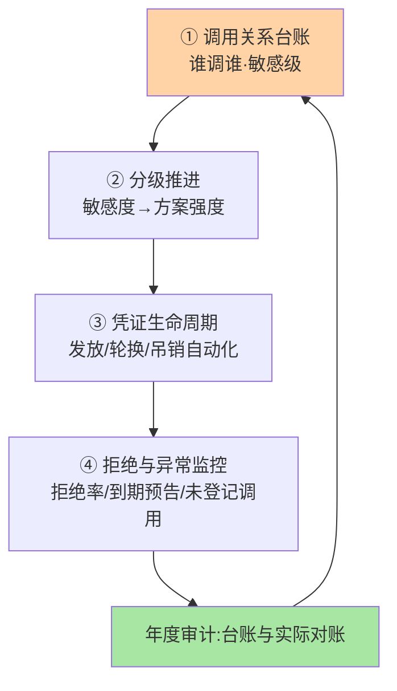
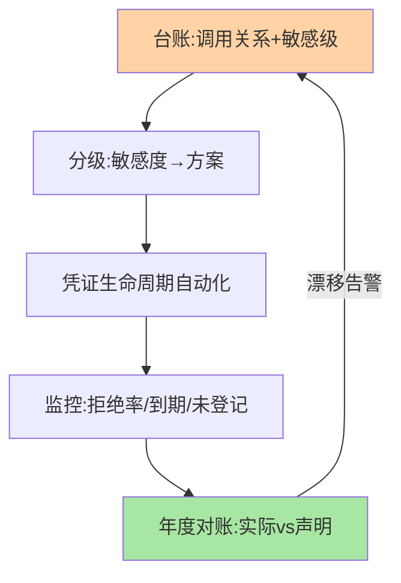

# 服务鉴权最佳实践：从台账到自动化的治理集

> 全系列收束篇：把认证/授权/mTLS/token 的机制沉淀为**治理规范集**——调用关系台账、分级推进路线、凭证生命周期管理、拒绝监控四大块，直接可执行。

> **本文核心**：四大治理块——**调用关系台账**（谁在调谁，鉴权的地图，没有台账一切无从谈起）、**分级推进路线**（核心数据服务 mTLS+白名单 → 一般服务短期 token → 公开只读最后覆盖）、**凭证生命周期管理**（台账化发放/轮换/吊销，全自动）、**拒绝监控**（鉴权拒绝率双信号看板：配置健康 + 攻击检测）。**机制链**：台账盘点 → 分级定方案 → 凭证自动化 → 监控闭环 → 定期审计。

## 一句话摘要

治理集的核心条目：**台账**——调用关系（调用方/被调方/接口/数据敏感级）是鉴权的底图，新调用「先申请后开通」（台账即准入）；**分级**——敏感度对齐方案强度（篇 1 的分级推进），拒绝「一刀切全 mTLS」的过度工程；**生命周期**——凭证发放审批化、轮换自动化、吊销即时化，台账与自动化缺一即失修；**监控**——拒绝率、凭证到期预告、异常调用模式（未登记调用方尝试）三看板。**鉴权治理的成熟度 = 台账完备度 × 自动化程度**——两者都靠持续运营而非一次性建设。

## 一、为什么鉴权治理「建设容易运营难」

鉴权机制上线（mTLS/token 铺开）是工程问题，之后的凭证轮换、新调用准入、权限变更、拒绝处理是**运营问题**——运营缺失的典型衰变：凭证过期没人换（调用大面积失败）、新服务直连没登记（台账失真）、权限变更无审计（无法回答「谁能调什么」）。**鉴权体系的竞争力在运营自动化**，本篇的治理集围绕「让运营可持续」设计。

## 5W 速记卡

| 维度 | 一句话 |
|---|---|
| What | 台账 + 分级推进 + 凭证生命周期 + 拒绝监控的治理集 |
| Why | 鉴权建设易运营难，可持续性靠治理集 |
| When | 鉴权体系规划、年度审计、新服务接入 |
| Where | 治理平台 + CI/CD + 监控体系 |
| How | 台账盘点 → 分级方案 → 自动化生命周期 → 监控闭环 |

## 二、治理集全景

**台账的自动化维护**：手工台账必然失真——从注册中心/网格/网关自动采集「实际调用关系」，与「申请开通的关系」比对：**实际有、台账无 = 未登记调用（告警）**；台账有、实际无 = 僵尸授权（清理）。台账的「实际-声明」对账是鉴权治理的照妖镜（与配置漂移 diff 同构，互指 config-center 篇 2）。

## 三、与用户权限体系的区别：双体系对照

| 维度 | 服务鉴权治理（本篇） | 用户权限体系（RBAC/ABAC） |
|---|---|---|
| 对象 | 服务与调用关系 | 人与功能/数据 |
| 粒度演进 | 服务级 → 接口级 | 功能级 → 数据级 |
| 交汇点 | 端到端用户上下文（代用户访问的数据权限） | 用户的功能与数据权限 |

端到端场景的完整安全 = 服务鉴权（B 确认是 A 在调）+ 用户授权（确认该用户能看此数据）——**两套体系在数据访问点交汇**（互指篇 4 的传递语义）。

治理集的闭环全景：

## 四、典型场景与误区

**典型场景**：鉴权体系冷启动（台账盘点 → 核心服务试点 → 分级铺开）、年度安全审计（台账对账 + 凭证生命周期检查 + 拒绝日志回顾）、新服务接入流程（申请 → 定级 → 发证 → 开通白名单 → 接入监控五步）。

**误区与不适用**：① 鉴权建设追求「一次全覆盖」——分级推进的节奏被打乱，改造阻力反噬项目；② 拒绝请求只记日志不进监控——拒绝率是鉴权体系的「心电图」；③ 凭证管理平台与台账脱节——两套记录必然漂移，台账应以凭证平台的实际数据为准。

## 五、💡 实战提示

- 💡 台账对账自动化：实际调用关系（网格/网关采集）月度比对申请台账
- 💡 新服务接入五步流程化：申请 → 定级 → 发证 → 开通 → 接入监控
- 💡 三看板起步：拒绝率、凭证到期、未登记调用——三图在手鉴权不慌
- 💡 严格度与治理成本的权衡：全量接口级授权的维护代价换细粒度安全——分级强度的取舍按数据敏感度定
- 💡 强度决策口径：何时用什么——核心数据链路 mTLS+接口级授权，标准链路 JWT+服务级白名单，低敏内部 Key 过渡即可，投入与敏感度对齐

## 六、你们可能会问

**Q1：历史遗留的无鉴权调用怎么办？**
不追溯封杀（业务中断），「登记豁免 + 限期治理」：先登记进台账标记遗留，给迁移窗口，到期未治理的自动拒绝——给出口但设时限。

**Q2：鉴权的性能损耗怎么评估？**
token 校验（本地验签微秒级）/ mTLS 握手（连接复用摊薄）/ 授权判定（本地策略缓存）——正常损耗可控，性能事故多出在「校验远程化」（每次调用查授权服务），本地缓存是标配解。

**Q3：鉴权体系的目标终态是什么？**
「默认拒绝、按需开通、全程审计」三句话——所有调用默认不可行、开通走流程、全程可追溯；机制可以分批，终态语义要早定。

## 七、开放问题

- 策略即代码（授权策略进 Git 走 PR、CI 校验、自动下发）与台账自动化的融合——鉴权治理的「运维自动化」正在向「策略工程化」演进。

## 八、自测三问

1. 治理集四块的闭环关系？台账的「实际-声明」对账怎么做？
2. 「建设容易运营难」的衰变剧本有哪些环节？
3. 终态三句话（默认拒绝/按需开通/全程审计）怎么理解？

## 📎 核心带走

- **核心一句话**：服务鉴权治理 = 台账 × 分级推进 × 凭证自动化 × 拒绝监控——成熟度 = 台账完备 × 自动化程度
- **机制链**：台账盘点 → 分级定方案 → 凭证全生命周期自动化 → 三看板监控 → 年度对账审计
- **失效点/边界**：手工台账必失真；追溯封杀不可取；终态三句早定、机制分批落地

## 📌 数据与事实声明

- 写于 2026-09-08，治理集为本系列机制的落地化归纳
- 免责：具体流程按组织安全规范评审

## 📚 参考资料

| 类型 | 标题 | 来源 |
|---|---|---|
| 关联系列 | 本系列篇 1-4 / config-center 篇 8 | docs/architecture/service-governance/ |
| 公开标准 | 零信任架构 NIST SP 800-207（公开） | nist.gov |
| 社区沉淀 | 服务鉴权治理公开实践 | 技术社区公开文章 |
