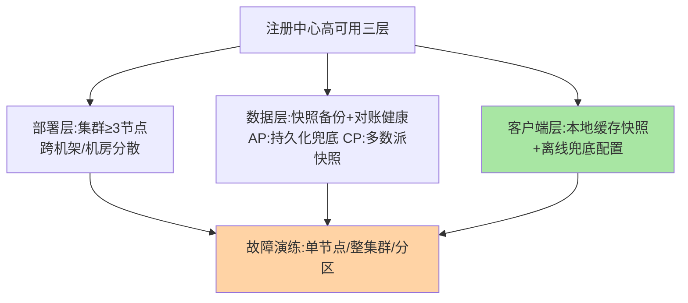

# 注册中心高可用与运维：基座自身的守门线

> 注册中心的爆炸半径是全站调用——它自己的高可用与运维纪律，就是全站的守门线。这篇收束全系列：集群部署形态、监控告警、故障演练三件套，把「基座不能倒」从口号变成清单。

> **本文核心**：基座高可用 = 部署/数据/客户端三层防线 + 监控告警演练三件套。**机制链**：集群跨故障域部署 → 注册表快照与对账健康 → 客户端缓存快照与离线兜底 → 核心指标心电图 → 季度演练闭环。

## 一句话摘要

注册中心自身的高可用三层：**部署层**（集群化 + 跨故障域，至少 3 节点、机房内分散）、**数据层**（AP 系靠对账与持久化、CP 系靠多数派与快照——注册表「可重建」但摘除状态与元数据要尽量不丢）、**客户端层**（本地缓存快照 + 离线兜底配置——最后一道防线永远在客户端）。**运维三件套**：监控（注册/查询成功率、集群健康、推送延迟）、告警（分级到值班）、演练（注册中心整体宕机、网络分区、集群扩容季度化）——**基座的可用性是「设计 + 演练」出来的，不是部署出来的**。

## 一、为什么基座的高可用是「最后一道防线」

前面各篇的可用性设计（推拉结合、本地缓存、AP 取舍）都在降低对注册中心的实时依赖——但注册中心自身的可用性仍是根：**长期宕机会耗尽所有下游兜底**（缓存过期、新实例无法注册、摘除停摆）。基座高可用的目标不是「永不宕」，是「**任何单点/单机房故障时，剩余能力足够撑到恢复**」——这个目标的达成靠三层防线 + 持续演练。

## 5W 速记卡

| 维度 | 一句话 |
|---|---|
| What | 部署/数据/客户端三层高可用 + 监控告警演练三件套 |
| Why | 注册中心爆炸半径是全站调用，基座自身是守门线 |
| When | 建设期部署设计、运行期巡检、故障复盘 |
| Where | 注册中心集群 + 客户端 SDK + 监控体系 |
| How | 集群跨故障域 + 数据备份策略 + 演练季度化 |

## 二、三层防线与演练清单

**部署层**：奇数节点跨故障域（CP 系的多数派要求、AP 系的对账效率）；**数据层**——注册表虽可重建，但**定期快照 + 摘除状态持久化**能把「重启后全量重注册风暴」压平（万实例同时重注册是注册中心的自我 DDoS）；**客户端层**：缓存快照（篇 4）+ 离线兜底配置（注册中心全灭时的最后地址列表——静态保底）。

全灭场景的三段接力预案：

**演练清单（季度化）**：单节点宕机（无感验证）、整集群宕机（缓存兜底验证 + 恢复后重注册风暴验证）、网络分区（AP/CP 行为验证，篇 6 的推演落到实战）、扩容（在线加节点）。

## 三、监控与告警的守门指标

| 指标 | 含义 | 告警级别 |
|---|---|---|
| 注册/查询成功率 | 核心服务能力 | P0：失败率突增 |
| 集群节点健康数 | 可用节点余量 | P0：低于多数派/半数 |
| 推送/对账延迟 | 列表新鲜度 | P1：持续超阈值 |
| 实例总数突变 | 摘除风暴/重注册风暴征兆 | P1：斜率告警 |

**实例总数突变告警**最容易被忽视——批量误摘（网络抖动）或重注册风暴都会在「总数曲线」上先现形，它是注册中心的「心电图」。

## 四、与 MySQL 高可用运维的区别：MySQL 对照

| 维度 | 注册中心高可用 | MySQL 高可用（互指主从与高可用深度） |
|---|---|---|
| 数据可重建性 | 高（实例重注册） | 低（业务事实） |
| 恢复重心 | 快照 + 客户端缓存 | 备份 + 主从切换 |
| 演练焦点 | 分区行为/摘除风暴 | 切换/延迟/校验 |

两者演练纪律同源（季度化、注入式、报告归档），差异在**恢复重心**——注册中心靠「可重建性 + 客户端兜底」，MySQL 靠「数据不丢 + 快速切换」——可重建性高反而让注册中心的恢复设计更轻，但**演练纪律一分不能少**。

## 五、典型场景与误区

**典型场景与决策口径**：新集群建设验收（三层防线 + 演练全过才算投产）——**选型与运维的决策口径**：多活与否、备份策略、演练频率都按爆炸半径定，全站级基座取最高档；大促保障（注册中心进核心保障清单——它挂了比数据库挂了更早致命）、组件升级（滚动升级 + 版本兼容矩阵 + 回滚路径）。

**误区与不适用**：① 注册中心不进核心监控大盘——「它只是个辅助组件」的认知是事故之源；② 只演练单节点不演练整集群——缓存兜底能力没验过，真故障时全是首演；③ 升级不做兼容矩阵（服务端与 SDK 版本配对）——注册中心协议演进出过多次不兼容事故。

## 六、💡 实战提示

- 💡 三节点起步、跨机架部署是最小生产形态，两节点等于没有高可用
- 💡 实例总数突变告警是心电图，配斜率告警不用绝对值
- 💡 重启注册中心前先想「重注册风暴」——分批恢复节点，别一口气全拉起

## 七、你们可能会问

**Q1：注册中心全灭的最坏场景怎么活？**
客户端缓存供列表（分钟到小时级）→ 离线兜底配置（静态地址保核心链路）→ 重建注册中心（快照恢复 + 实例重注册）——三段接力就是全灭预案的骨架，演练时按这三段走。

**Q2：重注册风暴怎么防？**
恢复时分批拉起节点 + 客户端注册退避（重试带抖动）——「风暴」的本质是万实例同一瞬间集中写，打散写入口径即可。

**Q3：注册中心要不要多活？**
同城多活（AP 系天然支持对等部署）成本低收益高；跨城多活要专门设计（对账跨城延迟）——按爆炸半径评估，多数场景同城双机房已够。

## 八、开放问题

- 云托管注册中心把部署与高可用外包，但「演练」外包不了——托管形态下租户侧的演练职责边界值得行业共识。
- 注册中心自身的可观测（推送延迟、对账健康）工具链仍不成体系，自建埋点是普遍现状。

## 九、自测三问

1. 三层防线各防什么？客户端层的「离线兜底配置」是什么？
2. 重注册风暴的成因与两个缓解手段？
3. 为什么「实例总数突变」是最容易被忽视的关键告警？

## 📎 核心带走

- **核心一句话**：注册中心的高可用 = 部署跨故障域 + 数据快照对账 + 客户端缓存兜底的三层防线，靠季度化演练维持
- **机制链**：部署层集群化 → 数据层备份/对账 → 客户端层缓存/离线兜底 → 监控告警心电图 → 演练验证闭环
- **失效点/边界**：全灭场景靠三段接力预案；可重建性不等于不用演练——基座纪律一分不能省

## 📌 数据与事实声明

- 写于 2026-09-08，部署与演练口径为业界工程共识归纳
- 「3 节点/季度演练」为经验口径
- 免责：以各组件官方运维文档为准

## 📚 参考资料

| 类型 | 标题 | 来源 |
|---|---|---|
| 关联系列 | 本仓库 MySQL《一致性校验与切换演练》（演练纪律互指） | docs/data/mysql/ |
| 官方文档 | Nacos/ZooKeeper 部署运维文档 | 各官方站点 |
| 社区沉淀 | 注册中心故障复盘公开文章 | 技术社区公开文章 |
