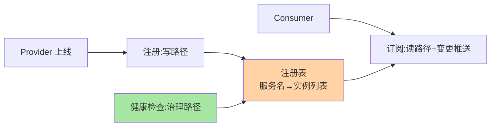

# 注册中心是什么：从手动配地址到动态发现

> 一句话：注册中心是**分布式环境下的服务地址簿**——服务上线登记、下线摘除、调用方实时拿到最新地址列表。它解决的不是「找到地址」，是「地址一直在变的前提下，随时找得到」。

> **本文核心**：注册中心是分布式环境下的服务地址簿：注册（写）+订阅（读）+健康检查（治理）三能力维持「地址一直在变但随时找得到」。
> **机制链**：硬编码 → 配置文件 → 配置中心 → 注册中心 → 动态发现

## 一句话摘要

微服务实例的地址是**动态的**（扩缩容、发布、故障迁移），静态配置必然失效。注册中心用三大能力化解：**注册**（provider 上线登记）、**订阅**（consumer 拿到并持续追踪地址列表）、**健康检查**（坏实例自动摘除）。「为什么难」在于它自己也是个分布式系统——**它挂了怎么办、数据不一致怎么办**，这两个问题把 AP/CP 选型推到台前，是本系列后半程的主线。

## 一、为什么不能继续手动配地址

一家公司从单体拆微服务的第一周就会遇到：A 服务调 B 服务，B 的 IP 写在 A 的配置文件里——B 扩容三个实例后，流量还是只打老实例；B 发版换 IP，A 直接连接失败。手工运维的三大失效：**变更频率超出人力**（日均几十次发布）、**故障响应超时**（实例挂了没人摘）、**扩容不生效**（新实例无人知晓）。

这条演进线（硬编码 → 配置文件 → 配置中心 → 注册中心）是服务治理的基础架构演进主线——每一步都在解决「变化传播的速度」问题，注册中心把变化传播做到了秒级自动化。

## 5W 速记卡

| 维度 | 一句话 |
|---|---|
| What | 服务地址的动态登记与发现基座（地址簿） |
| Why | 实例地址动态变化，静态配置必然失效 |
| When | 一切服务间调用的寻址环节 |
| Where | 独立集群（ZooKeeper/Nacos/Consul/Eureka/etcd） |
| How | 注册登记 + 订阅推送 + 健康检查摘除 |

## 二、核心模型：一张注册表与三大能力

注册中心的本质是**一张持续更新的注册表**（服务名 → 实例列表），三大能力围绕它展开——各自占一条路径：

**注册**（写路径：provider 上线写入自己的地址与元数据）、**订阅**（读路径：consumer 拉取列表并订阅变更推送）、**健康检查**（治理路径：心跳或探测，摘除坏实例）。这张表的可信度决定调用成功率——**注册表错了，后面所有调用全错**，这就是健康检查与一致性机制权重极高的原因。

## 三、与配置中心的区别：同为「中心化」，管的东⻄不同

| 维度 | 注册中心 | 配置中心 |
|---|---|---|
| 管理对象 | 服务实例地址（动态、可丢弃） | 配置项（持久、需版本化） |
| 数据生命周期 | 实例下线即删 | 长期留存、可回滚 |
| 一致性诉求 | 可容忍短暂旧列表（AP 常见） | 强一致倾向（配错就是事故） |
| 典型代表 | Nacos/ZooKeeper/Eureka | Nacos/Apollo |

两者常被同一个组件兼任（Nacos 二合一），但**治理语义不同**：注册表数据「丢了可重建」（实例会重新注册），配置数据「丢了就是事故」——这个差异决定了两者一致性取向的分化（篇 6 展开）。

## 四、典型场景与误区

**典型场景**：RPC 框架寻址（Dubbo/Spring Cloud 的服务列表来源）、网关上游发现（网关动态拿到后端实例）、跨语言调用寻址（HTTP 客户端从注册中心取地址）。

**误区与不适用**：① 把注册中心当存储用——注册表是「易失的运行时状态」，持久数据进配置中心或数据库；② 注册中心挂了就全站瘫痪——**成熟客户端有本地缓存快照**，注册中心短暂不可用时已发现的地址仍可用（这是高可用设计的核心认知，篇 10 展开）；③ 单机部署当生产——注册中心自己必须是集群，它挂掉的爆炸半径是全站调用。

## 五、你们可能会问

**Q1：K8s 自带 Service 发现，还需要注册中心吗？**
看边界：集群内简单寻址用 K8s Service 够；应用层的细粒度治理（版本路由、灰度、权重、跨集群）仍需要应用级注册中心——两者并存是常态（互指 K8s 系列与本系列篇 8）。

**Q2：为什么不用 DNS 做服务发现？**
DNS 是「能做」不是「好用」：缓存导致变更传播慢、无健康检查语义、无元数据——DNS 适合粗粒度场景，微服务寻址的动态性需求超出 DNS 的舒适区。

**Q3：注册中心的数据能丢吗？**
注册表丢了可以重建（实例重注册），但「丢失窗口内」的摘除状态、元数据变更会乱——不同实现（内存型 vs 持久型）的取舍在篇 6/7 展开。

## 六、自测三问

1. 注册中心三大能力是什么？各自的路径角色？
2. 注册中心与配置中心的治理语义差异？
3. 「注册中心挂了全站瘫痪」为什么是伪命题？前提是什么？

下一篇讲「注册中心核心模型」：服务/实例/元数据三要素与注册表本质。

## 💡 实战提示

- 💡 评估注册中心先看「挂了会怎样」：客户端缓存的有无决定爆炸半径
- 💡 服务名是长期契约，命名规范先于第一个服务上线
- 💡 别把注册中心当数据库，注册表是易失运行时状态

## 开放问题

- 心跳与深探测的两层判活，在 Service Mesh 场景是否会收敛到网格基础设施统一承担？sidecar 接管健康检查后应用 SDK 的判活职责边界值得跟踪。

## 📎 核心带走

- **核心一句话**：注册中心是分布式环境下的服务地址簿：注册（写）+订阅（读）+健康检查（治理）三能力维持「地址一直在变但随时找得到」。
- **机制链**：硬编码 → 配置文件 → 配置中心 → 注册中心 → 动态发现
- **失效点/边界**：注册中心短暂故障不等于全站瘫痪——前提是客户端有本地缓存快照（篇 4）

## 📌 数据与事实声明

- 写于 2026-09-08，机制描述为业界共识口径；组件特性以各官方文档为准
- 免责：以各注册中心官方文档为准

## 📚 参考资料

| 类型 | 标题 | 来源 |
|---|---|---|
| 关联系列 | 本仓库 Nacos / K8s Etcd 系列（组件视角） | docs/middleware/nacos/ |
| 官方文档 | Nacos/ZooKeeper/Eureka 概念篇 | 各官方站点 |
| 社区沉淀 | 服务发现机制公开技术文章 | 技术社区公开文章 |
