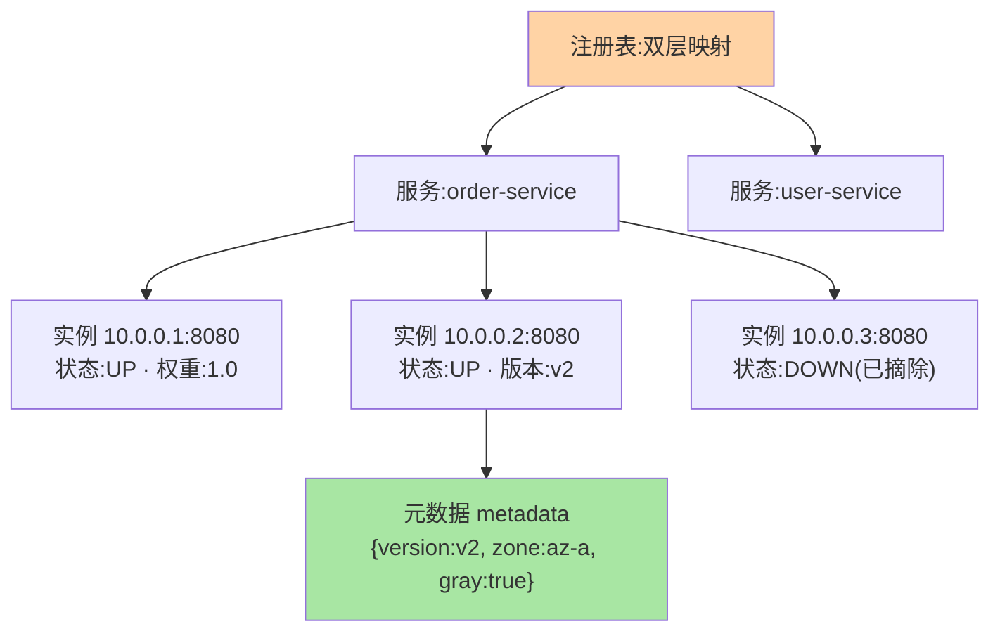
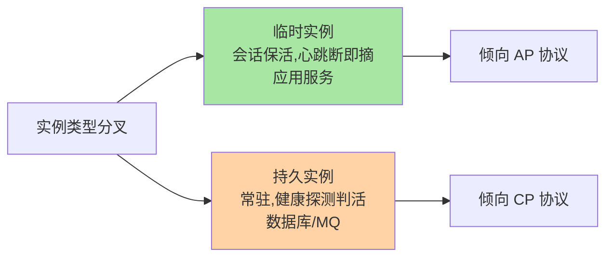

# 注册中心核心模型：服务、实例与元数据三要素

> 「服务」和「实例」不是一个东西，「元数据」是治理的钥匙——三要素模型立住了，注册/订阅/健康检查（后面三篇）都有了挂靠的对象。这篇把注册表的**数据结构本质**讲透。

> **本文核心**：注册表 = 服务 → 实例 → 元数据的三层映射，元数据是治理策略的挂载点。
> **机制链**：服务名（逻辑契约）→ 实例集合（IP:Port 唯一）→ 元数据（版本/机房/权重）→ 路由/灰度/均衡消费

## 一句话摘要

注册表的三要素：**服务（Service，逻辑名，如 order-service）→ 实例（Instance，一台具体地址：IP:Port + 状态）→ 元数据（Metadata，实例身上的键值标签：版本/机房/权重）**。注册表的本质是**双层映射的内存索引**（服务名 → 实例集合，实例集合内按地址唯一），元数据挂在实例上是后续**路由/灰度/权重**治理的依据（互指 service-routing / metadata-center 系列）——模型理解对了，机制篇全是水到渠成。

## 一、为什么模型要先立住

机制篇（注册/订阅/健康检查）全部围绕「对什么数据做什么操作」展开：注册是「往实例集合里加元素」，摘除是「改实例状态」，订阅是「追踪集合变更」——**没有模型，机制就是散装知识点**。三要素也是各组件的公共语言（Nacos 的 Service/Instance/metadata、ZooKeeper 的 znode 路径设计）——跨组件迁移时，变的只是实现，不变的是模型。

## 5W 速记卡

| 维度 | 一句话 |
|---|---|
| What | 服务 → 实例 → 元数据的三层注册表模型 |
| Why | 机制操作（注册/摘除/订阅）都需要明确的数据对象 |
| When | 理解任何注册中心实现、设计实例元数据时 |
| Where | 各组件的注册表核心数据结构 |
| How | 服务名做逻辑索引，实例地址唯一，元数据挂实例供治理消费 |

## 二、三要素与注册表结构

三要素的职责边界：**服务是逻辑契约名**（调用方只认名字不认地址）、**实例是物理执行单元**（上下线的最小粒度）、**元数据是治理维度的载体**（版本/机房/权重/灰度标记——治理策略全部「寄存」在这里）。实例状态机（UP/DOWN/STARTING…）是健康检查的输出（篇 5），元数据是路由的输入（路由系列）——**注册表是治理体系的数据枢纽**。

## 三、临时实例与持久实例：模型里的关键分叉

注册表里的实例分两类，语义完全不同：**临时实例**（客户端会话保活，心跳断了自动摘除——适合应用服务，挂了就该摘）与**持久实例**（注册后常驻，靠服务端健康探测判活——适合数据库、MQ 这类「不该被摘」的基础设施成员）。这个分叉直接影响一致性协议的选择（Nacos 的 AP/CP 双模正是按实例类型分协议，互指 Nacos 系列与篇 6）：

**建模时想清楚「实例挂了该不该自动消失」，协议选型就定了一半**——这个取舍的另一半在一致性语义。两代注册中心（从纯 CP 的 ZooKeeper 到 AP/CP 双模的 Nacos）的演进主线，正是这条分叉的显式化。

## 四、与 DNS 记录模型的区别：DNS 对照

| 维度 | 注册中心模型 | DNS 记录 |
|---|---|---|
| 数据粒度 | 实例级（带状态/元数据） | 记录级（A/CNAME 值） |
| 变更传播 | 秒级推送 | TTL 缓存延迟 |
| 治理语义 | 状态机 + 元数据 + 订阅 | 静态解析 |

DNS 是「粗粒度的名字→地址」，注册中心是「细粒度的可治理实例集合」——两种模型的取舍是粒度与治理能力的权衡，差异在元数据与状态机，这正是治理能力的来源。

## 五、典型场景与误区

**典型场景**：RPC 提供方注册（启动时写注册表 + 元数据带版本机房）、网关上游订阅（订阅服务实例变更推送）、多机房部署（元数据标 zone，路由按机房就近——互指路由系列）。

**误区与不适用**：① 服务名设计随意（带端口带环境后缀）——服务名是长期契约，命名规范先行（互指 service-versioning 的分组语义）；② 元数据当业务存储——元数据是治理标签不是业务字段，大对象塞元数据拖垮注册表推送；③ 忽视实例唯一键——同一实例重复注册产生脏数据（IP:Port 唯一性约束在注册中心多年演进中反复验证，是基本纪律）。

## 六、你们可能会问

**Q1：一个服务能有多少实例？注册表有上限吗？**
技术上限远超业务需求（十万级实例注册表仍可运行），真正的约束是**推送风暴**——万级实例的服务每次变更推送量巨大，超大集群用分片订阅/增量推送（组件实现差异，互指 Nacos 系列）。

**Q2：服务分组（group）算第四要素吗？**
分组是「服务的命名空间维度」（Nacos 的 group/namespace），建模上属于服务的属性而非独立层——概念归位到「服务的命名空间属性」，跨组件对照就不乱。

**Q3：实例的元数据谁写谁读？**
注册方写入（自报版本/机房），治理方消费（路由/灰度平台读取决策）——元数据的「生产者-消费者」契约要纳入治理规范，乱写的元数据等于没有。

## 七、自测三问

1. 三要素各自承载什么？注册表的深层结构是什么？
2. 临时实例与持久实例的语义分叉？它影响什么选型？
3. 元数据的「生产者-消费者」契约是什么？

下一篇讲「服务注册机制」：provider 上线登记与租约续期。

## 💡 实战提示

- 💡 元数据键值进治理规范：命名/取值/必填项，乱写的标签等于没有
- 💡 基础设施成员（DB/MQ）用持久实例，应用服务用临时实例
- 💡 IP:Port 唯一键约束务必开启，防重复注册脏数据

## 开放问题

- 心跳与深探测的两层判活，在 Service Mesh 场景是否会收敛到网格基础设施统一承担？sidecar 接管健康检查后应用 SDK 的判活职责边界值得跟踪。

## 📎 核心带走

- **核心一句话**：注册表 = 服务 → 实例 → 元数据的三层映射，元数据是治理策略的挂载点。
- **机制链**：服务名（逻辑契约）→ 实例集合（IP:Port 唯一）→ 元数据（版本/机房/权重）→ 路由/灰度/均衡消费
- **失效点/边界**：临时/持久实例的分叉决定一致性协议取向，建模期想清楚选型期少返工

## 📌 数据与事实声明

- 写于 2026-09-08，模型口径综合 Nacos/ZooKeeper/Eureka 官方文档归纳
- 免责：以各组件官方文档为准

## 📚 参考资料

| 类型 | 标题 | 来源 |
|---|---|---|
| 官方文档 | Nacos 架构概念 / ZooKeeper 数据模型 | nacos.io、zookeeper.apache.org |
| 关联系列 | 本仓库 Nacos 系列（组件实现互指） | docs/middleware/nacos/ |
| 社区沉淀 | 注册中心模型设计公开文章 | 技术社区公开文章 |
