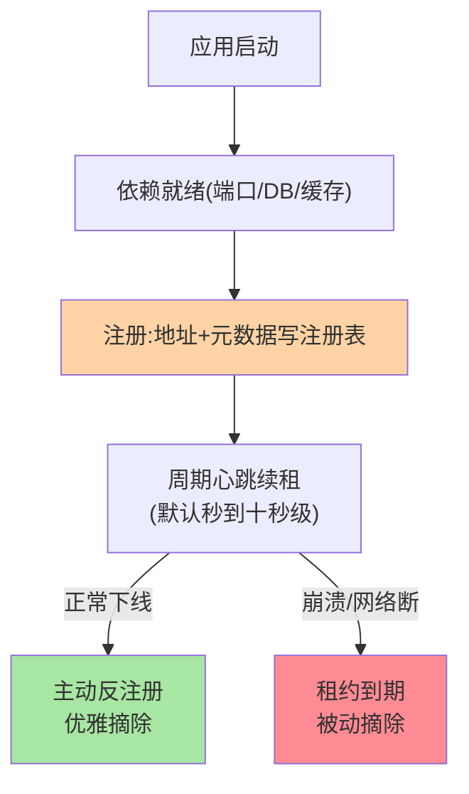
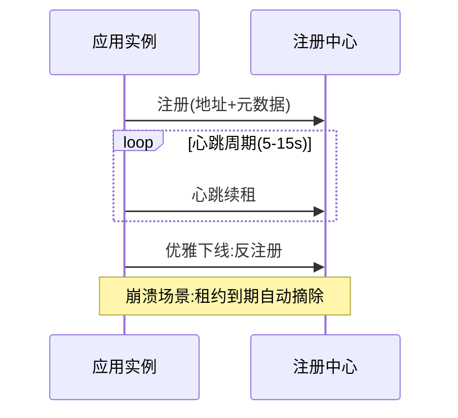

# 服务注册机制：上线登记与租约续期

> Provider 启动后「把自己写进注册表」看似一行 API，背后的机制设计决定了注册表的**可信度**：注册时机、实例信息、租约续期三件事，任何一件设计歪了，注册表就会变成「地址垃圾场」。

> **本文核心**：注册是租约制持续履约：就绪后注册、心跳续租、双通道退出。
> **机制链**：依赖就绪 → 写入地址+元数据 → 周期心跳续租 → 主动反注册（优雅）/租约到期摘除（兜底）

## 一句话摘要

服务注册的完整机制：**① 注册时机**——Spring 容器就绪后注册（过早注册会收到未就绪流量）；**② 注册内容**——地址 + 端口 + 元数据（版本/机房/权重），契约化写入；**③ 租约续期**——临时实例靠周期心跳维持租约，心跳断即摘除，「注册不是一锤子买卖而是持续履约」。反注册（优雅下线主动注销）与租约到期被动摘除构成**双通道退出机制**——主动通道保优雅，被动通道保兜底。

## 一、为什么注册不是「写一行数据」

把注册理解成「PUT 一条记录」会漏掉三个动态性问题：**写早了**（应用还没就绪就接流量，启动期雪崩）、**写错了**（元数据乱填，路由/灰度全歪）、**写了不走**（进程被 kill -9 没机会注销，脏实例永生）——租约机制正是为第三问而生：**注册是租约制，续期即存活**，与 DHCP 租约、etcd lease 同构（机制跨系统同源的又一例）。

## 5W 速记卡

| 维度 | 一句话 |
|---|---|
| What | 上线登记 + 元数据契约 + 租约续期的注册机制 |
| Why | 注册表可信度取决于注册时机/内容/续期三件设计 |
| When | 服务启动接入、注册表脏数据分析 |
| Where | SDK 注册客户端（Spring Cloud/Dubbo 注册逻辑） |
| How | 就绪后注册 + 心跳续租 + 主动注销与被动摘除双通道 |

## 二、注册流程与双通道退出

**注册时机**的演进教训：早期框架在端口监听后立即注册，结果「数据库连接池还没初始化完」的实例开始收流量——演进到「应用级就绪事件后才注册」（Spring Boot 的 ServiceReadyEvent 类机制）。**心跳间隔**是秒级权衡：太短网络抖动误摘，太长故障摘除慢——默认值多为 5-15 秒，配合摘除阈值（如 N 个周期未续约判死）调优。

注册全生命周期时序（含双通道退出）：

## 三、注册内容的契约：元数据的治理消费

注册写入的不只是地址：**元数据是治理策略的挂载点**——版本号供灰度路由消费、机房标供就近路由消费、权重供负载均衡消费（各消费方互指对应系列）。契约纪律：**元数据键值进治理规范**（命名、取值、必填项），因为注册方随手写的标签，下游治理全要解析——**注册是治理链路的最上游，垃圾进垃圾出**。

## 四、与配置写入的区别：配置中心对照

| 维度 | 服务注册 | 配置写入 |
|---|---|---|
| 数据性质 | 易失运行时状态 | 持久配置资产 |
| 生命周期 | 租约制，断续约即消失 | 长期留存可回滚 |
| 写入频率 | 每实例一次 + 心跳续租 | 低频变更 |
| 失败语义 | 重新注册即恢复 | 变更丢失是事故 |

同一套「中心化服务」（如 Nacos）承载两种语义——实现层共享、语义层分离，这是理解「注册配置二合一」组件的正确分层。

## 五、典型场景与误区

**典型场景**：K8s 环境注册（Pod IP 动态，注册随生命周期自动进退）、多机房注册（元数据标 zone）、灰度实例注册（元数据带灰度标记供路由筛选）。

**误区与不适用**：① 注册早于就绪——启动期故障放大，就绪事件后注册是纪律；② 心跳线程与业务共用线程池——业务繁忙心跳饿死，实例被误摘（心跳隔离是 SDK 设计红线）；③ 优雅下线漏掉反注册——只靠租约到期摘除会有数十秒脏流量窗口（优雅上下线系列展开双通道的完整配合）。

## 六、你们可能会问

**Q1：心跳断多久会被摘？**
「心跳周期 × 容忍次数」的判定窗口——如 5 秒周期 × 3 次容忍 = 15 秒摘除；窗口是「误摘风险」与「摘除速度」的权衡，按网络稳定性调。

**Q2：网络闪断导致误摘，实例会自动恢复吗？**
会——心跳恢复后重新续租（或重注册），注册表自动回收；但「摘除窗口内已路由到该实例的失败调用」已经发生，重试与熔断兜底（互指容错系列）。

**Q3：注册失败的启动策略是什么？**
 fail-fast（注册失败拒绝启动，防裸奔实例）与 fail-retry（后台重试）两派——**选型推荐**：生产默认 fail-fast + 后台重试的组合，关键在「绝不带着没注册的状态接流量」。

## 七、自测三问

1. 注册的三件设计（时机/内容/租约）各自防什么问题？
2. 双通道退出机制的分工是什么？
3. 「注册是治理链路最上游」的含义是什么？

下一篇讲「服务订阅与发现机制」：consumer 侧的推拉结合与本地缓存。

## 💡 实战提示

- 💡 心跳线程独立线程池，绝不与业务共享
- 💡 注册失败的启动策略选 fail-fast + 后台重试，绝不裸奔接流量
- 💡 心跳周期与摘除阈值联动调：周期×容忍次数 = 摘除窗口

## 开放问题

- 心跳与深探测的两层判活，在 Service Mesh 场景是否会收敛到网格基础设施统一承担？sidecar 接管健康检查后应用 SDK 的判活职责边界值得跟踪。

## 📎 核心带走

- **核心一句话**：注册是租约制持续履约：就绪后注册、心跳续租、双通道退出。
- **机制链**：依赖就绪 → 写入地址+元数据 → 周期心跳续租 → 主动反注册（优雅）/租约到期摘除（兜底）
- **失效点/边界**：心跳线程与业务共用线程池会被业务繁忙误摘——心跳隔离是 SDK 红线

## 📌 数据与事实声明

- 写于 2026-09-08，机制为 Nacos/Dubbo/Spring Cloud 注册逻辑的共识归纳
- 心跳周期默认值随组件版本不同，以各官方文档为准
- 免责：以官方文档为准

## 📚 参考资料

| 类型 | 标题 | 来源 |
|---|---|---|
| 官方文档 | Nacos 注册发现 / Spring Cloud 注册机制 | nacos.io、spring.io |
| 关联系列 | 本仓库优雅上下线系列（双通道配合互指） | docs/architecture/service-governance/ |
| 社区沉淀 | 服务注册机制公开文章 | 技术社区公开文章 |
