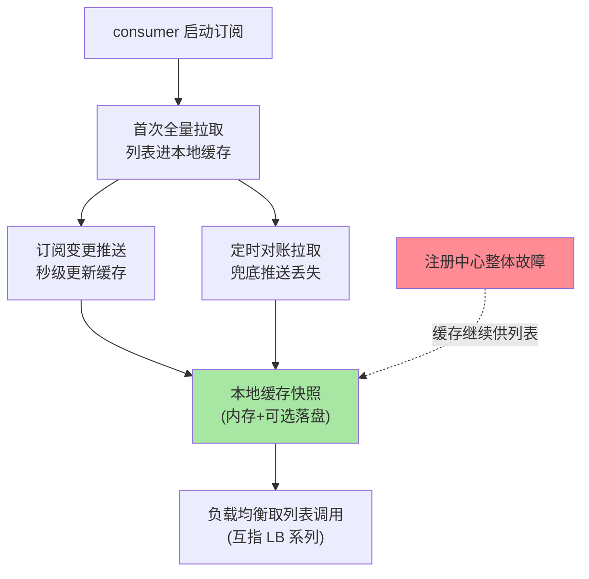
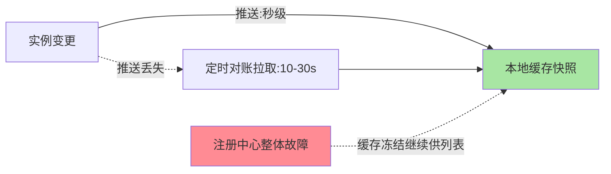

# 服务订阅与发现：推拉结合与本地缓存

> Consumer 侧的目标只有一句话：**任何时候手里都有一份「足够新、绝对可用」的实例列表**。推保证新、拉保证在、缓存保证抗故障——三个机制各管一段，缺一不可。

> **本文核心**：consumer 的地址列表靠「首拉全量 + 变更推送 + 定时对账 + 本地缓存快照」四层维持最终一致。
> **机制链**：订阅建立 → 推送保新鲜 → 拉取保可靠 → 缓存快照抗注册中心故障 → 负载均衡消费

## 一句话摘要

订阅与发现的三层机制：**① 订阅建立**（consumer 首次拉全量列表 + 注册变更监听）；**② 推拉结合**（变更推送保证秒级新鲜度，定时拉取兜底推送丢失——推送是优化，拉取是保底）；**③ 本地缓存快照**（列表落内存甚至落盘，注册中心整个挂掉时调用不中断——「注册中心挂了全站瘫痪」的否定答案就在这层）。三层合起来构成**最终一致的地址视图**。

## 一、为什么「只推」或「只拉」都不够

只推：推送通道丢消息（网络抖动、重连间隙）→ 列表悄悄过期，且无人察觉。只拉：轮询间隔内的新实例收不到流量、下线实例还在挨打——变更感知延迟 = 轮询周期。**推解决「快」，拉解决「可靠」，两者互补**——这是分布式系统「通知 + 对账」的经典组合（与配置中心推送机制同构，互指 config-center 篇 4）。

## 5W 速记卡

| 维度 | 一句话 |
|---|---|
| What | 订阅建立 + 推拉结合 + 本地缓存的三层发现机制 |
| Why | 列表要「新（推）+ 可靠（拉）+ 抗故障（缓存）」 |
| When | consumer 启动、注册中心故障演练、列表过期排查 |
| Where | RPC/HTTP 客户端的发现逻辑 |
| How | 首拉全量 + 订阅推送 + 定时对账拉取 + 缓存快照兜底 |

## 二、订阅链路全景

三层机制的失效覆盖图：

**本地缓存是可用性设计的点睛之笔**：调用方读的永远是本地缓存（不直查注册中心——那是每次调用一次远程往返的性能灾难），缓存的新鲜度由推拉机制维护。注册中心故障时，缓存在、调用在——**爆炸半径被缓存架构主动收窄**；代价是「摘除延迟」：实例下线后，缓存里的旧地址最长存活到下次更新（秒级推送正常覆盖，故障期靠 TTL 兜底）。

## 三、订阅的粒度与过滤

订阅不是只有「服务名」一个维度：**按元数据订阅**（只订阅 v2 版本实例、只订阅本机房实例——灰度与就近路由的发现侧支持）在主流框架均已支持。粒度选择是 Trade-off，**选型口径**：变更敏感场景缩短对账周期、细粒度订阅；性能敏感场景放宽——按业务对列表新鲜度的要求定——**订阅设计要跟治理策略联动**（路由规则用到的元数据维度，订阅就要带上，互指 service-routing）。

## 四、与 DNS 解析的区别：DNS 对照

| 维度 | 订阅发现 | DNS 解析 |
|---|---|---|
| 变更感知 | 推送秒级 | TTL 过期后 |
| 客户端状态 | 常驻缓存 + 订阅关系 | 逐查询解析 |
| 故障语义 | 缓存快照继续服务 | 解析失败即失败 |

DNS 的「解析即忘」与订阅的「常驻关注」是两种客户端架构——治理需要的持续关系只有订阅模型能给。

## 五、典型场景与误区

**典型场景**：RPC 客户端启动订阅（首拉 + 订阅 + 定时对账）、注册中心演练（拔掉注册中心集群验证业务无感——缓存快照的实战检验）、灰度环境订阅（元数据过滤只拿灰度实例）。

**误区与不适用**：① 每次调用都查注册中心——性能灾难，本地缓存是铁律；② 缓存无 TTL 无对账——推送丢失后列表永久过期，静默故障；③ 注册中心挂了就重启业务——重启反而丢缓存，正确姿势是依赖缓存继续跑，修注册中心。

## 六、你们可能会问

**Q1：列表更新的延迟到底多长？**
正常推送秒级；推送丢失退化为对账周期（通常 10-30 秒）；注册中心整体故障时缓存冻结——三层各有一个延迟上界，故障排查按层定位。

**Q2：实例下线后旧流量还能打多久？**
最坏 = 缓存更新延迟 + 调用方连接清理——优雅下线的「先摘流量再停进程」（互指优雅上下线系列）就是为了把这个窗口压到接近零。

**Q3：超大集群（万实例）推送会不会打爆 consumer？**
会——增量推送/分片订阅是组件侧演进方向（Nacos 2.x 的推送改造即为此），消费端做变更合并（多个变更合成一次刷新）也是通用缓解。

## 七、自测三问

1. 推与拉各解决什么？为什么说「推送是优化，拉取是保底」？
2. 本地缓存快照在故障语义上意味着什么？代价是什么？
3. 订阅粒度与治理策略的联动关系是什么？

下一篇讲「健康检查与心跳机制」：坏实例怎么被发现与摘除。

## 💡 实战提示

- 💡 本地缓存必须带 TTL + 定时对账，双保险防静默过期
- 💡 注册中心演练必做：拔集群验证业务靠缓存无感
- 💡 超大集群用增量推送/变更合并，防推送风暴

## 开放问题

- 心跳与深探测的两层判活，在 Service Mesh 场景是否会收敛到网格基础设施统一承担？sidecar 接管健康检查后应用 SDK 的判活职责边界值得跟踪。

## 📎 核心带走

- **核心一句话**：consumer 的地址列表靠「首拉全量 + 变更推送 + 定时对账 + 本地缓存快照」四层维持最终一致。
- **机制链**：订阅建立 → 推送保新鲜 → 拉取保可靠 → 缓存快照抗注册中心故障 → 负载均衡消费
- **失效点/边界**：缓存无 TTL 无对账 = 推送丢失后列表静默过期

## 📌 数据与事实声明

- 写于 2026-09-08，机制为 Spring Cloud/Dubbo/gRPC 客户端发现的共识归纳
- 对账周期默认值随框架不同，以官方文档为准
- 免责：以官方文档为准

## 📚 参考资料

| 类型 | 标题 | 来源 |
|---|---|---|
| 官方文档 | Nacos 订阅机制 / Spring Cloud LoadBalancer | nacos.io、spring.io |
| 关联系列 | 本仓库配置中心系列（推拉同构互指） | docs/architecture/service-governance/ |
| 社区沉淀 | 服务发现客户端设计公开文章 | 技术社区公开文章 |
