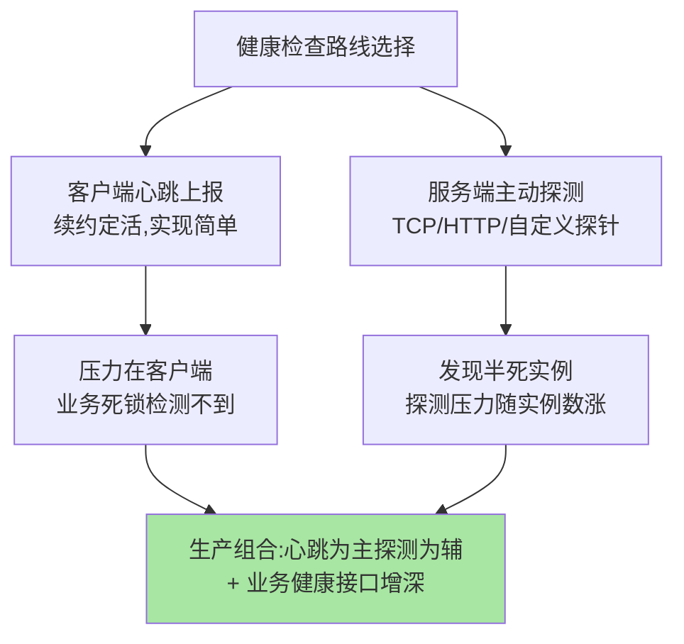
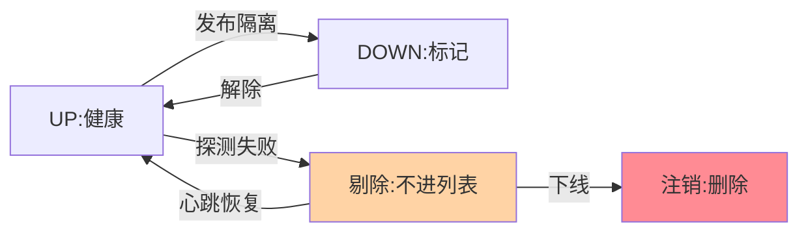

# 健康检查与心跳：坏实例的发现与摘除

> 注册表的可信度全靠健康检查兜底：实例「活着但不可用」（进程在、端口通、业务死锁）是最阴险的故障形态。这篇讲清**客户端心跳上报**与**服务端主动探测**两条判活路线的取舍，以及「摘除」的完整语义。

> **本文核心**：判活分两层：心跳续约管「进程在」，深探测管「业务可用」，摘除分级控爆炸半径。
> **机制链**：心跳上报/服务端探测 → 业务健康接口补深度 → 标记 DOWN / 剔除 / 注销三级摘除

## 一句话摘要

健康检查两条路线：**心跳上报**（客户端主动续约——实现简单、探测压力在客户端，但「客户端自己觉得好就是好」，业务死锁检测不到）与**服务端探测**（注册中心/TCP/HTTP 主动探——能发现「半死」实例，代价是探测压力随实例数线性增长）。**摘除语义**分三档：标记 DOWN（可恢复）、剔除列表（不接新流量）、注销（彻底删除）——生产实践常配「业务健康接口」（检查依赖就绪度），让「活着」的定义贴近「可用」——判活语义从进程级到业务级的演进，是健康检查体系成熟的标志。

## 一、为什么「端口通」不等于「可用」

进程存活、端口监听，但数据库连接池耗尽、线程池打满、内部死锁——这类「僵尸实例」对调用的响应是超时而非拒绝。**判活的核心矛盾：探多深才够**——探端口（快但浅）、探进程（同浅）、探业务健康接口（慢但真）。健康检查的设计就是在这条「深度-成本」曲线上选点，各层探测体系的演进方向都是组合互补，不同层各选各的点（注册中心探一层、K8s 探针探一层、RPC 心跳探一层——多层防线互不替代）。

## 5W 速记卡

| 维度 | 一句话 |
|---|---|
| What | 心跳上报与服务端探测两条判活路线 + 分级摘除语义 |
| Why | 注册表可信度依赖坏实例的及时发现与摘除 |
| When | 僵尸实例排查、误摘事故归因、健康接口设计 |
| Where | 注册中心服务端 + SDK 客户端 + K8s 探针三层 |
| How | 心跳续约定活，主动探测发现半死，分级摘除控爆炸半径 |

## 二、两条判活路线的取舍

心跳的优点是「分散式」——万实例场景探测压力摊到各客户端；缺点是「自证清白」——客户端线程还能跑心跳时，业务线程可能已死锁。服务端探测反之。**组合姿势**：心跳做基础续约 + 服务端低频抽样探测 + 业务健康接口（查依赖）做深度判定——三层各抓一类故障。

## 三、摘除的分级语义

摘除状态机的流转与恢复路径：

「摘除」不是一个动作是三个：**标记 DOWN**（实例还在列表但标记不可用——可快速恢复，适合发布中）、**剔除**（不进负载均衡结果——新流量不再进入）、**注销**（从注册表删除——实例生命周期终结）。爆炸半径从标记到注销递增，恢复成本递减——**运维动作选对级别**：发布临时隔离用 DOWN，故障实例用剔除，下线用注销。误摘的恢复路径也分级：心跳恢复自动回 UP（临时态）vs 需重新注册（注销态）。

## 四、与 K8s 探针的区别：K8s 对照

| 维度 | 注册中心健康检查 | K8s 探针（liveness/readiness） |
|---|---|---|
| 治理动作 | 摘出发现列表 | 重启容器 / 摘出 Service |
| 判活对象 | 注册表条目 | Pod 生命周期 |
| 层次关系 | 应用层发现 | 平台层调度 |

K8s 的 readiness 摘的是 Service endpoint，注册中心的摘除摘的是应用层列表——**两层并存时「双摘除」要配置联动**（互指 K8s 系列与优雅上下线篇 5），只摘一层会留半截流量。

## 五、典型场景与误区

**典型场景**：业务健康接口设计（检查 DB/缓存/下游依赖，依赖挂即报不健康）、发布期隔离（DOWN 标记 + 流量排空）、僵尸实例排查（心跳正常但业务超时——深探测补位）。

**误区与不适用**：① 健康接口永远返回 OK——形同虚设，接口要真查依赖；② 探测超时设得比业务最长响应还短——正常慢查询触发误摘；③ 摘除后不做容量评估——万级实例摘 5% 无感，十实例摘 1 个流量翻倍（连锁雪崩源，互指稳定性系列）。

## 六、你们可能会问

**Q1：心跳正常但业务不可用，最短多久能发现？**
取决于深探测层的周期——注册中心心跳层发现不了这类故障；生产实践是业务健康接口进「服务端低频抽样探测」（如 30-60 秒一轮），发现窗口即抽样周期。

**Q2：误摘了怎么快速恢复？**
临时态（DOWN）自动恢复；剔除态心跳恢复自动回来；确认是探测误判要调阈值并复盘——误摘治理的关键是「摘除事件必须有审计与归因」，静默摘除是事故温床；摘除机制的演进史就是一部误摘与漏摘的权衡史。

**Q3：健康检查自身怎么高可用？**
探测能力随注册中心集群部署（多节点分片探测）；心跳链路依赖网络——「心跳接口与业务接口分离部署」可避免业务网络拥塞误伤心跳。

## 七、自测三问

1. 两条判活路线各用什么换什么？生产组合姿势是什么？
2. 摘除的三级语义与各自的适用场景、恢复路径？
3. 「活着但不可用」靠哪一层发现？

下一篇讲「AP 与 CP 的选型」：注册中心最核心的一致性取舍。

## 💡 实战提示

- 💡 健康接口要真查依赖，永远返回 OK 的探针是装饰品
- 💡 摘除事件必须有审计日志，静默摘除是事故温床
- 💡 摘除前评估剩余容量，小集群摘一台就是容量事故

## 开放问题

- 心跳与深探测的两层判活，在 Service Mesh 场景是否会收敛到网格基础设施统一承担？sidecar 接管健康检查后应用 SDK 的判活职责边界值得跟踪。

## 📎 核心带走

- **核心一句话**：判活分两层：心跳续约管「进程在」，深探测管「业务可用」，摘除分级控爆炸半径。
- **机制链**：心跳上报/服务端探测 → 业务健康接口补深度 → 标记 DOWN / 剔除 / 注销三级摘除
- **失效点/边界**：探测超时短于业务最长响应会制造误摘——阈值按真实响应分布定

## 📌 数据与事实声明

- 写于 2026-09-08，机制为 Nacos/Eureka/Consul 健康检查实现的共识归纳
- 探测周期与摘除阈值为经验口径，按组件默认与网络环境调
- 免责：以官方文档为准

## 📚 参考资料

| 类型 | 标题 | 来源 |
|---|---|---|
| 官方文档 | Nacos 健康检查 / Eureka 心跳与自我保护 | nacos.io、github.com/Netflix/eureka |
| 关联系列 | 本仓库 K8s 系列（探针互指） | docs/devops/kubernetes/ |
| 社区沉淀 | 服务健康检查设计公开文章 | 技术社区公开文章 |
