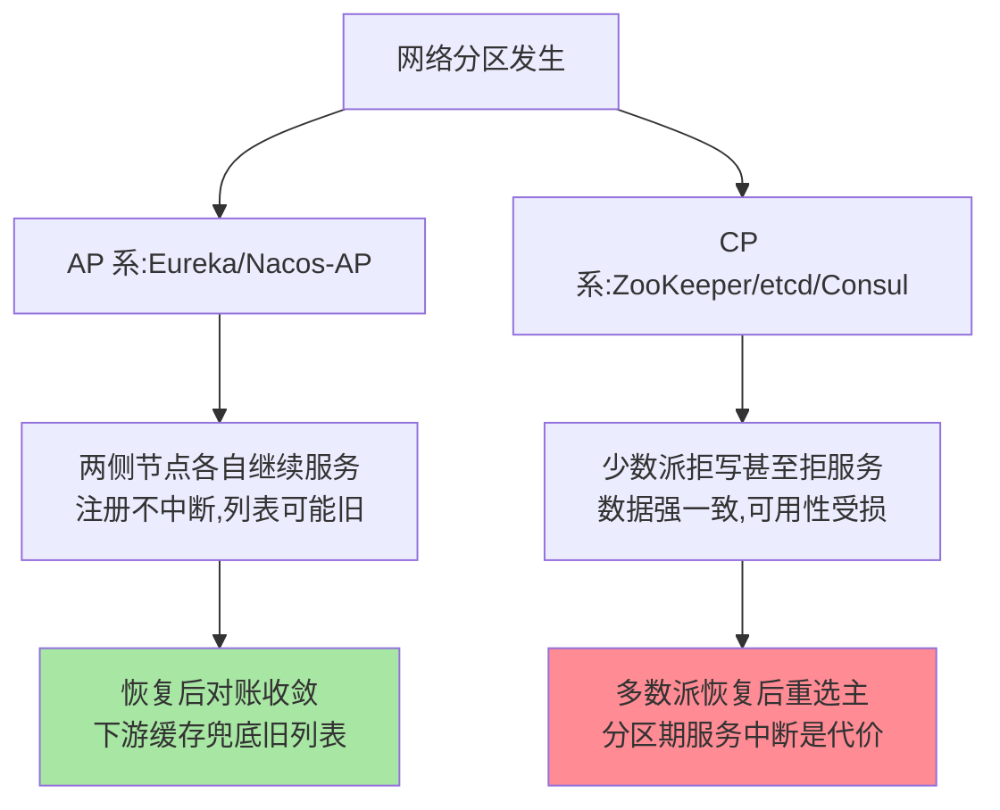
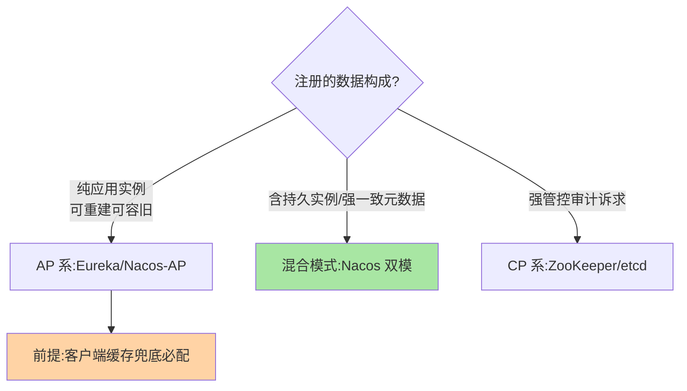

# AP 与 CP 的选型：注册中心最核心的取舍

> 注册中心网络分区时怎么办：**拒绝服务保一致（CP）还是继续服务容忍旧数据（AP）**？这一问就是注册中心选型的第一分水岭——Eureka/Nacos(AP) 与 ZooKeeper/Consul/etcd(CP) 的阵营划分由此而来。

> **本文核心**：注册场景的数据特性（可容忍旧列表、需要持续可用）使 AP 成为多数场景的合理默认；CP 的强一致在「注册表」这个数据上收益有限、可用性代价高昂。**机制链**：网络分区发生 → CP 拒写保一致（服务不可注册）vs AP 各自为战保可用（列表可能旧）→ 客户端本地缓存兜底 → 恢复后对账收敛。

## 一句话摘要

AP 与 CP 的分野在**分区时的行为选择**：AP 系（Eureka、Nacos 临时实例）分区下各节点独立服务、数据可能短暂不一致，但**注册与发现永不中断**；CP 系（ZooKeeper、Consul、etcd）分区下多数派说了算，**少数派拒绝服务换强一致**。注册表的数据特性决定了取舍逻辑：**列表旧几秒的代价 ≪ 注册服务不可用的代价**——这是 AP 成为服务发现默认倾向的机制根源；但持久实例/元数据类数据仍偏 CP（Nacos 双模的由来）。

## 一、为什么这个取舍在注册中心如此突出

注册中心自己是个分布式集群，注册表数据要在多节点间复制——网络分区（机房抖动、交换机故障）时必须回答「分区两侧还让不让写」。CAP 定理（互指 distributed-theory 系列）给的约束不可逃逸：**一致、可用、分区容忍三者取二**。注册场景的特殊性在于消费端：实例列表的消费者（调用方）本来就有本地缓存与重试容错——**下游的韧性反过来降低了上游一致性的必要强度**，这是注册中心偏 AP 的结构性原因。

## 5W 速记卡

| 维度 | 一句话 |
|---|---|
| What | 分区时「拒服务保一致（CP）」vs「续服务容旧数据（AP）」的行为选择 |
| Why | 注册中心自身是分布式系统，CAP 取舍不可回避 |
| When | 组件选型、实例类型建模、跨机房部署设计 |
| Where | 各组件的一致性协议层 |
| How | 临时实例走 AP、持久/元数据走 CP 的混合模式是工业演进方向 |

## 二、两个阵营的行为推演

推演到故障场景差异立现：**注册中心集群自身抖动时**，AP 系业务无感（缓存继续供列表），CP 系可能出现「注册失败/发现失败」的连锁——**「为了列表强一致，把注册服务本身变成不可用」，多数业务算不过这笔账**。反过来，CP 的价值场景：持久实例成员（数据库列表）、需要强一致语义的元数据变更——错乱比短暂不可用更贵的场景。

## 三、混合模式：工业界的演进答案

纯 AP 与纯 CP 的二选一被演进出的**混合模式**超越：Nacos 2.x 按实例类型分协议——**临时实例走 AP（Distro 协议）**、**持久实例走 CP（JRaft）**（机制细节互指 Nacos 系列特性层）。这回答了「同一系统里两类数据诉求不同」的现实：应用实例要可用性，基础设施成员要一致性。**「按数据类型分协议」是注册中心架构演进的成熟形态**，选型时与其站队阵营，不如审视自己的数据构成。

## 四、与数据库主从的区别：MySQL 对照

| 维度 | 注册中心 AP/CP | MySQL 主从复制 |
|---|---|---|
| 数据用途 | 运行时寻址（可重建） | 业务事实（不可丢） |
| 一致性诉求 | 旧列表可容忍 | 强持久化诉求（双 1） |
| 分区行为 | AP 可继续服务 | 主库单点写 |
| 取舍重心 | 可用性优先 | 持久性优先 |

MySQL 的数据「不可重建」所以重持久化（本仓库 MySQL 日志系列），注册表「可重建」所以可容忍 AP——**数据的可重建性决定一致性预算**，这是跨系统通用的取舍标尺。

阵营与数据类型的匹配决策：

## 五、典型场景与误区

**典型场景**：纯应用微服务（AP 足矣——Eureka/Nacos-AP）、混合负载（持久实例多选 Nacos 双模或 CP 系）、金融级强管控（注册表变更需审计强一致——CP + 变更通道加固）。

**误区与不适用**：① 「CP 更高级所以选 CP」——一致性等级与系统档次无关，与数据特性相关；② AP 就不用管一致性——对账收敛、版本向量等机制照常要有（最终一致 ≠ 不管一致）；③ 忽视客户端缓存对 AP 的依赖——AP 的「旧数据可容忍」前提是下游有兜底能力，裸调注册中心的客户端不配用 AP。

## 六、你们可能会问

**Q1：Eureka 的自我保护机制是什么？**
分区时大量实例心跳丢失，Eureka 判断「可能是网络问题而非实例死亡」，**暂停摘除保住列表完整**——AP 哲学的极致体现：宁可保留可能已死的实例，不可误删活实例。代价是分区期可能路由到坏实例（靠调用方重试兜底）。

**Q2：怎么判断我的业务该选哪边？**
三问：实例挂了短暂路由到它会怎样（重试可救 → AP 够）；注册服务本身不可用的代价（不可承受 → AP/缓存架构必配）；有没有持久成员与强一致元数据（有 → 双模或 CP）。

**Q3：跨机房部署时取舍会变吗？**
会——跨机房分区概率大增，AP 的价值放大；「每机房自治 + 异地对账」的多活注册架构是跨机房场景的演进方向（机房级分区时各机房独立服务）。

## 七、💡 实战提示

- 💡 选型先画「分区时各组件的行为表」——写不出来就是没想清楚
- 💡 AP 的前提是客户端缓存，这两个决策必须绑在一起评审
- 💡 混合模式（双模）是当前工业最优解，纯阵营站队已是上一代问题

## 八、你们可能会问

（见上方 Q&A——本篇的取舍问题正是「你们可能会问」的主场，合并呈现以保持叙事连贯。）

## 九、开放问题

- Service Mesh 场景下注册数据下沉到控制面（Istiod 类），AP/CP 的取舍是否会被「控制面单点 + 数据面缓存」的新架构消解，值得跟踪。
- 跨云多活注册（注册表本身跨云复制）的一致性协议设计，社区尚无标准答案。

## 十、自测三问

1. AP 与 CP 在分区时的行为差异是什么？各自的代价？
2. 「注册场景偏 AP」的结构性原因是什么（下游韧性的反作用）？
3. 混合模式按什么维度分协议？

下一篇讲「选主与数据同步」：CP 系与 AP 系各自的集群内部机制。

## 📎 核心带走

- **核心一句话**：分区时「继续服务容旧数据（AP）」是注册场景的合理默认——旧列表可容忍，注册不可用不可容忍
- **机制链**：分区发生 → AP 两侧独立服务 / CP 多数派拒写 → 下游缓存兜底旧列表 → 恢复后对账收敛
- **失效点/边界**：持久实例与强一致元数据仍是 CP 的地盘；AP 的前提是客户端有缓存兜底

## 📌 数据与事实声明

- 写于 2026-09-08，阵营划分与混合模式以各组件官方文档为准
- CAP 理论表述互指本仓库 distributed-theory 系列
- 免责：以官方文档为准

## 📚 参考资料

| 类型 | 标题 | 来源 |
|---|---|---|
| 关联系列 | 本仓库 Nacos 系列 / distributed-theory 系列 | docs/middleware/nacos/ 等 |
| 官方文档 | Eureka 自我保护 / Nacos Distro 与 JRaft | 各官方站点 |
| 原理书 | 《数据密集型应用系统设计》（DDIA）CAP 章 | 公开出版 |
