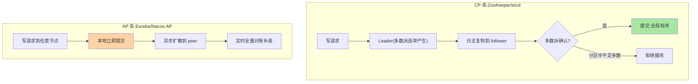

# 选主与数据同步：注册中心集群的内部机制

> 注册中心自己是一堆节点，谁是说了算的那个？节点间的注册表怎么保持一致？这篇下到集群内部：CP 系的共识选主与日志复制、AP 系的异步复制与对账收敛——两套完全不同的集群机制。

> **本文核心**：CP 系靠「共识选主 + 多数派日志复制」换全局有序，AP 系靠「去中心可写 + 异步对账」换持续可用。**机制链**：写请求 → CP：Leader 定序、多数派确认提交 / AP：本地提交、异步扩散 peer → 定时对账收敛 → 冲突按版本规则化解。

## 一句话摘要

集群内部机制按阵营分两套：**CP 系（ZooKeeper/etcd）走「共识选主 + 日志复制」**——多数派选举唯一 Leader，写请求经 Leader 以日志复制到多数派才算提交（Zab/Raft，理论互指 distributed-theory）；**AP 系（Eureka/Nacos-AP）走「异步复制 + 定时对账」**——每个节点可独立接受写入，变更异步扩散到peer，定期全量对账补差。**选主管「谁是权威」，同步管「数据怎么扩散」**——两者的组合决定注册表的语义（强一致 vs 最终一致）与分区行为（前面一篇的结论在实现层落地）。

## 一、为什么注册中心需要选主

多节点注册表有两个必须回答的问题：**写顺序问题**（两个节点同时改同一服务，以谁为准）与**元信息管理**（分片分配、版本调度这类「全局唯一决策」谁来做）。CP 系用「唯一 Leader」一并解决——写都走 Leader、Leader 管决策；AP 系没有 Leader（去中心化），写冲突靠「时间戳/版本比较 + 最终对账」化解——**有没有权威节点，是两套集群机制的总分叉**。

## 5W 速记卡

| 维度 | 一句话 |
|---|---|
| What | CP 共识选主 + 日志复制 vs AP 去中心 + 异步复制对账 |
| Why | 多节点注册表要解决写顺序与数据扩散 |
| When | 集群抖动排查、注册中心选型深究 |
| Where | 注册中心服务端内部 |
| How | CP：选举→日志→多数派提交；AP：本地写→异步扩散→对账收敛 |

## 二、两套集群机制的流水线

**CP 流水线**的代价与收益都来自「多数派确认」：写要凑多数（延迟 = 最快多数派的 RTT），分区时少数派不可写（可用性让位）；收益是**全局有序的注册表**——任何时刻任何节点读到的顺序一致。**AP 流水线**反过来：本地写零延迟、分区时照常服务，代价是**节点间短暂不一致**（扩散延迟 + 冲突靠版本规则收敛）。**选主与同步是一体的**：CP 的同步依赖选出的 Leader 定序，AP 的同步不需要主因为冲突有版本化解。

两套机制的历史演进交汇：CP 系的共识协议（Zab 2008 前后、Raft 2014）与 AP 系的对账模型各自演进，最终在「按数据类型分协议」的混合模式上汇合（篇 6 的结论）。

## 三、选主机制的工程细节

CP 选主（Zab/Raft）的三个关键点：**任期（epoch/term）**——每次选举递增，旧 Leader 失联后凭任期判断「自己过时了」（防脑裂后双主）；**选举超时与抖动**——随机化超时避免选主风暴；**数据新旧门槛**——日志不够新的节点不能当选（Raft 的投票约束），保证新主必有最新数据。**脑裂防护**正建立在多数派 + 任期上：分区中凑不齐多数派的旧 Leader 自动退位——「双主」在协议层面被排除——对比 Redis 哨兵的脑裂问题（应用层防护），注册中心 CP 系的防护在协议层更硬，这是两代高可用架构演进出的深度差异。选主全程：

## 四、与 MySQL 主从复制的区别：MySQL 对照

| 维度 | CP 系日志复制 | AP 系异步复制 | MySQL 半同步 |
|---|---|---|---|
| 提交语义 | 多数派确认才提交 | 本地即提交 | 主库等 ACK |
| 冲突处理 | 协议层不可能冲突 | 版本/时间戳收敛 | 无冲突（单主） |
| 分区行为 | 少数派拒写 | 全员可写 | 降级异步 |

有趣的对照：AP 系的「异步复制 + 对账」与 MySQL 异步复制的延迟语义同源，但 **AP 系是多主可写**（MySQL 是单主）——多主带来的冲突化解（版本比较）是 AP 系额外的机制复杂度。

## 五、典型场景与误区

**典型场景**：注册中心集群扩容（CP 系加节点要同步全量日志、AP 系只需对账拉平）、Leader 切换演练（kill CP 系 Leader 观察选主耗时与写入恢复）、跨机房部署（CP 跨机房选主延迟大增——多数派跨机房方案要专门设计）。

**误区与不适用**：① 「AP 系没有主所以不会脑裂」——AP 系本来就没有唯一主，无主可裂；它的风险是数据冲突而非双主；② CP 系选主期间完全不可用——ZooKeeper 的恢复期（选主 + 同步）确实不可写，这是 CP 的固有窗口；③ 忽视对账机制——AP 系的最终一致全靠对账，对账周期与效率决定收敛速度。

## 六、你们可能会问

**Q1：AP 系两个节点同时注册同一实例，怎么收敛？**
版本规则收敛（时间戳新者胜 / 心跳续租刷新版本）——短暂不一致（两节点视图不同）在对账后统一，实例场景下「后写者赢」语义安全（实例会继续心跳，旧状态自然被覆盖）。

**Q2：CP 系的 Leader 挂了，注册中心多久恢复？**
选举超时（通常秒级）+ 日志同步窗口——期间不可写（读看实现）；生产要演练这个窗口对业务的影响（客户端缓存兜底，见篇 4）。

**Q3：能不能 AP 与 CP 系共存在一个体系？**
可以且常见——Nacos 双模就是两套协议并存（按实例类型路由到不同协议）；更大胆的「AP 注册 + CP 配置」分层也是常见架构。

## 七、💡 实战提示

- 💡 CP 系集群必须奇数节点：3 或 5——偶数在分区时凑多数派效率低
- 💡 跨机房部署 CP 系先算选主与复制的 RTT 账，延迟敏感就机房内建集群 + 异地容灾
- 💡 AP 系的对账周期是收敛速度的关键参数，演练时实测——收敛速度与推送压力的取舍按实例变更频率定

## 八、开放问题

- 大规模注册中心（十万实例级）的 CP 日志复制压力与 AP 对账风暴的边界，社区在大集群实践中持续摸索。
- 去中心化 gossip 类注册方案（Cassandra 风格）在超大规模场景的收敛速度与治理语义完备性，仍是研究与实践的交叉地带。

## 九、自测三问

1. CP 与 AP 两套集群机制的核心差异是什么？各管什么语义？
2. 选主任期与多数派如何共同防脑裂？
3. AP 系写冲突靠什么收敛？为什么实例场景下安全？

下一篇讲「主流注册中心对比」：五个组件放上一张矩阵。

## 📎 核心带走

- **核心一句话**：CP 系「选主 + 多数派日志复制」换全局有序，AP 系「去中心 + 异步对账」换持续可用——有没有权威节点是总分叉
- **机制链**：写请求 → CP：Leader 定序 + 多数派提交 / AP：本地提交 + 异步扩散 → 对账收敛
- **失效点/边界**：CP 选主窗口不可写是固有代价；AP 的最终一致依赖对账机制的健康

## 📌 数据与事实声明

- 写于 2026-09-08，Zab/Raft 机制表述互指 distributed-theory 系列与各组件官方文档
- 选主超时窗口为组件默认口径（秒级）
- 免责：以官方文档为准

## 📚 参考资料

| 类型 | 标题 | 来源 |
|---|---|---|
| 关联系列 | 本仓库 distributed-theory / Nacos 系列 | docs/architecture/、docs/middleware/ |
| 官方文档 | ZooKeeper Zab / etcd Raft 文档 | zookeeper.apache.org、etcd.io |
| 原理书 | 《数据密集型应用系统设计》（DDIA）共识章 | 公开出版 |
