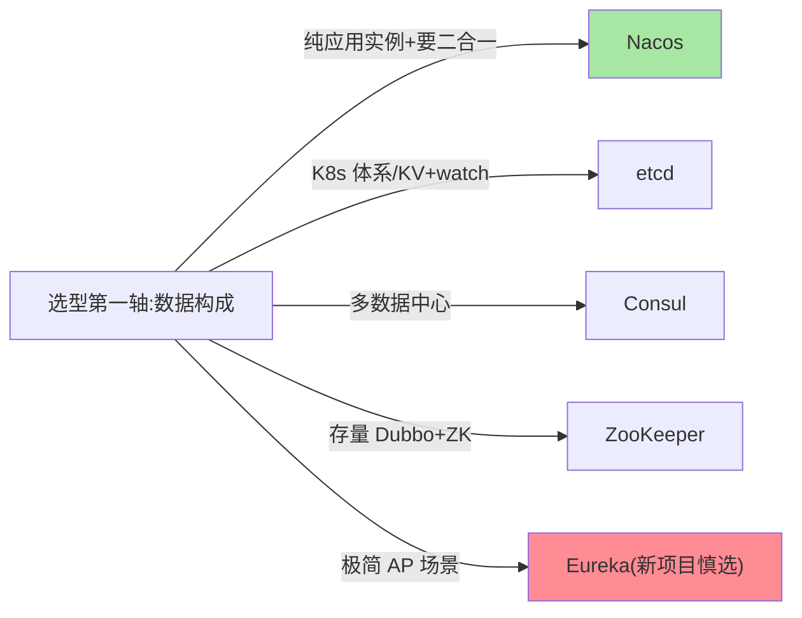
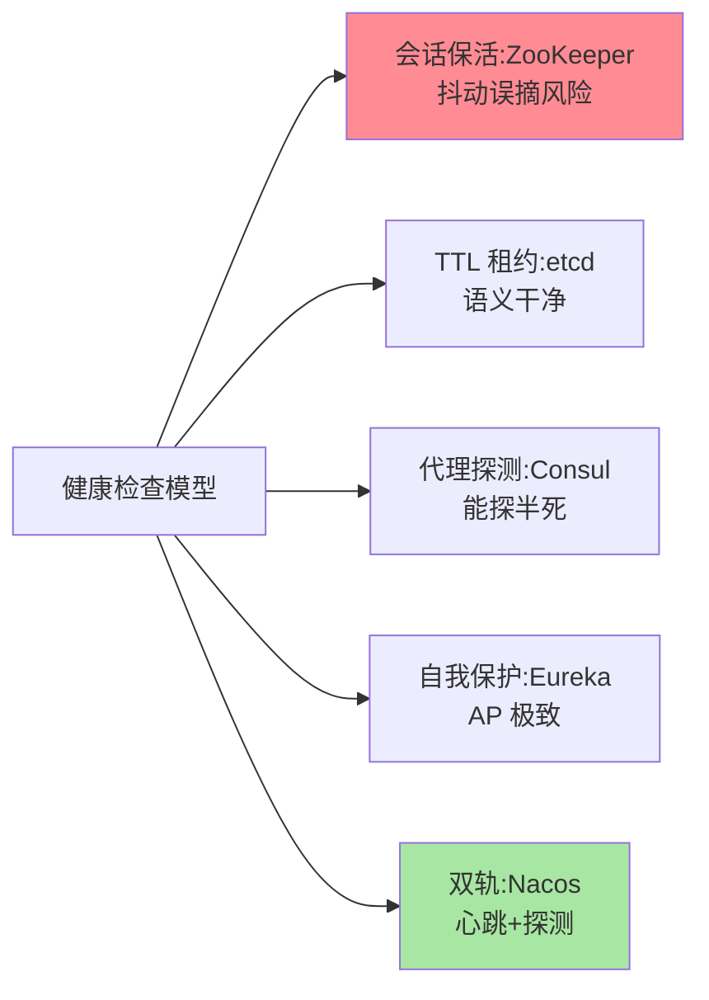

# 主流注册中心对比：五大组件一张矩阵

> ZooKeeper、Nacos、Eureka、Consul、etcd——五个常被放进同一张选型表的组件，其实是「五种设计哲学」。对比的目的不是排出名次，是**看清每个组件为一类场景付出了什么、放弃了什么**。

> **本文核心**：五大组件按「一致性取向 + 健康检查模型 + 生态定位」三个轴即可分开：ZooKeeper（CP、通用协调）、etcd（CP、云原生底座）、Consul（CP、多数据中心）、Eureka（AP、纯粹注册）、Nacos（AP+CP 双模、注册配置二合一）。**机制链**：数据构成决定一致性取向 → 取舍决定协议与行为 → 行为决定健康检查与运维模型 → 生态决定接入成本。

## 一句话摘要

对比矩阵五维展开：**一致性取向**（AP/CP/双模）、**健康检查**（心跳/探测/TTL 租约）、**数据模型**（znode/服务-实例/KV）、**生态绑定**（Dubbo/云原生/K8s）、**运维复杂度**。**没有全能冠军**——ZooKeeper 强在通用协调却重运维、Eureka 简单却停更边缘化、Nacos 二合一却需要理解双模、etcd 是 K8s 的基石但直接做注册中心需自建上层、Consul 的多数据中心是独门优势。选型逻辑是「按数据构成与生态对号入座」（篇 6 的决策在组件层落地）。

## 一、为什么对比要先立「轴」

把五个组件平铺 20 行特性表只会越看越乱——**特性是轴的投影**：一致性取向定了分区行为，健康检查模型定了误摘风险，生态绑定定了接入成本。三根轴立住，每个组件的「性格」一句话就能说清，选型讨论从背参数变成对轴心。

## 5W 速记卡

| 维度 | 一句话 |
|---|---|
| What | 五大注册中心的三轴对比（一致性/健康检查/生态） |
| Why | 选型需要「按轴对号」而不是背特性表 |
| When | 新集群选型、存量迁移评估 |
| Where | 本系列篇 9 的决策树输入 |
| How | 一致性取向 × 健康检查模型 × 生态定位三轴定位 |

## 二、对比矩阵

| 组件 | 一致性 | 健康检查 | 数据模型 | 生态绑定 | 运维复杂度 |
|---|---|---|---|---|---|
| **ZooKeeper** | CP（Zab） | 会话保活（心跳） | 层级 znode | Dubbo 老生态/通用协调 | 高（Java 栈、调优深） |
| **etcd** | CP（Raft） | TTL 租约 | 扁平 KV + watch | K8s 底座/云原生 | 中（运维简洁但偏底层） |
| **Consul** | CP（Raft） | 代理探测多模式 | 服务目录 + KV | HashiCorp 生态/多数据中心 | 中 |
| **Eureka** | AP（对等复制） | 客户端心跳+自我保护 | 服务-实例 | 老牌 Spring Cloud | 低（但社区已边缘化） |
| **Nacos** | **AP+CP 双模** | 心跳+探测双轨 | 服务-实例 + 配置 | 国产微服务生态/注册配置二合一 | 中低 |

健康检查轴的组件对照：

三句话解读矩阵：**① 组件的性格由「放弃了什么」定义**——ZooKeeper 放弃可用性换协调语义、Eureka 放弃一致性换简单；**② 双模是演进方向**——Nacos 的 AP/CP 分协议是篇 6 结论的组件化实现；**③ 生态权重压倒技术权重**——接入手感、社区活跃、云厂商支持在日常运维中的权重高于基准测试差异。

## 三、健康检查模型的对比细节

健康检查是五组件差异最「体感」的轴：ZooKeeper 靠**会话保活**（session 断即摘，误摘风险在抖动场景）；etcd 的 **TTL 租约**语义干净（lease 到期即失效，K8s 的 node lease 同构）；Consul 的**代理探测**最丰富（脚本/HTTP/TCP 多模式，能探「半死」）；Eureka 的**心跳 + 自我保护**是 AP 极致；Nacos **双轨**（临时走心跳、持久走探测）。**选型时把「误摘风险」与「半死发现能力」按业务对号**——篇 5 的机制结论在这里变成组件能力清单。

## 四、与消息队列选型的区别：方法论对照

| 维度 | 注册中心选型 | MQ 选型（互指本仓库 Kafka/RocketMQ 系列） |
|---|---|---|
| 第一轴 | 一致性取向 | 语义（顺序/事务/延迟） |
| 决定因素 | 数据构成 | 业务语义需求 |
| 生态权重 | 高 | 高 |

中间件选型的方法论同构：**先定轴心（数据/语义特性），再看组件性格，最后让生态落地**——这套方法可复用到网关、任务调度等一切中间件选型。

## 五、典型场景与误区

**典型场景**：新建国产微服务体系（Nacos 默认项）、K8s 深度用户（etcd 直接复用或 K8s 原生发现）、存量 Dubbo+ZooKeeper（不折腾就续用，迁移要算双跑成本）、多机房多数据中心（Consul 的主场）。

**误区与不适用**：① 用 star 数/热度选注册中心——注册中心是十年基建，社区边缘化（Eureka）才是真正的选型风险；② 忽视「注册配置二合一」的运维红利与耦合代价——二合一省部署，但故障域也合并了；③ 基准测试崇拜——注册中心的 QPS 差异远小于运维心智差异。

## 六、💡 实战提示

- 💡 新项目默认 Nacos（双模 + 生态）是最稳起点，特殊诉求再换
- 💡 Eureka 新项目慎选：社区活跃度是长周期基建的生死线
- 💡 选型报告必答三题：分区行为、误摘策略、迁移路径——答不出就是没准备好

## 七、你们可能会问

**Q1：ZooKeeper 做注册中心的「会话抖动误摘」怎么救？**
会话超时调大（牺牲摘除速度）+ 客户端重试兜底；更深层的解法是换 AP 系或双模——ZK 的会话模型改不了，这是设计取舍不是缺陷。

**Q2：etcd 直接当注册中心用要补什么？**
etcd 只给 KV + watch + lease，服务目录语义（服务/实例模型、健康检查聚合、UI）都要自建上层——除非深度 K8s 化，否则选带服务目录语义的组件更省。

**Q3：多数据中心是刚需时怎么选？**
Consul 的原生多数据中心（ WAN 联邦）最省；自建方案是「每数据中心独立注册中心 + 上层聚合」——复杂度高，优先原生能力。

## 八、开放问题

- 云托管注册中心（MSE 类）把选型部分转化为「产品选型」，自建与托管的成本分界随云成熟度持续移动。
- 注册中心与 Service Mesh 控制面的功能重叠（发现/路由下发）在收敛，下一代「注册中心」形态可能是 mesh 控制面的一个模块。

## 九、自测三问

1. 对比的三根轴是什么？为什么说「特性是轴的投影」？
2. 五个组件各自「放弃了什么」？
3. 「生态权重压倒技术权重」在注册中心选型里怎么体现？

下一篇讲「注册中心选型决策」：把矩阵变成决策树。

## 📎 核心带走

- **核心一句话**：五大组件按「一致性取向 × 健康检查模型 × 生态绑定」三轴定位，没有全能冠军，只有场景匹配
- **机制链**：数据构成 → 一致性取向 → 协议与行为 → 健康检查与运维模型 → 生态接入
- **失效点/边界**：矩阵是静态快照——组件随版本演进（Nacos 双模即演进产物），选型前复核当前版本能力

## 📌 数据与事实声明

- 写于 2026-09-08，组件能力以各官方文档为准；Eureka 社区状态为公开认知口径
- 版本演进快，选型前以官方当前版本复核
- 免责：以各官方文档为准

## 📚 参考资料

| 类型 | 标题 | 来源 |
|---|---|---|
| 官方文档 | 五组件官方站点 | zookeeper.apache.org 等 |
| 关联系列 | 本仓库 Nacos / Etcd 子系列 D | docs/middleware/nacos/ 等 |
| 社区沉淀 | 注册中心选型公开实践文章 | 技术社区公开文章 |
