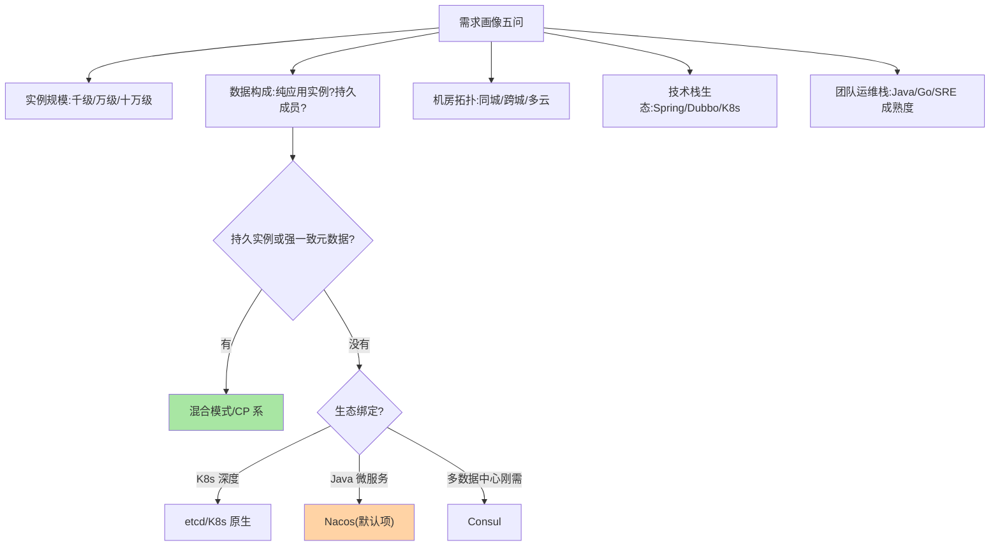
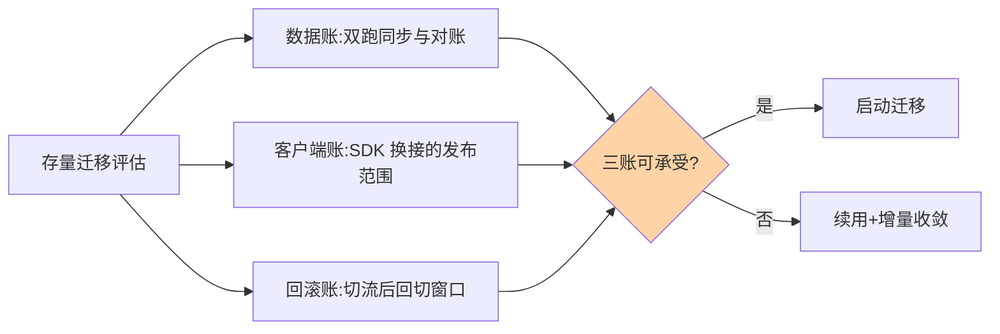

# 注册中心选型决策：从需求画像到落地清单

> 篇 8 给了矩阵，这篇给**决策过程**：把业务需求转成需求画像，画像对着决策树走一遍，产出选型结论 + 迁移路径 + 演练清单——选型不是「选个组件」，是「选一套可运维的方案」。

> **本文核心**：选型四步法——画像五问 → 决策树 → 迁移三账 → 三件输出（结论/迁移路径/演练清单）。**机制链**：模糊需求 → 画像收窄候选集 → 阵营与组件判定 → 存量迁移评估 → 可运维方案交付。

## 一句话摘要

选型四步法：**① 画需求画像**（实例规模、数据构成、机房拓扑、团队运维栈）；**② 走决策树**（数据构成定一致性阵营 → 生态定候选集 → 运维定最终项）；**③ 评迁移成本**（存量迁移的双跑纪律）；**④ 出落地清单**（部署形态 + 客户端接入 + 演练项）。**选型的输出是方案不是组件名**——「用 Nacos」与「Nacos 三节点同机房 + 客户端缓存开启 + 摘除演练季度化」是两个完全不同的答案。

## 一、为什么选型常常选错

选型事故的反面教材几乎同构：**按「别人家在用什么」选**（忽略自己的数据构成）、**按 benchmark 选**（忽略运维心智）、**只选组件不设计方案**（组件对了部署形态错）——选型的本质是**需求画像与组件性格的匹配**，跳过画像直接看组件，匹配就变成抽奖。

## 5W 速记卡

| 维度 | 一句话 |
|---|---|
| What | 需求画像 → 决策树 → 迁移评估 → 落地清单的四步选型法 |
| Why | 选型输出应是可运维方案而非组件名 |
| When | 新集群建设、存量重构、多注册中心治理 |
| Where | 架构评审会 |
| How | 四个维度的画像题 + 一棵决策树 + 三张清单 |

## 二、需求画像与决策树

迁移三笔账的评估流：

画像五问的价值在**把模糊需求变成可判定的输入**：「我们服务挺多的」没用，「峰值 8000 实例、3 机房、Spring Cloud 栈、团队 Java 背景」才有判定力——**每答一问，候选集就收窄一圈**，决策树的终点自然是收敛的。

## 三、迁移成本评估：存量迁移的特殊账

新集群选型自由，存量迁移要先算三笔账：**数据账**（双跑期两套注册中心的同步与对账）、**客户端账**（SDK 换接的发布范围——绑定在框架里的注册逻辑改动牵动全部应用）、**回滚账**（切流后回切的窗口与损失）。**双跑纪律**（互指 MySQL 迁移篇与 Redis 扩缩容篇）原样适用：先读后写、灰度渐进、旧系统保留观察期——**注册中心迁移的爆炸半径是全站调用，迁移方案的严谨度要求高于多数中间件**。

## 四、与网关选型的区别：方法论对照

| 维度 | 注册中心选型 | 网关选型（互指 gateway 系列） |
|---|---|---|
| 爆炸半径 | 全站调用 | 全站入口 |
| 选型重心 | 一致性与数据构成 | 性能与扩展模型 |
| 迁移风险 | 客户端 SDK 全量发布 | 路由规则迁移 |

两者都是「入口级基建」，选型方法同构但**决策轴不同**——注册中心轴在一致性，网关轴在流量语义——「方法可复用、轴要换」是中间件选型的通用心法——迁移成本的权衡则是注册中心的特殊权重，爆炸半径决定了它的严谨度上限。

## 五、典型场景与误区

**典型场景**：初创团队（Nacos 单集群起步，画像简单）、K8s 原生团队（先试 K8s Service + 应用层轻注册，别急着引重型组件）、多团队大 org（注册中心即治理平台，选型要带配置中心/治理面联动评估）。

**误区与不适用**：① 选型报告没有演练项——「选 Nacos」没完，「摘除演练/故障演练季度化」才算方案；② 忽视团队运维栈——Go 团队运维 Java 栈的 ZooKeeper，长期成本高企；③ 一步到位崇拜——初创千实例规模上十万实例架构，复杂度自找。

## 六、💡 实战提示

- 💡 选型会议先过画像五问，答不全的会不开
- 💡 决策树走到最后若两个候选打平，用「团队运维栈」做决胜票
- 💡 选型输出固定三件：结论 + 迁移路径 + 演练清单

## 七、你们可能会问

**Q1：多注册中心并存（历史遗留）怎么治理？**
承认现实、增量收敛：新服务强制走统一注册中心，存量随大版本迁移；「服务映射层」可作过渡（两套注册表同步）——并存不可怕，无治理的并存才可怕。

**Q2：选型要不要考虑 Serverless/新架构？**
画像题 P4 已含——Serverless 场景的平台化发现（云函数内建）会替代部分注册中心职能，选型时把「三年架构演进方向」纳入画像。

**Q3：决策树走到死胡同（画像矛盾）怎么办？**
画像矛盾暴露的是架构矛盾（如「要跨城多活又要强一致」）——回退到架构层解决，不是选型层硬选。

## 八、开放问题

- 平台工程趋势下，「注册中心选型」逐步被「平台内置能力选型」吸收，未来架构师的决策点可能从「选组件」上移到「选平台」。
- eBPF/服务网格让发现能力下沉内核，「注册中心」的边界十年内可能被重写——今天的选型都要预留退出通道。

## 九、自测三问

1. 画像五问是哪五问？为什么模糊需求要先转画像？
2. 存量迁移的三笔账是什么？为什么迁移严谨度要求高于多数中间件？
3. 「选型的输出是方案不是组件名」包含哪三件？

## 📎 核心带走

- **核心一句话**：选型 = 需求画像 × 组件性格的匹配过程，输出是「结论 + 迁移路径 + 演练清单」的可运维方案
- **机制链**：画像五问收窄候选集 → 决策树定阵营与组件 → 迁移三笔账评估 → 三件输出落地
- **失效点/边界**：画像矛盾要回架构层解决；组件能力随版本演进，选型结论按年复核

## 📌 数据与事实声明

- 写于 2026-09-08，决策框架为业界选型实践的归纳
- 「50GB/季度演练」类阈值为经验口径
- 免责：具体决策按组织现状评审

## 📚 参考资料

| 类型 | 标题 | 来源 |
|---|---|---|
| 关联系列 | 本系列篇 8 对比矩阵 / gateway 系列方法论对照 | docs/architecture/service-governance/ |
| 实战书 | 《数据密集型应用系统设计》（DDIA） | 公开出版 |
| 社区沉淀 | 注册中心选型公开复盘文章 | 技术社区公开文章 |
