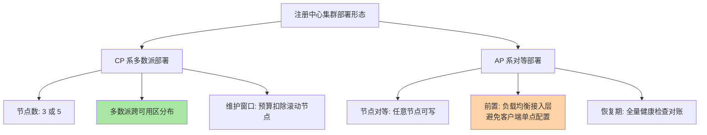
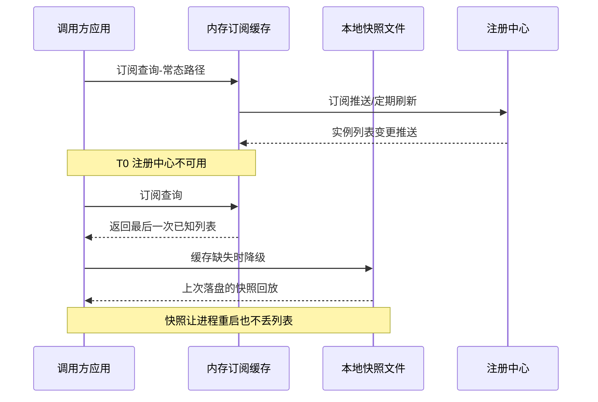

# 注册中心高可用与容灾架构深读：把自己当被依赖者设计

> **本文核心**：注册中心的高可用不是「自己不挂」，而是「挂了也不传导」——它是全公司调用链的最底层依赖，它的故障会以「发现失效」的形式放大到每一个调用方。本文从治理视角拆解注册中心自身的可用性设计：集群形态与多数派账本（CP 系的地理分布约束、AP 系的合并语义约束）、客户端容灾三级链路（内存订阅缓存→本地快照→空列表兜底）如何把注册中心故障「隔离」在发现层、心跳与推送扇出如何成为高可用账本里的隐性负载面。**机制链**：故障不对称分析（注册中心挂≠调用挂）→ 集群形态选型（多数派地理分布/对等复制）→ 客户端兜底链路（缓存衰减/快照回放）→ 负载面核算（心跳 QPS/推送扇出）→ 容灾演练闭环（故障注入验证兜底链）。

## 一句话摘要

「注册中心高可用」的第一性原理是**故障不对称**：注册中心短暂不可用，只要调用方手里的地址列表还在，调用就还能继续——所以它的可用性设计重点不在「把服务器做得永不宕机」（那是对存储系统的要求），而在三条治理线：**让集群侧的故障窗口尽量短**（多数派跨机房分布、对等复制无单点）、**让客户端侧的故障免疫尽量长**（本地缓存与快照的兜底链路、快照的保鲜与回放语义）、**让恢复侧的流量尽量可控**（避免恢复瞬间的心跳风暴与推送扇出把注册中心二次打挂）。业内惯例是「集群保写入、客户端保读取」——两侧各管一半可用性，缺一侧都是伪高可用。

## 前置阅读

- 入门层篇 6《AP 与 CP 的选型》（一致性与可用性的取舍底盘）
- 入门层篇 10《注册中心高可用与运维》（集群部署与监控的入门图景）
- RPC 特性层《注册中心一致性协议深读：Distro 与 Raft》（协议层机制，本文在其上谈可用性架构）

## 目标导向

本文是什么：注册中心自身高可用与容灾架构的机制深读。功能：设计/评审注册中心部署形态、预判故障时间线、验证客户端兜底链路。收益：从「配了三节点就算高可用」升级到「能算可用性账、能演练兜底链」的治理判断力。必看场景：注册中心部署评审、机房级容灾规划、注册中心故障复盘、发布窗口风险评估。

## 一、故障不对称：注册中心挂了，调用为什么还在继续

理解注册中心高可用，先要理解它与数据库在故障语义上的本质差异。数据库挂了，写入立刻失败——故障即时传导；注册中心挂了，**「注册」与「发现」两条路径的受损速度完全不同**：注册路径（新实例上线、心跳续约）即刻受损，发现路径（调用方查地址）却因为客户端本地有全量订阅数据的副本而继续可用——故障是**延迟传导**的，传导速度取决于「地址列表的保鲜需求」。

```text
注册中心故障传导的三个阶段:
  T0 注册中心不可用
  → 阶段一[免疫期]: 调用方读本地订阅缓存, 调用照常
      (时长 = 缓存数据的新鲜度容忍, 与实例变更频率负相关)
  → 阶段二[衰减期]: 无心跳续约, 存活实例的临时节点陆续过期
      (调用方列表里的死实例逐渐增多, 靠调用方容错兜底)
  → 阶段三[失效期]: 发布/扩容全部冻结, 新实例无法进入列表
      (持续越久, 恢复后的重建成本越高)
```

这个三阶段模型是本文的总纲：**高可用架构的目标不是消灭 T0，而是把免疫期拉长、把衰减期的伤害摊薄、把失效期挡在业务感知之外**。沿着这条线，注册中心的可用性工程分成三块——集群侧（写入通道的可用性）、客户端侧（读取通道的免疫）、恢复侧（回流的秩序），下面逐一拆。

## 5W 速记卡

| 维度 | 一句话 |
|---|---|
| What | 注册中心自身的集群形态、客户端容灾与恢复秩序的架构设计 |
| Why | 注册中心是全链路底层依赖，其故障以「发现失效」形式延迟传导并放大 |
| When | 部署形态评审、机房容灾规划、注册中心故障复盘、发布窗口评估 |
| Where | 集群复制层 + 客户端缓存层 + 心跳与推送负载面 |
| How | 故障不对称 → 集群保写入 → 客户端保读取 → 恢复控节奏 → 演练验证兜底 |

## 二、集群侧：多数派账本与部署形态

集群侧的可用性账分两种记法。**CP 系（Raft/ZAB 底座）的账本是多数派数学**：三节点容忍一节点故障、五节点容忍两节点——但这笔账有两个容易被忽略的修正项。修正一：**多数派的地理分布比节点数量重要**——三节点部署在同一机房，机房级故障直接失去多数派，「容忍一节点」的承诺在机房故障面前归零；业内惯例是多数派节点跨可用区分布（公开口径：主流托管服务默认多可用区部署）。修正二：**计划内维护要计入故障预算**——滚动升级期间实际可容忍的意外故障数是「N/2-1 再减去正在重启的节点」，发布窗口是多数派最薄的时段。

**AP 系（Distro/对等复制底座）的账本没有多数派，但有收敛账**：任意节点可写意味着没有「失去写入权」的故障模式，可用性上限更高；代价是故障期间的数据冲突要靠合并语义兜底（分片权威或时间戳取舍，机制见 RPC 特性层 Distro 篇）——**AP 集群的高可用短板从「能不能写」转移到「合并对不对」**：分区恢复后的数据对齐期间，实例列表可能出现短暂回退（恢复前的摘除被合并回来），治理上要在恢复窗口叠加一次全量健康检查。



**部署形态的评审清单**由此而来：接入层有没有单点（客户端直连节点列表还是过负载均衡）、节点故障的自动顶替（AP 分片重分配/CP 选举）有没有演练过、机房级故障的多数派或分片分布是否成立。这三条每一都指向同一个原则：**集群侧可用性是「结构性质」不是「数量性质」**——加节点不加结构，可用性不涨。

## 三、客户端侧：三级兜底链路与快照治理

集群侧再稳，注册中心也有不可用的时候（机房故障、网络抖动、自身升级）——客户端兜底链路才是发现可用性的最后一道防线。通用实现是三级结构：



三级链路的机制要点有三。**第一，内存缓存是「最后一次已知状态」不是「实时状态」**——注册中心不可用期间缓存不再更新，它的数据随时间衰减（真实存活的实例集合在漂移），治理口径上要把它当作「降级数据源」：调用方容错（重试换节点、熔断剔除死实例，互指 stability 系列）在降级期承担更高的剔除压力。**第二，本地快照解决的是「进程重启」这个最容易被忽略的故障组合**——注册中心不可用 + 调用方重启 = 空列表启动，没有快照的服务直接启动失败或拒绝调用；有快照的服务用「上次的列表」冷启动，等注册中心恢复后再校准。**第三，快照有保鲜问题**：落盘太频繁伤磁盘，太久不落盘则回放出来的列表过旧——常见折中是变更触发落盘 + 启动时校验时间戳（行业认知，各实现参数不同）。

**空列表兜底**是链路的最后语义：所有兜底都失败时，返回空列表还是抛异常，是两个不同的故障哲学——返回空列表让调用「快速失败、全部失败」（故障面大但行为可预期），抛异常让上层按自己的降级逻辑处理（灵活但要求上层真的写了降级）。治理上建议显式配置而不是吃默认值，并保证该行为有监控覆盖（发现降级事件计数）。

## 四、恢复侧：心跳风暴与推送扇出

被忽视的高可用环节是**恢复瞬间**。注册中心恢复服务后，积压的心跳、重连的长连接、滞后的注册请求同时涌回——这本质上是一次针对自己的流量尖峰。心跳的重试如果用固定间隔（而非指数退避+抖动），会形成周期性同步洪峰；AP 系的全量数据同步（新节点拉快照）与客户端全量重连叠加，恢复期 CPU 与网络可能瞬间过载——**注册中心死于「恢复」而不是「故障」是业内见过的真实模式（生产实践里的常见复盘条目）**。

推送扇出是另一笔隐性账。一个服务实例变更，要通知所有订阅方——热门服务（被上百个应用订阅）的变更扇出是「变更数 × 订阅方数」的乘积。滚动发布时大量实例状态翻转，扇出乘积在发布窗口堆积，注册中心的推送线程池与网络带宽承压——**发布窗口是注册中心负载面最厚的时段，恰与多数派最薄的时段（CP 滚动维护）重叠**。治理对策是错峰（发布窗口与注册中心维护窗口分开）+ 推送合并（攒批推送降低扇出次数）+ 扇出监控（每秒推送消息数进大盘）。

```mermaid
stateDiagram-v2
    [*] --> 常态服务: 心跳与推送负载平稳
    常态服务 --> 故障期: 节点故障或机房断链
    故障期 --> 恢复期: 集群自愈或链路恢复
    恢复期 --> 常态服务: 积压回流消化完成
    故障期 --> 二次故障: 恢复期流量尖峰过载
    二次故障 --> 恢复期: 限流与退避介入
    style 常态服务 fill:#a8e6a3
    style 二次故障 fill:#ffd3a5
```

状态机的关键分叉在「恢复期→二次故障」：这一步是否发生，取决于退避与限流是否就位。**恢复期的可用性是要设计的，不是恢复过程的自然属性**——这是注册中心高可用最容易被漏掉的半页。

## 五、与「服务实例高可用」的区别

| 维度 | 注册中心高可用 | 服务实例高可用 |
|---|---|---|
| 故障对象 | 发现链路（地址簿） | 业务链路（请求处理） |
| 核心指标 | 免疫期时长/恢复秩序/扇出健康度 | 错误率/延迟/容量冗余 |
| 兜底手段 | 客户端缓存与快照 | 多副本/重试/熔断 |
| 演练方式 | 注册中心断连+重启组合演练 | 流量打突/实例杀掉演练 |

两者是上下游关系：注册中心的可用性预算可以「借」给实例层（免疫期内发现层不出故障），实例层的容错能力反过来兜底注册中心的衰减期（死实例被熔断剔除）。**设计顺序上先算注册中心的免疫期能覆盖哪些场景，再把剩余场景交给实例容错**——两层预算对齐才是完整的发现高可用，只做其中一层都会在组合故障（注册中心降级+实例抖动）时穿底。

## 不同量级的思考：架构约束驱动解法

量级不是数字标签，是架构约束的边界——每一档的底层逻辑完全不同，解法不能套用：

- **十万级实例（单集群起步）**：约束来源是单集群的连接与内存上限——十万实例（含心跳与订阅关系）在三到五节点集群的容量舒适区内（内存 GB 级、心跳 QPS 千级，量级估算为行业认知）；思考方式是「监控驱动」——集群内存水位、心跳成功率、推送延迟三个指标齐了就够，不需要额外架构。这一档的核心问题是「有没有在监控」，而不是「要不要做容灾架构」
- **百万级实例（单集群到顶）**：约束来源是推送扇出与连接数的乘积起飞——热门服务的变更扇出开始吃满推送线程池，长连接数逼近单节点上限（公开报道的量级：主流实现单集群支撑百万连接需专门调优）；思考方式是「公式驱动」——扇出 = 变更频率 × 订阅方数，心跳账 = 实例数 ÷ 心跳间隔，两笔公式算清才谈扩容。这一档的核心问题是「公式算对没有」，而不是「加机器就行」
- **千万级实例（多集群分片）**：约束来源是单集群的结构上限——继续加节点只加存储不加推送能力，扇出瓶颈在结构上无解；思考方式是「节奏驱动」——按业务域拆多集群（命名空间/集群联邦），发布错峰、推送合并、机房就近接入的节奏要制度化。这一档的核心问题是「节奏与分片对不对」，而不是「参数调没调」
- **亿级实例（多活单元化）**：约束来源是物理集中不可能——任何单点视图都装不下亿级实例的实时变更流；思考方式是「架构驱动」——注册中心本身单元化（每单元管自己的实例域，跨单元按路由规则聚合），发现语义从「全局唯一列表」降级为「单元内强、单元间弱」。这一档的核心问题是「架构选对没有」，而不是「集群加到多少」

思考方式总结：十万级靠「默认够用」，百万级靠「公式核算」，千万级靠「分片节奏」，亿级靠「架构降级语义」——每一档的约束来自不同的物理层（单机内存/扇出乘积/结构上限/集中不可能），思考方式必须匹配约束来源。

**自下而上与触发升级**：先测档位再选思考——集群内存水位、峰值扇出、长连接数三个实测值决定你实际站在哪一档，不预支上一档的容灾复杂度，也不滞留在下一档的侥幸里。触发升级的信号：推送延迟 P99 持续抬升、发布窗口扇出接近推送线程池上限、单集群连接数进入厂商公开的调优区间——任一信号出现，思考方式必须随档升级（监控驱动→公式驱动→节奏驱动→架构驱动）。锚点始终是约束来源：扇出乘积与连接结构这些物理层变了，解法才跟着变——业务翻倍只是信号，约束迁移才是升级的依据。

## 反方案：为什么不把注册中心做成「永不宕机」？

有方案主张「注册中心是命脉，堆最强硬件+最强一致性存储，做成绝对不挂」——看似一劳永逸，实际三笔账算不平：**成本不线性**——绝对不挂意味着跨机房同步副本+仲裁部署，一套注册中心的机器与运维成本超过它所服务的业务的中位数成本；**目标错位**——注册中心的「不挂」对业务的价值上限就是「发现不停」，而客户端缓存已经免费提供了这一层（免疫期），集群侧的极限投入买的是重复保障；**复杂度反噬**——强一致多副本的写入延迟与选举窗口（见 RPC 特性层 Raft 代价账）反而制造新的故障模式。真正的取舍是**「集群做到合理冗余、客户端做足兜底、演练验证组合」**——用架构分工替代单点硬化。

## 六、典型场景与误区

**典型场景**：注册中心部署评审（多数派分布+接入层结构+维护窗口三件套）；机房级容灾规划（客户端快照的跨机房可用性——快照文件本身不能和注册中心同生共死）；发布窗口风险评估（发布顺序：先业务后注册中心、注册中心升级避开业务发布高峰）；故障复盘（按三阶段模型归因：免疫期/衰减期/失效期各发生了什么）。

**常见误区**：① **「三节点部署=高可用」**——同机房三节点在机房故障下多数派归零，结构比数量重要；② **「注册中心挂了调用方有缓存所以没事」**——免疫期不等于无限期，衰减期内死实例靠调用方容错兜底，兜底能力没对齐就是故障传导；③ **「快照是可有可无的优化」**——注册中心故障+应用重启的组合故障里，快照是唯一生路；④ **「恢复是自动的所以不用管」**——恢复期的心跳风暴与推送扇出是新的故障点，退避与限流是恢复设计的一部分；⑤ **「高可用靠架构图保证」**——兜底链路不演练等于没有，故障注入（断连/分区/慢恢复）是发现高可用的验收标准。

## 七、事故与实践叙事

**事故一：恢复期的二次打挂**。某平台注册中心集群因交换机抖动短暂不可用约一分钟，恢复瞬间数万客户端的订阅重连与积压心跳同时涌入，其中一批客户端的重试用固定间隔（未做抖动），形成周期性重连洪峰——注册中心恢复后三分钟内再次过载不可用，免疫期被二次故障击穿，业务方感知到大量「服务列表为空」的调用失败。复盘把「恢复秩序」纳入高可用设计：客户端重试强制指数退避+随机抖动、注册中心恢复初期对全量同步限速、重连按客户端 ID 分批放行。**教训**：可用性设计的时间轴要覆盖恢复段，「能恢复」与「能平稳恢复」是两个工程问题。

**事故二：快照与注册中心同机房团灭**。某团队为客户端快照专门做了本地磁盘持久化，自认为兜底完备——一次机房级断电演练暴露组合缺陷：注册中心与一批调用方同机房，机房整体不可用期间调用方迁移到另一机房重启，快照文件留在故障机房的本地盘上，新机器上无快照可回放、注册中心又不可达——发现链路在容灾切换现场完全失效。复盘把「快照的可迁移性」提级：快照随镜像/挂载网络盘存放，或客户端启动时支持从相邻可用区的只读副本拉取。**教训**：兜底资源的部署位置要和它的保护对象错开，同一故障域内的兜底是伪兜底。

**实践叙事：把「免疫期」变成可量化的 SLO**。某中台团队给发现链路定了三段式指标：免疫期时长（注册中心不可用期间发现层无故障的持续时间）、衰减期死实例比例（降级期间列表中不可达实例占比）、恢复收敛时长（恢复后列表与新实例对齐的时间）。三个指标随故障演练自动产出，成为注册中心高可用的验收口径——后续两次注册中心自身升级都按「免疫期覆盖升级窗口」设计，业务零感知。**把故障三阶段变成 SLO，是高可用从架构图走向工程纪律的关键一步**。

## 八、设计思想：被依赖者的谦逊设计

注册中心高可用背后有一个更一般的架构思想：**越底层的依赖，越要把自己设计成「可被绕过」的**。数据库不可绕过（业务必须读写），所以数据库走高强度冗余路线；注册中心可以被绕过（客户端缓存天然是一份副本），所以它的正确路线是「维护这份副本的可用性」而不是把自己硬化成不可绕过。这套思想在基础设施里反复出现：DNS 的 TTL 缓存、CDN 的边缘副本、配置中心的客户端快照（互指 config-center 系列）——**「数据可以在下游留副本」的依赖，用副本兜底替代自身硬化；「数据不可留副本」的依赖，才值得为绝对可用性付费**。判断一个依赖该走哪条路，第一问就是「它的数据能不能在客户端留一份带时效的副本」。

## 九、追问链

**质疑者第一层**：客户端缓存已经是副本了，为什么集群侧还要认真做高可用——免疫期直接拉满不行吗？——免疫期的质量取决于缓存快照前的数据新鲜度，而新鲜度由集群侧的复制与推送健康度决定：集群半死不活时（比如 CP 集群失去多数派前的降级期），推送停滞、列表陈旧，客户端「免疫」的是连接故障，免疫不了数据腐坏。**集群侧高可用是免疫期质量的供给方**，两侧不能互替。

**质疑者第二层**：AP 系恢复后的全量健康检查会不会反而打挂实例？——会，这正是恢复限速的必要性：健康检查的并发与频率要设预算（分批探测、复用心跳结果），把「对账流量」当作正常流量的一部分核算，而不是恢复后的无成本操作。对账的本质是「用主动探测校正降级期的被动衰减」，探测预算与衰减幅度成正比。

**质疑者第三层**：Serverless/服务网格等新形态下注册中心会消失吗——高可用设计还值得投入吗？——形态在变，机制在迁移：网格把发现下沉到 sidecar 与控制面，控制面到数据面的分发恰恰是本文同构的问题（控制面挂了，sidecar 靠本地最后已知配置继续服务）。**「控制面高可用+数据面兜底」的双层结构跨形态复用**，投入的知识跨周期成立。

## 你们可能会问

**Q1：怎么度量免疫期到底有多长？**
演练法：故障注入切断客户端到注册中心的连接，观察业务错误率抬升的时间点——从断连到错误率抬升的时长即实测免疫期。它与实例变更频率强相关（发布频繁的时段免疫期短），要按发布高峰口径测，不要按空闲口径测。

**Q2：注册中心要不要和业务服务部署在同一批机器？**
不建议混部：注册中心的可用性等级高于多数业务服务，混部让它继承业务的资源竞争与发布节奏。至少做到资源隔离+发布隔离，机房分布上更要与「多数派/分片结构」一起规划。

**Q3：客户端缓存应该缓存多久、快照多久落盘一次？**
缓存是订阅制的「推拉结合」（推送更新+定期全量校准），不是固定 TTL；快照按变更触发落盘为主、定时兜底为辅（行业认知，参数各实现不同）。判据是「重启+注册中心不可用」组合下能回放到尽量新的列表。

**Q4：监控大盘上注册中心最该放哪几个指标？**
最小集：心跳成功率、推送延迟 P99、集群节点健康数（CP 加选举事件频率）、客户端降级事件计数（缓存兜底被触发的次数）。降级事件计数是「免疫期被消耗」的直接信号，常被漏配。

## 💡 实战提示

- 💡 注册中心高可用=两侧各半：集群侧保写入通道（结构化冗余），客户端侧保读取免疫（缓存+快照+空列表语义），只做一侧是伪高可用
- 💡 决策口径：多数派/分片的地理分布优先于节点数量；恢复期的退避、限速、分批放行是必选项不是优化项
- 💡 选型推荐：优先选「客户端快照内建+降级事件可观测」的实现；快照可迁移性（跨机房重启可回放）进评审清单
- 💡 验收方式：故障注入演练是唯一可信验收——断连、断连+重启、机房切换三个组合场景各跑一遍，产出三段式指标（免疫期/衰减死实例比例/恢复收敛时长）

## 自测三问

1. 注册中心故障传导的三阶段是什么？（答：免疫期——本地缓存顶住调用照常；衰减期——临时节点过期死实例增多靠调用方容错兜底；失效期——发布冻结恢复成本累积。高可用设计=拉长第一段、摊薄第二段、挡住第三段）
2. CP 系集群的「三节点高可用」在什么条件下不成立？（答：节点同机房时机房故障使多数派归零；滚动维护时预算要扣除在维护节点——多数派是结构性质不是数量性质）
3. 恢复期有哪些风险，怎么设计？（答：积压心跳与重连风暴、推送扇出堆积、AP 全量对账流量——对策是指数退避+抖动、恢复限速、分批放行、对账预算化）

## 开放问题

- 免疫期的标准化度量：各实现的客户端兜底行为语义不一，「发现层 SLO」的行业口径尚未统一。
- 快照格式与跨实现迁移：客户端快照是私有格式，注册中心换型时兜底资产不可携带，可移植快照标准是空白。

## 📎 核心带走

- **核心一句话**：注册中心高可用不是把自己硬化成不挂，而是故障不对称下的三层设计——集群保写入（结构化冗余）、客户端保读取（缓存+快照兜底）、恢复保秩序（退避+限速+分批）
- **机制链**：故障不对称 → 三阶段传导（免疫/衰减/失效）→ 集群形态账本（多数派地理分布/对等合并语义）→ 客户端三级兜底 → 恢复期流量治理 → 演练产出三段式 SLO
- **失效点/边界**：免疫期随发布频率缩短；快照与保护对象同故障域即伪兜底；恢复期可二次过载；集群降级期的数据腐坏是客户端免疫不了的盲区

## 📌 数据与事实声明

- 写于 2026-09-23，机制以 Nacos/Eureka/ZooKeeper 公开文档与通用分布式文献为基准（公开口径）；容量与延迟数字均为量级估算（行业认知），以实测为准
- 免责：各实现的高可用参数与默认行为以官方文档与所用版本源码为准；事故叙事为行业通用模式的原型化脱敏重述，不指向任何真实公司

## 📚 参考资料

| 类型 | 标题 | 来源 |
|---|---|---|
| 官方文档 | Nacos 架构与高可用说明 / Eureka 自我保护机制 | nacos.io / github.com/Netflix/eureka/wiki |
| 原理书 | 《数据密集型应用系统设计》DDIA 第 8 章故障与部分失效 | 公开出版 |
| 关联文章 | 入门层篇 6/篇 10、RPC 特性层 Distro 与 Raft 篇、stability 系列熔断降级 | 本仓库 |
