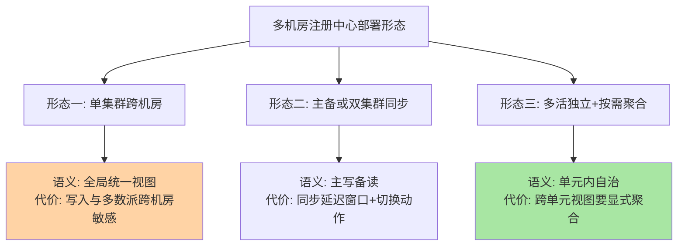
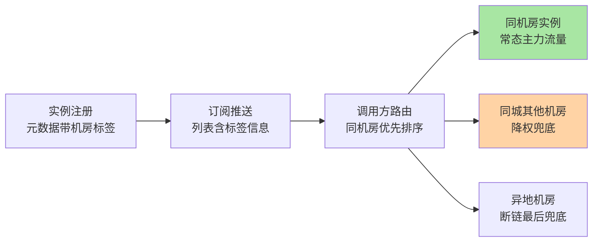
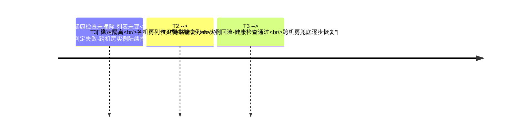

# 多机房服务发现与单元化路由深读：就近、封闭与断链

> **本文核心**：多机房下的服务发现要回答的问题从「地址是什么」变成「地址在哪个故障域」——机房专线的延迟与带宽约束决定了跨机房调用是治理对象而不是默认行为。本文拆解三条机制线：**就近路由**（注册元数据带机房标签→订阅侧过滤排序→调用方优先同机房，实现链的关键在「标签从哪来、路由在哪做」）、**部署形态**（单集群跨机房/主备同步/多活独立三种形态的发现语义与故障面）、**单元化**（按路由字段把调用封闭在 set 内，发现层为封闭性提供实例分组与分组内列表语义）。**机制链**：机房拓扑建模（标签/可用区元数据）→ 发现数据面（实例带域信息注册、订阅按域过滤）→ 路由决策（就近优先/单元封闭/跨域兜底）→ 断链行为（列表收缩与回流）→ 演练验收（断链时间线三段核对）。

## 一句话摘要

单机房里注册中心是个地址簿，多机房里它变成**路由信息的权威源**——调用方「调谁」的决策一半来自发现层给的列表顺序与分组语义。本文的核心判断：**就近路由是优化（不做只亏延迟），单元化是约束（不做会亏可用性）**——同城双活阶段靠就近路由把跨机房流量压到低水位即可；异地多活阶段必须靠单元化把「数据亲和的调用」封闭在单元内，否则断链时调用跨单元乱窜，数据层的一致性防线（单元内自洽）被调用层绕过。发现层在单元化里的角色是「提供封闭的分组视图」：实例注册带单元标签、订阅按单元隔离、断链时列表按单元收缩——发现层不做业务路由决策，但路由决策的数据地基全部由它供给。

## 前置阅读

- 入门层篇 4《服务订阅与发现机制》（订阅推送与本地缓存的基础模型）
- 本系列篇 1《注册中心高可用与容灾架构》（集群形态与客户端兜底链路）
- 服务路由系列《标签路由》《灰度发布与泳道》（路由规则层的条件定向分发）

## 目标导向

本文是什么：多机房场景下服务发现与单元化路由的机制深读。功能：设计多机房注册中心部署形态、落地就近路由的元数据链路、评审单元化的发现层封闭性。收益：把「多机房」从部署问题升级为「发现语义」问题的架构判断力。必看场景：同城双活/异地多活架构评审、专线带宽治理、单元化改造规划、机房断链演练设计。

## 一、问题起点：专线不是免费光纤

多机房所有治理动作的物理根源是一句话：**机房间的网络比机房内的网络差一个量级**——延迟从毫秒内跨到几毫秒到几十毫秒（距离决定，公开口径：同城双机房通常个位数毫秒、异地几十毫秒起步，行业认知），带宽有专线成本，故障面独立（断链是必须预案的常态事件而非小概率事故）。调用链上的每一次跨机房跳转都在支付这三笔成本，而微服务调用链是乘法结构：一条业务请求穿过的服务次数，乘以每跳跨机花的概率——**单看一跳没多少，链路乘完就厚了**。

于是治理目标收敛为两条：**常态下跨机房流量占比要压到低水位**（就近路由解决），**断链时业务能按机房切割存活**（单元化解决）。两条目标都落在发现层——因为「调用谁」的第一手输入就是发现层给出的实例列表：列表不分机房，调用方就按随机或轮询打过去，跨机房流量天然占一半；列表带机房语义，调用方才有就近与封闭的决策原料。

```text
发现层供给路由决策的三种语义:
  1. 平面列表: 所有实例混排 —— 调用方无法表达机房偏好(单机房默认)
  2. 带标签列表: 实例带机房/可用区元数据 —— 调用方可过滤排序(就近路由)
  3. 分组封闭列表: 实例带单元标签+订阅按单元隔离 —— 调用方列表天然单元内(单元化)
```

## 5W 速记卡

| 维度 | 一句话 |
|---|---|
| What | 机房标签元数据、就近路由实现链、多机房部署形态与单元化分组语义 |
| Why | 跨机房调用的延迟/带宽/断链风险要靠发现层供给的列表语义治理 |
| When | 双活与多活规划、专线带宽治理、单元化改造、断链演练 |
| Where | 注册元数据 → 订阅过滤 → 调用方路由决策 → 断链列表收缩 |
| How | 建模拓扑 → 标签注册 → 就近排序 → 单元封闭 → 断链按域收缩 |

## 二、部署形态：三种结构的发现语义

多机房下注册中心自己怎么部署，决定了发现语义的天花板。三种主流形态：



**形态一（单集群跨机房）**：一个注册中心集群的节点分布在多个机房。发现语义最简单（全局一个视图），但把集群的高可用账与机房耦合——CP 系的多数派要跨机房分布，写入确认走机房间 RTT；机房断链时少数派侧不可写。**它适合「机房间延迟低且断链概率低」的同城场景**，异地场景基本出局。

**形态二（主备/双集群同步）**：每机房一个集群，机房间做实例数据同步（单向或双向）。常态下各机房读自己的集群（就近+低延迟），断链时各机房独立服务（发现不断）——但同步延迟窗口内两侧视图有差异，双向同步的冲突合并（回到本系列篇 1 的合并语义问题）是复杂度中心。**适合双活的过渡形态**：部署改动小，语义上「全局视图」降级为「最终一致的全局视图」。

**形态三（多活独立+按需聚合）**：每机房（或每单元）一个完全独立的注册中心，实例主要注册在本单元，跨单元视图按需聚合（全局服务目录/管控面聚合）。这是单元化的标准配套——**发现层按单元切分，单元内注册、订阅、推送全部闭环**；代价是「看全局」变成显式动作（运维平台聚合各单元目录），且服务在多单元都部署时，订阅方要理解「单元内列表」的语义。形态选型的判定轴就一条：**你的发现语义需要多强的全局性**——同城容灾要的是「断链可切」，形态二够用；异地多活要的是「单元自治」，形态三是终点。

## 三、就近路由的实现链：标签、过滤与排序

就近路由的实现是一条从注册到调用的数据链，每一环都有实现取舍：

这条链的**关键路径在第一环与第三环**：标签是路由决策的全部输入（输入错则全链错），兜底语义是路由的最终安全网（网漏则故障被锁死在域内）；中间环的实现再花哨，也只是在两环之间搬运语义。

**第一环：标签从哪来**。实例的机房/可用区标签有三种供给方式——配置注入（实例启动时从环境/平台元数据服务读取所在机房写入注册元数据）、注册中心侧判定（按注册连接来源网段判定机房，实例无感知）、平台化注入（发布系统按部署位置统一打标）。取舍点在「信任链」：配置注入依赖实例自律，标错（实例迁移后标签没更新）是最常见的脏数据来源；平台化注入把标签做成部署事实的投影，准确性最高——**标签的治理成本随规模上升，业内惯例是规模上来后标签必须平台化（生产实践共识），靠应用自觉的标签在机房迁移后会大面积腐烂**。

**第二环：路由在哪做**。两种位置：调用方侧（订阅全量列表+本地按机房过滤排序——灵活但每个调用方都要实现）、中间层侧（SDK 或网格 sidecar 统一提供就近能力——收敛实现但引入中间层的语义固化）。**网关与网格的就近路由是中间层位置的代表**，RPC 框架的集群路由（互指 RPC 系列）是调用方位置的代表——两条路线的机制同构，差别在「就近逻辑的升级由谁同步」。

**第三环：排序与兜底语义**。就近不是非黑即白：同机房实例不足或全部熔断时，调用要能「跨机房兜底」而不是直接失败。通用语义是优先级列表（同机房→同城机房→异地机房），叠加权重衰减（跨机房实例天然降权）——**兜底顺序与降权幅度是就近路由的两个核心参数**，前者决定断链时的行为，后者决定常态下跨机房流量的水位。



## 四、单元化：发现层的封闭语义

单元化（set 化）的动机来自数据：异地多活要求「一份数据的读写封闭在一个单元内」，否则跨单元的数据同步延迟与冲突让一致性防线失效。但**数据封闭的前提是调用封闭**——如果单元 A 的用户请求在调用链中游走到单元 B 的服务实例，读写就落到了 B 的数据副本上，封闭被绕过。调用封闭靠两层配合：**入口路由**（按路由字段把外部请求分到单元，属接入层职责）+ **内部分布式调用封闭**（服务间调用不出单元——这正是发现层的职责）。

发现层提供的封闭语义有三条：**实例注册带单元标签**（单元是比机房更强的分组——机房是物理拓扑，单元是业务拓扑，一个单元通常内含一整套机房内部署）；**订阅按单元隔离**（调用方的默认订阅范围是本单元内的实例列表——「单元内列表」取代「全局列表」成为默认语义）；**跨单元调用显式化**（确需跨单元的调用——比如单元尚未覆盖的服务——要走显式的跨单元通道与命名，不能混在默认列表里）。三条合起来，发现层就从「全局地址簿」变成「单元内地址簿+全局目录索引」——**这就是形态三部署形态的语义对应物**。

```mermaid
stateDiagram-v2
    [*] --> 全局视图: 单机房或单集群
    全局视图 --> 就近优化: 多机房+标签路由
    就近优化 --> 单元封闭: 异地多活要求调用封闭
    单元封闭 --> 单元封闭: 常态: 单元内注册订阅调用闭环
    单元封闭 --> 降级开放: 单元故障: 流量切到兄弟单元
    降级开放 --> 单元封闭: 故障单元恢复-流量回切
    style 全局视图 fill:#ffd3a5
    style 单元封闭 fill:#a8e6a3
```

状态图里的「降级开放」是单元化的应急语义：某单元整体故障，其业务流量切到兄弟单元——此时兄弟单元的列表要临时「开放」容纳外单元流量，切回后恢复封闭。**封闭是常态，开放是事件；开放期间的数据一致性代价（跨单元读写）要在切换预案里显式记账**，这是单元化治理最容易被略过的一页。

## 五、断链时间线：发现行为的三个阶段

机房断链是所有多机房设计的验收场景，发现层的行为按时间轴核对：



四个阶段的治理要点：**T1 的错误率尖峰**取决于健康检查的摘除速度（检测间隔与阈值，机制见入门层篇 5）与调用方超时配置的配合——摘除快则尖峰短，但网络抖动的误摘风险同步上升，参数要在演练里校准而不是拍脑袋。**T2 的摘除完整性**是最危险的一段：摘除不干净（部分实例还在列表里）会让调用方在「半好半坏」的列表上反复试错——**「断链后列表收敛时间」是多机房发现的核心 SLO**。**T3 的单元语义**发挥作用：单元封闭做得好，本单元内调用全在本机房，业务完全存活；没做单元化的系统在这里暴露真相——所有关键依赖都有跨机房调用，切割存活变成部分存活。**T4 的回流秩序**复用本系列篇 1 的恢复治理（限速、分批、对账），不再展开。

## 与「异地多活」的区别

| 维度 | 多机房服务发现 | 异地多活架构 |
|---|---|---|
| 问题域 | 调用层的地址供给与封闭语义 | 数据层+调用层+接入层的整体方案 |
| 发现层角色 | 供给列表语义（标签/分组/收缩） | 消费方之一（还需数据分片与入口路由） |
| 成熟标志 | 断链后列表收敛时间达标 | 单元故障时业务按单元切换存活 |
| 本文边界 | 发现与路由机制 | 完整多活方案（数据同步/冲突处理另域） |

发现层是异地多活的地基之一而非全部——单元化改造的立项评审里，发现层封闭性（标签准确性、单元内订阅隔离、跨单元显式化）是可独立验收的第一阶段，这一步做不实，数据层的单元化改造等于建在沙上。

## 不同量级的思考：架构约束驱动解法

- **十万级实例（双机房同城）**：约束来源是「机房只是容灾维度不是容量维度」——十万实例同城双机房，形态二（双集群同步）配就近路由即可达标，断链切割是能力验证而非常态需求；思考方式是「监控驱动」——跨机房流量占比与断链收敛时间两个指标建起来就够。这一档的核心问题是「跨机房流量占比有没有在监控」，而不是「要不要单元化」
- **百万级实例（同城三机房）**：约束来源是扇出与同步的双双起飞——实例变更的跨机房同步流量、标签脏数据的治理成本、发布窗口的列表收敛压力同时变厚；思考方式是「公式驱动」——同步账 = 变更频率 × 机房数，收敛账 = 摘除窗口 × 订阅扇出，公式算不清就说不清容量。这一档的核心问题是「同步与收敛的公式算对没有」，而不是「机房加一个试试」
- **千万级实例（异地多单元起步）**：约束来源是「异地延迟让全局视图失去意义」——几十毫秒的机房间延迟使跨机房调用在延迟上不可接受、在断链上不可存活，单元化从优化变成硬约束；思考方式是「节奏驱动」——按业务域分批单元化（先数据亲和强的域）、单元内闭环验收、兄弟单元互备演练，节奏乱了一步则封闭性名存实亡。这一档的核心问题是「单元化节奏与封闭验收对不对」，而不是「注册中心再扩一倍」
- **亿级实例（单元化为常态架构）**：约束来源是「任何全局组件都是瓶颈与爆炸半径」——全局注册中心、全局目录、全局配置在容量与故障面上都不可接受，单元自治成为默认；思考方式是「架构驱动」——发现层单元化只是单元化架构的一环，与数据分片、入口路由、配置分发（互指 config-center 系列）同构演进，「单元」成为容量与容灾的统一计量单位。这一档的核心问题是「单元边界划对了没有」，而不是「哪个机房再顶一下」

思考方式总结：十万级靠「监控两指标」，百万级靠「两笔公式」，千万级靠「分批节奏」，亿级靠「单元架构」——约束来源从「机房是容灾维度」迁移到「机房是容量与爆炸半径维度」，思考方式必须跟着约束迁移。

**自下而上与触发升级**：先测档位再选思考——跨机房流量占比、断链列表收敛时间、实例变更的同步延迟三个实测值决定你实际站在哪一档，不预支上一档的单元化复杂度，也不滞留在下一档的侥幸里。触发升级的信号：跨机房流量占比压不进目标水位、异地机房即将承接生产流量、断链演练中出现「切割不干净」——任一信号出现，思考方式必须随档升级（监控驱动→公式驱动→节奏驱动→架构驱动）。锚点始终是约束来源：机房间延迟与断链概率这些物理层变了，解法才跟着变——业务翻倍只是信号，约束迁移才是升级的依据。

## 反方案：为什么不维护一个「全局统一注册中心」？

有观点主张「单元化太复杂，不如把注册中心做强，全局一个视图，路由靠规则引擎现场算」——看似简化了发现语义，实际三处硬伤：**物理上**，全局视图意味着实例变更流全量汇到一个逻辑点，容量与延迟账在千万级实例档必然失衡；**故障面上**，全局视图是全局爆炸半径，断链时「视图的一部分」语义模糊（哪些实例算可达？），切割语义反而比单元封闭更难说清；**治理上**，现场算路由把决策推迟到调用时，每一次调用的路由计算都要消费全局数据——就近路由的本地化决策（列表到手、本地排序）被替换成跨网络查询，延迟与可用性双输。取舍的正解是**「能本地化的决策本地化，全局性留给显式的聚合面」**——这正是单元化在发现层的表达。

## 六、典型场景与误区

**典型场景**：同城双活（双集群同步+就近路由，断链切割做能力验证）；异地多活单元化（独立注册中心+单元内订阅闭环+兄弟单元互备）；专线带宽治理（跨机房同步与调用的流量核算，就近路由把常态跨机房流量压低水位）；单元化改造立项（发现层封闭性作为第一阶段独立验收）。

**常见误区**：① **「注册中心跨机房同步了就是双活了」**——同步解决的是列表可见性，不解决调用封闭与数据亲和，断链时业务照样跨机房乱调；② **「标签由应用自己填就行」**——实例迁移与镜像复制会让标签静默腐烂，就近路由基于脏标签做决策等于放大故障，标签必须平台化治理；③ **「就近=只调本机房」**——没有降权与兜底顺序的就近是硬隔离，同机房实例抖动时没有跨机房泄压通道，故障被就近策略锁死在本机房；④ **「单元化是数据层的事」**——调用封闭先于数据封闭，发现层的单元语义不做，数据层单元化的隔离承诺随时被调用绕过；⑤ **「断链演练只演一次」**——列表收敛时间随实例规模与发布频率漂移，断链演练要按季度常态化并盯收敛 SLO 趋势。

## 七、事故与实践叙事

**事故一：脏标签把就近路由变成就近隔离**。某平台服务从 A 机房整体搬迁到 B 机房，注册标签沿用镜像里的旧配置——列表标签显示实例还在 A 机房，A 机房的调用方按就近策略把流量持续打向已搬空的「同机房」地址，错误率抬升而按标签看一切正常。复盘发现标签链路无人认领：搬迁流程里没有标签刷新步骤。整改把标签改为发布平台按实际部署位置注入，并在健康检查里交叉校验「标签机房与网络可达域」的一致性。**教训**：就近路由的可信度等于标签的可信度，标签治理是就近路由的隐形前置工程。

**事故二：断链时列表收敛拖了四十分钟**。某双活体系演练机房断链，注册中心主备同步中断后，备机房列表里残存大量已不可达的 A 机房实例——健康检查的跨机房探测依赖专线本身，断链时探测也断了，摘除判定悬空，列表收敛从预期的分钟级劣化到几十分钟（行业通病原型，数字为演练设定量级）。整改引入「断链即收缩」语义：机房间的探活与数据同步共用链路，链路判死即整域摘除该机房实例（域级摘除而非实例级探测），收敛时间压回分钟级。**教训**：跨机房健康检查的探测通路与数据链路是同一条命，断链时实例级探测失效，域级摘除才是断链场景的正确语义。

**实践叙事：发现层封闭性先行验收的单元化路径**。某团队规划异地多活时把改造拆成两个独立验收阶段：第一阶段只做发现层（单元标签平台化注入、订阅按单元隔离、跨单元调用显式命名+审计），用「跨单元调用清单归零」为验收线；第二阶段才动数据层分片。第一阶段独立上线后，意外收益先到：常态跨机房流量占比大幅下降（就近+封闭的顺带效果）、跨机房调用延迟毛刺消失，为第二阶段的数据改造赢得了组织信任。**把发现层封闭性作为可独立交付的第一步，是单元化改造降低风险的有效节奏**。

## 八、设计思想： locality 是发现层的第二属性

单机房时代发现层的唯一职责是「可用性」（列表给得全、给得新），多机房时代它长出第二属性——**局部性（locality）**：列表不仅要「有地址」，还要「有位置语义」（机房、可用区、单元），并且位置语义要参与默认行为（排序、过滤、封闭）。这个演进与存储领域的规律同构：缓存从「存不存在」到「从哪一层拿」，数据从「有没有副本」到「副本放在哪」——**规模系统的每一次跨域扩展，都会把「位置」从部署细节提升为一等元数据**。发现层的这一步走完，位置就沿调用链向上传导：路由规则、灰度泳道、容灾切换全部消费同一套位置标签——一套拓扑元数据撑起多个治理面，这是多机房治理「元数据先行」的设计本质。

## 九、追问链

**质疑者第一层**：就近路由为什么不做成注册中心侧的「过滤视图」（订阅时按机房过滤，调用方拿到的列表天然只有本机房）——这样调用方零改造不是更好？——服务端过滤牺牲了弹性：同机房实例熔断殆尽时，调用方拿不到跨机房备选列表，就近变成硬隔离；订阅全量+本地排序保留了「降级时换域」的决策权在调用方手里。服务端过滤的正确适用面是单元封闭（封闭语义下跨域列表本就不该出现）——**「就近」要弹性所以客户端裁决，「封闭」要强制所以服务端裁决**，两种语义不该混用同一种实现。

**质疑者第二层**：单元化后单元内实例全灭怎么办——封闭会不会把故障也封闭在单元里？——封闭封的是「常态流量」，不封「应急切换」：单元故障时入口层把该单元用户切到兄弟单元，调用层的「降级开放」语义同步打开（本系列状态图的降级路径）。真正要警惕的是反方向：切走的流量让兄弟单元容量翻倍，单元容量规划必须按「N+1 单元互备」核算而不是按单单元满载核算——封闭的代价是容量要为切换预留。

**质疑者第三层**：云厂商的多可用区托管服务（托管注册中心、服务网格控制面）把这些机制内置到什么程度了？——托管化的共性是「把拓扑元数据产品化」：可用区标签自动注入、就近接入默认开启、断链时的域级摘除内建（公开口径，各厂商程度不一）。自建与托管的分界回到本系列篇 1 的判断式：**拓扑元数据的治理能力要不要自持**——多机房拓扑复杂、发布频繁的团队，托管化省下的正是最易腐烂的标签治理成本。

## 你们可能会问

**Q1：机房标签应该打多细——机房、可用区还是机架？**
按路由决策的最小消费粒度打：就近路由消费到可用区/机房级；机架级是故障域精细化（电力/网络分组），通常只在同城大机房内做反亲和部署时消费。标签粒度每细一级，治理成本上一档，没有消费方的粒度不要打。

**Q2：跨机房流量占比多少算健康？**
没有普适数字，判据是「断链时业务存续所需」倒推：要求断链时本机房自足的业务，常态跨机房占比应接近兜底水位（个位数百分比量级，行业认知）；允许跨机房互备实时分担的业务可放宽，但要与专线带宽的故障预案对账。

**Q3：单元内服务不全（部分服务没单元化）怎么办？**
显式跨单元通道：未覆盖的服务走命名区分的跨单元调用（带监控与审批），并在单元化看板上作为「封闭性负债」持续跟踪——目标是清单收敛而不是临时放行常态化。混在默认列表里「顺手调到」是封闭性失效的主因。

**Q4：断链演练怎么设计才不失真？**
三点：真断链路（剪专线/防火墙规则，不用软件开关模拟——探测通路要与数据链路一起断）、双随机（演练时间与断链机房随机，防止「按预案彩排」）、看 SLO 不看感觉（列表收敛时间、错误率尖峰、切割完整度三个硬指标对比基线）。

## 💡 实战提示

- 💡 多机房发现的两条目标线：常态压跨机房流量占比（就近路由），断链保按域切割存活（单元封闭）——前者是优化后者是约束，别混
- 💡 决策口径：同城双活用「双集群同步+就近路由」起步；异地多活必须走到「独立注册中心+单元内订阅闭环」，单元封闭性作为数据改造前可独立验收的第一阶段
- 💡 标签治理优先于路由策略：标签平台化注入（发布系统按部署事实打标）+ 标签与网络域交叉校验——脏标签上的就近路由是定向事故
- 💡 断链语义用域级摘除（链路判死整域收缩），实例级跨机房探测在断链场景与数据链路同生共死，收敛时间不可控

## 自测三问

1. 就近路由实现链的三环是什么？（答：标签供给（平台化注入最可靠）→ 路由位置（调用方灵活/中间层统一）→ 排序与兜底语义（同机房→同城→异地优先级+跨域降权））
2. 三种多机房部署形态的语义与适用？（答：单集群跨机房=全局统一视图，适合同城低延迟；主备/双集群同步=最终一致全局视图，适合双活过渡；多活独立+按需聚合=单元自治，适合异地多活单元化）
3. 为什么单元化的封闭语义要发现层先做？（答：调用封闭先于数据封闭——调用跨单元则读写落到错误副本，数据层隔离被绕过；发现层的单元标签、单元内订阅、跨单元显式化是封闭的执行点）

## 开放问题

- 位置语义的标准化：机房/可用区/单元的元数据模型在各实现间不统一，跨云多活的拓扑元数据互认尚无行业公约。
- 域级摘除与实例级探活的自动仲裁：断链场景域级收缩更快但误判代价大，「链路判死」的置信度判定仍在各实现内私有演进。

## 📎 核心带走

- **核心一句话**：多机房下发现层从地址簿升级为路由信息的权威源——就近路由供弹性（客户端裁决+跨域兜底），单元化供封闭（服务端裁决+域级语义），标签元数据是两者的共同地基
- **机制链**：机房拓扑建模 → 标签平台化注册 → 订阅带位置语义 → 就近排序/单元封闭 → 断链域级收缩 → 恢复回流对账 → 演练核对收敛 SLO
- **失效点/边界**：脏标签让就近变隔离；跨机房探活与数据链路同命（断链时实例级探测悬空）；单元封闭把容量规划抬到 N+1 互备；开放（应急切流）期间的跨单元读写要显式记账

## 📌 数据与事实声明

- 写于 2026-09-23，机制以公开的多活架构文献与主流注册中心/网格公开文档为基准（公开口径）；延迟与占比数字均为量级估算（行业认知），以各自网络与压测实测为准
- 免责：各实现的机房路由与单元化支持程度差异大，以官方文档与实测为准；事故叙事为行业通用模式的原型化脱敏重述，不指向任何真实公司

## 📚 参考资料

| 类型 | 标题 | 来源 |
|---|---|---|
| 官方文档 | Nacos 集群与多机房部署说明 / Envoy 就近路由（locality weighted lifting） | nacos.io / envoy 文档 |
| 原理书 | 《凤凰架构》服务治理与远程调用章节 | 公开出版 |
| 关联文章 | 本系列篇 1、入门层篇 4/5、服务路由系列标签路由与泳道篇、RPC 特性层服务发现系列 | 本仓库 |
