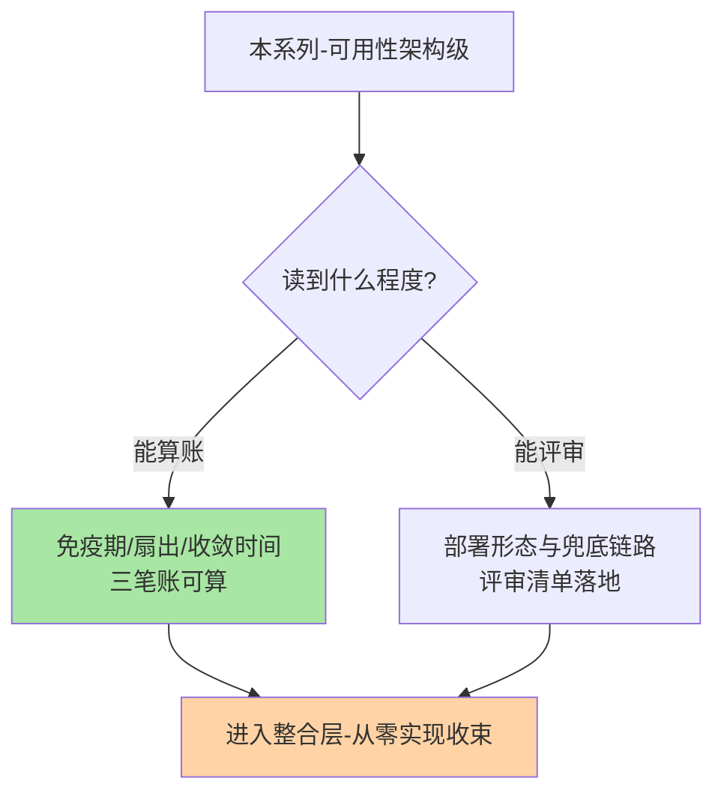
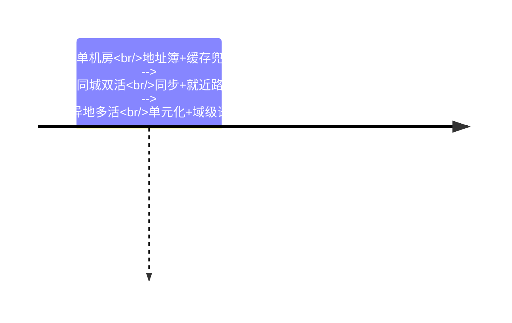

# 注册中心高可用系列总览：故障不对称下的三层设计

> **本文核心**：注册中心是全链路底层依赖，它的高可用不是「自己不挂」而是「挂了也不传导」——本系列沿治理视角两段展开：**容灾架构**（集群侧多数派与分片的结构账、客户端三级兜底链路、恢复期的心跳风暴与推送扇出治理）、**多机房与单元化**（机房标签元数据、就近路由实现链、部署形态三选一、单元封闭语义与断链域级摘除）。每个深挖点 1 篇机制深读，机制为主线、演练与事故为钉子。

## 一句话摘要

入门层建立「注册中心=分布式地址簿」的心智模型，本系列把「地址簿自己不可用时怎么办」拆到架构级：集群保写入、客户端保读取、恢复保秩序的三层设计，以及多机房下发现层从地址簿升级为路由权威源的语义演进——**两层主题共同的底层思想是「故障不对称」：不追求注册中心不挂，追求挂了之后每一段传导都有人兜住**。

## 系列导航

| 篇目 | 深挖点 | 核心交付 |
|---|---|---|
| 1_注册中心高可用与容灾架构-深度 | 故障不对称与三层设计 | 三阶段传导模型、多数派结构账、快照治理、恢复秩序 |
| 2_多机房服务发现与单元化路由-深度 | 发现层的位置语义 | 就近路由三环、部署形态三选一、单元封闭、断链时间线 |

## 与相邻层的关系

入门层（从零开始认识注册中心系列）给三大能力与选型底盘，本系列给容灾与多机房的机制细节；RPC 特性层服务发现系列（一致性协议/订阅推送）讲协议与数据面，本系列讲可用性架构与拓扑治理——协议行为是本系列故障时间线的输入。单元化篇与数据层多活方案互为边界：发现层管调用封闭，数据分片与冲突处理在数据域展开。

## 层内的取舍与演进

两篇共同强调的跨周期视角：注册中心的实现形态十年几换代（ZooKeeper 到 Nacos 到服务网格控制面），但「控制面高可用+数据面兜底」的双层结构与「位置成为一等元数据」的演进方向跨周期稳定——读这套知识的投入产出在实现换代后仍在。代价面如实说：多机房治理的参数（摘除阈值/降权幅度/收敛 SLO）强依赖各自网络拓扑，文中的量级只是锚点，**演练实测才是唯一可信口径**。

## 📌 数据与事实声明

- 写于 2026-09-23，机制口径以 Nacos/Eureka/Envoy 等公开文档为基准（公开口径）
- 免责：以各篇参考资料为准

## 📚 参考资料

| 类型 | 标题 | 来源 |
|---|---|---|
| 系列入口 | 注册中心入门层系列 | 本仓库 service-governance/service-discovery/入门层 |
