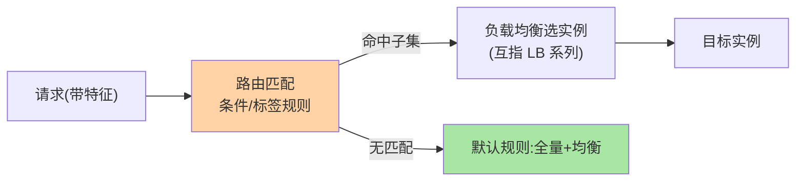

# 服务路由是什么：从均匀分发到定向分发

> 一句话：服务路由是**按规则把请求定向到指定实例子集的机制**——负载均衡解决「摊匀」，路由解决「指哪打哪」：灰度、多环境隔离、读写分离、故障切流，全是它的应用形态。

> **本文核心**：路由的本质是「流量筛选」——在候选实例集合上叠加规则匹配。**机制链**：请求带上特征（来源/参数/用户标签）→ 规则匹配（条件/标签）→ 命中的实例子集 → 交给负载均衡选实例（互指 LB 系列）→ 无匹配走默认规则。治理演进线：无路由 → 简单条件路由 → 标签体系 → 全链路泳道。

## 一句话摘要

路由的出现动机：**「均匀」在治理场景下反而是错的**——灰度发布要「新版本只接 1% 流量」，多环境要「测试流量绝不进生产」，故障切流要「坏机房流量瞬时清零」。这些需求的共性是**按条件定向**，与容量驱动的均匀分发是两个正交机制。路由三形态递进：**条件路由**（表达式匹配，最早出现）→ **标签路由**（键值体系，治理标准化）→ **灰度泳道**（流量染色 + 全链路透传，微服务治理的成熟形态）。

## 一、为什么均匀分发不够

负载均衡的决策输入是「容量与状态」，但治理问题的输入是「请求是谁、要去哪」——两类问题的决策维度完全不同。三个治理刚需撑起路由的存在：**灰度控制**（新版本风险隔离，比例与人群可控）、**环境隔离**（测试/预发/生产流量绝不串）、**故障切流**（坏单元分钟级清零）——「没有路由的微服务体系，治理只能靠重启」是早期微服务实践的真实写照。

## 5W 速记卡

| 维度 | 一句话 |
|---|---|
| What | 按规则把请求定向到指定实例子集的机制 |
| Why | 灰度/隔离/切流是均匀分发覆盖不了的治理刚需 |
| When | 灰度发布、多环境、故障切流、就近路由 |
| Where | RPC 框架路由层/网关/注册中心元数据配合 |
| How | 请求特征 → 规则匹配 → 子集筛选 → 交给均衡 |

## 二、路由在调用链中的位置

**路由在前、均衡在后**的次序是模型关键：路由先按规则缩小候选集（如「v2 且 az-a 的实例」），均衡再在子集内摊匀——两层正交组合，各自演进互不干扰。请求特征从哪来：**调用方元数据**（应用标识/机房）、**请求上下文**（用户标签/灰度标记——需要全链路透传，篇 5）、**规则配置**（治理平台下发）。

三种形态的递进全景：

## 三、与负载均衡的区别：分发的两种语义

| 维度 | 服务路由 | 负载均衡（互指 LB 系列） |
|---|---|---|
| 决策依据 | 规则与元数据 | 容量与状态 |
| 分发语义 | 定向（子集） | 均匀（全集/子集内摊匀） |
| 变更来源 | 治理平台下发规则 | 实例列表变化 |
| 失效代价 | 灰度失效（风险暴露） | 流量不均（性能问题） |

路由失效的代价是**治理失效**（灰度变全量、隔离被穿透）——比流量不均更危险，所以路由规则的管理（评审/灰度下发/审计）要求更严。

## 四、典型场景与误区

**典型场景**：版本灰度（v2 实例打灰度标签，规则引 1% 或指定人群）、多环境隔离（测试标签流量只进测试实例组）、就近路由（按机房元数据分发，跨城延迟治理）、故障切流（坏机房实例从候选集摘除——与熔断的区别是「规则级主动」vs「指标级自动」）。

**误区与不适用**：① 规则越写越多无人治理——路由规则是「活的配置」，无评审无审计的规则集是事故温床；② 灰度靠重启切流量——重启是发布不是路由（发布侧互指 graceful-shutdown）；③ 泳道当万能——全链路染色的透传成本高，简单场景条件路由更省。

## 五、💡 实战提示

- 💡 路由规则必须有默认兜底（无匹配走全量），防「规则打空」服务不可用
- 💡 规则变更走平台化（评审/灰度/审计），散落配置文件的规则是隐患
- 💡 灰度比例与人群指标（错误率/转化）联动观察，灰完就收，不长挂

## 六、你们可能会问

**Q1：路由规则配在哪一层？**
三个选项：RPC 框架路由层（进程内生效快）、网关（入口统一但只覆盖入口流量）、注册中心元数据 + 客户端过滤（与发现联动）——大型体系常是「注册中心存规则元数据 + 框架进程内执行」的组合。

**Q2：路由和 K8s 的流量切分（如 Istio）什么关系？**
网格把路由规则平台化（VirtualService 类 CRD）——治理语义同源，承载形态从「框架配置」演进到「基础设施声明式」，本系列讲机制，形态随架构演进（互指 K8s 系列）。

**Q3：规则冲突怎么办？**
优先级模型兜底（篇 2 四要素之一）——多规则叠加的工程细节是篇 6 的主题。

## 七、开放问题

- 路由规则的声明式标准化（跨框架的规则 DSL）在社区仍是碎片化状态，Mesh 的 CRD 是最接近标准的尝试。
- AI 驱动的动态路由（按错误率/成本自动调流量比例）与灰度自动化的融合是演进方向。

## 八、自测三问

1. 路由与负载均衡的分工与串联次序？
2. 路由三形态的递进关系？
3. 路由失效的代价为什么比流量不均更危险？

下一篇讲「路由规则模型」：规则、条件、标签、优先级四要素。

## 📎 核心带走

- **核心一句话**：服务路由 = 按规则定向分发，与负载均衡（均匀分发）正交互补
- **机制链**：请求特征 → 规则匹配 → 子集筛选 → 均衡选实例 → 无匹配走默认
- **失效点/边界**：规则必须带兜底默认；治理失效比流量不均更危险

## 📌 数据与事实声明

- 写于 2026-09-08，机制为 Dubbo/Spring Cloud/Mesh 路由实现的共识归纳
- 免责：以各框架官方文档为准

## 📚 参考资料

| 类型 | 标题 | 来源 |
|---|---|---|
| 关联系列 | 本仓库 load-balancing / graceful-shutdown 系列 | docs/architecture/service-governance/ |
| 官方文档 | Dubbo 路由规则 / Istio VirtualService | dubbo.apache.org、istio.io |
| 社区沉淀 | 服务路由公开实践文章 | 技术社区公开文章 |
