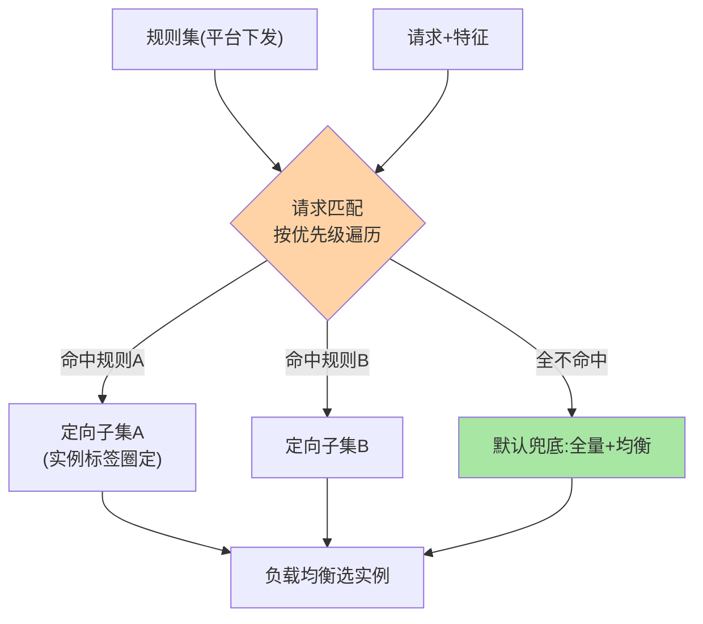

# 路由规则模型：规则、条件、标签与优先级

> 路由三形态（条件/标签/泳道）表面各异，底层共享同一个模型：**规则 = 匹配条件 + 目标子集 + 优先级**。这篇把四要素模型立住——模型清楚了，三种形态只是「匹配方式」的升级。

> **本文核心**：路由规则四要素——**匹配条件**（请求/来源的什么特征）、**目标子集**（命中后去哪组实例）、**优先级**（多规则冲突听谁的）、**生效范围**（对哪些服务/调用方生效）。**机制链**：规则注册（治理平台下发）→ 请求到达 → 按优先级遍历匹配 → 命中则定向子集 / 全不中走默认兜底。

## 一句话摘要

四要素详解：**匹配条件**——请求特征的表达式（来源应用、调用参数、用户标签、机房），条件路由用表达式语法、标签路由用键值对；**目标子集**——命中后流量的去向（实例标签集合），子集由实例元数据圈定（互指 metadata-center）；**优先级**——多规则并存时的裁决序（先特殊后一般）；**生效范围**——规则的作用域（全局/某服务/某调用方），作用域错配是规则事故的高发源。**默认兜底**是模型的隐藏第五要素：全不命中时走「全量 + 负载均衡」，规则体系永不打空。

## 一、为什么需要统一模型

规则散落在各框架里语法各异（Dubbo 条件表达式、Mesh 的 match 路由、网关的 ACL），但拆开看都是四要素的变体——**统一模型的价值是治理平台的抽象基础**：平台管理的不该是 N 种语法，是 N 种语法背后的同一套要素。建模立住后，规则的评审、审计、灰度下发都只需一套机制。

## 5W 速记卡

| 维度 | 一句话 |
|---|---|
| What | 匹配条件 + 目标子集 + 优先级 + 生效范围（+ 默认兜底） |
| Why | 三种路由形态的公共抽象，治理平台的基础 |
| When | 规则设计、多规则冲突排查、治理平台建设 |
| Where | 治理平台 → 框架/网关的规则下发链路 |
| How | 按优先级遍历匹配，命中定向，全空走兜底 |

## 二、四要素的协作全景

四要素的设计要点：**条件要「可观测」**——用于匹配的特征必须真实存在于请求上下文（引用了不存在的 header 的规则永不命中，静默失效）；**子集要「可验证」**——目标标签对应的实例数要有监控（灰度规则指向 0 实例 = 流量打空）；**优先级要「成文」**——冲突裁决序写进规范（如「调用方专属 > 服务级 > 全局」），不靠口头约定。

## 三、规则的声明与下发链路

规则从哪来、怎么生效：**治理平台编写评审 → 存入配置/注册中心 → 推送到框架/网关 → 进程内生效**——下发链路的每环都可能「规则丢失或延迟」（互指 config-center 的推送机制同构）。工程纪律：**规则版本化**（可回滚）、**变更审计**（谁改的为什么）、**生效确认**（下发后有命中率的确认监控，防「下发成功但没生效」的静默失败）。

规则生命周期的治理闭环：

## 四、与 ACL 防火墙规则的区别：ACL 对照

| 维度 | 服务路由规则 | ACL 防火墙规则 |
|---|---|---|
| 匹配对象 | 应用语义（用户/参数/标签） | 网络语义（IP/端口） |
| 失败动作 | 走默认兜底 | 默认拒绝 |
| 生效层 | 进程内/网关 | 网络设备 |

两者「条件匹配 + 动作 + 顺序裁决」的骨架同源——路由是「应用层 ACL 的正向选择」；ACL 的「默认拒绝」哲学提醒我们：路由的兜底语义（默认放行全量）要靠制度补偿（规则评审）。

## 五、典型场景与误区

**典型场景**：VIP 用户定向新版本（用户标签条件 + v2 子集）、按调用方隔离（核心应用的压测流量只进压测实例组）、规则回滚（版本化一键回退）。

**误区与不适用**：① 条件引用不存在的特征——静默失效，规则上线要有「命中率验证」；② 目标子集空转——实例下线后规则指向空集，流量打到默认兜底引发「灰度突然全量」；③ 优先级靠记忆——规则数量过十必须平台化排序与冲突检测。

## 六、💡 实战提示

- 💡 每条规则上线必须验证命中率，永不命中的规则比没有更糟（麻痹性）
- 💡 目标子集实例数监控与规则绑定，空集即告警
- 💡 规则命名带目的与负责人（如 `vip-gray-v2@zhang`），审计可溯
- 💡 形态选型推荐：何时用什么——临时小规模引流用条件路由，常态化标签治理用标签路由，跨多服务全链路验证才上泳道

## 七、你们可能会问

**Q1：规则数量有没有上限？**
性能上限远低于治理上限——百条规则的匹配开销可忽略，但「百条规则的冲突关系」人脑已管不住——规则治理平台化的拐点在数量更在复杂度。

**Q2：条件表达式要不要统一 DSL？**
统一 DSL 是治理平台的理想态，现实是各框架语法收敛慢——务实做法是平台内做「语法适配层」（平台统一模型，下发时翻译成各框架语法）——统一度与落地速度的权衡，适配层是当前演进阶段的务实解。

**Q3：规则能灰度下发吗？**
能且应该——规则本身先灰度（对部分 consumer 生效）验证匹配效果，再全量——「规则的灰度」与「流量的灰度」是两层，混一起容易翻车——两层解耦是规则治理演进中代价最高的教训之一。

## 八、开放问题

- 跨框架统一路由 DSL 的标准化推进缓慢（各生态绑定自家语法），平台适配层是中期现实解。
- 规则仿真（下发前模拟流量验证匹配结果）在平台建设中价值显著但实现成本高，是治理平台的分水岭能力。

## 九、自测三问

1. 四要素（+隐藏第五要素）分别是什么？
2. 规则下发链路的「静默失败」有哪两种形态？
3. 条件可观测、子集可验证、优先级成文分别防什么事故？

下一篇讲「条件路由」：表达式匹配的第一种形态。

## 📎 核心带走

- **核心一句话**：路由规则四要素模型（条件/子集/优先级/范围）是三种路由形态的公共抽象，治理平台的地基
- **机制链**：平台编写评审 → 下发推送 → 按优先级匹配 → 命中定向 / 兜底全量
- **失效点/边界**：条件引用空特征 = 静默失效；子集空转 = 灰度穿仓——两处都要监控兜底

## 📌 数据与事实声明

- 写于 2026-09-08，模型为 Dubbo/Mesh/网关路由实现的公共抽象归纳
- 免责：以各框架官方文档为准

## 📚 参考资料

| 类型 | 标题 | 来源 |
|---|---|---|
| 关联系列 | 本仓库 metadata-center / config-center 系列 | docs/architecture/service-governance/ |
| 官方文档 | Dubbo 条件路由 / Istio 路由规则 | dubbo.apache.org、istio.io |
| 社区沉淀 | 路由规则模型公开文章 | 技术社区公开文章 |
