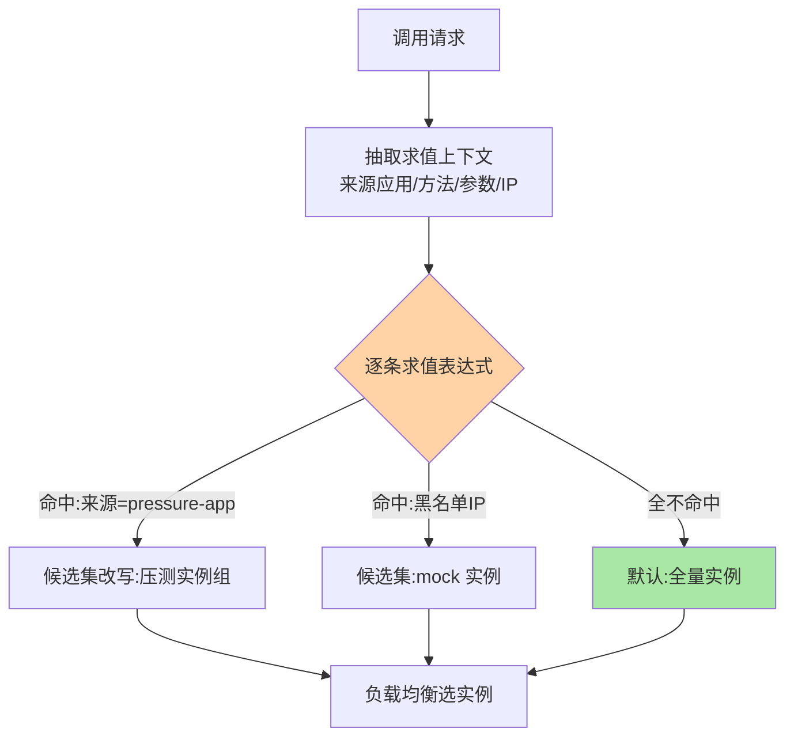
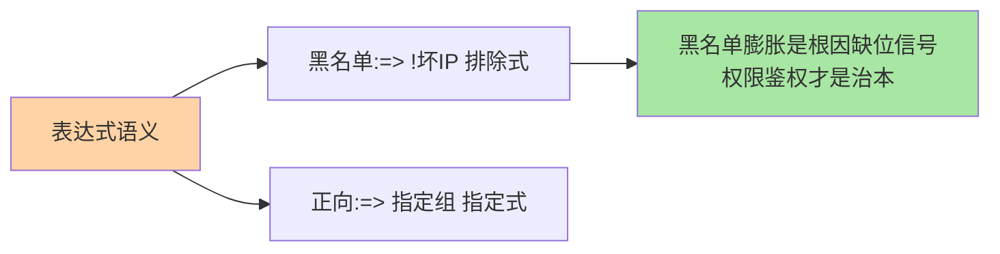

# 条件路由：表达式匹配的第一种形态

> 「来自 pressure-app 的调用只准进压测实例组」「黑名单 IP 一律去 mock 实例」——条件路由用**表达式**描述「什么请求去哪」，是路由最古老也最直接的形态。

> **本文核心**：条件路由 = 「**条件表达式 → 实例子集**」的直接映射：条件描述请求或调用方特征（来源应用、方法名、参数值、地址），表达式命中即把调用定向到指定实例集合。**机制链**：规则下发 → 请求到达 → 表达式求值（读调用上下文）→ 命中改写候选列表 / 未命中走下一条或默认 → 负载均衡选实例。

## 一句话摘要

条件路由的三个构成：**表达式语法**（Dubbo 风格 `host = 10.20.*` 或 `method = queryOrder => host = 10.0.0.3` 的「条件 => 动作」结构，读作「满足左边则路由到右边」）、**求值上下文**（调用方信息、方法、参数、附件——表达式只能引用真实存在的上下文）、**黑白名单语义**（`=> host` 正向指定目标，`=> !host` 排除）。**长处是灵活直白**（一行表达式解决临时引流/屏蔽），**短处也是灵活**（表达式自由度高、难审计难复用）——它是「治理起步期」与「临时运营动作」的利器，规模化后演进到标签路由（篇 4）。

## 一、为什么条件路由最先出现

路由的最早需求都是「临时性、个案性」的：屏蔽一台坏实例、把某调用方引到测试环境、压测流量隔离——**个案需求的自然解就是个案表达**：写一条条件表达式，即刻生效。它的历史地位由此而来：先有条件路由解决「能不能定向」，规模化后才有标签路由解决「好不好治理」——形态演进跟随治理成熟度，不是技术优劣迭代。

## 5W 速记卡

| 维度 | 一句话 |
|---|---|
| What | 条件表达式 → 实例子集的直接映射路由 |
| Why | 临时性、个案性引流需求的最快实现 |
| When | 屏蔽坏实例、压测隔离、临时引流、黑白名单 |
| Where | RPC 框架路由层（Dubbo 条件路由为代表） |
| How | 规则下发 → 表达式求值 → 命中改写候选集 |

## 二、表达式结构与求值流程

**求值顺序即优先级**：规则按配置顺序逐条求值，首条命中即生效（部分实现允许聚合）——顺序敏感是条件路由的治理难点（「规则排序」必须是显式管理项）。**性能账**：表达式逐请求求值，主流实现做了编译缓存（表达式预编译为匹配树）——量级上可忽略，但「动态拼接表达式」的用法会击穿缓存，禁止。

## 三、与标签路由的区别：表达式 vs 标签体系

| 维度 | 条件路由 | 标签路由（篇 4） |
|---|---|---|
| 匹配载体 | 表达式（自由语法） | 键值标签（结构化） |
| 治理成本 | 低起步、高失控风险 | 前期建模、后期可控 |
| 适用阶段 | 起步期/临时动作 | 规模化/常态治理 |

标签路由可理解为「把表达式里的特征值标准化为标签」——治理成熟度驱动形态演进，两者在多数框架中长期并存。

黑白名单与正向引流的语义对照：

## 四、典型场景与误区

**典型场景**：屏蔽故障实例（`host = 坏IP => disabled` 类规则）、压测流量隔离（来源应用条件 + 压测实例组）、接口级引流（特定方法走特定分组）、灰度过渡（条件路由临时顶替，成熟后转标签体系）。

**误区与不适用**：① 表达式写完不验证——引用错字段名的规则静默失效（上线必验命中率）；② 黑白名单滥用——黑名单膨胀成「IP 黑债」，根因治理（权限、鉴权）缺位的表现；③ 把条件路由当长期治理平台用——表达式规模失控后无人看得懂，规模化前迁移标签体系。

## 五、💡 实战提示

（选型决策已并入上文各篇场景判断）

- 💡 每条表达式规则配「预期命中率」，上线后核对
- 💡 表达式进版本管理（含注释与负责人），临时规则设过期时间
- 💡 表达力的取舍要显式：灵活度越高治理成本越高，收益不足就收敛到标签
- 💡 规模化拐点（规则过数十、跨团队共享）到了就迁标签路由

## 六、你们可能会问

**Q1：条件路由和网关的 ACL 有什么不同？**
语义同源（条件匹配 + 动作），作用层不同——条件路由在进程内改写「候选实例集」，网关 ACL 在入口做「放行拒绝」；路由是「选谁」，ACL 是「让不让过」。

**Q2：表达式能引用响应结果吗？**
不能——路由决策发生在调用前，只有请求上下文可用；「按结果路由」不存在（那是重试与容错的领地，互指 cluster-fault-tolerance）。

**Q3：多条件 AND/OR 复杂表达式怎么治理？**
复杂表达式是失控前兆——拆成多条简单规则 + 优先级，可读性与可审计性优先于表达力。

## 七、开放问题

- 表达式路由的「仿真验证」（下发前用历史流量回放求值）在治理平台中开始出现，能把「静默失效」提前到上线前暴露。

## 八、自测三问

1. 条件路由的三构成（语法/上下文/黑白名单语义）是什么？
2. 「求值顺序即优先级」带来什么治理难点？
3. 何时用条件路由、何时迁移标签路由？

## 📎 核心带走

- **核心一句话**：条件路由 = 表达式描述「什么请求去哪」的直接映射，个案治理的利器
- **机制链**：规则下发 → 上下文抽取 → 表达式求值（顺序即优先级）→ 候选集改写 / 默认全量
- **失效点/边界**：引用不存在的上下文字段会静默失效；规模化后失控——迁移标签路由

## 📌 数据与事实声明

- 写于 2026-09-08，表达式语义以 Dubbo 条件路由公开文档为代表口径
- 免责：以各框架官方文档为准

## 📚 参考资料

| 类型 | 标题 | 来源 |
|---|---|---|
| 官方文档 | Dubbo 条件路由规则 | dubbo.apache.org |
| 关联系列 | 本系列篇 4 标签路由 / 本仓库 LB 系列 | docs/architecture/service-governance/ |
| 社区沉淀 | 条件路由实践公开文章 | 技术社区公开文章 |
