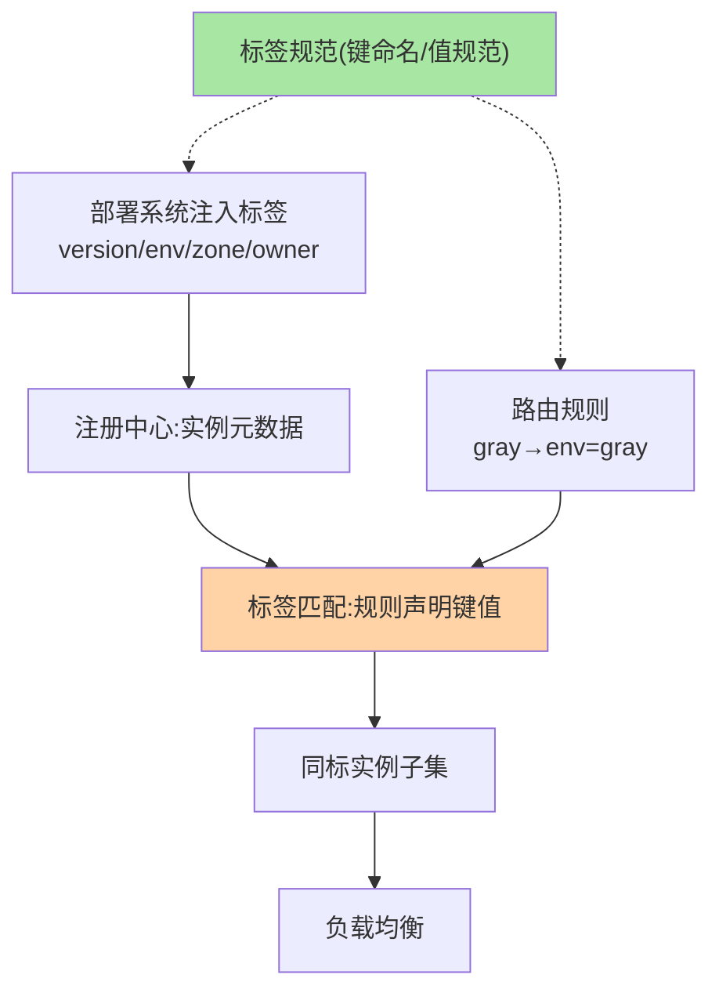
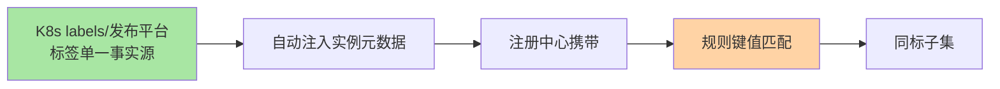

# 标签路由：键值体系驱动的结构化路由

> 条件路由的自由表达在规模化后变成负担——标签路由把「特征」标准化为**键值标签**：实例打标签、规则按标签匹配，治理从「写表达式」升级为「管标签体系」。

> **本文核心**：标签路由 = **实例标签（元数据）× 规则标签匹配**的双边结构：部署时给实例打标（`version=v2`、`env=gray`、`zone=az-a`），路由规则声明「流量按标签匹配到同标实例」。**机制链**：实例注册带标签（互指注册中心元数据）→ 规则声明匹配键值 → 请求按来源标签/规则过滤同标实例 → 同标子集内负载均衡。**标签体系的治理成熟度决定路由能力上限**——标签规划（键命名、值规范、多级组合）是本篇的核心命题。

## 一句话摘要

标签路由的两个半边：**实例侧**——注册时携带标签元数据（互指注册中心核心模型），标签来自部署系统（K8s labels/发布平台）自动注入，杜绝手工打标的漂移；**规则侧**——路由规则按标签键值匹配（「gray 流量 → env=gray 实例」），支持多键组合（与/或）。与条件路由的分工：**标签路由治理的是「常态化标签体系」**（版本/环境/机房这类长期维度），条件路由处理「临时个案」——两者并存，长期维度标签化、临时动作表达式化是成熟体系的标配分工。

## 一、为什么标签化是治理的升级

条件路由的表达式把「特征定义、匹配逻辑、目标指定」揉在一条字符串里——规模化后三个恶果：无法审计（每条表达式都要人肉读）、无法复用（同版本维度各团队各写各的）、无法统计（「有多少 v2 实例」答不出来）。**标签化把特征定义抽出来标准化**：键值体系让「实例画像」成为可查询的数据资产，规则只是「画像的消费方式」——从「写代码」到「管数据」，是治理形态的质变。

## 5W 速记卡

| 维度 | 一句话 |
|---|---|
| What | 实例标签元数据 × 规则键值匹配的结构化路由 |
| Why | 规模化后表达式不可治理，标签化让特征成为数据资产 |
| When | 常态化版本/环境/机房维度治理 |
| Where | 注册中心元数据 + 框架路由层 + 部署系统联动 |
| How | 部署注入标签 → 规则按键值匹配 → 同标子集均衡 |

## 二、标签体系的双边结构

**标签规范是体系的地基**：键命名规范（`env` 还是 `environment`，一字之差规则全空转）、值域规范（布尔用 true/false 还是 1/0）、保留键治理（`version`/`env` 这类治理保留键不许业务挪用）——标签规范缺失的体系，半年后必然出现「同键异义、同义异键」的标签债。

## 三、与条件路由的区别：数据 vs 逻辑

| 维度 | 标签路由 | 条件路由（篇 3） |
|---|---|---|
| 特征载体 | 结构化标签（数据资产） | 表达式内联（逻辑内联） |
| 可审计性 | 平台可统计可盘点 | 逐条人读 |
| 跨团队复用 | 键值标准即协议 | 各写各的 |
| 灵活上限 | 受标签集约束 | 几乎无限（双刃剑） |

「数据 vs 逻辑」的分工哲学在多处复现（声明式 vs 命令式、CRD vs 脚本）——**标签化是路由领域的声明式演进**。

标签从注入到消费的全景：

## 四、典型场景与误区

**典型场景**：版本双轨路由（version 标签 + 灰度规则）、环境隔离（env 标签硬隔离，测试流量永不进生产实例组）、就近路由（zone 标签 + 同机房优先规则）、单元化隔离（unit 标签，异地多活的流量封闭）。

**误区与不适用**：① 手工打标——标签必须来自部署系统自动注入，手工即漂移；② 标签滥用为业务存储——标签是治理维度不是业务字段（互指注册中心核心模型的误区同款）；③ 标签组合爆炸——可用标签键控制在十个以内，每加一键都要评审「治理价值」。

## 五、💡 实战提示

（选型决策已并入上文各篇场景判断）

- 💡 标签规范先行：保留键清单 + 命名规范 + 注入方式，发文后再启用标签路由
- 💡 标签来源唯一化：部署系统是唯一写入口，注册中心的标签只读
- 💡 键数量与治理收益的权衡：核心键 ≤10，多一键多一分组合复杂度
- 💡 每个标签键配「实例分布看板」，分布异常（某标签实例归零）即告警

## 六、你们可能会问

**Q1：标签和 K8s labels 什么关系？**
同构——K8s labels 是平台级标签体系的成熟实现，注册中心标签可与 K8s labels 打通（部署时同步注入）——平台标签成为单一事实源，避免两套标签漂移。

**Q2：一个实例能打几个标签？有上限吗？**
技术上无硬限（元数据随注册上报），工程上建议核心治理键 ≤10——标签越多，规则匹配的组合空间越大，治理复杂度超线性增长。

**Q3：标签变更怎么生效？**
实例标签在注册时固化——变更标签 = 重新注册（重启或重新注册动作），这是「标签不可变性」的设计：避免运行期标签漂移导致路由状态不一致。

## 七、开放问题

- 标签体系跨注册中心/网关/Mesh 的统一（一处打标处处生效）是治理平台的长期命题，OpenTelemetry 的资源语义规范提供了部分借鉴。

## 八、自测三问

1. 标签路由的双边结构是什么？为什么说「标签规范是地基」？
2. 与条件路由的「数据 vs 逻辑」分工怎么理解？
3. 标签不可变性（注册时固化）的设计理由是什么？

## 📎 核心带走

- **核心一句话**：标签路由 = 实例标签元数据 × 规则键值匹配，把治理特征从表达式升级为数据资产
- **机制链**：部署注入标签 → 注册携带 → 规则键值匹配 → 同标子集 → 负载均衡
- **失效点/边界**：标签规范缺失则体系必然腐化；标签是治理维度不是业务存储

## 📌 数据与事实声明

- 写于 2026-09-08，机制为 Dubbo 标签路由/Spring Cloud/Mesh 的共识归纳
- 免责：以各框架官方文档为准

## 📚 参考资料

| 类型 | 标题 | 来源 |
|---|---|---|
| 官方文档 | Dubbo 标签路由 / K8s Labels | dubbo.apache.org、kubernetes.io |
| 关联系列 | 本仓库 metadata-center / 注册中心系列 | docs/architecture/service-governance/ |
| 社区沉淀 | 标签路由实践公开文章 | 技术社区公开文章 |
