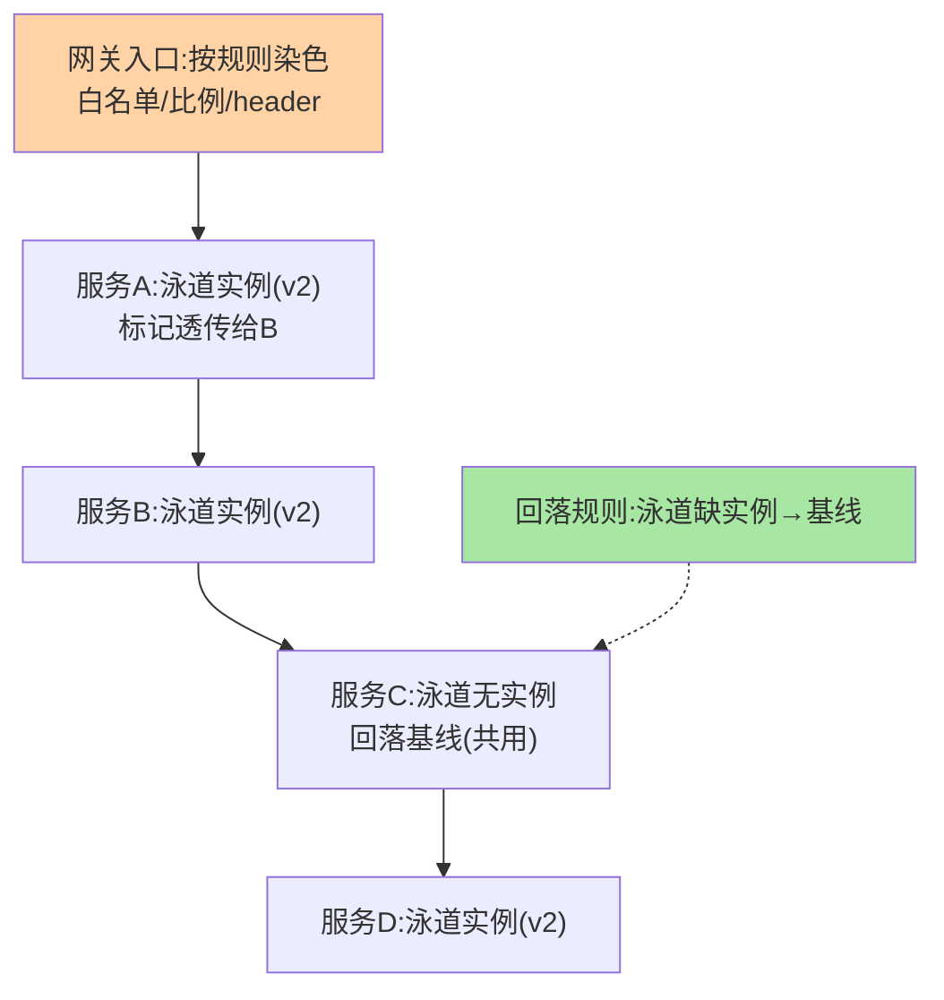
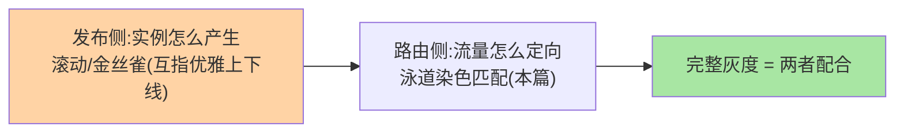

# 灰度发布与泳道：从单服务灰度到全链路验证

> 单服务灰度（新版本接 5% 流量）用标签路由就够了；但一次改动横跨五个服务时，「每个服务独立灰度」的组合爆炸会失控——**泳道**用「流量染色 + 全链路透传」把多服务灰度变成一个整体。这篇讲路由形态的巅峰之作。

> **本文核心**：泳道 = **按流量特征（染色标记）把一次调用全链路锁定在同一组「半套环境」里**。**机制链**：入口按规则染色（用户/流量比例打上泳道标记）→ 标记随请求透传（RPC 附件/HTTP Header）→ 每个服务的路由按标记匹配同泳道实例 → 泳道内无实例时回落基线（关键兜底）→ 全链路验证后放量合并。

## 一句话摘要

泳道的三个构成：**染色**（入口按规则给请求打标记——指定白名单用户、按比例随机、按 header）；**透传**（标记跨服务传递——RPC 隐式传参/HTTP Header，链路断传 = 泳道失效的第一病根）；**回落**（泳道内缺实例时回落基线环境——半套泳道架构的关键设计：泳道只部署「本次改动涉及的服务」，未涉及的服务回落共用基线，资源成本从「整套环境」降到「半套」）。泳道 vs 单服务灰度的分野：**改动横跨 N 个服务时，泳道把「N 维灰度组合」收敛为「1 条泳道」**。

## 一、为什么需要泳道

五服务链路各灰 5% 的组合问题：调用方 v2 可能调到被调方 v1（不兼容组合在灰度期反复出现），「灰度通过」的结论无法归因。泳道的解法是**请求级的一致性**：同一请求全链路走同一「版本世界」（全 v2 泳道或全基线），验证结论干净可归因。这是微服务治理从「单点治理」演进到「链路治理」的标志性形态——代价是染色透传的基建要求（全框架接入透传）。

## 5W 速记卡

| 维度 | 一句话 |
|---|---|
| What | 流量染色 + 全链路透传 + 同泳道定向的灰度形态 |
| Why | 跨服务改动的灰度组合爆炸，需要链路级一致性 |
| When | 多服务联改的验证期、全链路压测、故障隔离单元 |
| Where | 网关（染色）+ 全框架透传（SDK/网格）+ 路由（同标匹配） |
| How | 入口染色 → 链路透传 → 泳道匹配 → 缺实例回落基线 |

## 二、泳道全链路的工作全景

两个工程命门：**① 透传连续性**——标记经 RPC 附件/Header 全链路传递，任何一个服务丢失标记（自建线程池丢上下文、异步编排丢 trace），后续链路就「跳出泳道」——透传基建要框架级统一（与全链路追踪的 trace 透传同构，互指 stability 篇 8）；**② 回落语义**——泳道只含改动服务（半套），未改动服务回落基线共用——「泳道缺实例」是常态不是故障，回落规则必须显式（回落到基线还是报错，要按场景配置）。

## 三、与单服务灰度的区别：链路治理对照

| 维度 | 单服务灰度（篇 4） | 全链路泳道 |
|---|---|---|
| 灰度粒度 | 单服务的版本比例 | 链路的整体一致性 |
| 组合复杂度 | N 服务各管各 | 一条泳道一个世界 |
| 基建要求 | 标签 + 路由 | + 全链路透传 |
| 结论可归因性 | 弱（组合干扰） | 强（隔离验证） |

演进关系：单服务灰度是「点」，泳道是「线」——**从点灰度到线泳道的演进驱动力是微服务化带来的组合爆炸**。

泳道与发布策略的配合分层：

## 四、典型场景与误区

**典型场景**：多服务联改验证（订单 + 库存 + 优惠券同改，一条泳道整体验证）、全链路压测（压测泳道隔离真实流量——影子库配套）、故障隔离单元（问题链路整条切入隔离泳道）。

**误区与不适用**：① 泳道当常驻环境——泳道是「验证期临时形态」，常驻半套环境演成「影子环境债」；② 染色规则过复杂——入口染色规则膨胀后无人说得清「这条请求为什么在泳道里」；③ 异步/MQ 链路忘染色——透传只覆盖同步调用，消息驱动的链路要显式把标记写进消息体。

## 五、💡 实战提示

（选型决策已并入上文各篇场景判断）

- 💡 透传基建先行：trace 透传做好了泳道才可能做好——两者共用一套上下文基建
- 💡 泳道实例数最小化：只部署改动服务，回落机制能省一半以上资源
- 💡 泳道生命周期管理：建道-验证-放量-拆道流程化，防泳道堆积

## 六、你们可能会问

**Q1：泳道和灰度发布的灰度（发布侧）什么关系？**
互补分层——泳道解决「流量怎么定向」（路由视角），发布策略解决「实例怎么产生」（滚动/金丝雀部署视角，互指 graceful-shutdown 篇 4）；完整灰度 = 两者配合。

**Q2：基线回落会污染灰度结论吗？**
未改动服务回落基线不影响结论（它们本来就没有版本差异）；改动服务必须在泳道内有实例——「泳道完整性」检查（改动服务清单 vs 泳道实例清单）要在建道时自动核对。

**Q3：MQ 异步链路怎么进泳道？**
消息生产方把染色标记写入消息属性，消费方按标记路由到泳道消费者/实例——异步链路的泳道是显式工程，没有「自动透传」可指望。

## 七、开放问题

- 泳道与单元化（异地多活的 unit 架构）的机制趋同：都是「流量标记 + 拓扑封闭」——两者的统一抽象（「流量域」）是治理平台的演进方向。
- AI 驱动的自动放量（按泳道内错误率自动推进比例）已有云产品落地，灰度决策的自动化程度在快速提升。

## 八、自测三问

1. 泳道三构成（染色/透传/回落）各自解决什么？
2. 「半套泳道 + 回落基线」为什么是资源与正确性的双优解？
3. 异步链路的泳道为什么必须显式工程？

## 📎 核心带走

- **核心一句话**：泳道 = 染色 + 全链路透传 + 同泳道定向，把跨服务灰度从 N 维组合收敛为 1 条链路
- **机制链**：入口染色 → 标记透传（框架级基建）→ 逐跳同标匹配 → 缺实例回落基线 → 验证放量合并
- **失效点/边界**：透传断则泳道失效（框架级统一是前提）；泳道是临时形态，常驻即环境债

## 📌 数据与事实声明

- 写于 2026-09-08，泳道机制为国内大厂全链路灰度实践的共识归纳（各云产品文档同源）
- 免责：以各平台官方文档为准

## 📚 参考资料

| 类型 | 标题 | 来源 |
|---|---|---|
| 官方文档 | 各云全链路灰度产品文档 / Istio 泳道类方案 | 各官方站点 |
| 关联系列 | 本仓库 graceful-shutdown / stability（trace 透传互指） | docs/architecture/service-governance/ |
| 社区沉淀 | 全链路灰度公开实践文章 | 技术社区公开文章 |
