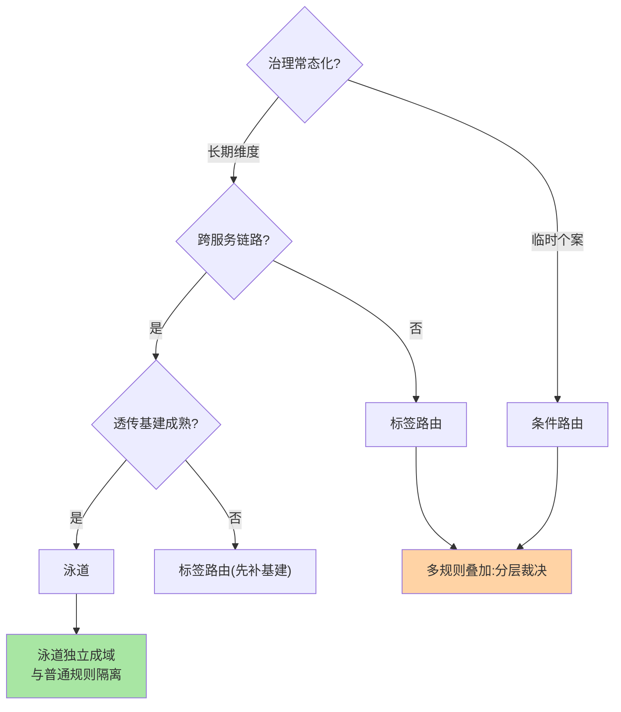
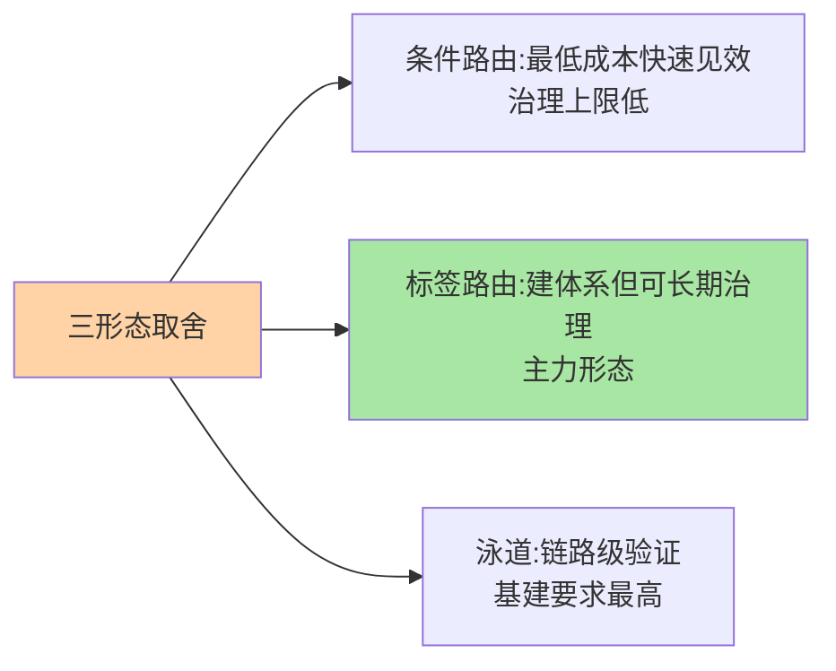

# 路由策略选型：多规则叠加与优先级实践

> 全系列收束篇：条件路由、标签路由、泳道三形态怎么选怎么组合？多条规则同时命中听谁的？这篇给形态选型的判断表与多规则叠加的工程纪律。

> **本文核心**：选型两问定形态——**治理常态化程度**（临时个案 → 条件路由；长期维度 → 标签路由；跨服务链路 → 泳道）与**基建成熟度**（透传基建不全则泳道不可选）。多规则叠加三纪律：**优先级成文**（特殊规则压一般规则）、**作用域隔离**（不同维度的规则不互相覆盖）、**兜底必配**（全不中走默认）。**机制链**：需求定性 → 形态选择 → 规则分层编写 → 优先级裁决 → 兜底保护 → 监控验收。

## 一句话摘要

形态选型判断表：**条件路由**——临时引流、个案屏蔽、治理起步期（低成本快速见效）；**标签路由**——版本/环境/机房等长期维度的常态化治理（需要标签规范与部署系统配合）；**泳道**——跨服务联改验证、全链路压测（需要透传基建）。多规则叠加的裁决模型：**按作用域分层**（全局规则 < 服务级规则 < 调用方专属规则，特殊压一般）+ **同层按优先级序**——裁决规则必须平台化显式管理，散落在代码里的裁决逻辑是规则治理崩坏的开始。

## 一、为什么多规则叠加是难点

单条规则简单，叠加后三个复杂度来源：**冲突**（两条规则命中同一请求、指向不同子集——听谁的）；**穿透**（上层规则筛选后子集为空，下层规则形同虚设）；**顺序依赖**（规则 A 的效果取决于 B 是否先执行——隐式时序耦合）。治理平台的职责就是把这三个复杂度**显式化**：冲突可检测、穿透可告警、顺序可编排——「规则叠加」从手艺变成工程。

## 5W 速记卡

| 维度 | 一句话 |
|---|---|
| What | 三形态选型判断 + 多规则叠加裁决模型 |
| Why | 形态选错代价高，规则叠加是治理复杂度的爆发点 |
| When | 路由体系设计、规则冲突排查、治理平台建设 |
| Where | 治理平台的规则引擎 |
| How | 两问定形态 + 分层裁决 + 兜底保护 |

## 二、选型判断与叠加裁决

**叠加裁决模型**：规则按作用域分三层——**全局层**（机房就近这类全站默认）→ **服务层**（某服务的版本灰度）→ **调用方层**（某调用方的专属引流，如压测流量），裁决序「调用方 > 服务 > 全局」即「特殊压一般」；同层多规则按显式优先级序。**泳道建议独立成域**——泳道规则与普通规则两套体系隔离，泳道内的匹配不再参与全局规则竞争，避免「泳道流量被普通规则劫持」。

## 三、与负载均衡选型的区别：方法论对照

| 维度 | 路由选型（本篇） | 均衡选型（互指 LB 篇 7） |
|---|---|---|
| 决策轴 | 治理形态与基建成熟度 | 位置 × 策略 × 会话 |
| 核心风险 | 规则冲突与穿透 | 摊不匀与震荡 |
| 验收指标 | 命中率与隔离性 | 流量分布与 P99 |

两者串联在同一调用链上，选型方法论同构（问答 → 候选 → 验收）——「决策轴不同、框架相同」是治理类选型的通用心法。

三形态的取舍定位：

## 四、典型场景与误区

**典型场景**：治理平台冷启动（先条件路由应急 + 标签体系规划，一年内完成形态迁移）、多规则事故复盘（穿透型事故：灰度规则指向的实例被摘光，流量穿透到生产全量）、平台化改造（规则散落配置文件 → 集中平台 + 裁决引擎）。

**误区与不适用**：① 三形态并列混用无规范——同一维度既有条件规则又有标签规则，裁决关系无人说得清；② 优先级硬编码在 SDK——裁决逻辑进代码后，平台失去全局裁决能力；③ 无兜底配置——规则集清空或全不中时服务不可用，默认兜底是生命线。

## 五、💡 实战提示

（选型决策已并入上文各篇场景判断）

- 💡 形态迁移要有终止条件：条件路由规则数超过 30 条即启动标签化迁移
- 💡 裁决冲突检测进规则发布流程（发布前模拟历史流量找冲突）
- 💡 每类规则配「命中率 + 子集实例数」双监控，穿透与空转即时可见

## 六、你们可能会问

**Q1：规则引擎要不要自研？**
先盘需求：规则量小（<50 条）用框架原生能力 + 配置管理即可；规则量大、跨团队、要审计仿真时，开源治理平台（如 Mesh 控制面/国内治理产品）优先于自研——自研规则引擎的维护成本常被低估。

**Q2：多规则叠加的性能账怎么算？**
按「规则数 × 匹配开销 × QPS」评估——主流实现将规则预编译（匹配树），百条规则内开销可忽略；性能问题多出在「动态解析规则」的错误用法上。

**Q3：泳道与普通规则真不能混吗？**
技术可实现统一裁决，但治理上强烈建议隔离——泳道是「临时世界」，与常态规则混裁决会让「为什么这条流量走了这里」变得不可解释。

## 七、开放问题

- 规则体系的「意图化声明」（描述治理目标，系统生成规则组合）是治理平台的远期形态，规则工程向策略工程的演进刚起步。

## 八、自测三问

1. 形态选型两问是什么？各自的基建前提？
2. 叠加裁决的分层模型与裁决序？
3. 泳道为什么建议独立成域？

## 📎 核心带走

- **核心一句话**：路由选型 = 形态两问定基础 + 叠加三纪律保秩序——形态随治理成熟度演进，规则治理必须平台化
- **机制链**：需求定性 → 形态选择 → 规则分层编写 → 优先级裁决 → 兜底保护 → 双监控验收
- **失效点/边界**：三形态混用无规范必乱；兜底缺失 = 规则体系零容错

## 📌 数据与事实声明

- 写于 2026-09-08，选型框架为治理实践的归纳；「30 条阈值」为经验口径
- 免责：具体决策按组织治理现状评审

## 📚 参考资料

| 类型 | 标题 | 来源 |
|---|---|---|
| 关联系列 | 本系列篇 3-5 / LB 篇 7（方法论对照） | docs/architecture/service-governance/ |
| 官方文档 | Dubbo 路由 / Mesh 治理文档 | 各官方站点 |
| 社区沉淀 | 治理平台建设公开实践 | 技术社区公开文章 |
