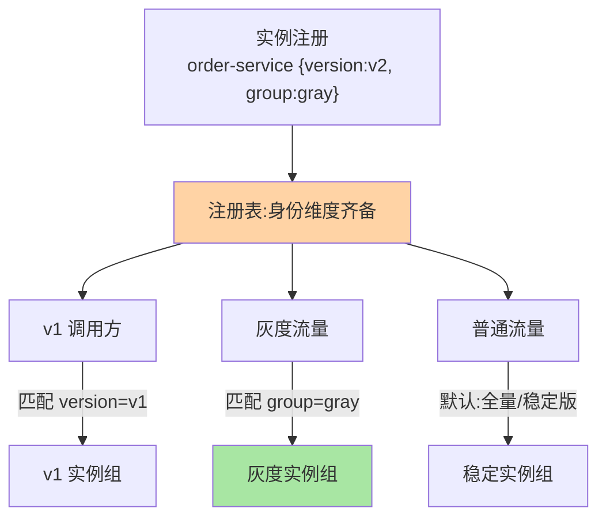
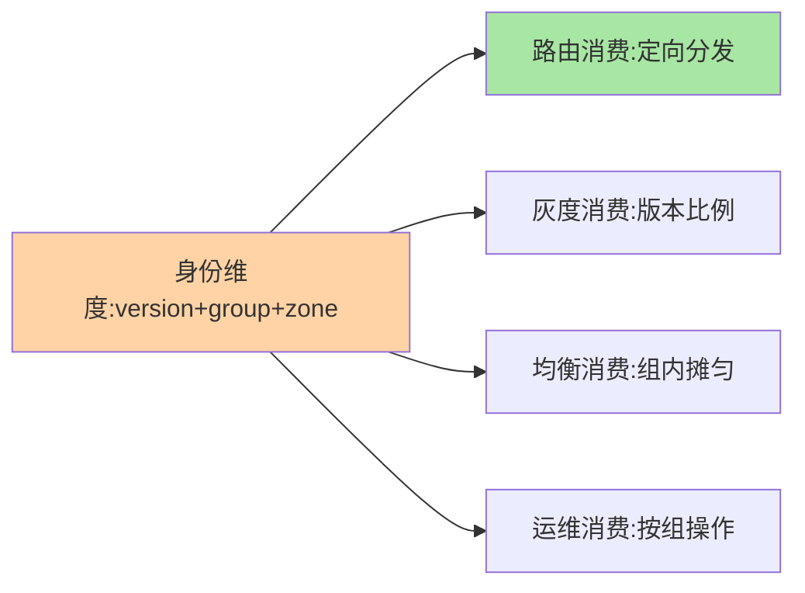

# 服务分组与版本：多实例共存的治理语义

> 一句话：分组与版本是**服务实例的「身份维度」**——版本管「同一服务的不同代际共存」，分组管「不同用途/租户的实例隔离」。两者都是给实例打上的治理坐标，是路由与灰度的数据基础。

> **本文核心**：两者的语义分工——**版本（version）**：接口/实现的代际标识（v1/v2），核心命题是「兼容性」（多版本共存期间新老调用方都能工作）；**分组（group）**：用途域隔离（压测组/灰度组/多租户组），核心命题是「隔离性」（组间流量绝不互串）。**机制链**：实例注册携带版本+分组标签（互指注册中心核心模型）→ 调用方按匹配规则筛选 → 命中子集内负载均衡。为什么需要：接口演进必然产生多版本共存期，多租户/压测必然产生隔离需求——两者是治理的「身份坐标系」。

## 一句话摘要

版本管理的核心难题不是「起名」而是「兼容」：**多版本共存期的调用兼容**（v1 调用方调 v2 提供方——新增字段可兼容、删字段不可兼容、语义变更最危险）与**版本下线时机**（老版本流量归零才能下线）。分组的典型形态：**环境组**（逻辑隔离的轻量环境）、**压测组**（压测流量封闭在影子实例组）、**租户组**（大客户独立实例组）。两者与标签路由的关系：分组与版本本质是「预定义的标签维度」（结构化、保留键），标签路由是更通用的机制（互指 service-routing 篇 4）。

## 一、为什么需要「身份维度」

无分组版本的裸注册：所有实例平等地出现在候选列表里——v2 半改状态被 v1 调用方调用（不兼容报错）、压测流量打到真实用户实例（数据污染）、大租户与小用户混部（相互干扰）。**「身份维度」的本质是把「实例的适用范围」显式化**：实例不只是「order-service 的一个副本」，而是「order-service 的 v2 版本、灰组分、az-a 机房的副本」——身份越完整，治理越精准（路由/灰度全部消费这些维度，互指 service-routing）。

## 5W 速记卡

| 维度 | 一句话 |
|---|---|
| What | 版本（代际兼容）与分组（用途隔离）两个实例身份维度 |
| Why | 多版本共存与多用途隔离是治理的必然需求 |
| When | 接口演进、多租户部署、压测隔离设计 |
| Where | 注册中心元数据 + 框架路由匹配 |
| How | 注册携带身份标签 → 规则匹配 → 子集内均衡 |

## 二、身份维度与调用匹配全景

**版本兼容的策略谱系**：向后兼容（新版本接受旧请求——新增可选字段、不删不改语义）是演进的黄金法则；破坏性变更走「双版本共存期」（新版本新分组/新路径，老版本自然衰减后下线）——**「兼容优先、共存兜底」是接口演进的通则**（REST 的路径版本、RPC 的接口版本号都是这个法则的载体）。

## 三、与标签路由的区别：保留维度 vs 通用机制

| 维度 | 分组与版本 | 标签路由（互指 service-routing 篇 4） |
|---|---|---|
| 定位 | 预定义保留维度（结构化） | 通用标签机制（任意键值） |
| 语义强度 | 强语义（版本必配、分组规范） | 自由扩展 |
| 关系 | 标签体系中的「一等公民」 | 承载更多自定义维度 |

分组与版本是最常用的两个标签键——框架级内建支持（Dubbo 的 group/version 参数）源于其高频性；更多维度（机房/单元/自定义）走通用标签——**保留维度 + 通用扩展**的双层设计。

分组与版本的治理消费全景：

## 四、典型场景与误区

**典型场景**：接口 v2 上线（双版本共存 + 灰度迁移 + 老版本下线三步曲）、压测隔离（压测组影子实例 + 流量染色封闭）、多租户部署（大客户独立分组 + 资源隔离）。

**误区与不适用**：① 版本号当营销名（「2026 版」）——版本是兼容性契约不是宣传语，语义化版本（major.minor.patch 的兼容含义）是正解；② 分组无限裂变——每个需求都开新组，组数爆炸后路由矩阵无法维护（分组需要「开组评审」）；③ 多版本共存无下线计划——v1 永不下线 = 双倍维护成本永续，共存期与下线条件要在发版时定。

## 五、💡 实战提示

- 💡 接口演进规范：新增可选、废弃标记（@Deprecated）、删除走大版本——三句写进开发规范
- 💡 版本下线看板：各版本流量占比周报，归零触发下线流程
- 💡 分组开组评审制：新组必须写明隔离理由与生命周期
- 💡 维度选型决策口径：何时用什么——版本维度用于接口代际、分组维度用于租户与压测隔离、机房与单元走通用标签，三档不混用
- 💡 身份维度的取舍：维度越多治理越精准但注册与匹配成本越高——核心三维（版本/分组/机房）起步够用

## 六、你们可能会问

**Q1：版本共存期一般多长？**
按调用方迁移速度定——内部调用方可协调（共存期周级），对外 API 不可控（共存期月到年级，且要长期维护旧版本）；「迁移速度不可控」是外部 API 版本治理更难的本质。

**Q2：分组和 K8s namespace 什么关系？**
不同层——K8s namespace 是资源隔离域（平台层），服务分组是治理身份（应用层）；K8s 内的服务分组用标签表达（与 K8s labels 打通，互指 K8s 系列）。

**Q3：不兼容变更有什么缓和方法？**
适配层（老协议网关转换）、灰度共存（新老并行 + 数据双写）、契约测试（防意外破坏兼容）——缓和不等于消除，重大不兼容仍要走双版本共存。

## 七、开放问题

- 契约优先（OpenAPI/Protobuf IDL 驱动的兼容性自动检查）在 CI 中普及，「兼容性」从人工评审演进为机器门禁，是版本治理的下一站。

## 八、自测三问

1. 版本与分组的语义分工？各自的_core 命题？
2. 版本兼容的黄金法则与破坏性变更的兜底？
3. 「保留维度 + 通用扩展」的双层设计怎么理解？

## 📎 核心带走

- **核心一句话**：分组与版本是实例的身份坐标——版本管代际兼容、分组管用途隔离，是路由与灰度的数据基础
- **机制链**：注册携带身份标签 → 调用方按维度匹配 → 子集内均衡 → 兼容优先、共存兜底
- **失效点/边界**：版本号是兼容契约非宣传语；分组开组要评审；多版本共存必须带下线计划

## 📌 数据与事实声明

- 写于 2026-09-08，机制以 Dubbo group/version 与主流框架的共识口径归纳
- 免责：以各框架官方文档为准

## 📚 参考资料

| 类型 | 标题 | 来源 |
|---|---|---|
| 官方文档 | Dubbo 服务分组与版本 | dubbo.apache.org |
| 关联系列 | 本仓库 service-routing / metadata-center 系列 | docs/architecture/service-governance/ |
| 社区沉淀 | 接口版本治理公开文章 | 技术社区公开文章 |
