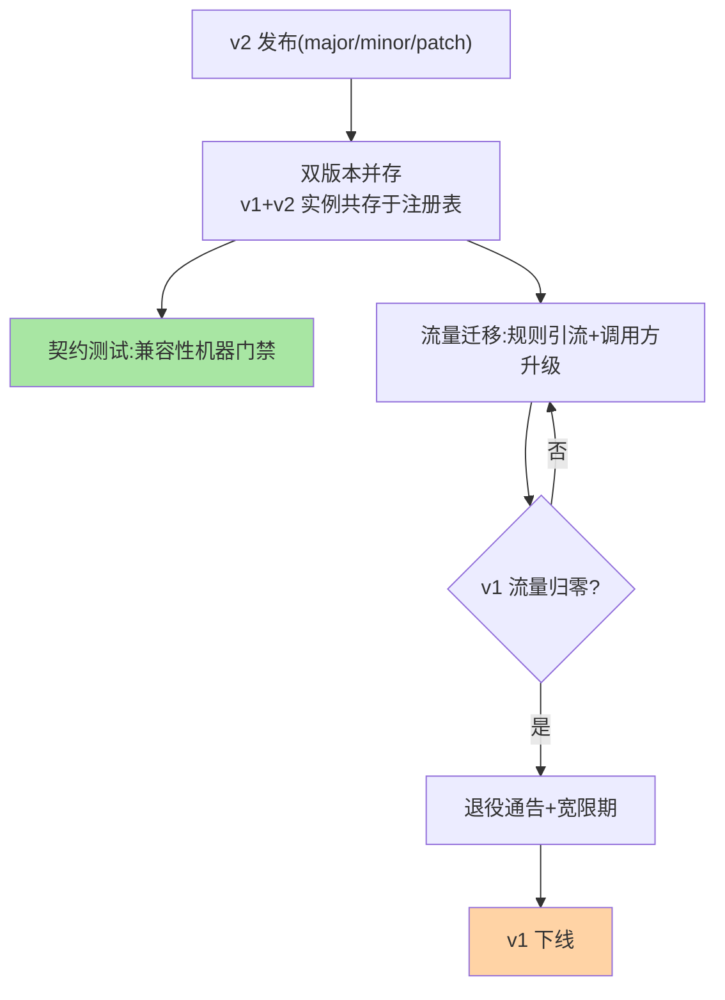
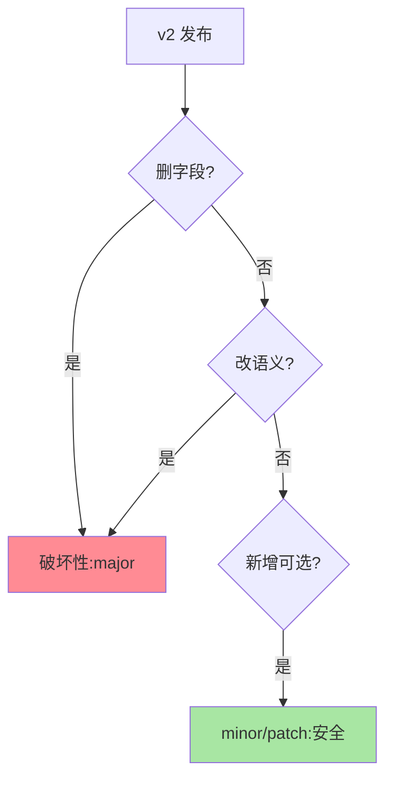

# 版本管理机制：从版本号语义到共存期工程

> 篇 1 立了版本的身份语义，这篇深入机制层：版本号怎么规范（语义化版本的治理含义）、多版本怎么并存（注册与路由的工程细节）、版本怎么退役（下线条件的量化判定）。

> **本文核心**：三段机制——**版本号规范**：语义化版本（major 破坏性/minor 功能性/patch 修复）在接口治理中的映射，major 变更即「不兼容承诺」；**多版本并存**：注册表多版本实例共存（互指注册中心核心模型）+ 调用方版本匹配 + 兼容性验证；**版本退役**：流量占比阈值 → 迁移通告 → 下线窗口 → 回滚预案。**机制链**：新版本发布 → 双版本注册 → 流量按规则迁移 → 老版本流量归零 → 有序退役。

## 一句话摘要

语义化版本（SemVer）的治理翻译：**major 升级 = 「调用方必须配合改造」的声明**（破坏性变更：删字段、改语义、改类型）、**minor = 「向下兼容的新能力」**（新增接口/可选字段）、**patch = 「修复不改行为」**——三段的纪律价值在于「看版本号即知升级风险」。多版本并存的工程形态：注册表内 v1/v2 实例并存（调用方按已方版本匹配，或网关按路径/头分流），并存期的**契约测试**（v1 调用方对 v2 提供方的兼容性自动验证）是防「意外不兼容」的机器门禁。

## 一、为什么版本号需要「语义」

无语义的版本号（v12.3、2026final）让调用方「每次升级都赌博」——不知道这次升级会不会破坏自己。语义化版本把「升级风险」编码进版本号本身：**major 变化 = 有破坏，先读变更日志；minor/patch = 安全升级**——版本号从「流水标识」升级为「兼容性契约」，调用方的升级决策成本大幅下降。这是「契约思维」在版本治理的落地（契约优先演进互指篇 1 开放问题）。

## 5W 速记卡

| 维度 | 一句话 |
|---|---|
| What | 语义化版本规范 + 多版本并存工程 + 版本退役流程 |
| Why | 版本号是兼容性契约，共存与退役需要工程化 |
| When | 接口发版、版本升级评审、老版本下线决策 |
| Where | 版本规范文档 + 注册表 + CI 契约测试 |
| How | SemVer 编码风险 → 双版本共存 → 流量迁移 → 归零退役 |

## 二、版本生命周期全景

**共存期的两个工程要件**：① **契约测试**——v1 客户端契约（请求/响应快照）对 v2 服务自动回归，不兼容在 CI 阶段暴露而非生产；② **流量看板**——各版本实时流量占比（迁移进度可视化，归零判定不靠猜）。**退役的宽限期**语义：通告归零后仍保留窗口期（如 2 周）承接漏网流量（返回明确「版本已废弃」错误而非 404）——优雅下线的版本级应用（互指 graceful-shutdown）。

## 三、与 REST API 版本化的区别：路径/头对照

| 维度 | RPC 接口版本（服务级 version） | REST API 版本（路径 /v2/ 或 Header） |
|---|---|---|
| 版本粒度 | 服务级（整个服务一个版本） | 接口级（可单接口版本化） |
| 路由载体 | 注册表版本匹配 | 网关/路径路由 |
| 生态惯例 | Dubbo group/version | RESTful 惯例 |

机制同源（多版本共存 + 定向路由），粒度与载体不同——REST 面向外部（版本长期共存是常态），RPC 面向内部（短共存快迁移是目标）。

版本兼容矩阵的检查视角：

## 四、典型场景与误区

**典型场景**：minor 升级流水线（契约测试通过 → 滚动升级 → 无共存期）、major 升级（双版本 + 灰度迁移 + 退役三步曲）、紧急 patch（只含修复的快速通道——patch 纪律被污染是最常见的版本债）。

**误区与不适用**：① minor 里夹带破坏性改动——「顺手改了」摧毁 SemVer 契约，调用方从此不敢安全升级（信任重建成本极高）；② patch 无限叠加——patch 数十次说明 minor 该发了（patch 是修复线不是功能线）；③ 退役靠口头通知——退役是流程（通告/宽限/下线/回滚预案四步），口头通知的退役必出「遗留调用方」事故。

## 五、💡 实战提示

- 💡 SemVer 写进接口发版规范 + CI 校验（major 变更强制评审标记）
- 💡 契约测试模板化：新接口必配契约用例，破坏性变更加显式失败标记
- 💡 版本流量看板与退役流程绑定——归零判定自动化，不靠人肉盯

## 六、你们可能会问

**Q1：内部服务也要 SemVer 吗？**
要且更容易执行——内部调用方可协调迁移，SemVer 的「契约价值」在内部发挥最充分（外部 API 反而受用户牵制）；「内部不用规范」是版本债的起点——规范严格度与迁移灵活度的取舍，内部场景应取前者。

**Q2：同时多少个版本并存是上限？**
工程上限 2-3 个（当前 + 上一 major），更多并存意味着迁移失控——并存数量是迁移健康度的直接指标。

**Q3：版本号从 0.x 起步的含义？**
SemVer 惯例 0.x 表示「接口不稳定期」（minor 也可能破坏）——0.x → 1.0 的跃迁是「对外承诺稳定」的仪式，启动这个跃迁要慎重。

## 七、开放问题

- AI 辅助的兼容性判定（diff 接口定义自动标注破坏性等级）在工具链中兴起，「语义化版本的人工判断」部分可自动化，是契约优先演进的实际加速器。

## 八、自测三问

1. SemVer 三段的治理含义各是什么？
2. 共存期的两个工程要件（契约测试/流量看板）各防什么？
3. 退役四步（通告/宽限/下线/预案）为什么缺一不可？

## 📎 核心带走

- **核心一句话**：版本管理 = SemVer 契约编码风险 + 双版本共存工程 + 归零退役流程
- **机制链**：新版本发布 → 契约测试门禁 → 并存与迁移 → 流量归零 → 通告宽限 → 有序下线
- **失效点/边界**：minor 夹带破坏摧毁契约信任；patch 不是功能线；并存 2-3 版是健康上限

## 📌 数据与事实声明

- 写于 2026-09-08，SemVer 语义以其官方规范口径归纳
- 免责：以各框架官方文档为准

## 📚 参考资料

| 类型 | 标题 | 来源 |
|---|---|---|
| 公开规范 | Semantic Versioning 2.0 | semver.org |
| 关联系列 | 本系列篇 1 / graceful-shutdown 系列 | docs/architecture/service-governance/ |
| 社区沉淀 | 接口版本管理公开文章 | 技术社区公开文章 |
