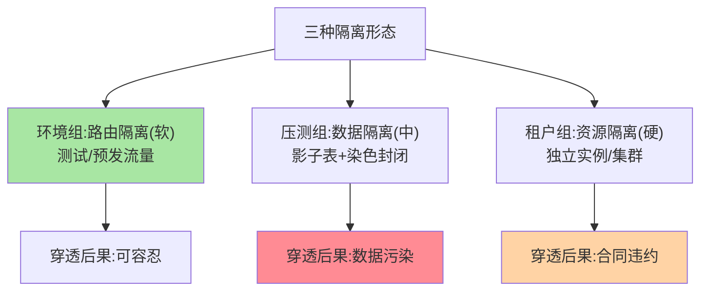
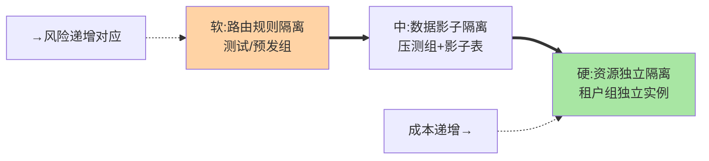

# 分组隔离机制：环境、压测与租户的隔离形态

> 分组的本质是**流量的封闭域**：组内实例只服务组内流量，域间绝不互串。三种典型形态——环境组、压测组、租户组——隔离的强度与实现各不相同。这篇讲清各形态的机制与隔离强度分级。

> **本文核心**：三种隔离形态——**环境组**（逻辑隔离：组间无网络阻断，靠路由规则封闭流量，轻量但靠纪律），**压测组**（影子隔离：压测流量染色 + 影子表/影子实例，数据也要隔离），**租户组**（物理倾向：大客户独立实例甚至独立资源池）。**机制链**：实例注册带分组标签 → 流量按来源/标记匹配同组 → 组内均衡 → 跨组流量被规则拒绝。**隔离强度分级**：路由隔离（规则级，可被规则错误穿透）< 数据隔离（存储层分表/影子表）< 资源隔离（独立实例/独立集群）——隔离等级要与业务风险匹配。

## 一句话摘要

逐形态拆解：**环境组**（测试/预发组）的成本最低（无独立集群，注册表里圈实例），但隔离是「规则级」——规则误删或兜底触发就会穿透到生产，适合内部测试流量；**压测组**是数据隔离的刚需场景——压测写流量若进生产库就是数据污染，影子表（同库 shadow 前缀表）+ 染色透传（互指 service-routing 篇 5）是标准组合；**租户组**面向「大客户的资源独占诉求」——实例级隔离起步，顶级租户独立集群，隔离强度与商务等级对齐。**通则：隔离等级 = 风险等级，升级要用资源换**。

## 一、为什么隔离需要「分级」

「隔离」常被当成布尔值（隔离了/没隔离），实际是连续谱：路由规则隔离（软）→ 数据隔离（中）→ 资源隔离（硬）——**越硬的隔离越贵**（独立实例/集群的资源成本）。分级思维的价值：按「穿透后果」选等级——测试流量穿透（可容忍）用软隔离，压测写流量穿透（数据污染）必须中隔离，租户 SLA 承诺（合同责任）要硬隔离——**用隔离等级对齐风险等级，成本才花在刀刃上**。

## 5W 速记卡

| 维度 | 一句话 |
|---|---|
| What | 环境组/压测组/租户组三种隔离形态与强度分级 |
| Why | 不同场景的穿透后果不同，隔离等级要分级匹配 |
| When | 多环境规划、全链路压测、多租户部署 |
| Where | 注册表分组标签 + 路由规则 + 数据层影子/分表 |
| How | 注册带组标签 → 组内流量封闭 → 按风险选隔离强度 |

## 二、三种形态与隔离强度全景

**压测组的完整链路**（隔离最复杂的形态）：入口染色（压测标记）→ 全链路透传（互指 service-routing 篇 5）→ 服务层路由到压测组实例 → **数据层影子表**（压测写进 shadow 表，同库但隔离）→ 回收清理。链路上任何一环丢标记，压测流量就落生产——**压测隔离的验收是「全链路穿透测试」**（故意在某服务丢标记，验证被拦截面不是直接穿透）。

## 三、与多环境部署的区别：K8s/物理环境对照

| 维度 | 分组隔离（应用层软隔离） | 多环境部署（平台层物理隔离） |
|---|---|---|
| 隔离机制 | 注册表标签 + 路由规则 | 独立集群/独立 namespace |
| 资源成本 | 低（共享集群圈实例） | 高（独立资源池） |
| 适用 | 轻量子环境/临时隔离 | 生产与测试的强隔离 |

两者是「隔离光谱」的两端——隔离强度与资源成本的取舍贯穿光谱每一级——生产/测试的强隔离用物理环境，环境内的细分（预发/灰度/压测）用分组软隔离——**组合使用是常态**。

隔离强度的三级谱系：

## 四、典型场景与误区

**典型场景**：全链路压测季前建设（压测组 + 影子表 + 染色链路的完整基建）、大租户 SLA 保障（独立分组 + 资源配额 + 独立容量评估）、临时隔离需求（应急隔离组承接问题流量复现）。

**误区与不适用**：① 压测组只隔离服务不隔离数据——服务隔离了、写还进生产表，隔离形同虚设；② 租户分组无容量评估——「分组」不等于「资源保障」，大租户分组要配套独立容量；③ 环境组的规则无兜底审计——软隔离靠规则活着，规则变更无审计即裸奔。

## 五、💡 实战提示

- 💡 隔离等级选型三问：穿透后果是什么？发生概率多高？恢复成本多大？——三答定等级
- 💡 压测组上线前必做穿透测试：全链路任意环节丢标记都不能落生产
- 💡 租户组的容量评估与商务合同联动——分组承诺要能兑现

## 六、你们可能会问

**Q1：软隔离被穿透的典型姿势？**
规则兜底触发（默认规则指向全量）、规则误删、新实例忘打组标签（裸实例被默认流量命中）——软隔离的运维面比机制面更容易出事，规则审计是生命线。

**Q2：影子表和独立压测库怎么选？**
影子表（同库）省资源但有同库 IO 干扰与误操作风险；独立压测库隔离彻底但成本高——压测规模与数据敏感度决定，多数组织「影子表起步、关键系统独立库」。

**Q3：租户分组的路由怎么防「普通租户误入」？**
分组匹配是双向的——调用方带租户标记、实例带租户标签，双向不匹配即拒绝（而非回落全量）；租户隔离的兜底语义是「拒绝」不是「回退」。

## 七、开放问题

- 隔离等级的「声明式定义」（隔离需求声明由平台自动落地路由/数据/资源三层配置）是隔离治理的平台化方向，跨层自动编排尚无成熟产品。

## 八、自测三问

1. 隔离强度三级与各自的穿透后果？
2. 压测组的完整隔离链路有哪些环节？
3. 租户隔离的兜底语义为什么必须是「拒绝」？

## 📎 核心带走

- **核心一句话**：分组隔离 = 流量封闭域，环境（软）/压测（中）/租户（硬）三级强度对齐风险等级
- **机制链**：注册带组标签 → 流量按组匹配封闭 → 数据/资源隔离配套 → 穿透测试验收
- **失效点/边界**：软隔离靠规则审计活着；压测隔离必含数据层；租户分组要配容量承诺

## 📌 数据与事实声明

- 写于 2026-09-08，形态分级为业界实践的归纳
- 免责：具体隔离方案按业务风险评审

## 📚 参考资料

| 类型 | 标题 | 来源 |
|---|---|---|
| 关联系列 | 本仓库 service-routing 系列（染色互指）/ 全链路压测相关 | docs/architecture/service-governance/ |
| 社区沉淀 | 全链路压测与多租户隔离公开实践 | 技术社区公开文章 |
