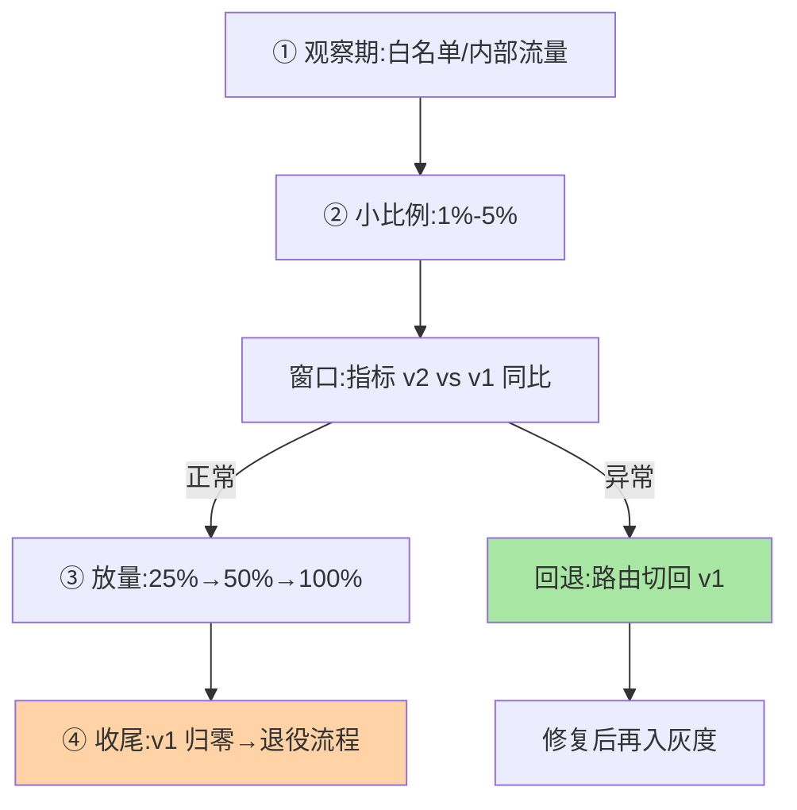

# 多版本灰度机制：从流量切分到版本回退

> 版本共存搭好了舞台，灰度是台上的主角：**按规则把流量逐步从 v1 切到 v2**，观察指标、放大比例、完成迁移；出错时**回退**。这篇讲灰度迁移的完整流程与回退的工程细节。

> **本文核心**：灰度迁移四阶段——**① 观察期**（v2 只接内部/白名单流量）、**② 小比例期**（1%-5% 真实流量，核心指标盯防）、**③ 放量期**（阶梯放大 25%→50%→100%，每级观察窗口）、**④ 收尾**（v1 流量归零进退役流程）。**回退机制**：回退不是「重发 v1」而是「路由切回」——v1 实例还在（共存期不退役），路由规则秒级切回。**机制链**：规则调整 → 流量比例变化 → 指标对比（v2 vs v1 同比） → 放量/回退决策。

## 一句话摘要

灰度的核心工程问题不是「切流量」（规则引擎都会），是**「对比的正确性」与「回退的及时性」**：对比正确性——灰度指标要与 v1 同期对比（同时段、同流量结构），且要区分「版本差异」与「流量差异」（灰度流量常含更多新用户，指标天然偏移）；回退及时性——**v1 保持热备状态**（实例不下线、数据结构兼容）、回退触发条件预定义（错误率阈值自动触发优于人工判断）、回退演练（上线前实测回退时效）。灰度节奏的经验口径：每级观察窗口至少覆盖一个完整业务周期（日级业务看整天）。

## 一、为什么灰度失败常在「回退」

灰度事故复盘的典型剧本：v2 指标异常被发现时已全量（无阶梯或窗口太短）、决定回退时 v1 已下线（共存期太短）、回退后数据不兼容（v2 写了新格式数据，v1 读不懂）——**灰度设计的三缺席：阶梯缺席、热备缺席、数据兼容缺席**。回退能力在灰度开始前就要设计好，不是出事后现场想办法。

## 5W 速记卡

| 维度 | 一句话 |
|---|---|
| What | 四阶段灰度迁移 + 回退机制（路由切回 + 热备 v1） |
| Why | 版本迁移的安全靠灰度，灰度的安全靠回退 |
| When | major 版本上线、高风险变更灰度 |
| Where | 路由规则 + 监控对比 + v1 热备 |
| How | 阶梯放量 + 同期对比 + 预定义回退触发 |

## 二、灰度阶梯与回退机制

**回退的两类触发**：**自动触发**——错误率/延迟阈值超限自动切回（阈值预定义，响应速度秒到分钟级，适合技术指标）；**人工触发**——业务指标异常（转化率下跌）需人判断，人工决策 + 一键执行（决策可慢、执行必须快）。**数据兼容是回退的深水区**：v2 若改了数据格式，回退后 v1 读不懂——「回退安全」要求 v2 的数据变更向后兼容（新增可空字段类），破坏性数据变更的版本回退要带数据迁移回滚，复杂度完全不同（评估在灰度前）。

## 三、与发布灰度的区别：视角对照

| 维度 | 版本灰度（本篇） | 发布灰度（互指 graceful-shutdown 篇 4） |
|---|---|---|
| 灰度对象 | 版本间流量比例（v1→v2） | 发布批次（滚动/金丝雀实例数） |
| 常存期 | 版本共存期较长 | 发布完成即结束 |
| 回退语义 | 路由切回旧版本实例 | 回滚新批次实例 |

两者配合构成完整灰度（发布产生 v2 实例 → 版本灰度控制流量）——路由视角与发布视角的分工（互指泳道篇的配合分层）。

灰度四阶段与回退闭环：

## 四、典型场景与误区

**典型场景**：核心接口 major 升级（四阶段全流程 + 回退演练前置）、算法类服务灰度（推荐算法 v2 用 A/B 框架按人群灰度——业务指标驱动）、配置驱动的灰度（灰度比例进配置中心，调整不发版）。

**误区与不适用**：① 灰度比例线性放大太密（1%→3%→5%）——小比例期噪声大，阶梯按「统计显著」设计（1%→10%→50%）；② 指标只看全局——灰度流量的细分指标（新版本用户路径的错误率）被全量均值稀释；③ 回退预案只在文档里——未演练的回退在真实场景必出岔（v1 实例早已被挪用是经典现场）。

## 五、💡 实战提示

- 💡 灰度三前置：v1 热备确认、回退阈值预定义、数据兼容评估——三件不齐不开灰
- 💡 每级放量的观察窗口覆盖完整业务周期（至少一整天含高峰）
- 💡 灰度比例进配置中心（调整不发版），自动回退阈值进监控联动

## 六、你们可能会问

**Q1：内部服务也要这么重的灰度吗？**
按影响面分级——核心链路服务重灰度（四阶段），边缘服务轻灰度（小比例直放）——灰度流程要与故障半径匹配，不是所有服务都值得全套流程。

**Q2：灰度期间 v1 也要修 bug 吗？**
要——共存期 v1 仍是「服务生产的版本」，致命 bug 照修（patch 级）；功能迭代停止（引导用户到 v2），「维护模式」是共存期 v1 的状态语义。

**Q3：怎么判断灰度「成功」可以收尾？**
预定义的成功标准（错误率 ≤ v1 基线 + 业务指标不低于 v1 + 覆盖完整周期）——成功标准在灰度前定义，避免「感觉可以了」的模糊收尾——放量节奏与回退速度的取舍由指标自动性决定。

## 七、开放问题

- 自动化灰度（指标驱动的自动放量与自动回退，按统计显著性决策）在头部组织成熟应用，但「业务指标的自动判读」仍是难点——灰度自动化的边界在业务语义理解。

## 八、自测三问

1. 灰度四阶段与每级的观察要点？
2. 回退的两类触发与「回退安全」的数据前提？
3. 灰度失败的「三缺席」（阶梯/热备/数据兼容）复盘法？

## 📎 核心带走

- **核心一句话**：多版本灰度 = 阶梯放量 + 同期对比 + 可靠回退——回退能力在开灰前设计
- **机制链**：观察期 → 小比例 → 阶梯放量 → 归零退役；异常 → 预定义触发 → 路由切回热备 v1
- **失效点/边界**：v2 数据变更必须向后兼容否则回退深水区；观察窗口覆盖完整业务周期；成功标准前置定义

## 📌 数据与事实声明

- 写于 2026-09-08，灰度框架为业界实践归纳；比例阶梯为经验口径
- 免责：具体流程按业务风险评审

## 📚 参考资料

| 类型 | 标题 | 来源 |
|---|---|---|
| 关联系列 | 本系列篇 2 / graceful-shutdown 篇 4 | docs/architecture/service-governance/ |
| 社区沉淀 | 灰度发布公开实践 | 技术社区公开文章 |
