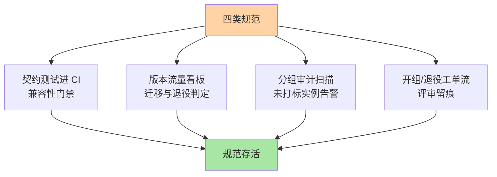

# 分组与版本最佳实践：从命名到治理的规范集

> 全系列收束篇：把前四篇的机制沉淀成**可执行的规范集**——命名规范、演进规范、隔离规范、治理流程四类，直接可抄进组织的治理手册。

> **本文核心**：四类规范——**命名规范**（版本语义化 + 分组命名空间化 + 标签键规范）；**演进规范**（SemVer 纪律 + 兼容优先 + 退役流程）；**隔离规范**（等级匹配 + 开组评审 + 穿透测试）；**治理流程**（变更评审 + 流量看板 + 审计）。**机制链**：规范定义 → 工具化执行（CI 门禁/扫描） → 流程化运转（评审/看板/审计） → 定期复盘迭代。规范的失效模式只有一种：**没有工具与流程承载的规范**。

## 一句话摘要

规范集的核心条目速览：**命名**——版本 SemVer（major 兼容承诺）、分组 `用途-域` 格式（gray-finance）、标签键保留清单（version/group/zone 治理保留）；**演进**——新增可选、废弃标记、删除走 major 的三句铁律 + 共存上限 2-3 版；**隔离**——三问定级（穿透后果/概率/恢复成本）+ 开组评审 + 压测穿透测试；**治理**——版本流量周报、组生命周期审计、规范例外审批制。**工具化清单**：契约测试进 CI、版本流量看板、分组审计扫描、未打标实例告警——四件工具是规范的「执行臂」。

## 一、为什么规范容易「发布即死亡」

治理规范的高死亡率：发布时全员学习 → 三个月后无人提起 → 新人不遵守老人已忘。**存活的条件是「工具化 + 流程化」**：规范要求「契约测试通过」→ CI 强制（不通过合不了码）；规范要求「分组评审」→ 流程工单承载（没工单开不了组）——**规范要变成系统的默认行为而不是人的记忆义务**。本篇的规范集每条都标注工具化方式，就是为此。

## 5W 速记卡

| 维度 | 一句话 |
|---|---|
| What | 命名/演进/隔离/治理四类规范 + 四件工具化执行臂 |
| Why | 分组与版本的治理价值靠规范落地，规范靠工具存活 |
| When | 治理手册编写、新团队接入、规范年度复盘 |
| Where | 组织治理手册 + CI/平台工具 |
| How | 规范条目 → 工具强制 → 流程承载 → 复盘迭代 |

## 二、规范集与工具化全景



**规范条目与工具的对应示例**：规范「删除接口字段必须走 major」→ 工具「契约测试 diff 检测删除并断言 major 已升」；规范「实例必须携带 version/group」→ 工具「注册扫描：无标签实例告警并阻断接入」；规范「共存超 3 版报治理会」→ 工具「版本看板自动标红」——**每条规范问自己「什么工具能代替人记得它」**。

## 三、与整体治理体系的区别：位置对照

| 维度 | 分组版本规范（本篇） | 整体治理体系（各域总和） |
|---|---|---|
| 范围 | 实例身份维度 | 全治理域 |
| 角色 | 路由/灰度/隔离的数据规范 | 消费这些数据的各域机制 |

分组与版本的规范是「数据规范」（把实例身份管好），下游各域（路由/灰度/隔离）是「消费机制」——**数据质量决定治理上限**，这也是本系列作为治理基础篇的定位。

规范-工具的对应矩阵：

```mermaid
flowchart LR
    S1["命名规范"] --> T12["注册扫描:未打标告警"]
    S2["演进规范"] --> T22["契约测试CI门禁"]
    S3["隔离规范"] --> T32["开组工单+穿透测试"]
    S4["治理流程"] --> T42["版本看板+审计"]
    T12 --> ALIVE2["规范存活"]
    T22 --> ALIVE2
    T32 --> ALIVE2
    T42 --> ALIVE2
    style ALIVE2 fill:#a8e6a3
    style S2b[""] fill:none
```

## 四、典型场景与误区

**典型场景**：新团队接入治理体系（规范集 + 工具权限一次性交付）、治理规范年度复盘（例外条款转正、失效条款清理）、跨部门规范对齐（各团队的分组语义差异仲裁——规范统一是治理平台的前提）。

**误区与不适用**：① 规范大而全一次发布——几十条规范同时生效无人执行，分级发布（先强制三条核心）存活率高得多；② 规范无例外机制——「100% 强制」遇到合理例外会导致规范整体失信——严格度与可执行度的取舍，例外走审批并记录；③ 规范与工具脱节更新——流程变了工具没改，工具的强制点变成阻力点。

## 五、💡 实战提示

- 💡 规范分级发布：先强制 3 条核心（版本必填/分组评审/契约门禁），存活后再扩
- 💡 每条规范标注工具化方式与负责人，无工具承载的规范不发
- 💡 规范例外走审批并公示——透明例外比隐性违反健康
- 💡 松紧决策口径：何时用什么强度——核心保留键（version/group）强强制，扩展标签弱规范（有看板即可），新维度先观察后定级

## 六、你们可能会问

**Q1：规范的「度」怎么把握（过严 vs 失控）？**
看执行阻力信号：工单积压、频繁申请例外 = 过严；事故复盘反复指向同类问题 = 过松——用流程数据调规范的松紧，而非拍脑袋。

**Q2：存量服务不合规怎么办？**
不追溯清洗（成本爆炸），「新规新办、旧规旧办 + 迁移触发点」（服务大版本升级时顺带合规化）——存量治理搭在自然演进的车上。

**Q3：规范由谁维护？**
治理团队起草 + 业务团队评审 + 平台团队工具化——三方缺一：只有治理起草会脱离实际，只有平台工具化会偏离治理意图。

## 七、开放问题

- 治理规范的「平台内生化」（规范以策略代码形式由平台自动执行，Policy as Code）是终点形态——OPA 类策略引擎在治理域的应用是这一方向的实际探索。

## 八、自测三问

1. 四类规范与四件工具的对应关系？
2. 「规范要变成系统的默认行为」怎么落地？
3. 规范「度」的调节信号有哪些？

## 📎 核心带走

- **核心一句话**：分组与版本的最佳实践 = 四类规范 + 四件工具——有工具承载的规范才活着
- **机制链**：规范定义 → 工具化强制（CI/看板/扫描/工单） → 流程化运转 → 数据驱动的松紧调节
- **失效点/边界**：规范分级发布优于大而全；例外审批制保健康；存量治理搭自然演进

## 📌 数据与事实声明

- 写于 2026-09-08，规范集为本系列机制的落地化归纳
- 免责：具体条目按组织现状裁剪

## 📚 参考资料

| 类型 | 标题 | 来源 |
|---|---|---|
| 关联系列 | 本系列篇 1-4 / 整体治理各域 | docs/architecture/service-governance/ |
| 公开规范 | Semantic Versioning / 治理手册公开范例 | semver.org 等 |
| 社区沉淀 | 服务治理规范公开实践 | 技术社区公开文章 |
