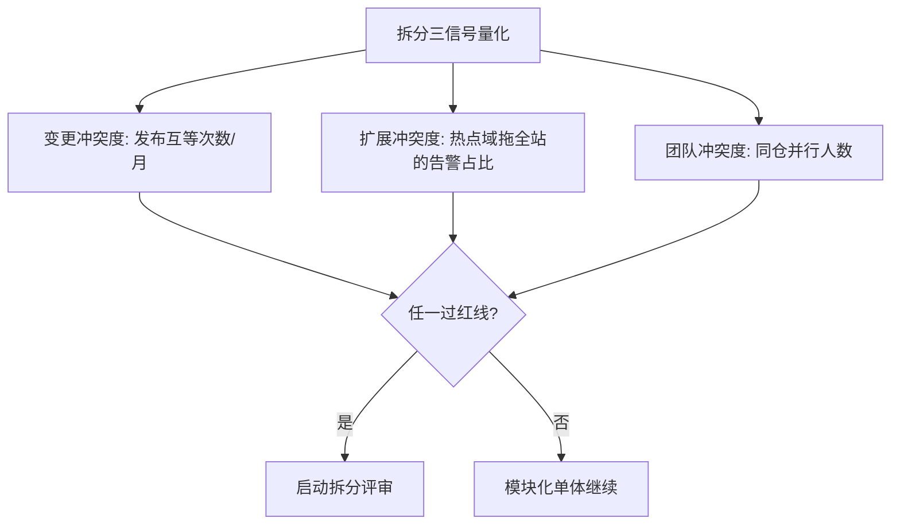
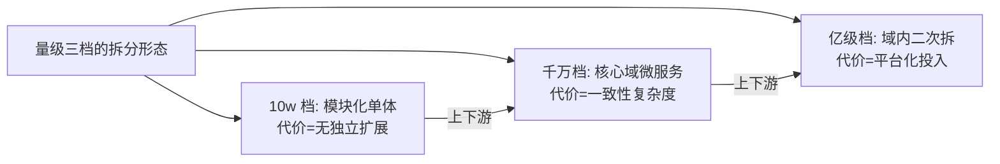
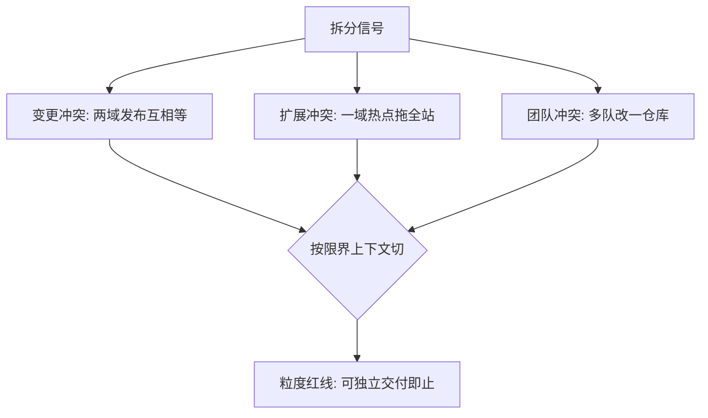
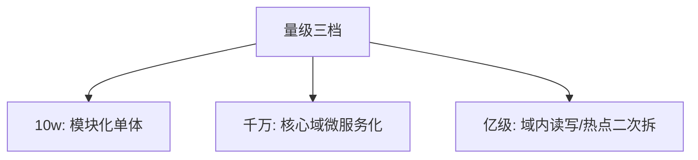

# 微服务拆分决策

> 「什么时候拆、按什么拆、拆到多细」——微服务拆分的三个决策问题，用决策树回答而不是用流行度回答。

## 一句话摘要

拆分决策 = 拆分信号（团队/变更/扩展的冲突度）× 拆分依据（限界上下文而非技术分层）× 粒度红线（拆到团队可独立交付为止）——10w 档单体+模块边界，千万档按上下文拆核心域，亿级档核心域再按读写/热点二次拆。

## 篇目规划（L1-L4，ADR-0012 方向=子目录）

| 篇目/层 |
|---|
| 专题篇 1 · 拆分信号与时机：三个冲突度量化 |
| 专题篇 2 · 拆分依据：限界上下文 vs 技术分层（反模式对照） |
| 专题篇 3 · 粒度红线与合并回退（拆错的逆操作） |

**机制定位与取舍**：本方向的每个机制（原理与底层实现）都在篇目里锚定了位置——规划期的取舍是「机制原理优先于操作罗列」，代价是入门读者需要更多耐心，收益是后续每篇的参数与步骤都有原理可归因；架构上各层互为上下游，边界由「机制讲透」与「操作可执行」这条线划分。

## 演进视角

微服务粒度的演变：单体 → 过度拆分（纳米服务反模式）→ 理性回归（单团队可交付为界）——演变教训是「拆分的成本在运维与一致性，收益在交付与扩展」，权衡随团队规模与量级漂移。

## 📌 数据与事实声明

- 本文件为方向骨架规划（篇目标注 ⏳ 待写 / ✅ 已落地），依据 ADR-0012 工程级深度标准与 4 层架构规范；量级与参数数字均为行业认知量级，落篇时以实测替换。

## 📚 参考资料

- 《领域驱动设计》限界上下文、Sam Newman《Monolith to Microservices》、本仓库 RPC/注册发现系列。
