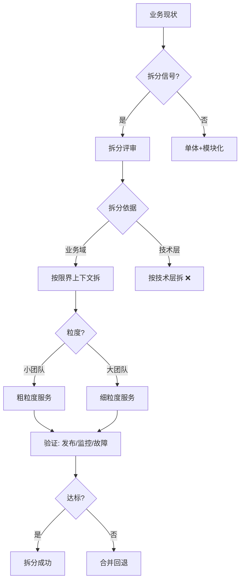
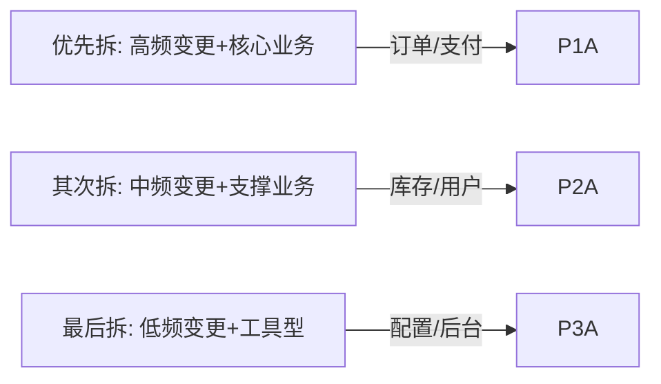

# 微服务拆分决策树：什么时候拆、拆成什么、怎么拆

## 一句话摘要

拆分决策 = **拆分信号 × 拆分依据 × 粒度红线**——用决策树回答，而不是用流行度回答。

## 拆分决策全景图

## 拆分决策树详解

### 决策节点 1：是否拆分？

**拆分信号（任一过红线即拆分）**：
- 变更冲突度 > 2 次/周
- 扩展冲突度 > 30% 流量热点
- 团队冲突度 > 8 人同仓

**不拆分的条件**：
- 团队 < 10 人
- QPS < 1000
- 业务简单 CRUD

### 决策节点 2：拆成什么？

| 维度 | 拆分策略 | 适用场景 |
|---|---|---|
| 按业务域 | 限界上下文 | 业务复杂、团队多 |
| 按技术域 | 读写分离 | 数据量大、查询复杂 |
| 按租户域 | 多租户隔离 | SaaS/多商户 |
| 按地域域 | 地域拆分 | 跨地域部署 |

### 决策节点 3：粒度多细？

**粒度红线**：
- 可独立部署 ✅
- 可独立扩展 ✅
- 可独立演进 ✅
- 团队可独立交付 ✅

**过度拆分信号**：
- 服务间调用 > 5 层
- 分布式事务 > 2 个
- 调试一个请求需开 5 个日志

## 拆分代价评估

| 代价项 | 量化指标 | 可接受阈值 |
|---|---|---|
| 网络延迟 | RTT 增加 | < 10ms |
| 数据一致性 | 延迟 | < 5s |
| 运维复杂度 | 服务数 | < 50 |
| 团队学习成本 | 培训周期 | < 2 周 |

## 拆分优先级矩阵

## 反模式对照表

| 反模式 | 症状 | 解决方案 |
|---|---|---|
| 分布式单体 | 拆了进程，DB 没拆 | 先拆 DB |
| 共享数据库 | 多服务读同一表 | 按服务分库 |
| 过早拆分 | 团队 < 10 人 | 不拆 |
| 拆分不均 | 一个服务 80% 流量 | 重新切分 |
| 无回退方案 | 拆完发现不对 | 灰度+回退 |

## 拆分检查清单

- [ ] 拆分信号已确认
- [ ] 限界上下文已识别
- [ ] 数据拆分方案已确定
- [ ] 服务间接口已定义
- [ ] 灰度迁移方案已就绪
- [ ] 监控指标已配置
- [ ] 回退方案已准备

## 📌 数据与事实声明

- 决策树基于业界微服务治理实践
- 量化指标为经验值，需按团队实际情况调整
