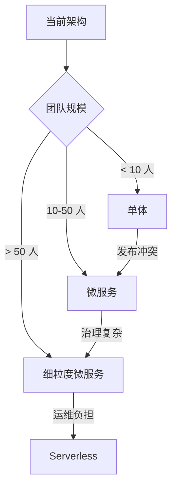

# 微服务拆分：取舍权衡与演进路径

## 一句话摘要

拆分没有银弹，只有**取舍权衡**。本文从单体→微服务→Serverless 的演进路径，讲透每个阶段的取舍与决策。
## 演进路径全景

## 各阶段取舍

### 单体 → 模块化单体

| 取舍 | 内容 |
|---|---|
| 收益 | 开发效率高，部署简单 |
| 代价 | 发布耦合，扩展受限 |
| 适用 | 团队 < 10 人，QPS < 1000 |

### 模块化单体 → 微服务

| 取舍 | 内容 |
|---|---|
| 收益 | 独立部署，独立扩展 |
| 代价 | 运维复杂，分布式事务 |
| 适用 | 团队 10-50 人，QPS 1000-10000 |

### 微服务 → 细粒度微服务

| 取舍 | 内容 |
|---|---|
| 收益 | 粒度精细，弹性强 |
| 代价 | 服务治理复杂，调试困难 |
| 适用 | 团队 50+ 人，QPS 10000+ |

### 微服务 → Serverless

| 取舍 | 内容 |
|---|---|
| 收益 | 无需运维，按量付费 |
| 代价 | 冷启动，调试困难 |
| 适用 | 事件驱动，突发流量 |

## 拆分决策要素

### 团队能力
- 是否有 SRE 团队？
- 是否有平台工程能力？
- 是否有分布式事务经验？

### 业务特征
- 业务复杂度（简单 CRUD vs 复杂业务）
- 变更频率（低频 vs 高频）
- 数据一致性要求（强一致 vs 最终一致）

### 技术栈
- 语言生态（Java vs Go vs Node）
- 中间件成熟度（消息队列/注册中心）
- 监控可观测能力

## 演进路径决策树

## 反模式识别

1. **盲目追新**：单体没必要拆成微服务
2. **过度工程**：小团队搞 Service Mesh
3. **忽略团队能力**：没有 SRE 搞微服务 = 自毁
4. **拆分不彻底**：分布式单体 = 单体

## 演进路径检查清单

- [ ] 当前架构的痛点已识别
- [ ] 团队能力匹配目标架构
- [ ] 拆分代价已评估
- [ ] 灰度迁移方案已就绪
- [ ] 回退方案已准备
- [ ] 监控可观测已配置

## 📌 数据与事实声明

- 演进路径基于业界微服务治理实践
- 各阶段适用量级为经验值
