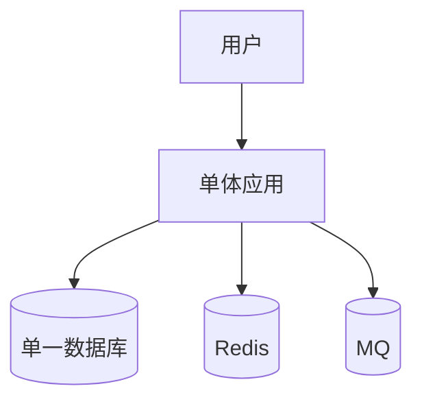
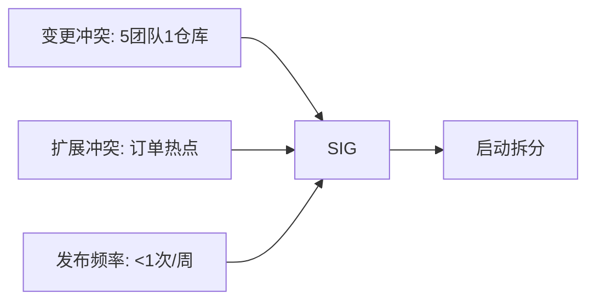
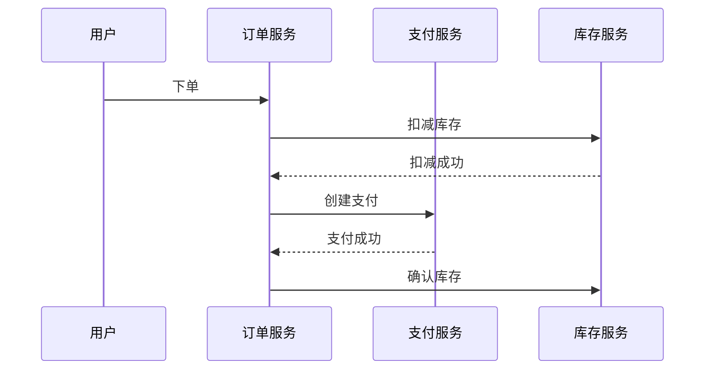

# 微服务拆分实战：电商订单域拆分案例

## 一句话摘要

从单体电商到微服务订单域拆分，全流程实战：拆分信号识别 → 限界上下文映射 → 数据拆分 → 灰度迁移 → 监控验证。

## 背景

**业务规模**：千万级订单/天，50 人团队
**痛点**：
- 订单发布频率 < 1 次/周（每次发布全站影响）
- 订单表 5000 万行，查询越来越慢
- 5 个团队改同一仓库，冲突频繁
- 库存服务依赖订单服务，级联故障

## 拆分前架构

## 拆分步骤

### Step 1：识别拆分信号

### Step 2：限界上下文映射

| 上下文 | 聚合根 | 服务边界 |
|---|---|---|
| 订单域 | 订单 | 订单服务 |
| 支付域 | 支付单 | 支付服务 |
| 库存域 | 库存 | 库存服务 |
| 用户域 | 用户 | 用户服务 |

### Step 3：数据拆分策略

| 数据 | 拆分前 | 拆分后 |
|---|---|---|
| 订单表 | 单库单表 | 订单库，1024 张分表 |
| 支付表 | 单库单表 | 支付库，独立分表 |
| 库存表 | 订单库内 | 库存库，独立分表 |

**数据迁移**：双写 → 对账 → 切读 → 停写

### Step 4：服务间通信

### Step 5：灰度迁移

| 阶段 | 比例 | 验证项 |
|---|---|---|
| 灰度 1% | 影子流量 | 链路正确性 |
| 灰度 10% | 真实流量 | 性能对比 |
| 灰度 50% | 监控观察 | 错误率/RT |
| 全量 | 100% | 业务指标 |

### Step 6：监控验证

| 指标 | 拆分前 | 拆分后 | 目标 |
|---|---|---|---|
| 订单 P99 RT | 800ms | 300ms | < 500ms |
| 支付成功率 | 99.5% | 99.9% | > 99.9% |
| 发布频率 | 1 次/周 | 1 次/天 | > 1 次/天 |
| 故障影响面 | 全站 | 订单域 | < 10% |

## 踩坑记录

1. **分布式事务初始方案选 TCC**：开发成本超预期，改为 Saga + 对账
2. **库存服务没有灰度**：直接全量，线上扣减错误，回退双写
3. **TraceID 未贯穿**：排查问题靠猜，加装 SkyWalking
4. **数据对账周期长**：每天对账，延迟发现不一致，改为实时对账

## 经验总结

- 拆分不是技术决策，是业务决策
- 数据拆分 > 服务拆分（数据库没拆=没拆）
- 灰度是必须的，全量切换风险极高
- 可观测性是拆分后的第一要务

## 📌 数据与事实声明

- 场景为电商订单域，行业通用案例
- 拆分步骤来自业界微服务治理实践
- 监控指标基于千万级订单量级
