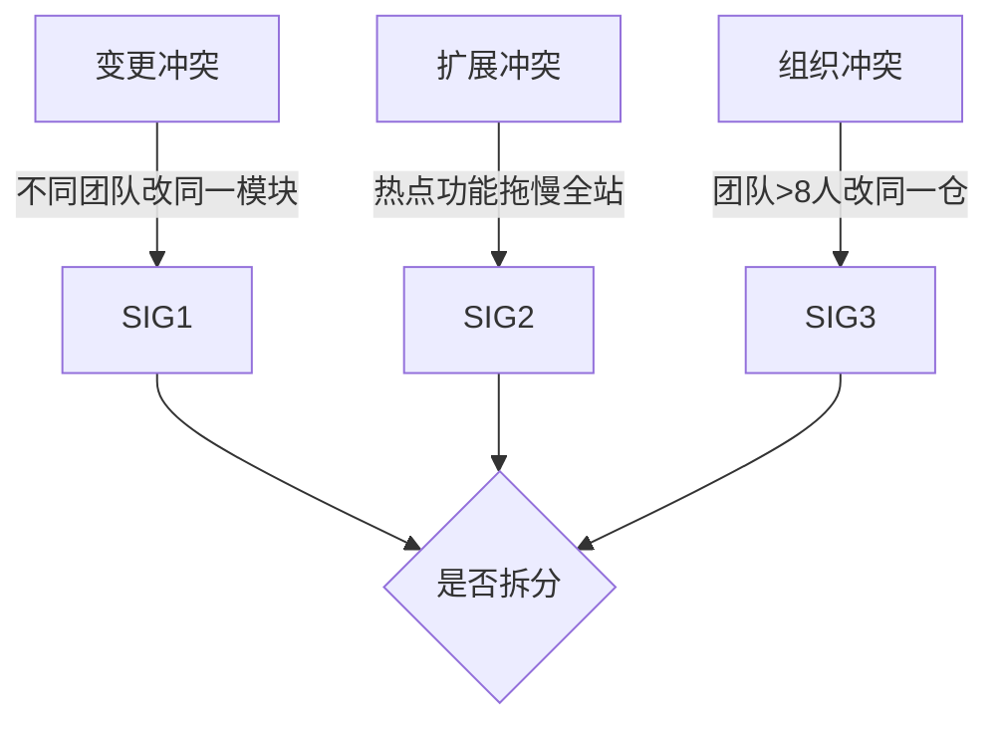

# 从零开始认识微服务拆分

## 一句话摘要

微服务拆分的本质不是「把大系统切小」，而是**识别业务边界、让每个服务可以独立部署、独立扩展、独立演进**。拆分是为了解决单体在团队扩展/发布频率/技术栈多样性上的瓶颈，不是为了拆分而拆分。

## 什么是微服务拆分

单体架构的问题在**团队规模上线后**才暴露：
- 发布耦合：改 A 模块的 BUG，必须等 A 一起上线
- 扩展耦合：热点功能拖慢整个应用，无法只扩容热点
- 技术栈耦合：全栈只能用一套技术，新语言/新框架无法局部引入
- 组织瓶颈：5 人以下一个仓库够用，50 人以上互相踩发布

微服务拆分的核心目标：**让服务边界 = 团队边界 = 发布边界**。

## 拆分的三个信号（什么情况下该拆）

1. **变更冲突度**：发布互等次数/月 > 2 次 → 拆分信号
2. **扩展冲突度**：一个功能的热点拖慢整体 QPS → 拆分信号
3. **团队冲突度**：同仓并行人数 > 5 → 拆分信号

**一句话判断**：三个信号任一过红线，就启动拆分评审；全部不过，继续单体+模块化。

## 拆分的两个维度

### 按业务能力拆（推荐）
- 订单服务、支付服务、用户服务
- 每个服务有独立的业务上下文（限界上下文）
- 优势：团队对齐、故障隔离、独立演进

### 按技术层级拆（反模式）
- 拆成「用户服务」「订单服务」「数据服务」
- 问题：服务间强依赖，分布式事务爆炸
- ❌ 除非有充分理由，避免按技术层拆分

## 拆分的代价

| 代价 | 说明 |
|---|---|
| 网络延迟 | 进程内调用→网络调用，RTT 从 ns 级变 ms 级 |
| 数据一致性 | 分布式事务/最终一致性，复杂度指数上升 |
| 运维成本 | 部署/监控/调试/链路追踪全部变复杂 |
| 团队成本 | 需要 SRE/平台团队支撑，不是每个团队扛得住 |

## 拆分的粒度红线

**可独立交付**：一个服务从开发到上线，一个团队可以独立完成，不需要跨团队协调。

**不要过度拆分**：
- 纳米服务（< 500 行代码）：调用开销 > 业务价值
- 每个服务至少能独立部署、独立扩展、独立演进

## 拆分的演进路径

- 单体 → 模块化单体（加模块边界，不拆进程）
- 模块化单体 → 核心域微服务（拆出高频变更域）
- 核心域 → 按读写/热点二次拆（亿级量级才需要）
- 过度拆分 → 合并回退（纳米服务反模式）

## 5W 速记卡

| 维度 | 一句话 |
|---|---|
| What | 把单体按业务边界拆成独立部署的服务 |
| Why | 解决发布耦合、扩展耦合、团队瓶颈 |
| When | 变更冲突/扩展冲突/组织冲突任一过红线 |
| Where | 核心业务域，不包括工具型/基础设施型 |
| How | 限界上下文 → 接口契约 → 数据解耦 → 灰度迁移 |

## 常见反模式

1. **分布式单体**：拆了进程，但数据库没拆，等于没拆
2. **共享数据库反模式**：多个服务读写同一张表，故障半径扩散
3. **过早拆分**：团队 < 10 人、QPS < 1000，拆分代价 > 收益
4. **拆分不均**：一个服务 80% 流量，其他服务空转

## 📌 数据与事实声明

- 本文件为入门层概念篇，量级与参数为行业认知，落篇时以实测替换
- 拆分信号阈值（变更冲突>2次/月等）为经验值，需按团队实际情况调整

## 📚 参考资料

- 《领域驱动设计》限界上下文
- Sam Newman《Monolith to Microservices》
- Martin Fowler《Microservices》一书
