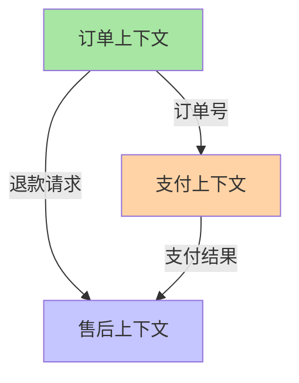

# 微服务拆分：限界上下文与拆分粒度

## 一句话摘要

拆分的依据是**限界上下文（Bounded Context）**而不是技术分层——每个上下文有独立的模型、术语和数据边界。粒度红线：拆到团队可独立交付为止。

## 限界上下文是什么

DDD 核心概念：业务上有明确边界的领域，每个上下文有自己独立的：
- **词汇表**：同一术语在不同上下文含义不同
- **数据模型**：上下文内自有模型，不共享数据库
- **业务规则**：上下文内规则自洽

## 按限界上下文拆 vs 按技术层拆

| 维度 | 按限界上下文拆 | 按技术层拆 |
|---|---|---|
| 边界依据 | 业务能力 | 技术职责 |
| 服务边界 | 清晰，业务内聚 | 模糊，跨业务 |
| 故障隔离 | 好，单上下文故障不扩散 | 差，数据库共享故障半径大 |
| 团队对齐 | 自然对齐 | 不对齐 |
| 分布式事务 | 少（按上下文聚合根） | 多（跨层操作） |
| 适合场景 | 业务复杂、团队多 | 简单 CRUD、小团队 |

## 拆分粒度三档

### 10 万 QPS 档：模块化单体
- 不拆进程，加模块边界
- 内部按包/模块隔离
- 发布还是整体，但开发可以分模块

### 千万 QPS 档：核心域微服务化
- 拆出高频变更的核心域（订单/支付/库存）
- 低频域保留单体（配置/后台管理）
- 核心域独立部署、独立扩展

### 亿级 QPS 档：域内二次拆
- 核心域再按读写分离（交易 vs 报表）
- 热点域按租户/地域二次拆
- 代价：平台化投入（调度/治理/监控）

## 拆分粒度红线

**可独立交付** = 一个团队从开发→测试→上线，不需要跨团队协调。

判断标准：
1. 一个服务的数据库可以独立迁移 ✅
2. 一个服务的发布不影响其他服务 ✅
3. 一个服务的扩容不影响其他服务 ✅
4. 一个服务的技术栈升级不影响其他服务 ✅

任一不满足 → 粒度太细，需要合并。

## 拆分的逆操作：合并回退

拆错的信号：
- 服务间调用链 > 5 层
- 分布式事务 > 2 个
- 跨服务改同一个字段
- 调试一个请求要开 5 个日志

回退策略：合并回单体或粗粒度服务，保留模块化边界。

## 5W 速记卡

| 维度 | 一句话 |
|---|---|
| What | 按业务上下文切分，不是按技术层切分 |
| Why | 业务内聚、故障隔离、团队对齐 |
| When | 核心域高频变更时 |
| Where | 订单/支付/库存等核心业务域 |
| How | 识别上下文 → 定义接口 → 数据解耦 → 灰度迁移 |

## 常见反模式

1. **分布式单体**：拆了进程，数据库没拆
2. **共享数据库**：多个服务读写同一张表
3. **过早拆分**：团队 < 10 人、QPS < 1000
4. **拆分不均**：一个服务 80% 流量

## 📌 数据与事实声明

- 拆分粒度阈值（10w/千万/亿级）为行业认知量级
- 限界上下文识别方法来自 DDD 实践
