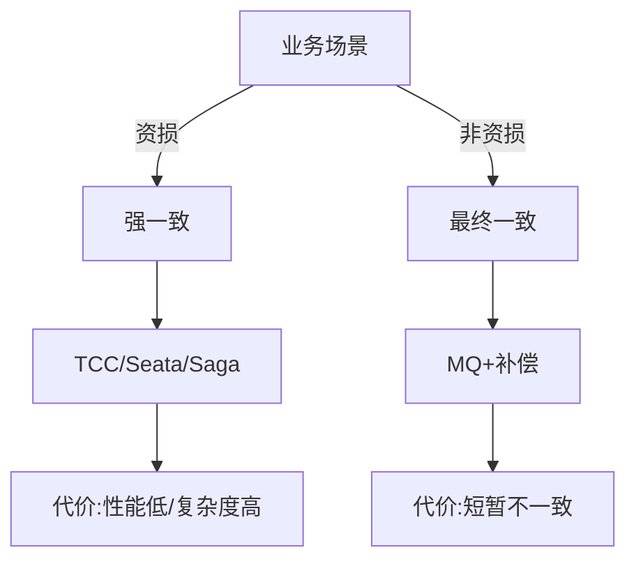

# 微服务拆分时机与数据一致性策略

## 一句话摘要

拆分的时机 = **业务变化频率 > 技术维护成本** 时。数据一致性：先保证最终一致，再考虑强一致；强一致只给钱（资损场景）。

## 拆分的三个时机

### 1. 发布频率 < 1 次/周
单体发布慢是因为耦合，拆分后各服务独立发布，频率可提升到 1 次/天甚至多次/天。

### 2. 团队规模 > 15 人
一个仓库 15 人以上，并行开发冲突指数上升。此时拆分按团队边界切，减少冲突。

### 3. 技术栈异构需求
某个模块需要 Go（高性能）或 Python（AI），其他模块是 Java，拆分后各服务可以用不同语言。

**一句话判断**：发布频率、团队规模、技术栈三者任一触发，拆分收益 > 代价。

## 数据一致性策略

### 强一致（ACID）
- 场景：资损场景（交易/扣款/退款）
- 方案：分布式事务（Seata/TCC/Saga）
- 代价：性能低、复杂度高、锁竞争

### 最终一致（BASE）
- 场景：非资损场景（订单状态/库存同步）
- 方案：消息队列 + 补偿机制
- 代价：短暂不一致、业务需容忍

### 一致性取舍矩阵

## 拆分的数据策略

### 数据库拆分
- **垂直分库**：按业务域拆（订单库/用户库/支付库）
- **水平分表**：按 ID 哈希或范围拆（1024 张表）
- **分库分表后**：跨库查询需走 ES 或异构表

### 数据迁移策略
1. 双写期：旧库+新库同时写
2. 对账期：新旧数据一致性校验
3. 切换期：读切到新库
4. 回退期：新库异常→切回旧库

## 拆分的灰度策略

不要一次性全拆，按灰度迁移：

- 灰度 1%：影子流量验证
- 灰度 10%：真实流量 A/B 对比
- 灰度 50%：观察监控指标
- 全量：切换完成

## 拆分的监控指标

拆分后必须监控：
1. 服务间调用延迟 P99
2. 分布式事务成功率
3. 数据一致性延迟
4. 服务可用性 SLA
5. 发布频率

## 常见反模式

1. **一次性全拆**：灰度是必须的，全量切换风险极高
2. **忽略数据迁移**：拆库容易，拆数据难
3. **强一致滥用**：非资损场景用 TCC，性能崩溃
4. **无回退方案**：拆完发现不对，回退代价大

## 5W 速记卡

| 维度 | 一句话 |
|---|---|
| What | 何时拆+数据怎么一致 |
| Why | 发布/团队/技术栈触发时机 |
| When | 发布<1次/周 或 团队>15人 |
| Where | 核心业务域数据 |
| How | 灰度迁移+最终一致优先 |

## 📌 数据与事实声明

- 灰度比例 1%/10%/50% 为行业通用做法
- 强一致/最终一致取舍基于资损场景判断
