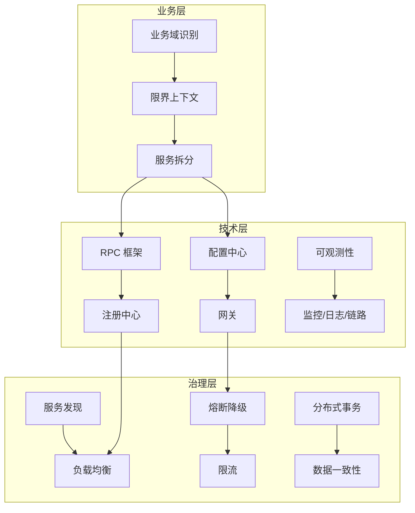
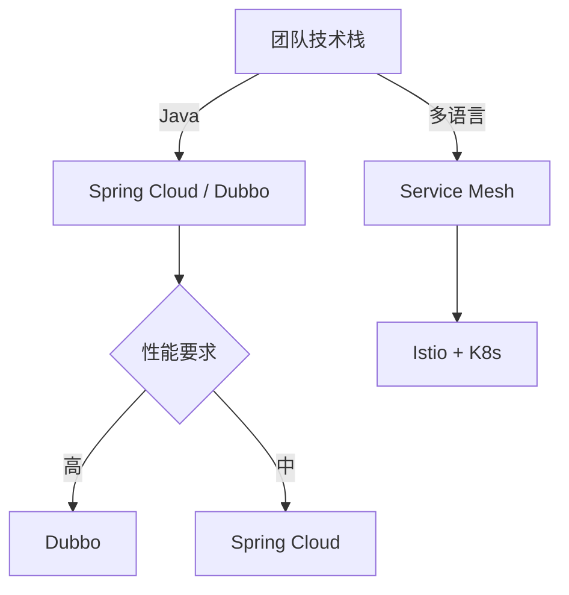

# 微服务拆分全景与选型决策

## 一句话摘要

微服务拆分 = **业务识别 + 技术选型 + 治理体系**。本文给出拆分全景图 + 选型决策树，覆盖 Spring Cloud / Dubbo / Service Mesh 三大技术栈的取舍。

## 微服务全景图

## 三大技术栈对比

| 维度 | Spring Cloud | Dubbo | Service Mesh |
|---|---|---|---|
| 语言支持 | Java为主 | Java为主 | 多语言 |
| RPC 协议 | HTTP/REST | Dubbo协议 | gRPC |
| 注册中心 | Eureka/Nacos | Nacos/ZooKeeper | Nacos |
| 配置中心 | Config | Nacos/Apollo | Apollo |
| 网关 | Gateway | None | Istio |
| 学习曲线 | 中 | 低 | 高 |
| 社区活跃度 | 高 | 高 | 中 |
| 适用场景 | Java 生态 | 高性能 RPC | 多语言 |

## 选型决策树

## 拆分后的治理体系

### 服务发现
- Nacos（阿里系推荐）
- Consul（HashiCorp 推荐）
- Eureka（Spring Cloud 原生）

### 负载均衡
- Ribbon（Spring Cloud）
- Dubbo LoadBalance
- Istio Sidecar

### 熔断降级
- Sentinel（阿里开源）
- Hystrix（已停维护）
- Resilience4j（Spring Cloud）

### 分布式事务
- Seata（阿里开源）
- TCC（自定义）
- Saga（事件驱动）

## 拆分 Checklist

### 拆分前
- [ ] 拆分信号已确认
- [ ] 限界上下文已识别
- [ ] 数据拆分方案已确定
- [ ] 技术选型已确定

### 拆分中
- [ ] 服务间接口已定义
- [ ] 灰度迁移方案已就绪
- [ ] 监控指标已配置
- [ ] 回退方案已准备

### 拆分后
- [ ] 服务发现已配置
- [ ] 负载均衡已配置
- [ ] 熔断降级已配置
- [ ] 可观测性已配置

## 常见反模式

1. **技术栈混杂**：Spring Cloud + Dubbo 混用 = 治理混乱
2. **忽略数据拆分**：服务拆了 DB 没拆 = 没拆
3. **无治理体系**：只有服务没有治理 = 不可用
4. **过度拆分**：纳米服务 = 分布式单体

## 📌 数据与事实声明

- 技术栈对比基于业界实践
- 选型决策树基于团队规模/量级/技术栈
