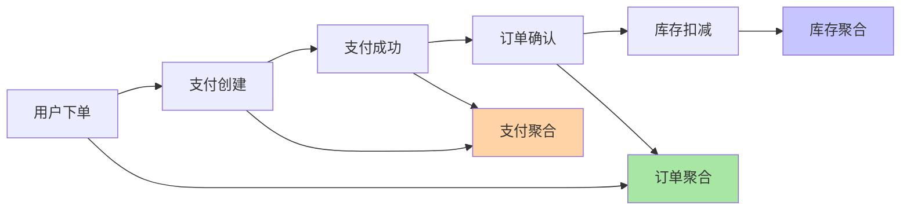
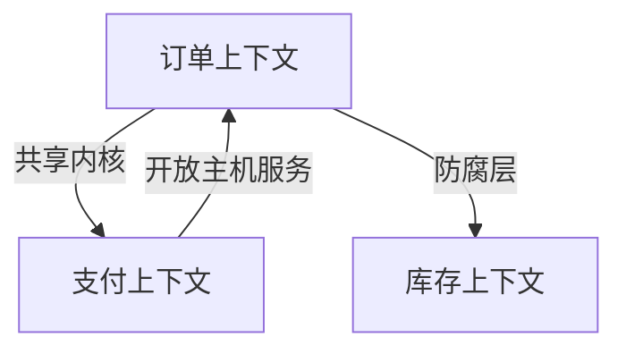

# 深入理解微服务拆分中的服务边界识别

## 一句话摘要

服务边界的识别不是技术决策，是**业务决策**——核心是"谁变更谁负责"。本文从事件风暴、限界上下文映射、代码耦合度三个维度讲透服务边界识别方法。

## 服务边界识别三法

### 方法一：事件风暴（Event Storming）

从业务事件出发，识别聚合根和服务边界：



**步骤**：
1. 列出所有业务事件
2. 按事件聚类→聚合根
3. 聚合根→服务边界
4. 事件之间的依赖→服务间调用

### 方法二：限界上下文映射（CQRS + Context Mapping）



- **共享内核**：两个上下文共享的模型（订单号）
- **防腐层**：隔离外部上下文变化
- **开放主机服务**：对外暴露的接口协议

### 方法三：代码耦合度分析

通过代码依赖分析识别边界：

```
高耦合 → 服务边界模糊
  ├─ A 模块调用 B 模块内部方法
  ├─ A/B 共享同一张数据库表
  └─ A/B 发布互相依赖

低耦合 → 可以拆分
  ├─ A/B 通过接口通信
  ├─ A/B 各自独立数据库
  └─ A/B 可独立发布
```

## 边界识别的常见陷阱

1. **按技术层拆**：拆成「用户服务」「订单服务」「数据服务」——数据服务成了瓶颈
2. **按团队拆**：谁写谁管——但业务边界可能跨团队
3. **忽略数据归属**：数据库没拆，服务拆了=没拆
4. **过度聚合**：一个服务承载多个不相关的业务域

## 服务边界判定 checklist

- [ ] 该服务的核心业务域是否内聚？
- [ ] 该服务的发布是否影响其他服务？
- [ ] 该服务的数据库是否独立？
- [ ] 该服务的团队是否可以独立交付？
- [ ] 该服务的故障是否影响其他服务？

任一不满足 → 边界需要调整。

## 量级考量

| 量级 | 服务数量 | 边界粒度 |
|---|---|---|
| 10万QPS | 5-10 个 | 粗粒度（一个域一个服务） |
| 千万QPS | 20-50 个 | 中粒度（核心域再拆） |
| 亿级QPS | 50-200 个 | 细粒度（读写分离+二次拆） |

## 📌 数据与事实声明

- 事件风暴来自 Domain-Driven Design 实践
- 服务边界判定 checklist 来自业界微服务治理经验
