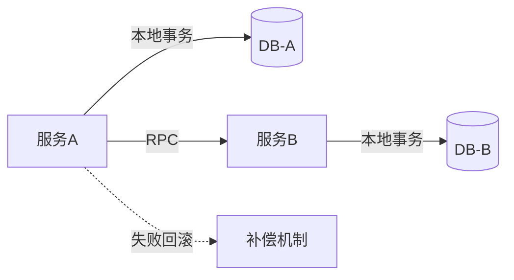
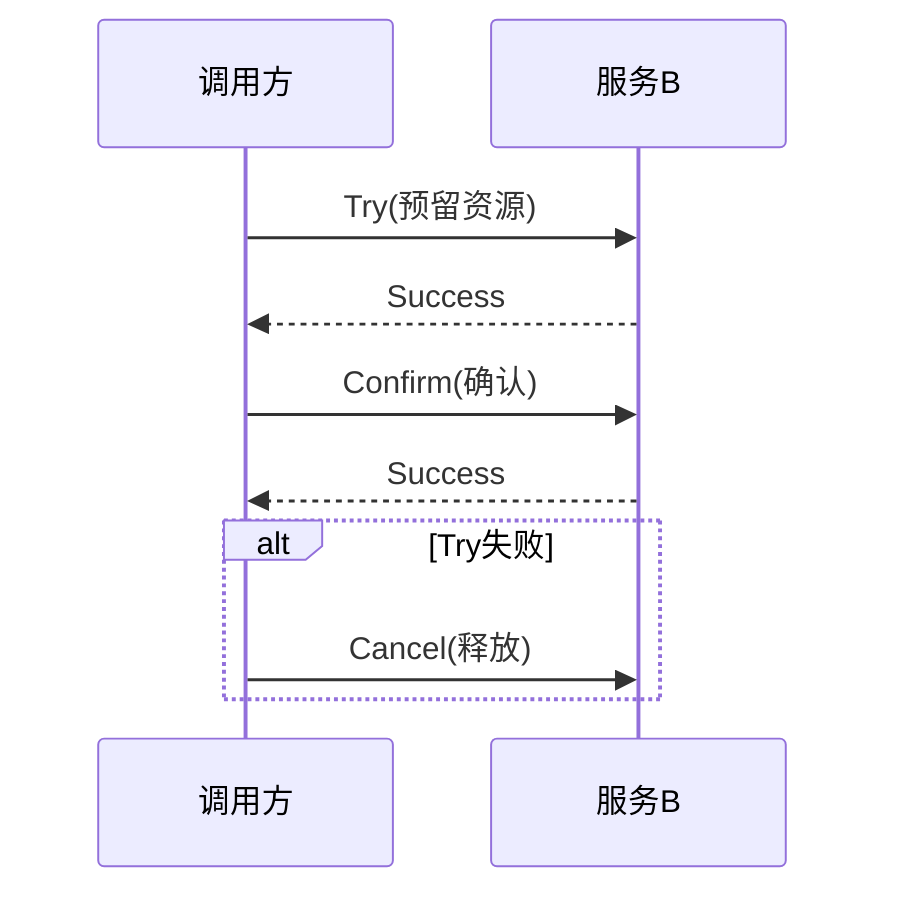
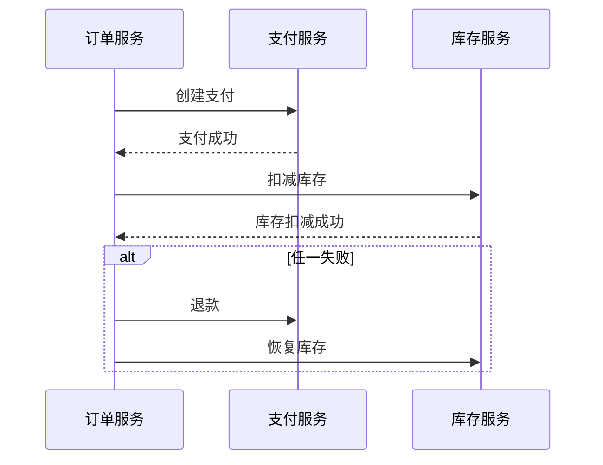
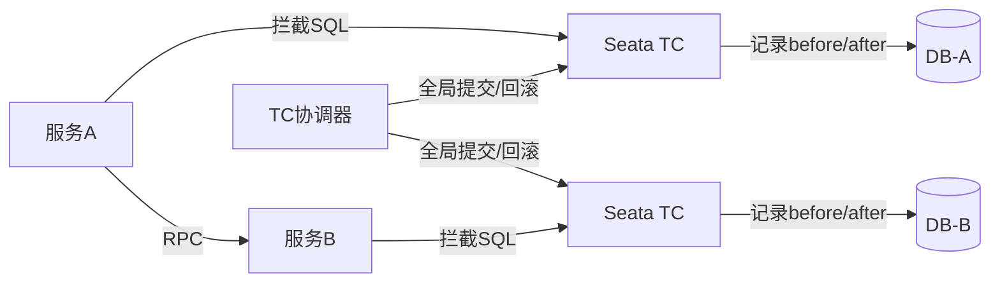
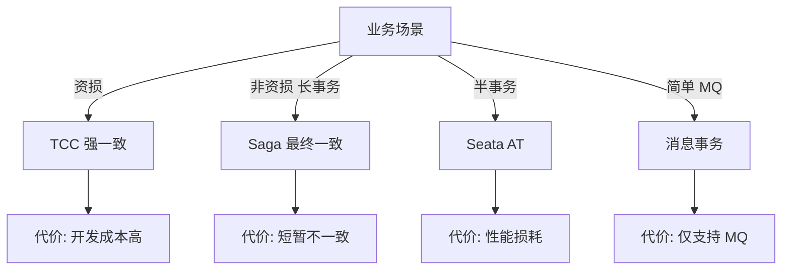

# 微服务拆分中的分布式事务与数据一致性

## 一句话摘要

分布式事务是拆分后的最大挑战。本篇从 TCC/Saga/Seata 三种方案对比，讲透不同场景下的一致性保障策略。

## 分布式事务的本质

单体：本地事务（ACID）
微服务：跨服务事务 = **网络调用 + 数据操作 + 失败处理**

## 三种方案对比

### TCC（Try-Confirm-Cancel）

- **优点**：实时性强，强一致
- **缺点**：开发成本高（每个操作三段代码）
- **适用**：资损场景（交易/扣款）

### Saga 模式

- **优点**：开发成本低，长事务友好
- **缺点**：最终一致，需要补偿机制
- **适用**：非资损场景（订单/物流）

### Seata AT 模式

- **优点**：无侵入（基于代理）
- **缺点**：性能损耗（记录回滚日志）
- **适用**：半事务场景

## 一致性方案选型决策树

## 数据一致性验证方法

1. **对账机制**：定时对比两服务数据
2. **补偿机制**：失败后自动补偿
3. **人工介入**：异常数据人工处理
4. **监控告警**：一致性指标异常触发告警

## 常见反模式

1. **强一致滥用**：非资损场景用 TCC，性能崩溃
2. **忽略补偿**：Saga 没有补偿 = 数据不一致
3. **循环依赖**：A 调 B，B 调 A，事务死锁
4. **长事务嵌套**：事务跨度 > 30s，回滚代价大

## 📌 数据与事实声明

- TCC/Saga/Seata 是业界三种主流方案
- 资损场景必须强一致，非资损场景可用最终一致
