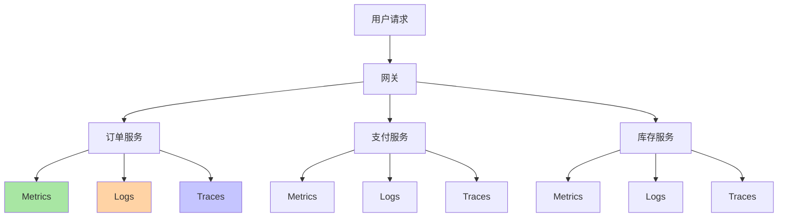
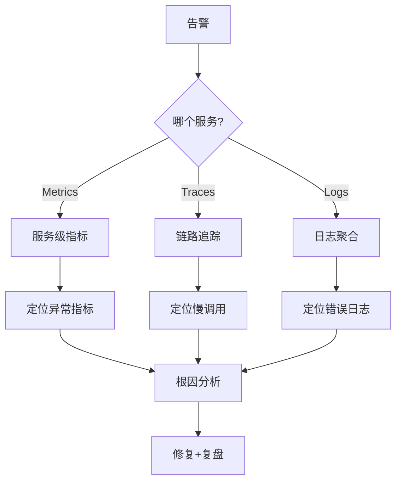

# 微服务拆分后的可观测性与故障排查

## 一句话摘要

拆分后故障排查从「查一个日志」变成「追踪跨服务链路」。本文讲透可观测性的三支柱（Metrics/Logs/Traces）在微服务中的落地方法。

## 拆分后的可观测性挑战

单体：一个日志文件，一个监控面板
微服务：N 个服务，N 个日志源，N 个监控面板

## 三支柱在微服务中的落地

### Metrics（指标）
- 服务 QPS/RT/P99
- 错误率（5xx/4xx）
- 资源使用率（CPU/内存/磁盘）
- 业务指标（订单量/支付成功率）

### Logs（日志）
- 结构化日志（JSON 格式）
- TraceID 贯穿全链路
- 日志聚合（ELK/ Loki）
- 日志级别：ERROR > WARN > INFO > DEBUG

### Traces（链路追踪）
- 分布式追踪（Jaeger/Zipkin/SkyWalking）
- Span 串联跨服务调用
- 耗时定位：哪一层慢
- 故障根因：哪一步失败

## 故障排查流程

## 关键监控指标

| 指标 | 阈值 | 告警级别 |
|---|---|---|
| P99 RT | > 500ms | WARNING |
| 错误率 | > 1% | CRITICAL |
| 服务可用性 | < 99.9% | CRITICAL |
| 数据一致性延迟 | > 5s | WARNING |
| 分布式事务成功率 | < 99.9% | CRITICAL |

## 常见反模式

1. **无 TraceID**：跨服务排查靠猜
2. **日志格式不统一**：无法聚合分析
3. **指标粒度太粗**：只看平均值，忽略长尾
4. **无故障演练**：不出事不知道哪里会挂

## 📌 数据与事实声明

- 三支柱来自 Google SRE 实践
- 告警阈值需按业务量级调整
