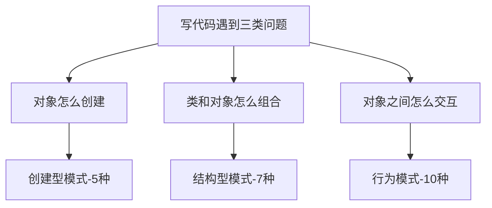
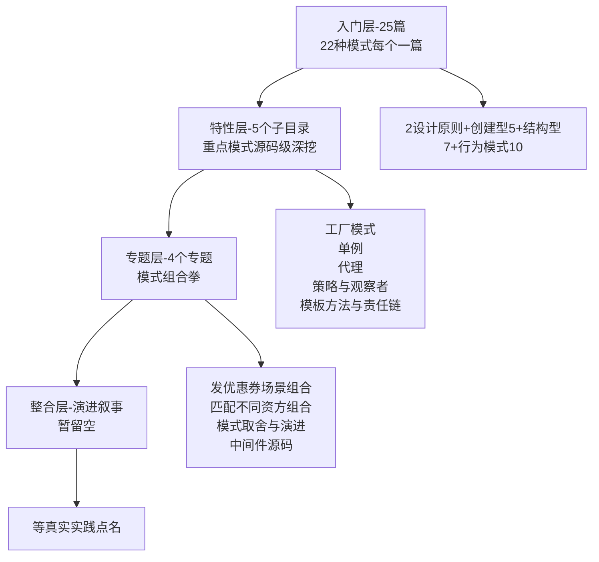

# 设计模式系列导读 · 从问题到模式

> 📖 本系列共 25 篇（0_导读 + 2 设计原则 + 22 模式），覆盖设计模式整个知识面：SOLID 原则、创建型 5 种、结构型 7 种、行为模式 10 种。
> 本篇是第 0 篇导读：先建立「从问题到模式」的心智模型，再决定读哪条路。

## 一、为什么需要这套系列

设计模式是面向对象开发绕不开的「经验总结」：写对象怎么创建、类怎么组合、对象怎么交互，前人已经踩过坑、沉淀成 22 种可复用的经典方案。但学设计模式常见两种极端：

- **死记模式定义**：背下了 22 种模式的类图和定义，但遇到真实业务还是不知道「该用哪个」，背了一堆用不上
- **只会 if-else 硬写**：没学过模式，业务逻辑全堆在 if-else 里，越写越难维护，遇到需求变更就重构

这套系列的设计思路：**先建立「从问题到模式」的映射，再逐个拆解**。主线是「写代码遇到什么问题 → 该用哪类模式」，支线是 22 种模式各自解决的具体场景。先会「识别场景」，再会「用对模式」，最后会「组合多个模式」解决真实业务。

## 二、全局心智模型：从问题到模式

识别场景的三步：

1. **先问问题类型**：这是「创建对象」的问题（怎么 new、怎么复用实例）？还是「组合类和对象」的问题（接口不兼容、结构太复杂）？还是「对象交互」的问题（谁通知谁、行为怎么切换）？
2. **再找对应分类**：创建型管「怎么造」，结构型管「怎么搭」，行为模式管「怎么协作」
3. **最后选具体模式**：同一分类里有多个模式，按场景细节取舍（比如创建对象——是「一族相关对象」用抽象工厂，「分步构建」用生成器，「全局唯一」用单例）

> tips：(知识地图) 这套「问题 → 分类 → 模式」的三步是整套设计模式知识的主干：22 种模式全部是「三类问题」的具体解法。「创建/结构/行为」三大分类就是 22 种模式的骨架。

## 三、系列导航表（25 篇）

| 序号 | 篇目 | 深度 | 一句话定位 | 对标参考 |
|---|---|---|---|---|
| 0 | 系列导读 | 全景 | 从问题到模式的心智模型 + 阅读路径 | - |
| 1 | SOLID 五原则 | 入门 | 单一职责/开闭/里氏替换/接口隔离/依赖倒置 | refactoring.guru |
| 2 | 七大设计原则 | 入门 | 开闭/依赖倒置/迪米特/合成复用等 | 大话设计模式 |
| 3 | 工厂方法 | 入门 | 子类决定创建哪个类 | refactoring.guru |
| 4 | 抽象工厂 | 入门 | 创建一族相关对象 | refactoring.guru |
| 5 | 生成器 Builder | 入门 | 分步构建复杂对象 | refactoring.guru |
| 6 | 原型 Prototype | 入门 | 克隆已有对象（深/浅拷贝） | refactoring.guru |
| 7 | 单例 Singleton | 入门 | 全局唯一实例 | refactoring.guru |
| 8 | 适配器 Adapter | 入门 | 兼容不兼容的接口 | refactoring.guru |
| 9 | 桥接 Bridge | 入门 | 抽象与实现分离 | refactoring.guru |
| 10 | 组合 Composite | 入门 | 树形结构统一处理 | refactoring.guru |
| 11 | 装饰 Decorator | 入门 | 动态增强对象 | refactoring.guru |
| 12 | 外观 Facade | 入门 | 简化复杂子系统 | refactoring.guru |
| 13 | 享元 Flyweight | 入门 | 共享大量细粒度对象 | refactoring.guru |
| 14 | 代理 Proxy | 入门 | 控制访问（延迟/权限/缓存） | refactoring.guru |
| 15 | 责任链 Chain of Responsibility | 入门 | 请求沿链传递，各自处理 | refactoring.guru |
| 16 | 命令 Command | 入门 | 请求封装为对象 | refactoring.guru |
| 17 | 迭代器 Iterator | 入门 | 顺序遍历集合（不暴露内部） | refactoring.guru |
| 18 | 中介者 Mediator | 入门 | 集中协调对象交互 | refactoring.guru |
| 19 | 备忘录 Memento | 入门 | 保存/恢复对象状态 | refactoring.guru |
| 20 | 观察者 Observer | 入门 | 状态变化通知订阅者 | refactoring.guru |
| 21 | 状态 State | 入门 | 状态驱动行为切换 | refactoring.guru |
| 22 | 策略 Strategy | 入门 | 算法族可互换 | refactoring.guru |
| 23 | 模板方法 Template Method | 入门 | 骨架固定，步骤可变 | refactoring.guru |
| 24 | 访问者 Visitor | 入门 | 操作与结构分离 | refactoring.guru |

## 四、从点到面：四层进阶路径

入门层 25 篇把 22 种模式铺全之后，真正的深度在后面三层——这也是本系列「从点到面」的设计：

| 层级 | 定位 | 规模 | 适合 |
|---|---|---|---|
| 入门层 | 点：每个模式一篇，建立完整认知 | 25 篇 | 所有读者必读 |
| 特性层 | 点 × 深：重点模式拆开源码级挖透 | 5 个子目录 × 2-4 篇 | 按兴趣挑重点 |
| 专题层 | 面：多模式组合成真实业务解法 | 4 个专题 | 解决实际问题 |
| 整合层 | 体系：整个知识体系收束 | 暂留空 | 等实践点名 |

## 五、入门读者最容易踩的 3 个认知误区

### 误区 1：以为设计模式是「银弹」

很多教程把设计模式捧成「万能解药」，容易让人以为「用了模式代码就好」。实际上设计模式是**经验的总结，不是规则的强制**——它解决的是「特定场景的特定问题」，用错场景、过度设计反而让代码更复杂。核心是「识别场景后按需选用」，不是「为了用模式而用模式」。

### 误区 2：以为记住定义就会用

「背下 22 种模式的定义和类图」不等于「会用」。设计模式的难点在**识别场景**——同一个问题，可能多个模式都能解（比如「对象创建」就有工厂/生成器/原型多个选择），要能判断「这个场景到底用哪个最合适」。系列正文会反复强调「何时用、何时不用、和相似模式的区别」。

### 误区 3：以为模式 = 继承 + 类图

「设计模式就是各种继承关系」是常见误解。现代设计更强调**「组合优于继承」**——很多模式（策略、装饰、观察者）核心是用「接口 + 组合」实现的，继承只是手段之一。GoF 原著的核心观点之一就是「优先使用对象组合，而不是类继承」。理解这点，才不会把模式写成僵硬的继承树。

> tips：(三点区分) 设计模式是「按场景选」不是「银弹必用」；难点是「识别场景」不是「背定义」；核心是「组合优于继承」不是「继承堆类图」。这三个误区是新手最容易栽的，正文里每个都对应多篇讲透。

## 六、怎么读这套系列

- **零基础/刚入行**：从 0 按顺序读到 24，每天 2-3 篇，两周建立完整模式认知
- **有 1-3 年经验**：先读 1-2 设计原则，再重点读 3 工厂、7 单例、14 代理、22 策略、20 观察者、23 模板方法（工作里最常用的 6 个），然后进特性层看源码级实现
- **准备实战/重构**：直接进专题层（发优惠券/匹配不同资方的模式组合 + 中间件源码），用真实业务场景把多个模式串起来

---

下一篇将讲 **1_SOLID 五原则**：五个设计原则怎么指导「写好的面向对象代码」——待正文落盘后补链接。
