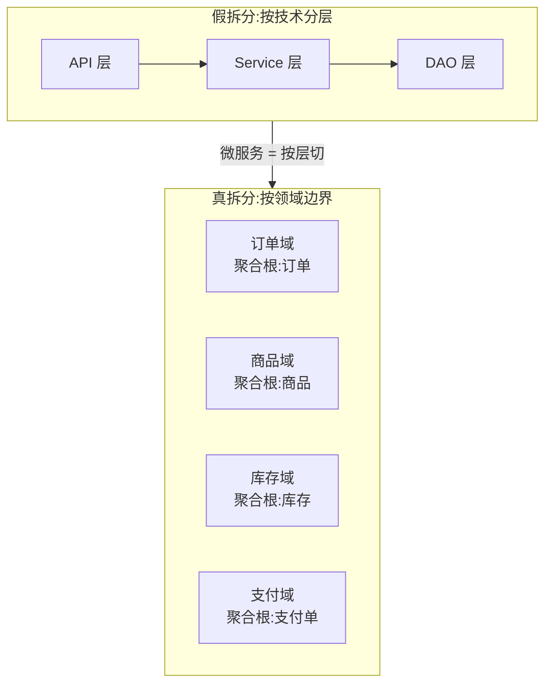
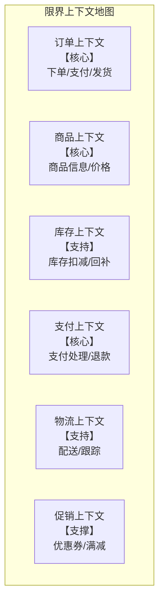
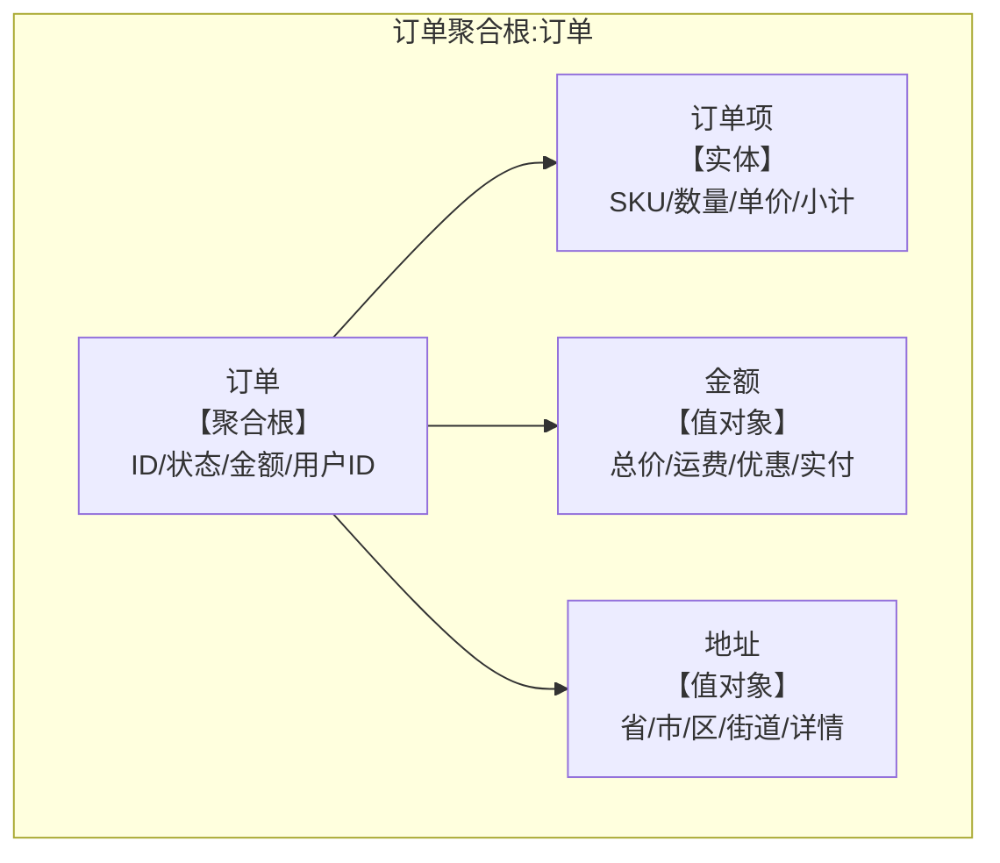
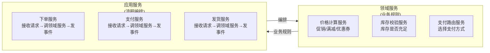
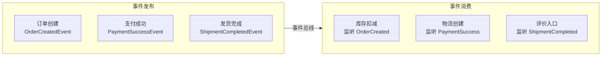
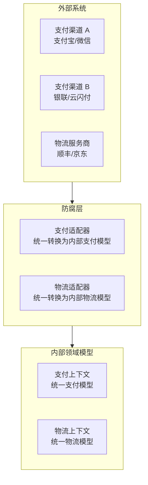
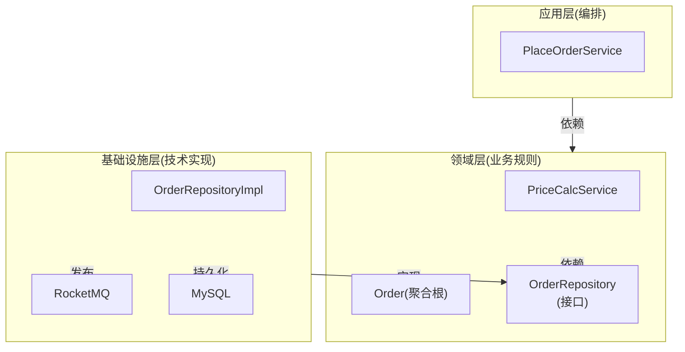
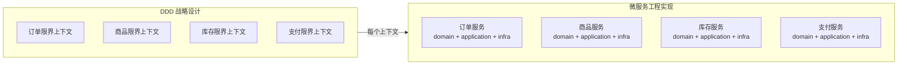

---
title: "DDD 实战：领域驱动设计的工程化落地"
type: overview
tags: [DDD, 领域驱动, 聚合根, 限界上下文, 电商订单]
date: 2026-09-18
wordCount: 4374
readMinutes: 14
---\n
# DDD 实战：领域驱动设计的工程化落地

> DDD 不是画 UML 图，是**把业务语言翻译成代码结构**——限界上下文划分边界，聚合根守护一致性，领域服务封装业务规则。本篇以电商订单系统为场景，把 DDD 的核心机制讲透。

## 一句话摘要

DDD = **战略设计（划边界）+ 战术设计（建模型）+ 工程落地（代码实现）**。战略定边界，战术定模型，工程定实现。三层缺一不可。

## 二、为什么需要 DDD

### 2.1 微服务的"假拆分"陷阱



**假拆分的症状**：
- 每个服务里都有 "Service" 层，结构一样
- 跨服务调用 = 跨层调用，只是换了个名字
- 数据一致性靠分布式事务，维护成本指数增长
- 同一个聚合根被拆到两个服务，更新要协调

**真拆分的标志**：
- 每个服务有独立的领域模型，代码结构反映业务语义
- 聚合根在自己的服务内，外部只通过 ID 引用
- 跨服务交互 = 领域事件，不是直接调用

### 2.2 DDD 的核心问题

| 问题 | 传统做法 | DDD 做法 |
|------|----------|----------|
| 业务逻辑在哪？ | Service 层（贫血模型） | 领域层（充血模型） |
| 数据怎么传？ | DTO 到处传 | 聚合根 + 值对象 |
| 边界在哪？ | 按技术层切 | 按限界上下文切 |
| 一致性怎么保证？ | 分布式事务 | 聚合内强一致 + 事件最终一致 |

## 三、战略设计：划边界

### 3.1 限界上下文（Bounded Context）

**定义**：一个明确的边界，边界内模型一致，边界外不关心。



**划分原则**：

1. **通用语言**：上下文内术语一致，上下文间术语可以不同
   - 订单语境："商品" = SKU 编号 + 数量 + 单价
   - 商品语境："商品" = 名称 + 描述 + 分类 + 图片
   - 库存语境："商品" = 仓储单位 + 库位 + 可用数量

2. **显式边界**：上下文之间必须有明确的接口
   - 订单 → 库存：下单时查询库存
   - 订单 → 支付：下单后创建支付单
   - 支付 → 订单：支付成功后更新订单状态

3. **独立演进**：一个上下文的模型变更，不影响其他上下文
   - 订单增加"预售"字段 → 只改订单上下文
   - 商品增加"直播价" → 只改商品上下文

### 3.2 上下文映射

| 映射关系 | 含义 | 电商案例 |
|----------|------|----------|
| **上游/下游** | 一个提供数据，一个消费 | 商品 → 订单（商品信息是订单输入） |
| **防腐层（ACL）** | 隔离外部模型变化 | 支付适配器：屏蔽不同支付渠道差异 |
| **共享内核** | 共享的核心模型 | 用户 ID / 商品 ID（所有上下文共享） |
| **遵从者** | 跟随上游模型 | 物流上下文跟随订单上下文的订单状态 |
| **Conformist** | 自己的模型独立 | 促销上下文的优惠规则独立于其他 |

## 四、战术设计：建模型

### 4.1 聚合根（Aggregate Root）

**定义**：聚合的入口，外部只能通过聚合根访问聚合内的实体。



**聚合根的设计原则**：

1. **一生命周期一聚合根**：一个业务概念，一个聚合根
   - 订单 → 订单聚合根
   - 商品 → 商品聚合根
   - 库存 → 库存聚合根
   - 支付单 → 支付聚合根

2. **外部只引用聚合根 ID**：不直接引用聚合内的实体
   - ❌ 支付服务直接修改订单的 `status`
   - ✅ 支付服务调用订单服务：`订单服务.更新支付状态(订单ID, 支付状态)`

3. **聚合内强一致，聚合间最终一致**：
   - 订单 + 订单项 → 同聚合，强一致
   - 订单 → 支付 → 物流 → 不同聚合，最终一致（靠事件）

### 4.2 实体 vs 值对象

| 维度 | 实体（Entity） | 值对象（Value Object） |
|------|----------------|------------------------|
| 标识 | 有唯一 ID | 无 ID，靠值判定相等 |
| 可变性 | 可变 | 不可变 |
| 生命周期 | 独立生命周期 | 从属生命周期 |
| 电商案例 | 订单项（有行号） | 金额（总价/运费/优惠） |
| 替换条件 | 业务状态变更 | 值变了就新建 |

**值对象的设计意义**：
- 不可变 → 线程安全，无并发问题
- 无 ID → 不被外部引用，聚合根独占
- 相等靠值 → `new 金额(100, "CNY") == new 金额(100, "CNY")` → true

### 4.3 领域服务 vs 应用服务



**区分标准**：
- **领域服务**：封装业务规则，不感知外部（HTTP/DB/MQ）
  - `价格计算服务.计算(商品列表, 优惠券)` → 返回最终价格
  - `库存校验服务.校验(商品ID, 数量)` → 返回是否充足
- **应用服务**：编排领域服务，管理事务/消息/日志
  - `下单服务.下单(请求)` → 调用价格计算 → 校验库存 → 创建订单 → 发事件

**DDD 的常见错误**：
- ❌ 领域服务变成"业务逻辑的 Service 层"——还是贫血模型
- ❌ 应用服务里写业务判断——应该是领域服务的职责
- ✅ 应用服务只编排，领域服务只判断

### 4.5 Repository 模式
```
订单（聚合根）
├── 订单ID（标识）
├── 用户ID（关联）
├── 订单项列表（实体集合）
│   ├── 行号
│   ├── SKU ID
│   ├── 商品名称
│   ├── 数量
│   ├── 单价
│   └── 小计
├── 金额（值对象）
│   ├── 商品总价
│   ├── 运费
│   ├── 优惠金额
│   └── 实付金额
├── 收货地址（值对象）
│   ├── 省/市/区
│   └── 详细地址
├── 状态：待付款/已付款/已发货/已完成/已取消
└── 支付方式：支付宝/微信/银行卡
```

**关键约束**：
- 订单状态的变更必须通过聚合根方法：`订单.付款()` → 内部校验 `状态 == 待付款`
- 外部服务不能直接修改 `状态` —— 必须走聚合根的方法
- 订单项是订单聚合内的实体，生命周期从属订单

**商品聚合根**：
```
商品（聚合根）
├── 商品ID（标识）
├── 名称
├── 描述
├── 分类
├── 价格（值对象：金额+币种）
├── 库存数量（引用库存上下文，不直接持有）
├── 图片列表
├── 规格属性（值对象集合）
└── 状态：上架/下架/售罄
```

### 4.5 Repository 模式

**定义**：聚合根的持久化接口，领域层不关心数据怎么存。

```java
// 领域层定义接口
public interface OrderRepository {
    void save(Order aggregate);  // 保存聚合根
    Order findById(OrderId id);  // 按 ID 查找
    boolean existsByUserIdAndStatus(UserId userId, OrderStatus status); // 查重
}

// 基础设施层实现
@Repository
public class OrderRepositoryImpl implements OrderRepository {
    @Override
    public void save(Order aggregate) {
        // 1. 持久化聚合根本身
        orderMapper.update(aggregate);
        // 2. 持久化聚合内的实体
        itemMapper.batchSave(aggregate.getItems());
        // 3. 持久化值对象（嵌入字段或单独表）
        // 4. 发领域事件
        eventPublisher.publish(new OrderCreatedEvent(aggregate.getId()));
    }
}
```

**Repository 的设计纪律**：
- 接口在领域层定义，实现在基础设施层
- 返回聚合根对象，不是 DO（Data Object）
- 持久化整个聚合，不是单个实体
- 聚合根保存后，自动发领域事件

### 4.6 聚合根拆分规则

**什么时候该拆分聚合根**：

| 信号 | 说明 | 处理 |
|------|------|------|
| 聚合太大 | 一个聚合包含 10+ 实体 | 拆分为多个聚合根 |
| 修改频率不同 | 订单项改频率 ≠ 订单改频率 | 拆分为独立聚合 |
| 并发冲突多 | 多人同时改同一聚合 | 缩小聚合边界 |
| 生命周期不同 | 商品上下架 ≠ 订单状态变更 | 拆分为独立聚合 |

**拆分原则**：
- 聚合根之间只通过 ID 引用，不直接持有对象
- 跨聚合的一致性靠最终一致（事件）
- 拆分后每个聚合根独立持久化

**电商案例**：
- 订单聚合根 + 订单项 → 合并（生命周期一致，修改频率一致）
- 商品聚合根 + 库存聚合根 → 拆分（商品改价格不触发库存扣减）
- 订单聚合根 + 支付聚合根 → 拆分（支付失败不影响订单存在）

### 4.7 充血模型 vs 贫血模型

| 维度 | 贫血模型 | 充血模型 |
|------|----------|----------|
| 业务逻辑位置 | Service 层 | 领域对象内部 |
| 领域对象 | 只有 getter/setter | 有行为方法 |
| 依赖方向 | Service 依赖 DO | DO 依赖 Service 接口 |
| 可测试性 | 难测试（需 Mock Service） | 易测试（直接调用领域方法） |
| 电商案例 | `OrderService.付款(订单ID)` | `订单.付款()` |
| 电商案例 | `OrderService.取消(订单ID)` | `订单.取消()` |

**充血模型的优势**：
- 业务逻辑内聚，修改不扩散
- 聚合根守卫不变量（`付款()` 内部校验状态）
- 符合面向对象设计原则

**充血模型的代价**：
- 领域对象变复杂，依赖注入难
- 单元测试需要模拟领域方法
- 团队需要更强的 DDD 能力

**选择原则**：
- 简单业务 → 贫血模型够用
- 复杂业务规则 → 充血模型必选
- 金融/电商核心链路 → 充血模型

### 4.8 领域事件（Domain Event）

**定义**：领域中发生的重要业务事件，被后续流程监听。



**领域事件的设计原则**：

1. **事件命名用过去式**：`OrderCreated` 不是 `CreateOrder`
2. **事件携带必要数据**：事件包含后续处理所需的最小数据集
3. **事件消费者幂等**：同一个事件处理多次结果一致
4. **事件最终一致**：事件发布后，消费者可能延迟处理

**电商案例**：

```java
// 领域事件定义
public class OrderCreatedEvent {
    private OrderId orderId;
    private List<OrderItem> items;
    private Money totalAmount;
    private Instant createdAt;
}

// 事件发布（事务后发）
eventPublisher.publish(new OrderCreatedEvent(order));

// 事件消费者
@EventListener
public void handleOrderCreated(OrderCreatedEvent event) {
    // 1. 扣减库存
    inventoryService.deduct(event.getItems());
    // 2. 创建支付单
    paymentService.create(event.getOrderId(), event.getTotalAmount());
}
```

**事件溯源的适用场景**：
- 需要审计追踪（金融/合规）
- 需要重放事件重建状态
- 事件本身是业务数据（如计费事件）

**事件溯源 vs 事件驱动**：
- 事件驱动：事件触发后续动作，不存储事件
- 事件溯源：事件作为数据持久化，可重放重建状态
- 电商一般用事件驱动，金融用事件溯源

### 4.9 防腐层（Anti-Corruption Layer）

**定义**：隔离外部模型变化，保护内部领域模型。



**防腐层的设计纪律**：
- 外部模型变化 → 只改适配器，不改内部模型
- 适配器返回内部领域对象，不是外部 DTO
- 适配器处理协议转换、数据映射、错误翻译

### 4.10 工厂模式（Factory）

**定义**：封装复杂对象的创建逻辑，隐藏实现细节。

```java
// 工厂类
public class OrderFactory {
    public static Order create(CreateOrderRequest request) {
        Order order = new Order();
        order.setOrderId(IdGenerator.next());
        order.setUserId(request.getUserId());
        order.setStatus(OrderStatus.PENDING);
        order.setItems(request.getItems().stream()
            .map(item -> new OrderItem(item.getSkuId(), item.getQty(), item.getPrice()))
            .collect(Collectors.toList()));
        order.setAmount(calcAmount(request.getItems()));
        order.setAddress(request.getAddress());
        return order;
    }
}
```

**工厂的适用场景**：
- 创建逻辑复杂（需要计算、校验、生成 ID）
- 需要隐藏实现细节（外部只传请求，内部组装实体）
- 需要统一创建入口（所有订单都走工厂，便于审计）

## 五、工程落地

### 5.1 代码结构

```
order-system/
├── domain/                    # 领域层
│   ├── model/                 # 聚合根/实体/值对象
│   │   ├── Order.java        # 订单聚合根
│   │   ├── OrderItem.java    # 订单项实体
│   │   └── Money.java        # 金额值对象
│   ├── service/               # 领域服务
│   │   └── PriceCalcService.java
│   └── repository/            # Repository 接口
│       └── OrderRepository.java
├── application/               # 应用层
│   ├── service/               # 应用服务
│   │   └── PlaceOrderService.java
│   └── event/                 # 事件监听
│       └── OrderCreatedListener.java
└── infrastructure/            # 基础设施层
    ├── repository/            # Repository 实现
    │   └── OrderRepositoryImpl.java
    ├── mapper/                # MyBatis Mapper
    └── event/                 # 事件发布
        └── RocketMQPublisher.java
```

### 5.2 依赖方向（依赖倒置）



**核心纪律**：领域层不依赖基础设施层。基础设施层实现领域层定义的接口。

### 5.3 事务边界

| 操作 | 事务边界 | 理由 |
|------|----------|------|
| 下单 | 应用层事务 | 编排多个领域服务 |
| 库存扣减 | 领域服务内 | 聚合根内强一致 |
| 发领域事件 | 事务后发 | 先持久化，再发事件（避免事件先于数据） |
| 跨聚合更新 | 最终一致 | 靠事件补偿+对账 |

### 5.4 DDD 在微服务中的定位



**一个上下文 = 一个微服务 = 一个聚合根体系**。上下文之间不共享数据库，通过 API/事件通信。

## 六、常见陷阱

| 陷阱 | 表现 | 怎么识别 |
|------|------|----------|
| **贫血模型** | 领域对象只有 getter/setter，业务逻辑在 Service | 领域对象没有方法 |
| **聚合太大** | 一个聚合包含几十个实体 | 保存一个聚合要更新多张表 |
| **聚合间直接引用** | 支付服务直接持有订单聚合根对象 | 跨聚合调用方法，不是 ID |
| **Repository 返回 DO** | 应用层拿到 MyBatis DO 对象 | 领域层依赖了 infrastructure |
| **领域事件发太重** | 每个字段变更都发事件 | 事件消费者处理不过来 |
| **上下文边界模糊** | 订单和商品用同一套模型 | 两个上下文的"商品"含义不同 |

## 七、核心带走

- **战略设计**：限界上下文划边界，通用语言保一致
- **战术设计**：聚合根守一致性，实体有身份，值对象不可变
- **工程落地**：领域层定义接口，基础设施层实现，依赖倒置
- **事务纪律**：聚合内强一致，聚合间最终一致，事务后发事件
- **微服务映射**：一个上下文 = 一个服务 = 一个聚合根体系
- **高级主题**：领域事件驱动异步流程，事件溯源审计追踪，防腐层隔离外部变化，工厂封装创建逻辑
- **设计决策**：聚合根拆分看生命周期/频率/并发，充血模型适合复杂业务

## 📌 数据与事实声明

- 写于 2026-09-18，DDD 理论参考 Eric Evans《Domain-Driven Design》+ Vaughn Vernon《Implementing DDD》
- 电商订单场景为行业通用示例，非特定公司/系统实现
- 工程实践基于行业惯例，具体实现需按业务调整

## 📚 参考资料

- Eric Evans《Domain-Driven Design》
- Vaughn Vernon《Implementing Domain-Driven Design》
- 《实现 Domain-Driven Design》Vaughn Vernon（中译本）