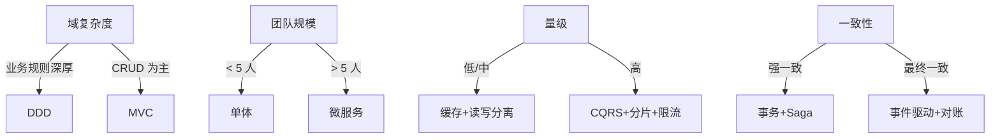
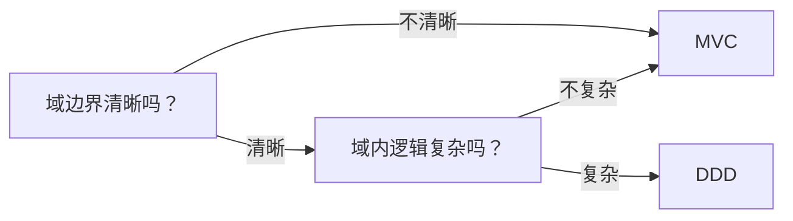

# 架构模式选型决策框架

> 面试高频题："请设计一个 XX 系统，你会选什么架构？为什么？" 考察的不是背模式，而是**决策框架**——在域复杂度、团队规模、量级、一致性四个维度上权衡。

> **本文核心**：架构模式选型没有银弹，只有"适配度"。四维度诊断 → 模式匹配 → 反模式排查，形成可复用的决策路径。

## 一句话摘要

架构模式选型 = 域复杂度 × 团队规模 × 量级 × 一致性要求。四维度各有权重：域复杂度决定模式深度（是否需要 DDD），团队规模决定服务粒度（单体 vs 微服务），量级决定扩展手段（缓存/CQRS/分片），一致性决定事务模型（强一致 vs 最终一致）。**选错模式比不选更危险**——错误的 DDD 建模比贫血模型更伤人，过度微服务比单体更难维护。

## 🎯 本文核心（机制坐标）

四个维度如何映射到架构模式：



## 一、域复杂度：业务规则的深度

域复杂度是选型的第一维度。它决定了模式选 MVC 还是 DDD。

### 1.1 域清晰 vs 域模糊

| 信号 | 域清晰 | 域模糊 |
|------|--------|--------|
| 需求变化频率 | 域内稳定，跨域常变 | 跨域频繁联动 |
| 通用语言 | 业务方能用统一术语描述 | 术语混乱，同一概念多种说法 |
| 团队结构 | 按域组织团队 | 跨域协作频繁 |
| 数据模型 | 域内自洽，跨域通过 ID 关联 | 数据高度耦合，一改全动 |

### 1.2 MVC 适用场景

MVC 适合**域边界不清晰**或**域内逻辑简单**的场景：

- 传统 CRUD 应用：增删改查为主，业务规则不复杂
- 管理后台/运营系统：数据展示为主，逻辑集中在 Service 层
- 初创期产品：域边界未稳，需要快速迭代

MVC 的本质是**关注点分离**：Model（数据）→ View（展示）→ Controller（编排）。它不解决域内业务逻辑的复杂性，只解决"代码怎么组织"。

### 1.3 DDD 适用场景

DDD 适合**域边界清晰且业务规则深厚**的场景：

- 金融/风控/计费：规则复杂、状态机多、一致性强
- 电商核心链路：订单/库存/支付有明确的域边界
- 多渠道接入：每个渠道的域模型不同，需要统一抽象

DDD 的核心是**战略设计**（限界上下文划边界）+ **战术设计**（聚合根守一致性）。它比 MVC 多一层抽象：不是"代码怎么组织"，而是"业务怎么划分"。

### 1.4 选型判据



**一句话判据**：如果业务方能用统一术语描述"订单是什么、订单能做什么"，域就清晰；如果描述不清、同一概念多种说法，域就模糊——先用 MVC 理清边界，再逐步演进。

## 二、团队规模：服务粒度

团队规模决定拆分还是不拆。

### 2.1 单体 vs 微服务

| 维度 | 单体 | 微服务 |
|------|------|--------|
| 团队规模 | < 5 人 | > 5 人 |
| 部署频率 | 低（周/月） | 高（天/小时） |
| 独立扩容 | 不行 | 可以按服务扩容 |
| 技术栈 | 统一 | 可以异构 |
| 分布式事务 | 无 | 需要 Saga/事件 |
| 运维成本 | 低 | 高（监控/链路/配置） |

### 2.2 微服务的隐藏成本

微服务不是银弹。隐藏成本包括：

1. **分布式事务**：跨服务的数据一致性需要 Saga/事件溯源，实现复杂度高
2. **运维成本**：监控、链路追踪、配置中心、服务发现——每多一个服务就多一份运维负担
3. **调试成本**：一个问题跨 5 个服务，排查难度指数上升
4. **网络延迟**：服务间通信引入额外延迟，高频调用场景需要仔细设计

### 2.3 选型判据

**3 条规则**：

1. 团队 < 5 人 → 单体（协作成本最低）
2. 域边界清晰 + 团队 > 5 人 → 微服务（独立部署/独立扩容）
3. 域边界不清晰 → 先单体，按域拆分（演进式架构）

**反模式**：3 人团队拆 20 个服务——分布式事务把你折磨死。**面试官爱问这个坑**。

## 三、量级：扩展手段

量级决定缓存、CQRS、分片、限流等手段的引入时机。

### 3.1 三档量级

| 档级 | QPS | 核心问题 | 引入手段 |
|------|-----|----------|----------|
| 十万级 | < 10K | 可用性 | 缓存 + 读写分离 |
| 百万级 | 10K-100K | 扩展性 | CQRS + 分片 + 限流 |
| 千万级 | > 100K | 高可用 | 多活 + 降级 + 熔断 |

### 3.2 缓存的适用边界

缓存不是越多越好。引入缓存的前提：

- 读多写少（读:写 > 3:1）
- 数据一致性要求不高（最终一致可接受）
- 热点数据集中（20% 数据被 80% 请求命中）

**缓存的坑**：
- 缓存与数据库双写不一致 → 缓存失效策略 + 对账
- 缓存雪崩 → 随机 TTL + 熔断
- 缓存穿透 → 布隆过滤器 + 空值缓存

### 3.3 CQRS 的适用边界

CQRS（命令查询职责分离）适合读模型和写模型差异大的场景：

- 写模型：事务性强，需要强一致
- 读模型：可冗余，可缓存，可预计算

**CQRS 的代价**：同一数据两份模型，维护成本高。简单系统不要用。

## 四、一致性：事务模型

一致性要求决定事务模型。

### 4.1 强一致 vs 最终一致

| 维度 | 强一致 | 最终一致 |
|------|--------|----------|
| 场景 | 金融/交易/计费 | 社交/内容/推荐 |
| 实现 | 数据库事务/2PC/Saga | 事件驱动/对账/补偿 |
| 代价 | 吞吐低、延迟高 | 逻辑复杂、需要补偿 |
| 面试高频 | "资金安全怎么保证" | "订单状态怎么同步" |

### 4.2 Saga 模式

Saga 是微服务架构下最常用的一致性方案：

```
订单服务 → 扣库存 → 支付服务 → 通知服务
   ↑_________________________________↓
            补偿事务（回滚）
```

**Saga 的两种实现**：
1. **编排式**：中央协调器指挥每个服务，逻辑集中但协调器是单点
2. **事件式**：每个服务发布事件，下一个服务监听执行，去中心化但链路难追踪

### 4.3 事件驱动的适用边界

事件驱动适合**异步解耦**的场景：

- 订单创建 → 扣库存 → 发物流（异步通知）
- 支付成功 → 更新账务 → 通知用户（解耦核心链路和通知）

**事件驱动的坑**：
- 事件顺序难保证 → 需要事件序号 + 重放
- 事件重复消费 → 消费者必须幂等
- 事件丢失 → 需要持久化 + 重试

## 五、综合决策矩阵

| 场景 | 域复杂度 | 团队规模 | 量级 | 一致性 | 推荐架构 | 理由 |
|------|----------|----------|------|--------|----------|------|
| 初创 MVP | 低 | < 5 | < 1K | 最终一致 | 单体 + MVC | 快速迭代，域边界未稳 |
| 电商核心链路 | 高 | > 10 | 10K-100K | 强一致 | DDD + 微服务 + Saga | 域边界清晰，资金安全 |
| 内容社区 | 低 | 5-10 | 100K+ | 最终一致 | 微服务 + CQRS + 缓存 | 读多写少，缓存优化 |
| 金融风控 | 极高 | > 10 | 10K | 强一致 | DDD + 事件溯源 + Saga | 审计追踪，强一致 |
| 多渠道支付 | 高 | > 10 | 100K+ | 强一致 | DDD + 微服务 + 事件驱动 | 多渠道隔离，资金安全 |

## 六、常见反模式（面试官最爱问）

| 反模式 | 表现 | 怎么识别 | 怎么修 |
|--------|------|----------|--------|
| **为微服务而微服务** | 3 人团队拆 20 个服务 | 分布式事务频繁 | 合并服务，回退单体 |
| **DDD 滥用** | CRUD 系统搞聚合根 | 领域对象只有 getter/setter | 退化回 MVC |
| **事件溯源滥用** | 审计需求用事件溯源 | 查询场景没做 CQRS 分离 | 加 CQRS 或放弃事件溯源 |
| **缓存一致性** | 分布式缓存 + 数据库双写 | 没处理失效/回滚 | 加缓存失效策略 + 对账 |
| **贫血模型** | 领域对象只有 getter/setter | 业务逻辑在 Service 层 | 迁回充血模型 |
| **聚合太大** | 一个聚合包含几十个实体 | 保存一个聚合要更新多张表 | 拆分聚合根 |

## 七、追问链（面试深挖点）

1. **为什么选这个模式？** → 回答四维度诊断过程，不是"我熟悉"
2. **这个模式有什么坑？** → 反模式表里的内容，提前准备 2-3 个
3. **如果量级涨 10 倍，架构怎么变？** → 展示演进思维（单体 → 拆分 → CQRS → 多活）
4. **团队小了/大了怎么调整？** → 架构是演进式的，不是一选定终身
5. **数据一致性怎么保证？** → 强一致/最终一致 + Saga + 对账

## 八、设计思想：架构决策的本质

架构模式选型的本质是**权衡（Trade-off）**：

- **MVC vs DDD**：简单 vs 深度
- **单体 vs 微服务**：协作效率 vs 独立部署
- **强一致 vs 最终一致**：正确性 vs 可用性
- **缓存 vs 实时**：性能 vs 一致性

**没有完美的架构，只有适配当前约束的架构。** 约束变了，架构也要变。演进式架构的核心是"可演进"——今天选的单体，明天可以拆成微服务；今天选的 MVC，明天可以加 DDD。架构决策不是一选定终身，而是**在当前约束下做出最优选择，并保留演进空间**。

## 九、不同量级的思考

- **十万级 QPS / 小团队**：约束来源是交付速度——单体 + MVC，域边界稳了再拆。这一档的核心问题是"要不要过度设计"，触发升级信号是"部署频率跟不上需求"
- **百万级 QPS / 多团队**：约束来源是团队边界——微服务 + DDD，防腐层隔离外部变化。这一档的核心问题是"服务怎么划"，触发升级信号是"跨团队改同一服务"
- **千万级 QPS / 平台化**：约束来源是开放治理——多活 + 降级 + 熔断 + CQRS。这一档的核心问题是"高可用怎么保"，触发升级信号是"单服务故障影响全链路"

**自下而上与触发升级**：先跑通单体，量级上来了再拆。触发升级的信号是"部署频率跟不上需求"、"单服务故障影响全链路"、"团队协作成本超过技术收益"。

## 十、参数级配置清单（ADR-0012）

|| 配置项 | 默认值参考 | 分档推荐 | 为什么 |
||---|---|---|---|
|| 缓存TTL | 300s | 十万级:600s / 百万级:300s / 千万级:60s | 越短一致性越强，越长性能越好 |
|| Saga 超时 | 30s | 十万级:60s / 百万级:30s / 千万级:10s | 超时越短回滚越快，但误判率高 |
|| 事件重试 | 3次指数退避 | 十万级:3次 / 百万级:5次 + 死信队列 / 千万级:10次 + 幂等 + 监控 | 重试越多越可靠，但延迟越高 |

## 十一、步骤级操作（ADR-0012）

1. **前置（架构诊断）**：列出系统的四维度特征（域复杂度 / 团队规模 / 量级 / 一致性），标注当前档位
2. **选型**：按决策矩阵查表，选出推荐架构模式
3. **验证**：跑通核心链路，验证模式是否解决当前问题
4. **回退**：架构选型的回退路径——单体→微服务可回退，DDD→MVC 可退化

## 十二、行业惯例

- 团队惯例：架构评审必须过四维度诊断，缺一不可
- 平台化惯例：扩展点目录维护在架构文档，防腐层隔离外部变化
- 代码评审惯例的收敛口令："这个决策归哪层"——一句话完成架构视角的快速审计

## 你们可能会问

**Q1：MVC 和 DDD 可以共存吗？**
可以。MVC 负责表现层，DDD 负责域内逻辑。表现层简单用 MVC，域内复杂用 DDD，两者不冲突。

**Q2：微服务一定要用 DDD 吗？**
不一定。微服务是部署架构，DDD 是设计方法。微服务可以不含 DDD（按技术分层拆），DDD 也可以不拆成微服务（一个上下文一个单体）。

**Q3：选型决策后还能改吗？**
可以。架构是演进式的——单体可拆微服务，MVC 可加 DDD。关键是保留演进空间，不要一选定终身。

## 💡 实战提示

- 💡 架构选型不是一选定终身——约束变了，架构也要变
- 💡 域清晰度是选 MVC vs DDD 的第一判据，先理清边界再选模式
- 💡 微服务的隐藏成本是分布式事务和运维复杂度，3 人团队慎拆
- 💡 缓存不是越多越好——读:写 > 3:1 才值得引入
- 💡 事件驱动的消费者必须幂等，否则重复消费会出事故
- 💡 反模式比选错模式更危险——先排除反模式，再谈选型

## 📌 数据与事实声明

- 写于 2026-09-18，DDD 理论参考 Eric Evans《Domain-Driven Design》+ Vaughn Vernon《Implementing DDD》
- 架构模式选型是行业通用框架，非特定公司/系统实现
- 量级档位的 QPS 范围是行业经验，非精确分界线
- 事故叙事为业内高频反模式的匿名化叙事

## 📚 参考资料

- Eric Evans《Domain-Driven Design》
- Vaughn Vernon《Implementing Domain-Driven Design》
- Martin Fowler《Microservices: A Definition of This New Term》
- Sam Newman《Building Microservices》
- 《实现 Domain-Driven Design》Vaughn Vernon（中译本）