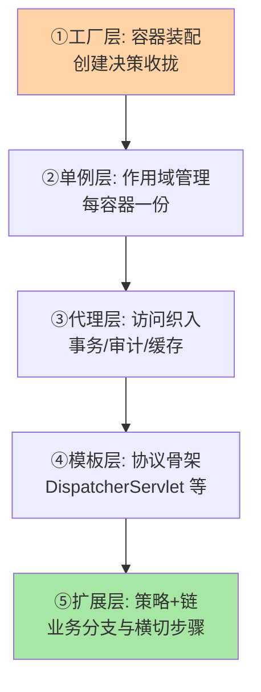
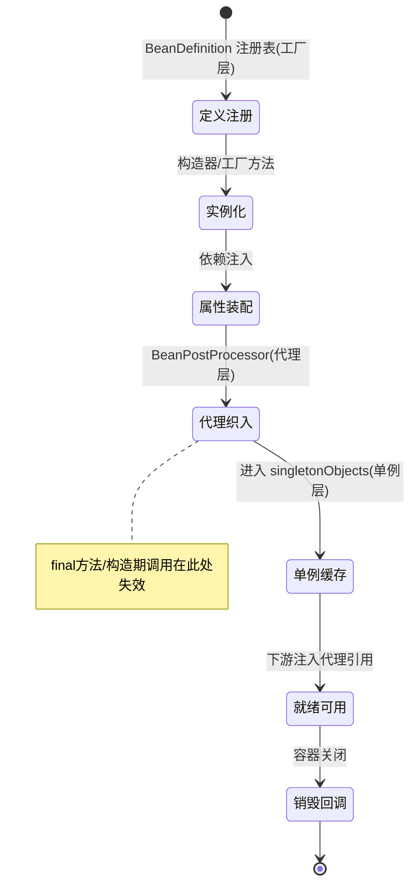
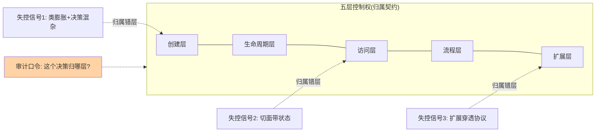
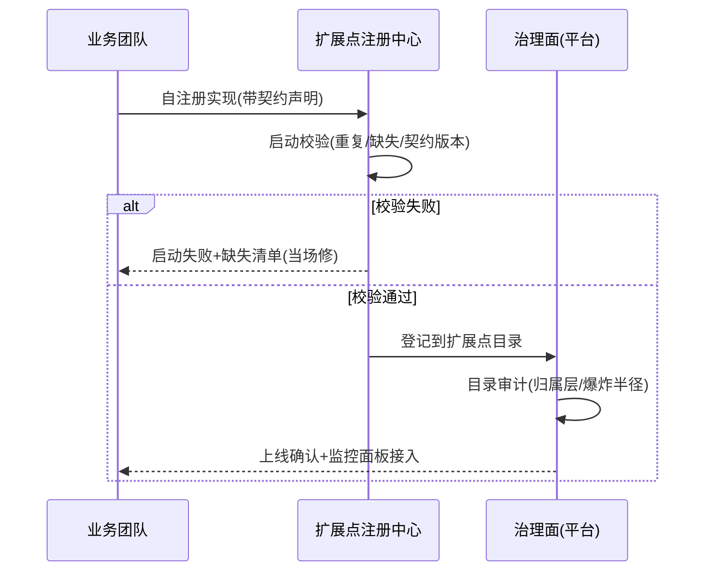
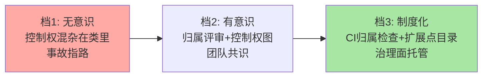

# 模式实战组合：跨系列的模式如何协同与互相制衡

> 单个模式的知识在特性层已经讲透，真实系统里模式从来不是单打独斗——一个 Spring Bean 的创建背后是工厂，装配背后是单例作用域，调用背后是代理，流程背后是模板与链。本篇把五个系列的模式放进同一张图：它们如何协同、如何互相制衡、组合失控长什么样。**整合层的价值不在多讲几个模式，在讲清模式之间的关系。**

> **本文核心**：模式组合的本质是**控制权的分工与制衡**——工厂控制「创建」，单例控制「生命周期」，代理控制「访问」，模板控制「流程」，链与策略控制「扩展」。任何一层控制权膨胀都会挤压其他层（工厂塞业务 → 装配层变厚；代理带逻辑 → 调用链失控），组合设计的核心纪律是**每层只握自己的控制权**。识别模式组合问题的透镜只有一个：这个决策的归属层对不对。

## 一句话摘要

模式组合视角下，一次典型的 Spring 服务调用穿越全部五层控制权：容器（工厂思想）按单例作用域创建 Bean（单例），创建后由自动代理织入增强（代理），调用方注入接口引用调用（依赖倒置），方法内部按策略路由业务分支（策略），框架层用模板方法固化协议、责任链开放扩展（模板+链）。组合的价值在分工明确——每层「谁说了算」不重叠；组合的失控也在分工混乱——创建层塞业务逻辑、访问层夹带状态、扩展层决定流程。本篇给出组合协作图、三个失控模式案例与「决策归属」审计清单。

## 🎯 本文核心（机制坐标）

一次服务调用的五层控制权穿越：



## 一、组合协作图：五层控制权的分工契约

| 层 | 模式载体 | 控制权 | 不该管的事 |
|---|---|---|---|
| 创建 | 工厂/容器 | 实例怎么造、依赖从哪来 | 业务分支（渠道选择是策略的事） |
| 生命周期 | 单例作用域 | 实例的唯一性与存活范围 | 线程安全的具体实现（那是类内部的事） |
| 访问 | 代理 | 调用前后插手什么 | 业务逻辑（增强只做横切关注点） |
| 流程 | 模板方法 | 步骤顺序协议 | 步骤的具体实现（子类/回调的事） |
| 扩展 | 策略+责任链 | 可变的实现与可插拔的步骤 | 流程顺序的重定义（那是模板的事） |

这张表的读法是纵向审计：**任何一个设计决策，先问它属于哪一层的控制权**——「新渠道的费率计算放哪」属于扩展层（策略实现内），「渠道实现怎么创建」属于创建层，「渠道接口的调用日志」属于访问层。放错层的决策就是失控的种子。

Bean 从定义到销毁的组合机制状态：



## 二、组合形态一：工厂 × 单例 × 代理（Spring Bean 全生命周期）

Spring 容器是三模式组合的工业级样本：BeanDefinition 注册表（工厂思想）→ singleton 作用域缓存（DefaultSingletonBeanRegistry）→ BeanPostProcessor 自动代理（CGLIB/JDK 代理替换原始引用）。三层的协作契约：工厂只按定义创建与装配；单例层只管缓存与作用域；代理层只管增强替换——**三层彼此不感知业务**，业务变化只影响配置与切点表达式。

组合的精妙处在代理与单例的交互：代理实例替代原始实例进入单例缓存，下游注入的都是代理——单例的唯一性由缓存保证，代理的增强由后处理器保证，**两层机制互不侵入却组合出「唯一且增强」的 Bean**。理解这个组合，就能解释「为什么 @Transactional Bean 不能 final」（代理需要子类化）、「为什么构造器里调 @Transactional 方法无效」（代理未成型）——组合机制解释了单模式视角看不清的行为。

五层控制权与失控信号的治理视图：



## 三、组合形态二：模板 × 策略 × 责任链（框架扩展点的分层）

框架的扩展体系是三模式的分层协作：模板方法钉住协议（DispatcherServlet 主流程）→ 责任链开放横切扩展（Interceptor 链）→ 策略开放点状替换（HandlerAdapter/ViewResolver 可换实现）。三层的扩展自由度递增：模板层零自由（协议）、链层顺序自由（可插拔）、策略层实现自由（可替换）——**扩展点分层让「想改什么」决定「用什么扩展机制」**：改顺序去链配置，换实现去策略注册，改协议（升级框架）才动模板层。

失控形态是扩展层僭越：拦截器里重定向流程（链层干了模板层的事）、策略实现里改变调用顺序（实现层夹带协议）——短期都能跑，长期让「协议在模板层」的架构假设失效。审计口径：扩展代码里出现 `return` 中断主流程之外的流程控制（跳转、循环调用其他扩展点），即越层信号。

切面状态的错误与正确写法对照：

```java
// ✗ 错误: 切面单例上的可变状态——并发事故源
@Aspect @Component
public class CacheAspect {
    private final AtomicInteger counter = new AtomicInteger(); // 单例共享状态!
    public Object around(ProceedingJoinPoint pjp) {
        if (counter.incrementAndGet() > THRESHOLD) return fallback(); // 全局计数错乱
        return pjp.proceed();
    }
}

// ✓ 正确: 状态按归属显式设计——请求级状态进上下文
@Aspect @Component
public class CacheAspect {
    public Object around(ProceedingJoinPoint pjp) {
        RequestContext ctx = RequestContextHolder.current();  // 请求级状态归请求上下文
        return ctx.cached(pjp) ? ctx.cachedValue() : pjp.proceed();
    }
}
```

跨团队扩展点的注册与治理流程：



## 四、事故叙事三则（组合失控的真实形态）

**叙事一：创建层塞业务，渠道工厂变成业务分支库。**某支付网关的工厂类三年膨胀到两千行：装配分支之外长满了费率计算、限额校验、渠道路由——创建层的类成了业务的第二实现地，渠道实现类反而「空壳化」。任何渠道改动都在工厂里找逻辑，新人只在实现类里看（看不到费率），改出账事故。重构按「决策归属」拆：费率归策略实现、路由归策略注册表、工厂回归纯装配两千行变三百行。复盘沉淀：**类的大小不是问题，决策归属错层才是**——审计时看「这个类里的每个方法属于哪层控制权」。

**叙事二：代理层夹带状态，缓存增强变成数据错乱。**某团队用 AOP 给服务方法加「结果缓存」，切面内维护了请求计数器做「缓存穿透保护」——多个方法共享同一切面实例（单例），计数器成为全局可变状态，压测下计数错乱触发误熔断。修复：计数器状态移出切面（本地 ThreadLocal 或独立组件），切面回归无状态。复盘沉淀：**切面无状态是代理层的第一纪律**——增强需要状态时，状态的归属（请求级/方法级/全局级）必须显式设计，不能顺手放切面字段。

**叙事三：模板层被扩展穿透，升级框架全量回归。**某系统深度依赖框架内部行为：拦截器里按 Handler 执行顺序做假设、策略实现里反射调框架 protected 方法——扩展层把模板层的「协议」当成了「实现细节」依赖。框架升级（顺序调整、方法重命名）后全量故障，回归成本波及全系统。复盘沉淀：**扩展层只依赖契约不依赖实现**——契约 = 公共 API + 文档声明；反射触达框架内部的那一刻，就把自己的系统焊死在了那个框架版本上。

## 五、追问链：把「模式组合」问穿一层

- **追问一：五层控制权的划分依据是什么，为什么不是四层或六层？**——划分依据是「变更的驱动源」：实例怎么造随依赖变（创建）、实例存多久随部署变（生命周期）、调用前后随横切需求变（访问）、步骤顺序随协议变（流程）、业务实现随需求变（扩展）——五个变更源彼此独立，才有五层控制权。**层数由变更源的独立性决定**：两个「层」总是一起变，就该合并；一个层里有两个变更源，就该拆分。
- **再追问：模式组合会不会过度设计？怎么判断组合过头了？**——判断信号是「层的存在不服务于任何变更源」：没有第二个实现却留着策略注册表、没有横切诉求却先织代理——空转的层只贡献间接性。组合的正当性由真实变更驱动（Rule of Three 的架构版：第三个变更需求出现才引入对应模式层）。
- **打破砂锅：模式学多了会不会看什么都是模式（锤子效应）？**——会，且 antidote 就是本篇的「控制权归属」透镜：模式不是要套的目标，控制权归属是分析工具——先答「这个决策归哪层」，工具选型（用不用模式、用哪个）是答案的下游。**从模式出发是倒因为果，从控制权出发才是正途**；模式词汇的价值是让「归属分析」的沟通有公共语言。实际操作里还有一个反锤子效应的检查动作：每次决定「用某个模式」后，强制自己写下「不用它会怎样」的一段——写得出真实代价（变更范围、事故形态）才允许引入，写不出就说明这个模式在当前场景没有敌人，引入它只是在跟风。

## 六、反方案分析：反模式的组合形态

- **God Object 与组合失序**：一个类同时承担创建（内部 new 全部依赖）、生命周期（静态单例）、流程（大方法串全部步骤）——五层控制权挤进一个类，任何变更都动它、任何测试都绕不开它。它是「模式组合」的反面教材：**不是模式用多了失控，是控制权从未分层失控**——引模式不会救它，拆控制权才会
- **「为了模式而模式」的连锁抽象**：一个简单功能被套上工厂 + 策略 + 模板三层（每层只有一个实现），调用链三跳才能到业务——这是把「组合」当「先进」的反模式。判定：每层的变更驱动源是否存在，不存在就删除该层
- **切面滥用（AOP 化的业务逻辑）**：业务规则（如风控判断）藏进切面——切面的定位是「横切关注点」（日志/事务/缓存），业务规则进切面 = 逻辑从类型系统里消失（调用方看不到、IDE 追不到），可读性灾难。边界：增强必须是「去掉也不影响业务正确性」的关注点

## 七、设计思想：组合的架构观——控制权经济学

五个系列的模式讲到底都在回答同一个问题：**某类决策的控制权归谁、边界在哪、谁来制衡**。工厂经济学（创建决策集中收拢换取改动范围小）、单例经济学（唯一性保证换取可测性代价）、代理经济学（无侵入增强换取失效边界）、模板与链的经济学（协议强一致换取扩展刚性 / 扩展自由换取治理成本）——**每个模式是一张控制权交易合约，组合设计就是合约组合管理**。这套架构观的价值：面对新场景不再问「该用什么模式」，而问「这类决策的合约该怎么签」——模式词汇是合约的模板库，控制权分析是签约的谈判过程。把这套架构观落进团队，最小闭环只有两个动作：评审时问「决策归哪层」，架构文档里维护一张五层归属表——从这两个动作长出去，比任何一次性的「模式培训」都更接近真实的组合治理。

## 八、不同量级的思考：模式组合的规模分寸

- **十万级 QPS / 小团队**：约束来源是可读性与交付速度——容器管理（工厂+单例自动获得）+ 少量策略，模板与链交给框架。这一档的核心问题是「层是否服务于真实变更」，警惕投机性模式层
- **百万级 QPS / 多团队**：约束来源是团队边界——扩展层升格为契约（SPI/自动装配，跨团队按契约协作），代理链与切面收敛到平台模块统一治理。这一档的核心问题是「契约的物理归属」，各团队自注册、聚合层零硬编码
- **千万级 QPS / 平台化**：约束来源是开放性治理——扩展点对外开放（插件机制），控制权分层成为治理结构：平台握协议层（模板）、业务握实现层（策略）、治理面握链编排。这一档的核心问题是「开放的控制权如何不被滥用」，解法是插件契约、沙箱与审计

**自下而上与触发升级**：先盘点现有代码的决策归属（每层厚度），薄层不加厚；触发升级的信号是「跨团队改同一层」「扩展点被绕行」「协议被反射依赖」——组合的复杂度跟随组织与量级演进，模式层是治理结构不是技术装饰。

## 九、参数级配置清单（ADR-0012）

| 配置项 | 默认值参考 | 分档推荐 | 为什么 |
|---|---|---|---|
| 切面状态 | 强制无状态 | 请求级状态用 ThreadLocal 且 finally remove | 切面单例的可变状态是并发事故源 |
| 扩展层数 | 真实变更驱动，无投机层 | 平台化前做「层审计」 | 空转层只贡献间接性 |
| 切面与业务边界 | 切面禁业务规则 | 风控/计费类判断必须在策略实现内 | 切面逻辑对 IDE 与调用方不可见 |
| 链长度上限 | 单链 ≤10 节点 | 网关类分层后每组 ≤5 | 链长即排查与延迟成本 |
| 反射触框架内部 | 禁止 | 升级隔离模块内豁免 | 内部依赖焊死框架版本 |
| 工厂类规模 | 单一装配职责 | >500 行即审计决策归属 | 膨胀工厂 = 决策错层的信号 |

## 十、步骤级操作（ADR-0012）

1. **前置（组合审计）**：选一个核心链路，画出五层控制权图（每层列出实际类），标注「每层的变更频率」
2. **诊断**：对每层问三问——变更驱动源存在吗？决策归属对吗？有没有空转层？产出问题清单
3. **重构**：按「最小移动」原则逐项修（决策移到归属层），每移动一批跑全量回归 + 压测对比
4. **验证**：重构后重画五层图对比（层厚与变更频率的相关性应增强——越常变的层越厚越靠外）
5. **回退**：每次移动独立提交可独立回滚；跨层大移动（如拆 God Object）走双写过渡

## 十一、业内惯例

- 团队规范惯例：「切面白名单」机制——新增切面要进架构评审（防切面滥用与状态夹带）；「扩展点目录」维护在架构文档（防扩展点绕行）
- 平台化惯例：插件契约三件套（接口 + 沙箱约束 + 版本兼容声明），控制权开放必配治理面
- 代码评审惯例的收敛口令：「决策归层了吗？」——一句话完成组合视角的快速审计

## 你们可能会问

**Q1：五层控制权和「单一职责原则」什么关系？**
单一职责说的是「类」级（一个类一个变更理由），控制权分层说的是「架构」级（一类决策一个归属层）——SRP 在类间成立而归属错乱依然可能（每个类职责单一，但决策放错了层）。两者是同一思想在不同粒度的表达，组合审计用架构粒度。

**Q2：模式组合的知识会不会随框架演进失效？**
具体模式形态会变（注解替代 XML、函数替代模板类），控制权归属的问题永久存在——容器更替后「创建归容器」的归属不变。**学组合观比学模式清单保值**，这也是本篇以「控制权」为主线的原因。

**Q3：遗留系统没有这些层，从哪开始治理？**
从「事故最多且变更最频繁」的那层开始（通常是扩展层或创建层错层），按事故驱动逐层治理——组合审计不需要一次做全，控制权归属的错误会用事故指路。

## 十二、什么时候用 / 不用

- ✅ 用组合视角：架构评审（决策归属审计）、模式选型犹豫时（先归属后选型）、跨团队扩展点设计（契约与治理面）
- ✅ 治理信号：同类事故重复出现（归属错层的典型症状）
- ❌ 不用：小工具与原型——控制权在脑子里清晰即可，图形化分层是团队协作的产物
- ❌ 不用：为分层而分层——层的正当性永远由变更驱动源决定

## 开放问题

- 控制权分层的自动化审计：AST/字节码分析能否自动判定「决策归属层」（如识别工厂类里的业务分支、切面里的可变状态），把人工评审升级为 CI 检查——静态分析对「归属」语义的识别率是关键瓶颈
- 函数式与响应式范式下「层」的形态变化：组合函数替代模式类之后，控制权归属的分析对象从类迁移到函数与管道，「层」的物理载体在变、归属问题不变——审计工具与教学话术需要跟随迁移
- AI 生成代码的归属审查：生成代码天然「能跑就行」，控制权错层的概率高于人写——评审重点从「写对了吗」转向「放对了吗」，组合视角的审查价值在上升

组合设计的三档成熟度路径：



## Trade-off：结构清晰与间接成本的交换

控制权分层让每个决策有唯一归属（清晰），代价是间接层（决策要穿过层才能到达实现）——间接成本包括阅读跳转、调试链长、新人心智。**分层的正确密度由变更频率与团队规模决定**：单人项目控制权在心里分层，百人平台控制权必须在架构里分层。这个 Trade-off 没有绝对答案，但有绝对纪律：**间接层的每一跳都必须能回答「这一跳服务于哪个变更源」**——答不出来的跳，就是该删的层。

## 跨周期视角：五年后模式组合的形态

三条演进线值得跟踪：①语言与框架吸收模式（函数式组合替代部分模板/策略、容器注解替代手工装配），「显式模式」的存量收缩，「归属问题」的存量不变——抽象层级上移，控制权问题下移到新载体；②平台工程把扩展层治理产品化（插件市场、扩展点注册中心），「控制权分层」从架构文档变成平台功能；③AI 辅助编码可能弱化模式书写的记忆价值，强化「归属判断」的价值——代码可以生成，决策归属的判断是审查者的核心工作。**模式的「形」会过时，控制权的「神」长期有效**——这是整合层押注的长期价值。

## 💡 实战提示

- 💡 审计口令一句话：「这个决策归哪层？」——评审时对可疑代码常问
- 💡 切面无状态是铁律，状态归属显式设计（请求级/方法级/全局级）
- 💡 扩展层禁反射触框架内部——契约依赖，不依赖实现
- 💡 每个间接层必须能回答「服务于哪个变更源」——答不出的层是删除候选
- 💡 治理从事故最多的层开始——归属错层会用事故指路

### 五层控制权的快速面试指南（教别人的压缩包）

把本篇压缩成三句可复述的话，是检验自己是否真懂的标尺：①「工厂决定你从哪来，单例决定你活多久，代理决定谁能碰你，模板决定你按什么步骤活，策略和链决定你具体怎么活」——五个模式各握一种控制权；②「组合失控只有一个形状：决策放错了层」——创建层塞业务、访问层夹状态、扩展层穿协议，都是同一根因；③「审计只要一句话：这个决策归哪层」——归属答得清，组合就是资产；答不清，模式堆得再多也是负资产。这三句话适合放进团队的新人指南——组合观的传播靠压缩包，不靠全篇背诵。

## 自测三问

1. 五层控制权各管什么？划分依据是什么？
2. 「决策归层」审计的三问是什么？空转层怎么识别？
3. 模式组合的 Trade-off 是什么？间接层的删除判据是什么？

## 🎯 核心带走

- **核心一句话**：模式组合 = 控制权的分工与制衡——工厂管创建、单例管生命周期、代理管访问、模板管流程、链与策略管扩展，归属错层即失控起点
- **协作样本**：Spring Bean 全生命周期（工厂×单例×代理）、框架扩展体系（模板×链×策略）
- **哪里会坏**：创建层塞业务、代理层夹状态、扩展层穿透协议、God Object 五层合一
- **边界**：层的正当性由变更驱动源决定；间接层答不出「服务哪个变更」即删
- **量级迁移**：十万级问真实变更、百万级问契约归属、千万级问开放治理
- **传播压缩包**：五句控制权口诀 + 一句审计口令——组合观靠压缩包传播，不靠全篇背诵

## 📌 数据与事实声明

- 写于 2026-09-15；五层控制权的划分为本篇分析框架（对 GoF 模式意图的工程归纳）；Spring 机制以官方源码与文档公开口径为准
- 事故叙事为业内高频组合失控模式的匿名化叙事，非特定公司事件
- 免责：框架行为以对应版本文档为准

## 📚 参考资料

| 类型 | 标题 | 来源 |
|---|---|---|
| 经典书 | GoF《设计模式》/《重构》（组合与间接层论述） | 公开出版 |
| 系列内 | 单例 / 代理 / 工厂 / 策略观察者 / 模板责任链 五个特性层系列 | design-patterns/特性层 |
| 官方源码 | spring-framework（容器与 AOP 的组合实现） | github.com/spring-projects/spring-framework |
| 系列导航 | 设计模式整合层目录 | 本目录 index |
