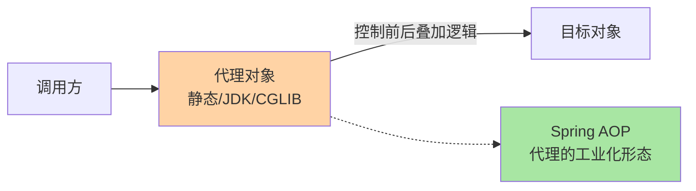
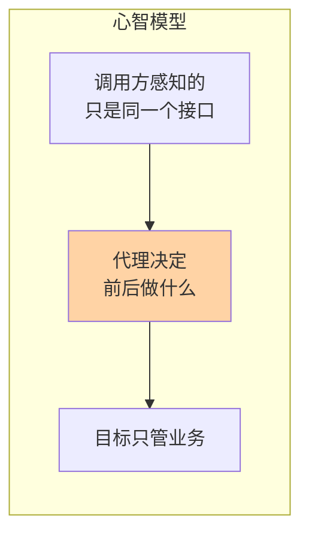
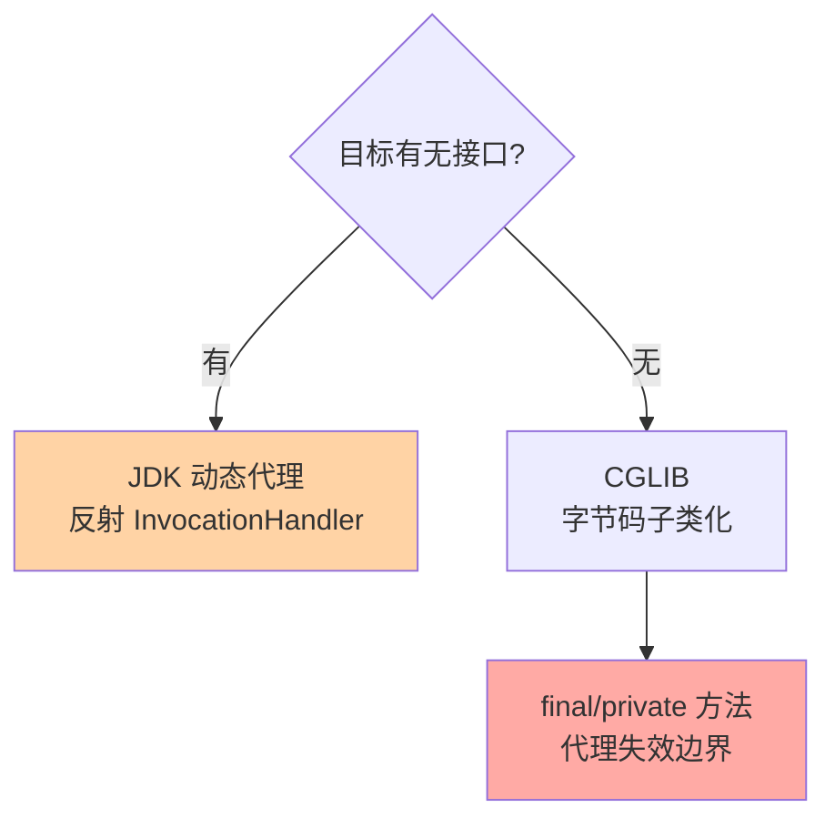

# 深入理解代理系列

> 静态代理 / JDK 动态代理 / CGLIB / Spring AOP——代理是「控制访问」的核心机制，也是 AOP 的基石。本系列把三种代理实现拆到字节码与拦截链层面，讲清「选哪个、为什么、坑在哪」。

## 这个目录讲什么

代理模式的核心：不改变原始对象的前提下，通过代理对象间接访问目标，从而叠加控制逻辑（日志、事务、缓存、权限）。本系列两篇正文从「手写代理」讲到「框架代理」：先拆 JDK 动态代理的 InvocationHandler 反射调用链，再讲 CGLIB 字节码子类化与 Spring AOP 的选型决策、失效边界。

## 这个目录下有哪些文章

| 篇目 | 类型 | 一句话重点 |
|---|---|---|
| 1_静态代理与JDK动态代理-特性 | 特性 | 三种形态的机制差异；InvocationHandler 反射调用链与性能代价 |
| 2_CGLIB与SpringAOP代理选型-特性 | 特性 | 字节码子类化 vs 接口代理；final/private 失效边界；Spring 默认策略 |
## 我能得到什么

- 说清静态代理 / JDK 动态代理 / CGLIB 三者的机制差异与选型依据
- 看懂 Spring AOP「有接口走 JDK、无接口走 CGLIB」背后的代理机制
- 掌握代理失效的经典坑（自调用、final 方法）及其排查路径

## 我想看哪一篇

- **按方向**：想懂 AOP 底座 → 按序读两篇；只解决 Spring 代理疑问 → 直接篇 2
- **按问题**：「为什么 @Transactional 没生效」→ 篇 2 失效边界节
- **按阶段**：快速回顾 → 两篇按序读，重点看追问链与选型对比

## 📌 维护说明

新增文章必须同步更新本导航表，并在「我想看哪一篇」中补充对应阅读路径。

## 选型一览与 Trade-off

代理是跨系统调用链与框架集成（事务、缓存、RPC 客户端）的默认扩展点。Trade-off 也在这：反射与字节码生成带来创建期开销，运行期每次调用多一层转发——量级到十万 QPS 以上，代理层数直接影响延迟分布，这是要实测的跨期代价。
这是代理在 AOP 架构里成为默认扩展位的原因。

## 📌 数据与事实声明

- 写于 2026-09-15（系列导读）；模式机制描述以 GoF《设计模式》与 JDK/Spring 官方文档公开口径为准
- 免责：框架行为以实际版本源码为准

## 📚 参考资料

| 类型 | 标题 | 来源 |
|---|---|---|
| 经典书 | 《设计模式：可复用面向对象软件的基础》（GoF） | 公开出版 |
| 官方文档 | Spring Framework AOP / Core | docs.spring.io |
