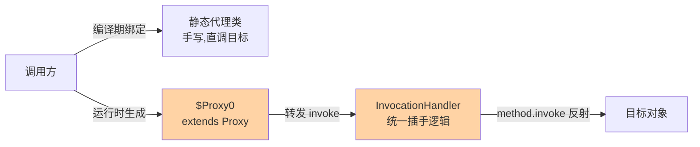
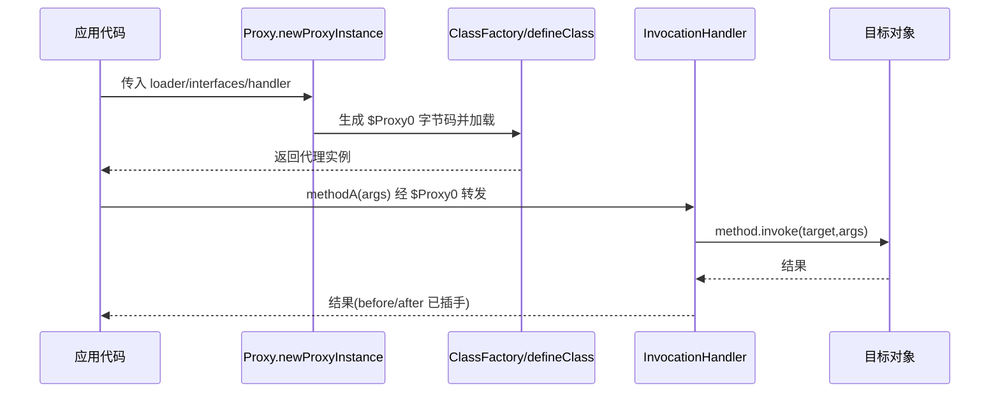
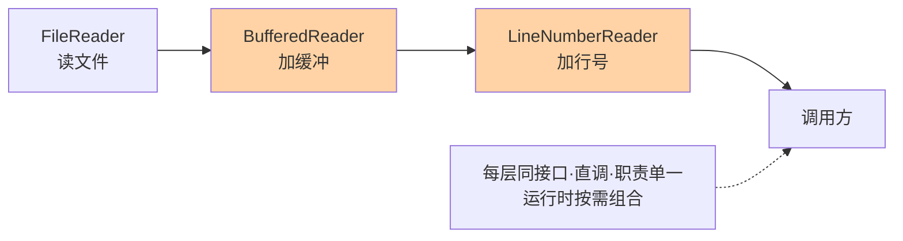

# 静态代理与 JDK 动态代理：从手写到反射调用链

> 静态代理是「为每个目标手写一个代理类」，JDK 动态代理是「运行时为接口批量生成代理类」。从前者到后者，变的不是模式思想，是代理类的**生产方式**——理解 `Proxy.newProxyInstance` 与 `InvocationHandler` 的调用链，就理解了 Spring AOP 的地基。

> **本文核心**：代理的全部价值在「方法调用的前后插手」。静态代理把插手逻辑写死在代理类里（一个目标一个类，爆炸式膨胀）；JDK 动态代理把插手逻辑收敛到一个 InvocationHandler，代理类本身由 JVM 运行时生成（`$Proxy0` extends Proxy implements 接口）——方法调用统一转发到 handler 的 invoke，反射是这条路的通行成本。

## 一句话摘要

代理模式在不改变目标类的前提下，通过代理对象在调用前后插入控制逻辑（日志、权限、缓存、远程转发）。静态代理手工编写代理类：结构清晰、零反射开销，但一个目标一个代理类，接口方法变更要同步改两处。JDK 动态代理在运行时生成代理类：`Proxy.newProxyInstance(loader, interfaces, handler)` 产出的 `$ProxyN` 继承 `java.lang.reflect.Proxy` 并实现全部接口，每个方法调用转发给 `InvocationHandler.invoke(proxy, method, args)`——一套 handler 服务所有接口，代价是反射调用（现代 JDK 已优化到接近直连的量级，业内认知）与「只能代理接口」的边界。

## 🎯 本文核心（机制坐标）



## 一、源码关键路径：动态代理类长什么样

`Proxy.newProxyInstance` 三步：①`ProxyClassFactory` 生成代理类的字节数组（类名形如 `com.sun.proxy.$Proxy0`，继承 Proxy、实现全部指定接口，每个方法体是一段固定的转发字节码：把参数打包成 Object[]，调用 `super.h.invoke(this, methodObj, args)`）；②按 loader defineClass；③用 `Proxy(InvocationHandler h)` 构造器实例化。关键结论：**代理类不含任何业务逻辑，它只是「把接口调用翻译成 handler 回调」的通用翻译器**——所有插手逻辑都在 handler 里。

invoke 内部的典型写法与坑：

```java
public Object invoke(Object proxy, Method method, Object[] args) throws Throwable {
    // 坑1: Object 自身方法会路由进来,要拦截处理
    if ("toString".equals(method.getName()) && method.getDeclaringClass() == Object.class) {
        return "proxy@" + System.identityHashCode(proxy);
    }
    before();                                    // 前置插手
    try {
        return method.invoke(target, args);      // 反射到目标
    } finally {
        after();                                 // 后置插手(finally 保证)
    }
}
```

三个高频坑：①hashCode/equals/toString 三个 Object 方法也会进 invoke，不处理会出现「代理对象放进集合表现异常」；②`method.invoke(target, args)` 对基本类型参数有装箱开销且 args 为 null 的方法要显式传 null 数组；③handler 里如果调用了 `proxy`（而不是 target）的同名方法——无限递归栈溢出，这是新手事故榜第一名。

代理类的生成与调用全流程：



## 二、两种代理的逐项对比

| 维度 | 静态代理 | JDK 动态代理 |
|---|---|---|
| 代理类来源 | 手工编写 | 运行时字节码生成 |
| 插手逻辑位置 | 每个代理类内联 | 收敛到单一 InvocationHandler |
| 接口变更 | 代理类同步改 | 无感（生成器按接口现算） |
| 调用开销 | 直调，零额外成本 | 反射转发（JDK17+ 量级已大幅收窄） |
| 代理范围 | 类与接口都行 | 仅接口（继承 Proxy 占了类位） |
| 典型场景 | 装饰器式单点增强 | 框架级批量增强（AOP、RPC 客户端桩） |

静态代理在装饰器链里的形态（JDK IO 流全家桶即此结构）：



## 三、典型使用场景

- **RPC 客户端桩**：`UserService` 接口在消费端没有实现类，动态代理把本地调用翻译成网络请求——接口即契约，代理即桩
- **声明式事务/缓存的底座**：@Transactional 的方法拦截就是 handler 里的事务模板（特性层事务代理篇互指）
- **静态代理的正当领地**：对第三方具体类（无接口）做单点增强、或装饰器链（IO 流包装）——结构明确、直调零开销
- **延迟加载**：代理持有点位引用，首次访问才初始化目标（Hibernate 懒加载的接口代理形态）

### RPC 客户端桩：代理的工业化代表作

消费端拿到 `UserService` 接口引用却本地没有实现类——这个引用就是动态代理：invoke 里做「方法签名编码 → 负载均衡选节点 → 网络请求 → 结果解码」，业务代码完全无感「这是远程调用」。这个设计的精妙处在**用接口把分布性藏起来**：调用方编程模型与本地调用一致，迁移、Mock、单测都按接口走。代价同样要认清：网络故障被包装成了「方法抛异常」，调用方容易按本地异常的心智处理远程失败（重试语义、幂等要求都变了）——所以成熟 RPC 框架的代理桩会显式抛 `RpcException` 族异常，强制调用方区分本地与远程失败。Dubbo 的 InvokerInvocationHandler 是这条路的完整实现，互指本仓库 Dubbo 系列。

## 四、误区与不适用

- ❌ **「动态代理比静态代理高级，全用它」**：代理范围只有接口；目标是无接口具体类时动态代理直接不可用——这是 CGLIB 存在的理由（下篇主题）。调用热路径上对反射开销敏感且代理关系简单的，静态代理仍是正解
- ❌ **「handler 里调 proxy 的方法没关系」**：proxy 的方法全部转发回同一个 handler——自调用即无限递归。handler 里只能调 target
- ❌ **「静态代理是过时技术」**：装饰器模式（BufferedReader 包装 FileReader）本质就是静态代理的应用形态，JDK IO 全家桶都是它——它没有过时，只是被用在「单点、明确、性能敏感」的地方
- ❌ **「代理里抛异常不用管」**：invoke 抛出的检查异常若不在接口方法签名里，代理层会包成 UndeclaredThrowableException 甩出——异常语义在代理边界上变形，要在 handler 内转换好

## 你们可能会问

**Q1：动态代理为什么只能代理接口？**
代理类要继承 Proxy 占掉唯一父类位，多接口靠 implements 叠加；类代理需要继承目标类，与继承 Proxy 冲突——类级代理只能换技术路线（CGLIB 子类化，下篇）。这是语言规则（单继承）推出来的边界，不是实现偷懒。

**Q2：反射开销到底要不要优化？**
先剖析再决策。代理层在总耗时的占比无感（多数业务如此）就不动；占比进入热路径 top 再优化——优化手段按优先级：减少代理层数 > handler 内消除逐调用大对象分配 > 换生成直调的技术（CGLIB 或编译期生成）。

**Q3：一个接口的代理可以被强制转换回目标类型吗？**
不能。`$Proxy0` 只实现接口、不继承目标类，`(Target) proxy` 直接 ClassCastException；要从代理拿目标，handler 得自己暴露引用（或用 AopContext 类机制）。类型系统上「代理实现了接口」但不「是一个目标」——多态语义别越界。

**Q4：静态代理会不会被编译期代码生成取代？**
正在融合。APT/字节码插件在编译期批量生成静态代理类，兼得「直调零开销」与「免手写」——原生镜像与构建优化场景这个形态在回潮。手写静态代理的领地收缩到「一两个方法的小增强」，批量的交给生成器。

## 五、追问链：把「反射调用」问穿一层

- **追问一：反射调用真的慢吗？慢在哪？**——慢在四件事：方法访问性检查、参数装箱与 Object[] 打包、无法内联、签名解析。但 JIT 对热点反射调用有 inflation 机制：调用次数超过阈值（默认 15）后动态生成「方法访问器」字节码，走生成类直调——**热路径的反射经过 inflation 后开销收窄到接近直调量级（业内认知，实测为准）**。「反射一定慢」的结论停在 JDK8 之前。
- **再追问：既然 JDK 生成了代理类字节码，为什么不直接在代理方法体里生成直调目标方法的代码？**——生成器看不到 target 对象的类型信息（handler 模式下 target 是 Object），直调代码无从生成；这是 handler 模式的设计代价：通用性（一套 handler 服务所有接口）换掉了直调。CGLIB 选另一条路（子类覆写、方法体内直调 + 拦截器分发）就是为拿回这部分——下篇对比。
- **打破砂锅：接口变更时代理要重新生成吗？**——代理类按「当时的接口列表」现生成，应用重启自然拿到新接口；但 handler 若按方法名白名单分发，新方法会落进 default 分支静默或抛错——**代理类自动跟接口走，handler 的分发逻辑是人工契约**，接口演进评审要覆盖它。

### 延迟加载代理的形态与代价

代理持有一个「点位」而非实例：首次方法调用时才构造目标并缓存引用。收益是「可能永远不用就不初始化」（重对象的创建成本延后甚至免除）；代价是**第一次调用的延迟毛刺**（构造耗时叠加到首个请求上）与初始化的线程安全（多线程同时首次访问，构造要并发防重——本质又是一个单例的 DCL 问题）。工程上要么预热（启动后主动触发一次初始化），要么接受毛刺但把它从关键路径上挪走。ORM 框架的懒加载实体、RPC 的延迟连接都是这个形态。

### 代理类生成时机与启动影响

JDK 动态代理类在 `newProxyInstance` 调用时生成——把生成时机堆在应用启动期（容器初始化批量创建代理），启动耗时随代理数量线性增长；每个代理类还占 Metaspace。量级视角：千级以内代理类无感；万级（动态为每个数据类型生成代理的场景）启动与元空间都要入监控。业内惯例是启动期集中生成 + 缓存复用，运行期不再新增代理类型——代理类集合固化后，链路分析才有稳定对象。

## 六、事故叙事：一次 UndeclaredThrowableException 引发的线上排查

某系统用 JDK 动态代理包装第三方 SDK 的接口做重试增强，handler 内 catch 了 SDK 的受检异常后按重试策略处理。上线后偶发「调用方收到莫名其妙的 UndeclaredThrowableException」——原接口方法签名只声明了 IOException，重试耗尽后 handler 把底层受检异常（SDK 新版加的 CustomException）原样抛出，代理层发现它不在接口签名内，包了一层 UndeclaredThrowableException。调用方按 IOException 写的 catch 全部落空。修复：handler 出口统一转换为接口声明的异常体系，超纲异常打日志后转 IOException 包装。复盘沉淀：**代理边界是异常契约的检查点，handler 的异常出口必须与接口签名对齐**——SDK 升级评审清单里要加一条「新增受检异常 → handler 出口适配」。

### 装饰器链的组合纪律

装饰器链的价值在「按需组合」，失控也在组合：层级没有上限约束时，一次 IO 操作穿十几层包装，排查时栈帧全是包装类、异常定位困难。业内收敛的纪律是：**每层只做一件事**（缓冲或行号或压缩，不混合）；**组合点集中**（工厂/Builder 统一组装，不在业务代码里随手 new 链）；**栈深有基线**（性能剖析里包装层占比异常即精简）。这与代理层的「层数治理」是同一条纪律——横切结构的层数本身就是复杂度，组合自由要靠组装纪律对冲。

### 代理与 AOP 拦截链的关系

把视野拉高：单个代理是「一个 handler 包一个目标」，框架级 AOP 是「多个通知织入一条拦截链」——`ReflectiveMethodInvocation.proceed()` 逐节点推进拦截器数组，每个通知决定「继续链 or 直接返回」。动态代理解决「代理从哪来」，拦截链解决「增强从哪来、什么顺序」——两者是地基与楼层的结构关系。理解了这个分层，看 Spring 事务、缓存、异步三类注解在同方法上叠加时的执行顺序问题（顺序由 Order 注解与拦截器注册顺序决定），就从「玄学」变成「读链」。

## 七、设计思想：为什么 JDK 选择「接口 + 反射」而不是「生成直调子类」

JDK 动态代理诞生于 JDK1.3，选择接口代理 + handler 反射，核心约束是**一个类只能有一个父类**：若代理用「继承目标类」实现，代理类就占掉了继承位，且无法同时实现「多目标复用同一个代理类」。接口代理把继承位留给用户类，代理类自己继承 Proxy——通用性最大化。代价（反射开销、仅接口）在当时可接受：代理场景的调用频率远低于业务热点路径。这个「占位取舍」也解释了后来的生态分化：需要代理类、需要直调性能的，CGLIB 子类化补位——**两种动态代理是同一个问题在不同约束下的解，不是新旧替代关系**。把这条约束放进架构评审清单：每当团队讨论「代理选型」，第一问永远是目标有无接口、第二问是调用热度——两个答案直接决定路线，与团队偏好无关。

## 八、不同量级的思考：代理的约束迁移

- **十万级 QPS 以下**：约束来源是正确性与开发效率——handler 写对（不递归、异常对齐）、逻辑清晰即可，反射开销无感。这一档的核心问题是「插手逻辑的正确性」，而不是「调用开销」
- **百万级 QPS**：约束来源是调用链放大——代理层的每次装箱、日志、上下文传递都在热路径上。这一档的核心问题是「转发开销的累积」，解法是 handler 内避免逐调用大对象分配、控制链上代理层数（多层代理叠加 = 每层一次转发）
- **千万级 QPS / 深度链路**：约束来源是可观测与治理——几十个 handler 串联后，性能剖析与故障定位需要链路标识贯穿。这一档的核心问题是「代理链的结构治理」，解法是链路分级（核心路径白名单精简代理层）+ 链路追踪上下文标准化

**自下而上与触发升级**：先用性能剖析量出代理层在热路径的耗时占比，占比无感就不动；触发升级的信号是剖析图中代理转发进入 top 占比、或异常在代理边界变形的告警——思考方式从「写对」迁到「量住」再迁到「治理」，约束来源变了，动作才变。

## 九、业内惯例与源码参照

- JDK 自身范例：`java.lang.reflect.Proxy` 文档与 `sun.misc.ProxyGenerator`（生成字节码逻辑，JDK17 后移到 `java.lang.reflect` 内部包）；RPC 框架（Dubbo 的 JavassistProxyFactory/InvokerInvocationHandler）是 handler 模式的工业级实现，互指本仓库 Dubbo 系列
- 业内惯例：handler 分发优先用「接口方法 → 处理器」的注册表结构，少用 if-else 方法名串；代理类数量在应用启动时一次性生成并缓存，运行期不再生成
- 与装饰器的边界：装饰器强调「给目标叠加职责且同接口可叠加多层」，代理强调「控制对目标的访问」——工程上两者结构相同，语义按意图分；团队规范里按「增强（decorator）/ 控制（proxy）」命名前缀区分，防止混用失控

### handler 分发结构的工程化写法

if-else 方法名串是 handler 最常见的腐化起点——方法越多链越长，加方法要改 handler 本体（违反开闭）。工程化收敛是注册表结构：启动期把「Method 对象 → 方法处理器函数」注册进 Map（方法对象作 key 天然唯一，比方法名更精确——同名不同参也不冲突）；invoke 退化成一次 Map 查找 + 函数调用。再加两层治理：注册冲突在启动期抛错（重复注册当场炸，不等到运行期）；未注册方法走显式 default 处理器并打告警（静默吞掉新方法是最难排查的「增强莫名失效」）。这套写法把 handler 从「一个长方法」变成「一组可单测的处理器集合」——handler 的可维护性与可测试性同时落地。

## 十、什么时候用 / 不用

- ✅ JDK 动态代理：接口已有、增强逻辑要批量应用到多个接口/实现（框架增强、RPC 桩、声明式事务）
- ✅ 静态代理：具体类单点增强、装饰器链、反射开销不可接受的窄热路径
- ❌ 不用：目标无接口且不引入 CGLIB 时硬上动态代理——不可用，不是不适合
- ❌ 不用：代理内塞业务逻辑——代理只做「控制/增强」这类横切关注点，业务进了 handler 就是架构污染
- ❌ 不用：多层代理叠加无治理——每层都是转发与异常变形点，链长失控先精简

## Trade-off：通用性与调用开销的交换

handler 模式用反射转发换来「一套逻辑服务全部接口」的通用性——接口越多、增强点越多，这笔交换越划算；接口单一、调用极热时，静态代理的直调优势重新成立。**通用性是运行期变现的，开销是每次调用都付的**——按增强点数量与调用热度算总账，而不是给两种代理贴「先进/过时」标签。反射在 JIT inflation 后的实际量级，永远以自己业务负载的剖析数据为准。

## 开放问题

- Project Loom 与 Valhalla（值类型）落地后，反射对值类型的装箱语义可能改变，代理转发的开销结构要重估
- 静态代理生成器（编译期 APT 生成）在原生镜像与构建优化场景回潮，「运行期生成 vs 编译期生成」成为新选型维度

## 💡 实战提示

- 💡 handler 里只能调 target，调 proxy 即无限递归——新手事故第一名
- 💡 Object 三方法（hashCode/equals/toString）会进 invoke，代理对象进集合前先处理
- 💡 handler 异常出口与接口签名对齐，超纲受检异常显式转换，防 UndeclaredThrowableException
- 💡 热路径代理层数做加法前先做减法：每层代理都是一次转发 + 一个异常变形点
- 💡 反射量级以自己负载的剖析为准——JIT inflation 之后「反射必慢」是过时结论

### 一个集成视角：代理在依赖注入容器里的装配

容器环境下代理通常不由业务代码手动 newProxyInstance，而是由容器在 Bean 生命周期里织入：BeanPostProcessor 的 postProcessAfterInitialization 阶段判断该 Bean 是否命中增强规则（切点匹配），命中则用代理替换原始引用注入给下游——调用方拿到的从来都是代理，原始对象被藏进代理内部。理解这条装配链能解开两个常见困惑：为什么「自己 new 的对象上注解不生效」（没走容器装配就没有织入机会）；为什么同一方法内自调用不走增强（self 调用拿到的是原始 this，不是容器注入的代理）。**增强的前提是「调用经过代理」**——容器负责把「经过」变成默认事实，绕过容器就绕过了增强。

## 自测三问

1. `$Proxy0` 的类结构是什么？方法调用如何流转到 InvocationHandler？
2. 反射调用的开销构成有哪些？inflation 机制做了什么？
3. 代理边界上异常契约为什么会变形？怎么防？

## 🎯 核心带走

- **核心一句话**：JDK 动态代理 = 运行时生成「接口调用 → handler 回调」的通用翻译器；静态代理 = 手写的单点直调增强——一个赢通用性，一个赢开销
- **机制链**：ProxyClassFactory 生成字节码 → defineClass → 实例化 → 方法调用打包转发 invoke → method.invoke 反射到目标
- **哪里会坏**：handler 自调 proxy 递归、Object 方法未拦截、异常超纲变形、接口演进漏掉 handler 分发
- **边界**：只能代理接口；增强进 handler，业务别进代理
- **量级迁移**：十万级问正确性、百万级问转发开销、千万级问代理链治理

## 📌 数据与事实声明

- 写于 2026-09-15；代理类生成与反射语义以 JDK 官方文档与 `java.lang.reflect.Proxy` 源码公开口径为准
- 「inflation 后接近直调量级」为业内量级认知，以自业务负载剖析实测为准
- 事故叙事为业内高频缺陷模式的匿名化叙事，非特定公司事件
- 免责：JDK 内部实现随版本演进，以对应版本文档为准

## 📚 参考资料

| 类型 | 标题 | 来源 |
|---|---|---|
| 官方文档 | java.lang.reflect.Proxy（JavaDoc 与指南） | docs.oracle.com |
| 官方源码 | jdk（sun.misc.ProxyGenerator / jdk.proxy 模块） | github.com/openjdk/jdk |
| 系列内 | 篇 2《CGLIB 与 SpringAOP 代理选型》 | 本目录 |
| 关联系列 | @Transactional 事务代理源码 | 特性层 AOP 与代理系列 |
