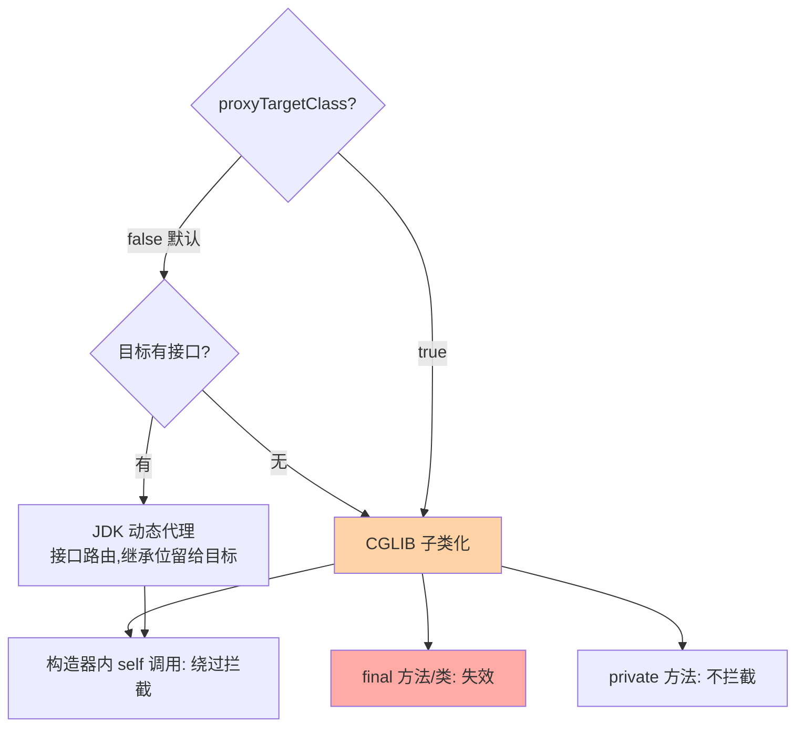
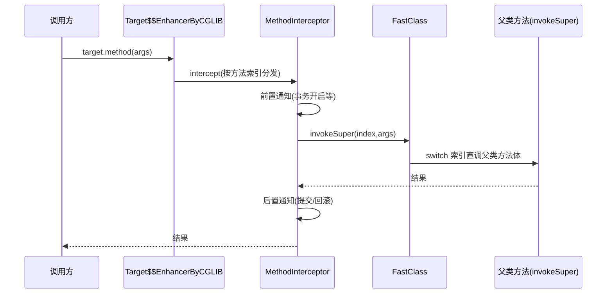

# CGLIB 与 Spring AOP 代理选型：子类化路线与框架决策

> CGLIB 走「生成目标类的子类」这条路，绕开了 JDK 动态代理「只能代理接口」的边界，也撞上了 final 与 final 类这堵墙。本篇拆 CGLIB 的字节码子类化机制与 FastClass 直调优化，再把 Spring AOP 的代理决策树（有接口走谁？配置 proxyTargetClass 之后呢？）钉死，最后给出失效边界的完整清单。

> **本文核心**：CGLIB 的机制本质是「运行时生成目标类的子类，方法体替换为拦截器分发」——它赢在能代理类、方法体内直调快，输在 final/private 不可覆写、构造器被调两次、final 类直接不可代理。Spring AOP 的选型规则一句话：**默认有接口走 JDK、无接口走 CGLIB；配置 proxyTargetClass=true 后一律 CGLIB（Boot 2.x 起默认值即 true）**——选型不是自由发挥，是配置项的确定语义。

## 一句话摘要

CGLIB（Code Generation Library）通过 ASM 字节码库在运行时生成目标类的子类：覆写全部非 final 方法，方法体内按方法索引分发到 `MethodInterceptor.intercept`；另生成一对 FastClass（代理类与目标类各一）用「索引直调」替代反射，把调用开销压到接近直调。Spring AOP 在此之上做代理策略决策：`proxyTargetClass=false`（默认）时目标有接口走 JDK 动态代理、无接口走 CGLIB，`=true` 时强制 CGLIB——Spring Boot 2.x 起 `spring.aop.proxy-target-class` 默认 true，即默认全 CGLIB。两条路线的失效边界不同：JDK 路线失效于「无接口」，CGLIB 路线失效于「final 方法 / final 类 / private 方法 / 构造器内自调用」——失效清单是选型的另一半。

## 🎯 本文核心（机制坐标）



## 一、源码关键路径：CGLIB 怎么生成子类

`Enhancer` 是入口：`enhancer.setSuperclass(Target.class)`、`setCallback(interceptor)`、`create()` 内部走「ASM 生成子类字节码 → defineClass → 实例化」。生成的子类形如 `Target$$EnhancerByCGLIB$$xxxx`，覆写所有可覆写方法，方法体固定为「按方法索引调用 `MethodInterceptor.intercept(obj, method, args, methodProxy)`」。intercept 里的 `methodProxy.invokeSuper(obj, args)` 走 FastClass 索引直调父类方法——**FastClass 为类的方法建「签名→索引」表，调用时按索引 switch 分发，绕开 Method.invoke 的反射全套**。这是 CGLIB 调用性能优于裸反射的机制根源。

两个容易忽略的机制细节：①生成子类实例时，**目标类的构造器会被执行两次**（父类构造一次 + 代理初始化一次）——构造器里有副作用的类被 CGLIB 代理后副作用翻倍；②回调是实例级配置，`setCallbackFilter` 可按方法选不同拦截器（如只拦截 public 写方法）。

CGLIB 一次代理调用的完整流转：



## 二、Spring AOP 的决策树与 Boot 默认值

```mermaid
flowchart LR
    B["Bean 后处理阶段<br/>AbstractAutoProxyCreator"] --> M{"命中切点?"}
    M -->|否| RAW["原始 Bean 直接注入"]
    M -->|是| P{"proxyTargetClass"}
    P -->|true(Boot 默认)| CGLIB["CGLIB 代理"]
    P -->|false| I{"有实现接口?"}
    I -->|有| JDKP["JDK 动态代理"]
    I -->|无| CGLIB
    style B fill:#ffd3a5
```

历史上（Spring 4 时代）默认是「有接口走 JDK」，大量「注入实现类报 ClassCastException」的事故由此而来——代理只实现了接口，注入具体类型失败。Boot 2.x 把 `proxyTargetClass` 默认改为 true 全量 CGLIB，用「放弃接口代理」换「注入类型不再分裂」。**这个默认值变化是无数旧文章与新行为矛盾的根源**：读旧资料「Spring 默认 JDK 代理」时先看 Boot 版本。

## 三、失效边界：CGLIB 拦不到的四个位置

1. **final 方法**：子类不可覆写，代理方法体无从替换——调用直接走原方法，拦截静默失效（不报错，最危险）
2. **final 类**：整个类不可继承，CGLIB 生成子类直接抛异常（创建期就失败，反而容易发现）
3. **private 方法**：子类看不见父类 private，无从覆写；同类内 self 调用 private 方法自然绕过拦截
4. **构造器与字段初始化里的 self 调用**：此时代理尚未就绪（正在构造），目标 this 上的调用不走代理——切面日志少第一条、事务少第一笔，都是这个形态

JDK 动态代理路线的失效面不同：无接口不可用；同类内 self 调用同样绕过（this 是原始对象）。「自调用失效」是两条路线共有的头号失效源，互指特性层事务代理篇的八场景手册。

## 四、事故叙事两则

**叙事一：final 方法让审计静默失效。**某支付组件的方法上加了审计切面，后续迭代有人给该方法加了 final（「确定不会被继承」的性能洁癖），审计日志从此静默消失——CGLIB 不覆写 final 方法，切面完全不触发，且无任何报错。三个月后合规检查发现审计断档才暴露。复盘沉淀：**final 与 AOP 是互斥声明，切面方法进「禁 final」清单并挂 ArchUnit 静态规则**——这类失效不报错，只能靠静态扫描防线。

**叙事二：构造器里调业务方法，事务少扣一笔。**某服务在构造器里调用了带 @Transactional 的初始化方法（预热缓存顺带初始化一条流水），上线后偶发「流水缺失」。排查发现：构造器执行时代理尚未成型，方法内的 this 是原始对象，事务拦截器根本不在调用链上。修复：初始化逻辑移出构造器，改为 `@PostConstruct` 阶段经容器代理调用。复盘沉淀：**「构造期的一切调用都不在增强范围内」要进代码评审清单**——不仅是事务，所有切面在构造期集体失效。

## 五、追问链：把「子类化」问穿一层

- **追问一：CGLIB 生成的子类实例，和目标实例是什么关系？**——是父子关系：代理实例 is-a 目标类，内部并不持有一个目标对象（与 JDK 代理「包装 target」结构不同）。所以 `invokeSuper` 是调用「自己作为父类的那部分」，切面状态挂在代理实例上。副作用：目标类字段初始化逻辑照常执行（构造两次的来源），`instanceof Target` 为 true——类型判断反而更平滑。
- **再追问：FastClass 的索引直调为什么快？它有代价吗？**——反射 invoke 每次做访问检查、装箱、签名解析；FastClass 把方法编成 int 索引，调用是 `switch(index)` 后直调——省掉反射的解析与安全检查。代价是**每个被代理类要多生成两个 FastClass 类**（代理类与目标类各一），类数量与元空间占用翻倍——大量动态代理类（为每个数据类型生成）时，Metaspace 要入监控。
- **打破砂锅：Spring 为什么不全走 JDK 接口代理，接口明明更干净？**——因为「目标必须为代理而设计接口」是强侵入：大量遗留类与第三方类没有接口，接口代理直接不可用；且接口代理注入具体类型会崩（上节事故）。全 CGLIB 是框架在「通用性」与「使用心智统一」之间的工程决断——代价是 final 失效面扩大，由静态扫描规则兜底。

## 六、反方案分析：第三条路与其他替代

- **为什么不用 AspectJ 编译期织入**：AspectJ 在字节码层面直接改写目标类（编译期/加载期织入），没有代理、没有 self 调用失效、能拦 private/构造器——能力上限高得多。代价是需要独立编译器或加载期 agent、工具链复杂、团队心智成本高。Spring AOP 选「代理 + 方法级拦截」是覆盖 90% 场景的轻量解，需要构造器拦截、字段拦截、超大规模切面时才升级 AspectJ。
- **为什么不用手写装饰器替代自动代理**：装饰器（静态代理）可控可读，但「每个 Bean 手写一个装饰类」在服务规模上百后是维护灾难；自动代理的价值恰是「增强声明与装配解耦」。折中形态是关键路径手写装饰器（可读性优先），批量的横切关注点交给 AOP。
- **为什么 JdkRegexpMethodPointcut 之类的方法匹配逐渐边缘化**：切点表达从正则进化到 AspectJ 表达式（`execution(* com..service.*.*(..))`），表达力与工具支持全面胜出——正则匹配方法名无法表达调用语义层级，维护性差，业内已收敛。

## 七、设计思想：为什么框架默认值从接口代理转向 CGLIB

Boot 2 的默认值翻转是一次「错误率驱动」的决策：接口代理下，用户踩「注入实现类失败」「无接口不生效」两类错误的频率，显著高于 CGLIB 路线下「final 失效」的频率——前者报错或静默失效且高频，后者低频且可用静态扫描拦截。**默认值应该立在最不容易让普通用户掉坑的一侧**，把剩余风险交给工具链兜底（ArchUnit 规则、启动期 final 扫描告警）。这个决策模式和「语言默认值设计」同源：与其让每个人理解继承位与接口语义，不如给一个「大概率对」的默认，把复杂性留给显式配置。

## 八、不同量级的思考：代理选型的约束迁移

- **十万级 QPS 以下**：约束来源是失效边界的正确性——final/self 调用清单管住，选型本身开销无感。这一档的核心问题是「增强有没有生效」，而不是「谁更快」
- **百万级 QPS**：约束来源是转发开销的累积——CGLIB 的 FastClass 直调 vs JDK 的 inflation 反射，实测差异已收窄但链上每层代理的固定成本仍在。这一档的核心问题是「代理层数与单层成本」，做法是剖析定位后精简增强点、合并拦截器
- **千万级 QPS / 巨型单体**：约束来源是类规模与启动——万级代理类的 Metaspace、启动期批量生成的耗时、切面表达式扫描的启动成本。这一档的核心问题是「代理基建本身的资源账」，做法是切点收敛、代理类固化、启动画像持续跟踪

**自下而上与触发升级**：先测代理层耗时占比与代理类数量基线，无感不动；触发升级的信号是剖析图上拦截转发进 top、启动画像里代理生成占比异常、或 Metaspace 增长曲线异常——从「配置默认」迁到「剖析驱动」再迁到「基建容量管理」，思考方式跟随约束来源换挡。

### 拦截器链的顺序语义与治理

多个切面命中同一方法时执行顺序由 `@Order`（或 Ordered 接口）决定，值小者优先——但「优先」的具体含义要看通知类型：进入方向（before/around 前半）按 order 升序，返回方向（after/around 后半）按相反序，形如洋葱。常见事故是假设「事务先于自定义切面」却不设 order：两者都是默认优先级时顺序取决于注册序，跨模块变更会静默翻转（自定义切面在事务外读库，读不到未提交写入）。治理纪律：**有依赖关系的切面必须显式声明 order 并写进切面模块文档**；核心组合（事务 × 审计 × 缓存）在集成测试里加一条「顺序断言」用例，注册序变化当场炸 CI。

### 循环依赖与代理的联动（三级缓存视角）

Bean A 依赖 B、B 又依赖 A，且 A 需要被代理时，Spring 用三级缓存化解：`singletonFactories` 存「提前生成代理的工厂」，B 构造中需要 A 时工厂提前产出 A 的代理引用，避免把未代理的原始 A 注出去。这解释了两个现象：构造器注入的循环依赖无解（都没实例化完，工厂无法产代理），字段/setter 注入可解；以及「代理化导致启动报循环依赖」的版本差异——某些增强路径下提前暴露策略变化，原本文档化允许的循环依赖开始报错。**循环依赖本身是设计坏味道**，代理化只是让它提前暴露——治理方向是拆依赖，不是找配置开关。

## 九、业内惯例

- Boot 服务默认全 CGLIB（默认值未动时），团队规范配套「切面目标方法禁 final」静态规则；核心链路用 ArchUnit 把「@Transactional 方法 + final」拦在 CI
- 切面声明收敛到统一模块，业务模块不散写切点表达式——表达式散落是「增强范围失控」的第一根源
- 需要代理的对象保持「无 final 构造、无构造器业务、可继承」三个特征——把它写进领域对象的编码规范
- 升级 Spring/Boot 大版本时把「代理默认值」列入变更检查单（4→5、Boot1→2 都动过相关行为）

### 声明式事务的代理内幕（联动案例）

@Transactional 是「代理 + 拦截链」最日常的应用：事务拦截器（TransactionInterceptor）作为切面挂在方法外层，invoke 时开事务 → 放行拦截链 → 按是否异常决定提交/回滚。三个联动细节值得钉住：①事务切面通常显式设为最高优先级（order 最小），保证它在自定义切面**外层**——自定义切面里看到的已经是事务内上下文；②回滚判定发生在拦截器出口，切面内部 catch 住异常不上抛，事务照样提交（失效场景三，互指事务系列八场景手册）；③同类内 self 调用不走代理，事务随之失效——这也是 CGLIB 与 JDK 代理共同的失效源头。把这三个细节读透，事务与切面的九成「玄学」都有了机械解释。

### 代理对象的 equals 与 hashCode 语义

CGLIB 子类没有覆写 equals/hashCode 时继承目标类实现，代理实例与目标实例的相等性按目标逻辑走——但两者本就不是同一对象，把代理放进 Set 再放原始对象，「去重失败」这类怪象就会出现。Spring 的处理是在部分代理路径上转发 equals 到目标或按代理自身身份处理；工程纪律是**业务对象尽量实现基于业务键的 equals**（而不是依赖默认对象身份），无论外层包几层代理，相等性语义都稳定——身份语义的相等性在代理、序列化、跨网络场景全部脆弱。

## 你们可能会问

**Q1：CGLIB 会调用目标构造器两次，怎么规避副作用？**
构造器只做字段赋值，副作用（注册、连接、预加载）移到容器回调（@PostConstruct/InitializingBean）——回调时机在代理就绪后，经代理调用增强生效。历史遗留类无法重构时，用「代理工厂显式创建」替代容器自动代理，绕开双重构造路径。

**Q2：proxyTargetClass=true 后接口还有意义吗？**
有，且更有：接口是注入边界（依赖抽象）与测试替身锚点，与代理路线解耦——注入时用接口类型，CGLIB 代理同样实现了接口，两类注入都安全。「强制 CGLIB」解决的是代理实现问题，不是接口设计问题的免死金牌。

**Q3：怎么在启动期发现 final 失效？**
Spring 5 起 `CglibAopProxy` 对「拦截 final 方法」会打 warn 日志（拦截不到的提示）；更可靠的是 ArchUnit 规则在 CI 拦「被切点命中且 final」的组合——日志会被淹没，CI 规则不会。

**Q4：CGLIB 与 Spring 6 / JDK 21 的兼容现状？**
Spring 6 起内置 CGLIB 已 fork 内嵌并持续适配新 JDK（类文件版本升级跟随）；直接引第三方 cglib 旧坐标在新 JDK 上会踩字节码版本坑——用框架内嵌版本，不自行引依赖。

## 十、什么时候用 / 不用

- ✅ 默认：Boot 服务直接用默认全 CGLIB，团队规范管住 final 与构造器边界
- ✅ 选接口代理（proxyTargetClass=false）：明确以接口为注入契约、目标全部有接口、需要接口级多代理叠加的框架型模块
- ✅ 升级 AspectJ：需要构造器/字段/对象级拦截，或切面规模大到代理路线的表达力不足
- ❌ 不用 CGLIB：目标类是 final（JDK 自己的工具类、record、第三方 final 类）——转接口提取 + JDK 代理，或包装器手写
- ❌ 不用自动代理：增强点极少且明确的小模块——手写装饰器更直白，别为「架构完整」引入切面体系

## Trade-off：能力上限与工具链复杂度的交换

CGLIB/自动代理用「final 失效面 + 双构造 + 元空间成本」换「零侵入批量增强」；AspectJ 用「工具链复杂度」换「全能力无死区」。Spring AOP 卡在中间拿走易用性，把长尾风险交给规范与静态扫描——**增强能力每上一级，可理解性与可排查性降一级**。选型的诚实姿势是按团队对切面的运维能力定价：能养 ArchUnit 与切面规范，全 CGLIB 很划算；养不起，宁可增强点少而显式。落地时给团队两条硬线：切面只收口在统一模块声明；核心链路的增强组合（事务×审计×缓存）必须有顺序断言的集成测试——能力上限与工程底线分开谈，升级决策才不会漂。

## 开放问题

- GraalVM 原生镜像下运行期类生成受限，代理走向「构建期生成」——CGLIB/代理链的启动行为与 native 画像成为新的工程议题
- 虚拟线程海量并发下，拦截链的 ThreadLocal 上下文传递成本被放大，上下文载体（Scoped Value）迁移会波及切面实现

## 💡 实战提示

- 💡 切面目标方法禁 final，挂 ArchUnit 进 CI——CGLIB 对 final 的失效是静默的，只能静态扫描防
- 💡 构造器里不调业务方法——构造期一切增强失效，初始化走 @PostConstruct
- 💡 Boot 2+ 默认全 CGLIB：注入具体类型安全了，但别因此放弃接口注入习惯
- 💡 大规模动态代理（按类型生成）把 Metaspace 与启动画像入监控
- 💡 读旧文章先核对 Boot 版本——「Spring 默认 JDK 代理」是 Boot 2 之前的旧世界结论

### 与 JDK 路线的联合失效检查单

两条路线的失效边界不同，联合检查单按「调用形态」而不是「代理类型」组织：容器注入的调用（走代理，增强生效）／new 出来的调用（无代理，全部失效）／同类 self 调用（this 是原始对象，失效）／static 方法（无 this 可代理，不适用）／final 方法（CGLIB 静默失效）。评审时拿这张单对着调用形态扫一遍，比背「CGLIB 有哪些失效」更能命中真实事故——事故从来不是「代理类型错了」，是「这条调用没经过代理」。

## 自测三问

1. CGLIB 生成子类的方法体如何分发到拦截器？FastClass 优化了什么？
2. proxyTargetClass 两种取值下的决策树各是什么？Boot 默认值改成了什么、为什么？
3. CGLIB 的四个失效位置分别是什么？各自的发现难度如何？

## 🎯 核心带走

- **核心一句话**：CGLIB = 运行时子类化 + FastClass 直调，赢在代理类与调用速度，输在 final/private/双构造；Spring AOP 选型是配置语义不是自由发挥——Boot 2+ 默认全 CGLIB
- **决策树**：proxyTargetClass=true → CGLIB；false → 有接口 JDK、无接口 CGLIB
- **失效清单**：final 方法（静默）、final 类（报错）、private（不拦）、构造期 self 调用（不拦）
- **哪里会坏**：审计静默断档、构造期事务缺失、注入类型分裂（旧默认值时代）
- **边界**：方法级增强的轻量解；构造器/字段级诉求升级 AspectJ，集群级唯一性另找分布式协调

### 测试环境里的代理处置

单测想测「业务方法本身」时，切面是噪声：Spring Test 提供 `spring.aop.proxy-target-class=false` 之类的开关之外，更精准的做法是 `@SpringBootTest` 里按需排除 AOP 自动代理（`@TestConfiguration` 覆盖或直接实例化目标类）。反过来，集成测试必须开着代理跑——事务边界、审计行为只有穿过真实代理链才被验证，「单测全绿、集成翻车」的典型场景就是测试环境为了方便关了代理。纪律：**单测直接实例化目标类测逻辑，集成测试保留完整代理链测边界，两套测试各答各的问题**——用同一套配置同时答两个问题，两头都答不好。

## 📌 数据与事实声明

- 写于 2026-09-15；CGLIB 机制以 cglib 源码与 Spring 官方文档公开口径为准；Boot 2.x 起 spring.aop.proxy-target-class 默认 true 为官方发布说明口径
- 事故叙事为业内高频 AOP 失效模式的匿名化叙事，非特定公司事件
- 免责：框架默认值与实现随版本演进，以对应版本文档为准

## 📚 参考资料

| 类型 | 标题 | 来源 |
|---|---|---|
| 官方文档 | Spring Framework AOP（Proxying Mechanisms 一节） | docs.spring.io |
| 官方源码 | spring-framework（CglibAopProxy / ObjenesisCglibAopProxy） | github.com/spring-projects/spring-framework |
| 官方源码 | cglib（Enhancer / FastClass / MethodInterceptor） | github.com/cglib/cglib |
| 系列内 | 篇 1《静态代理与 JDK 动态代理》 | 本目录 |
| 关联系列 | @Transactional 事务代理与失效八场景 | 特性层事务系列 |
