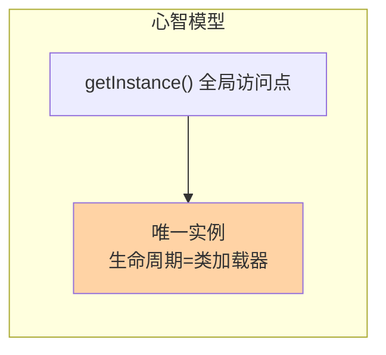
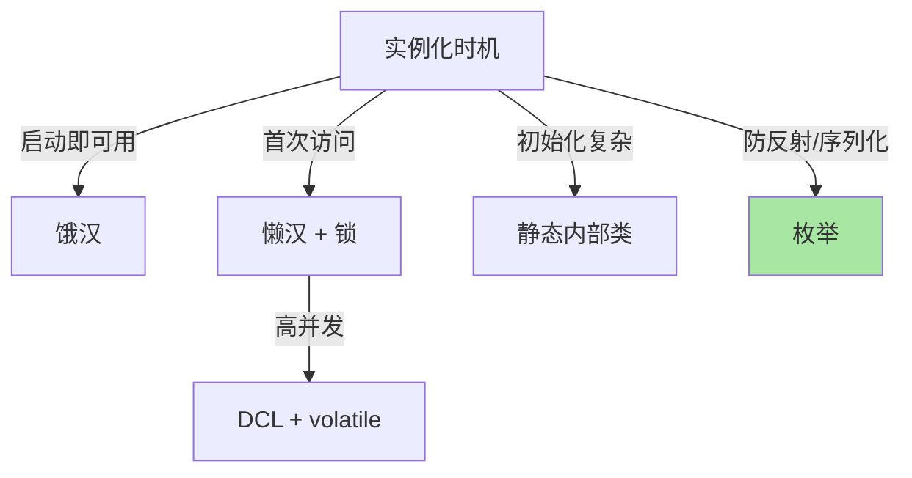

# 深入理解单例系列

> 5 种写法 + volatile 指令重排 + 反射/序列化破坏防御——单例是创建型模式里最简单的，也是面试最容易挖深的。本系列把「为什么这样写」拆到内存语义层面。

## 这个目录讲什么

单例确保一个类只有一个实例并提供全局访问点。看似一行 `getInstance()`，深入进去是并发可见性、指令重排、类加载机制三层知识。本系列正文按「写法演进 → 为什么每一步要加这个关键字」的顺序拆解五种写法。

## 这个目录下有哪些文章

| 篇目 | 类型 | 一句话重点 |
|---|---|---|
| 1_深入理解单例模式-特性 | 特性 | 5 种写法演进；volatile 双重检查锁的内存语义；枚举防反射/序列化破坏 |
## 我能得到什么

- 说清饿汉/懒汉/双重检查锁/静态内部类/枚举五种写法的差异与适用场景
- 理解 volatile 在双重检查锁里防的不是可见性而是指令重排
- 掌握反射攻击与序列化破坏的防御手段（枚举为什么天然免疫）

## 我想看哪一篇

- **按方向**：系统回顾 → 按写法演进顺序通读
- **按问题**：「为什么要 volatile」→ 篇 1 双重检查锁节；「枚举单例为什么安全」→ 篇 1 防御节
- **按阶段**：快速回顾 → 篇 1 追问链部分 + 五写法对比表

## 📌 维护说明

新增文章必须同步更新本导航表，并在「我想看哪一篇」中补充对应阅读路径。

## 选型一览与 Trade-off

单例的生命周期与类加载器绑定：跨系统部署（多模块、热部署）里 ClassLoader 隔离会造出「多个单例」。Trade-off 上，饿汉用确定性换掉按需加载、懒汉反之——加载时机的选择本质是跨期代价的分配决策，规模上量级越大的进程越倾向确定性。
这是单例在容器化架构里常被容器单例（Bean 默认作用域）取代的原因。

## 📌 数据与事实声明

- 写于 2026-09-15（系列导读）；模式机制描述以 GoF《设计模式》与 JDK/Spring 官方文档公开口径为准
- 免责：框架行为以实际版本源码为准

## 📚 参考资料

| 类型 | 标题 | 来源 |
|---|---|---|
| 经典书 | 《设计模式：可复用面向对象软件的基础》（GoF） | 公开出版 |
| 官方文档 | Spring Framework AOP / Core | docs.spring.io |
