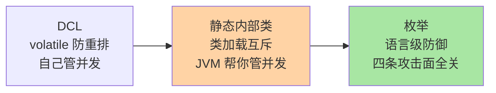
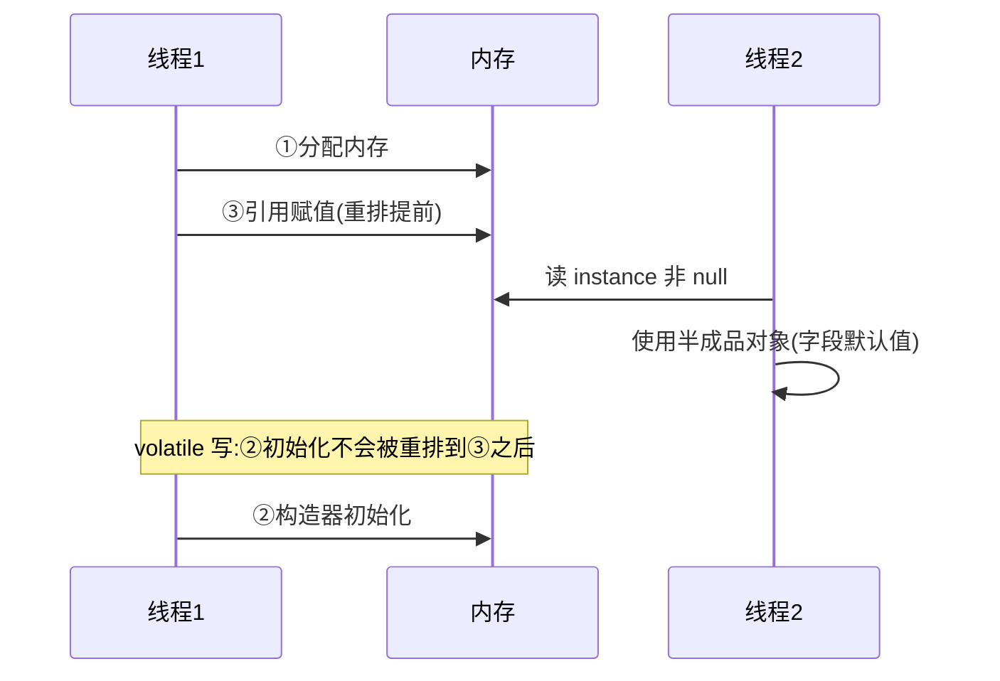
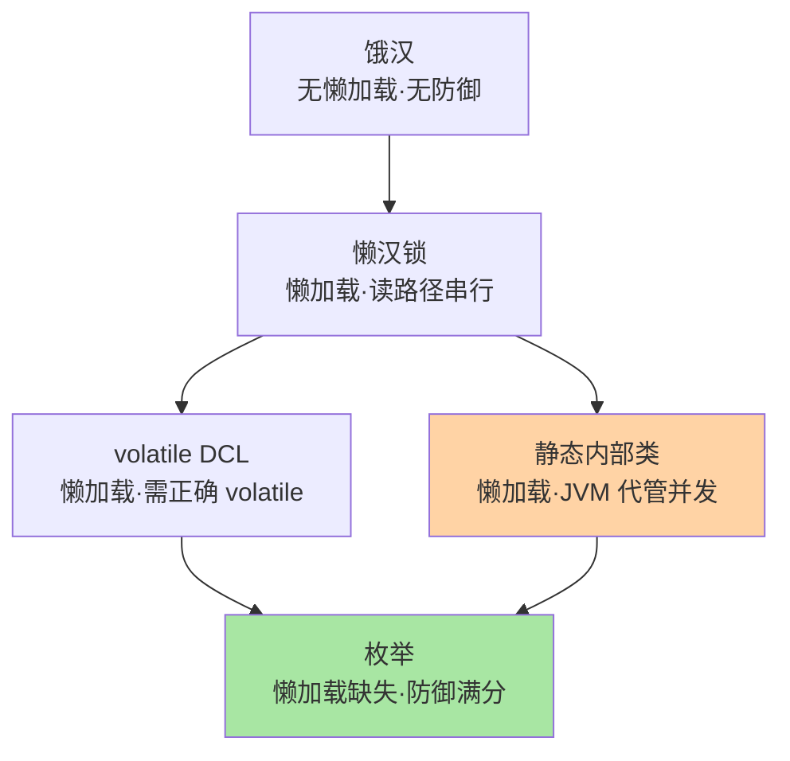

# 深入理解单例模式：五种写法演进与内存语义

> 单例是创建型模式里最简单的，也是把 Java 内存模型（JMM）、类加载机制、序列化机制串成一堂课的最佳教材。本篇按「写法演进」推进：每一种写法修上一代的什么坑、又埋下什么新坑——五步走完，volatile、枚举防御、容器单例的「为什么」全部落位。

> **本文核心**：单例的全部技术含量在两件事——**①实例唯一性不被破坏**（并发创建、反射、序列化、类加载器四条攻击面）；**②懒加载与线程安全的平衡**（不加锁的懒加载是坏的，加粗锁的懒加载是慢的，volatile DCL 与静态内部类是两个正解）。枚举写法在语言层面同时关掉四条攻击面，这就是《Effective Java》推荐它的底层原因。

## 一句话摘要

单例模式确保一个类在全进程只有一个实例并提供全局访问点。五种经典写法按演进排列：饿汉（类加载即建，简单但无懒加载）、懒汉加锁（懒加载但每次读都加锁）、双重检查锁 DCL（两次判空缩小加锁范围，必须配 volatile 防指令重排）、静态内部类（利用类加载的天然互斥实现懒加载且无锁）、枚举（语言级防反射与序列化破坏）。生产系统里，Spring IoC 容器的默认 singleton 作用域是单例的工业化形态——它管的是容器内 Bean 的唯一性，与类加载器级别的单例是两个层级，混用会出「两个单例」事故。

## 🎯 本文核心（机制坐标）

三种正确写法的机制坐标：



选型一句话：**普通工具类静态内部类够用；需要防反射/序列化（安全敏感、序列化频繁）用枚举；需要自定义初始化时序与参数的才用 volatile DCL**。

## 一、源码关键路径：DCL 为什么要 volatile

DCL（Double-Checked Locking）是五种写法里唯一「必须懂 JMM 才能写对」的形态：

```java
public class Singleton {
    private static volatile Singleton instance;   // volatile 不是可有可无

    private Singleton() {}

    public static Singleton getInstance() {
        if (instance == null) {                  // 第一次检查:无锁快路径
            synchronized (Singleton.class) {
                if (instance == null) {          // 第二次检查:持锁确认
                    instance = new Singleton();  // 问题行
                }
            }
        }
        return instance;
    }
}
```

问题行的字节码视角，`new Singleton()` 分三步：①分配内存；②调用构造器初始化；③把引用赋给 instance。②③可能被重排为 ①③②（JIT 与处理器的合法优化，单线程内语义不变）。重排后另一个线程在第一次检查处读到**非 null 但未初始化完成**的引用——直接使用就是半成品对象的字段默认值（如 count=0），这种 bug 复现率低、破坏力大。volatile 对该字段的语义：写之前禁止前面的初始化重排到引用赋值之后，读时禁止后续使用重排到读取之前——一条 volatile 同时买下可见性与顺序性。



业内惯例：新代码几乎不再手写 DCL——静态内部类同样懒加载、零锁、无重排心智负担；DCL 的价值在于理解 volatile 与 JMM 本身（并发面试之外，能看懂 JDK 与框架源码里大量同类手法）。

## 二、五种写法演进：每一步修什么

| 写法 | 上代的坑 | 新坑/代价 | 适用 |
|---|---|---|---|
| 饿汉 | — | 无懒加载；初始化重会拖慢类加载启动 | 初始化轻、确定必用 |
| 懒汉 synchronized 方法 | 饿汉无懒加载 | 每次获取都抢锁，高并发下读路径被串行化 | 教学，不用于生产 |
| volatile DCL | 懒汉读路径慢 | 需正确理解重排；写错 volatile 就是半成品事故 | 需要自定义初始化时序 |
| 静态内部类 | DCL 心智负担 | 反射仍可破坏；不能传参 | 绝大多数工具类单例 |
| 枚举 | 内部类反射可破坏 | 不能懒加载；不能继承 | 安全敏感、序列化场景 |

静态内部类的机制值得单独说：内部类 `Holder` 在外部类加载时**不**加载，首次访问 `Holder.INSTANCE` 触发其类加载——JVM 类加载的 initialize 阶段由 `<clinit>()` 方法的锁保证线程安全，等于「JVM 替你执行了一次带锁的 DCL」，而且字节码层面就禁止了相关重排。**用平台保证替代手工并发控制**，这是它优于 DCL 的设计根源。

五种写法在「懒加载 × 防御完备」两个维度的位置：



## 三、四条攻击面：唯一性怎么被破坏

### 3.1 反射攻击

`Constructor.setAccessible(true)` 可以绕过 private 构造器 new 出第二个实例。防御：构造器里检查实例已存在即抛异常。枚举天然免疫——JVM 禁止对枚举类型反射调用构造器（`Constructor.newInstance` 对枚举直接抛 `IllegalArgumentException`，这是 JDK 层面的硬防御）。

### 3.2 序列化破坏

实现 `Serializable` 的单例，反序列化默认 new 新对象。防御：`readResolve()` 方法返回既有实例。枚举同样天然免疫——序列化机制对枚举只存名字，反序列化按名字查回唯一实例。

### 3.3 类加载器隔离

每个 ClassLoader 加载一遍「同一个类」，就有多个互不相同的单例——Web 容器多应用部署、热部署、OSGi 环境（多 ClassLoader 架构）里，单例的唯一性边界是**类加载器，不是 JVM**。跨加载器共享要用父加载器委托或外部注册表。

### 3.4 容器与手写的双单例

Spring Bean 默认 singleton 作用域，同时这个 Bean 的类又自己实现了单例——Spring 容器里是唯一实例，但测试里 `new` 出来的、或被反射构造的又是另一份。「Spring 的单例」语义是**每个容器每个 Bean 定义一个实例**，不是 JVM 级唯一——两个容器（父子容器配置不当）就有两份。

### 追问链一：把「静态内部类」问穿一层

- **追问一：内部类的 `<clinit>()` 锁，和 synchronized 有什么区别？**——语义同源（互斥 + 可见性 + 禁重排），但执行主体不同：类初始化锁由 JVM 在类加载流程中持有，且完成后永不再争用——它是「一次性锁」，运行期零开销；synchronized 是每次调用都可能争用的常驻成本。这一档的核心问题是「谁承担并发正确性」，静态内部类把答案交给了平台。
- **再追问：既然 JVM 保证，为什么还要学 volatile DCL？**——因为真实代码里「初始化」不总发生在类加载期：字段级别的延迟初始化、缓存的双重检查、连接池的懒建——这些场景类加载锁帮不上忙，volatile DCL 是唯一正确手法。学它是为了拿到一把通用钥匙，不是为了在单例上炫技。
- **打破砂锅：那为什么不把所有延迟初始化都写成静态内部类？**——内部类方案的前提是「初始化逻辑可以整体搬进另一个类」。带参数的初始化、依赖运行时上下文的初始化（按配置建连接池）搬不进去——这时候才轮到 DCL 登场，且初始化参数的可见性同样要按 final/volatile 纪律发布。

### 追问链二：把「枚举防御」问穿一层

- **追问一：枚举防反射的机制在 JDK 哪一行？**——`Constructor.newInstance` 内部对 `Enum.class` 的派生类直接抛异常（`(flags & ENUM) != 0` 判断），这不是枚举类自己实现的防御，是反射框架对枚举的硬编码豁免——**语言层面的防御不可能被业务代码绕过**，这就是它优于 `readResolve` 与构造器检查的地方。
- **再追问：枚举序列化只存名字，那枚举加字段/加实例怎么兼容？**——按名字反查意味着「删实例」是破坏性变更（老序列化数据反查失败），「加实例」是兼容变更；枚举内部字段（如每个实例挂的配置）变化则与普通类一样按字段序列化演进。枚举的序列化契约比普通类更严格，演进要走「只加不删」纪律。
- **打破砂锅：既然枚举这么强，为什么 JDK 自己的单例（如 Runtime）不用枚举？**——历史与约束双因素：Runtime 早于枚举诞生；且 Runtime 需要暴露大量实例方法与继承结构，枚举的「隐式 final + 固定实例集」约束反而碍事。**没有银弹只有匹配**——防御满分换来了结构刚性，这是枚举的 Trade-off。

## 四、事故叙事两则

**叙事一：半成品单例导致「偶现 count=0」。**某限流组件用 DCL 实现单例，作者认为 volatile「影响性能」没加（实际单次写入的屏障成本可忽略）。上线后低概率出现计数从零开始的窗口，监控显示限流阈值判定失效数秒。排查两天定位到重排：线程 B 在 T1 初始化完成前拿到引用。加 volatile 后消失。复盘沉淀：**DCL 不带 volatile 不是性能优化，是正确性 bug**；这类问题的可怕在于复现依赖并发时序，压测都未必踩中。

**叙事二：热部署后的「两个缓存单例」。**某管理后台用自研单例做本地缓存，热部署功能上线后偶发「改了缓存配置一半实例生效一半不生效」。根因：热部署用新 ClassLoader 重新加载缓存类，新请求拿到新单例，老请求上下文还持有旧单例引用——两个缓存各自为政。修复：缓存实例挂到容器级共享上下文（跨加载器的稳定位置）。复盘沉淀：**单例唯一性的真实边界是类加载器**，部署形态一变，「全局唯一」的假设就碎。

### 容器单例的实现路径（源码视角）

Spring 默认单例注册表 `DefaultSingletonBeanRegistry` 的实现值得读：核心是一张 `singletonObjects` 的 ConcurrentHashMap 缓存，外加 `earlySingletonObjects`（提前暴露的半成品引用）与 `singletonFactories`（对象工厂）两级辅助结构。Bean 首次创建时按「三级缓存查找 → 未命中则创建 → 创建完成后注册缓存」推进；多容器（父子）场景下先查子容器再沿父链查——「每容器每定义一份」的语义就是这张缓存表的作用域。顺带回答一个常见困惑：容器并不依赖 private 构造器或静态实例，**它用「注册表 + 作用域」实现唯一性，类本身保持普通**——这正是「单例是部署属性」的机制证据。

### 单例内共享状态的并发容器选型实操

计数类：`LongAdder` 优于 `AtomicLong`——它在高并发写时把计数拆到 Cell 数组分散热点，`sum()` 时再汇总；读写比悬殊的场景收益量级明显（百万级 QPS 下避免 CAS 重试风暴）。键值缓存类：`ConcurrentHashMap` 替代 `Collections.synchronizedMap`——前者按桶分段（JDK8 后 CAS + synchronized 桶头）锁定粒度细，后者一把全局锁。只读场景：不可变结构（`Map.copyOf`）加 volatile 引用发布，读路径完全无锁且天然安全发布。**选型口诀：先问读写比，再问竞争键分布，最后才看 API 顺手度**——并发容器的性能差异全部来自竞争粒度，而竞争粒度来自业务访问模式。

## 五、反方案分析：为什么不自己写单例

- **为什么不手写而用容器单例**：现代 Java 服务里对象生命周期几乎都归 IoC 容器管，手写单例反而造出「容器管一半、自己管一半」的双轨——依赖注入失效、测试无法替换、生命周期没人管。**默认答案是不写**，需要单例语义交给容器作用域。
- **为什么不用「全局静态变量」替代**：`public static Singleton INSTANCE = new ...`（饿汉变体）没有防御、没有懒加载、测试时无法 mock——它只是没有模式名字的单例，继承了全部缺点还丢了写法演进带来的机制理解。
- **为什么不用 monostate 模式（所有实例共享状态）**：monostate 绕开「唯一实例」的实现，但把唯一性约束藏进字段语义，调用方可以无感 new 出多个「名同实一」的对象——约束不可见比约束不存在更危险，业内几乎只在特定库设计里见到。

## 六、你们可能会问

**Q1：枚举单例不能懒加载，为什么还是被推荐？**
懒加载的价值要按初始化成本算：初始化轻（无 IO/无大内存）时，「懒」没有收益，枚举的防御完备性反而更重要；初始化重且不一定用到时，静态内部类。两者的判断依据是「初始化成本 × 使用概率」，不是教条。

**Q2：Spring 的 singleton 和单例模式是一回事吗？**
不是。Spring singleton 是作用域（每容器每 Bean 定义一个实例），单例模式是类级实现（类自己保证唯一）。Spring Bean 类不需要也不能靠 private 构造器实现——容器要反射创建它。两者在「每容器唯一」上语义交汇，在「JVM 级唯一」上不重叠。

**Q3：单例的测试怎么解？**
根因是单例把「获取依赖」焊死在类内部，测试无法注入替身。解法不是给单例加 setter（又造出可变全局状态），而是把它改成普通对象由容器注入，只在组合根处保证唯一——**单例是部署属性，不是编程接口**。

## 七、不同量级的思考：单例的约束边界

单例「简单」的印象只在低并发成立，量级改变它的约束来源：

- **十万级 QPS 以下**：约束来源是正确性——任何线程安全写法都够，静态内部类是默认解。这一档的核心问题是「有没有并发缺陷」，而不是「性能调优」
- **百万级 QPS**：约束来源是读路径放大——单例内部的共享可变状态（计数器、缓存 map）成为热点，`synchronized` 方法级别的串行化直接限流。这一档的核心问题是「共享状态的竞争粒度」，而不是「写法选择」；解法是内部状态无锁化（CAS/LongAdder/不可变结构）
- **千万级 QPS / 多实例集群**：约束来源是「单例」语义的失效——每台机器一个实例，进程级单例对集群级唯一性毫无帮助；需要集群唯一（如编号发放）时，问题已经变成分布式锁或号段服务，单例模式退场。这一档的核心问题是「唯一性属于哪个层级」，而不是「怎么写」

**自下而上与触发升级**：先测单例内部状态的实际竞争度（锁等待、CAS 重试率），决定要不要从「线程安全写法」升级到「无锁结构」；触发升级的信号是锁等待占比、伪共享导致的缓存行失效（性能计数可观测）——约束从正确性迁移到吞吐时，思考方式必须跟着换，不是在原写法上继续加注释。

## 八、业内惯例与边界

- 工具类无状态方法集合用**静态方法类**（如 `Collections`），连单例都不必——无状态就没有「实例」语义，private 构造器防实例化即可
- 需要懒加载 + 防御 + 简单：静态内部类默认解；序列化/反射敏感：枚举；JDK 内部大量使用的是「初始化顺序设计好的饿汉」（类加载时机被调用链天然控制）
- 单例上挂可变全局状态是反模式信号——它让模块间通过全局隐式耦合，业内收敛的替代是「容器单例 + 依赖注入」，唯一性归容器，可见性归注入

### 单例与线程封闭的配合

不是所有共享都要上并发容器——高频写且线程私有的数据，用 ThreadLocal 线程封闭比任何锁都便宜（典型：SimpleDateFormat 的每线程实例、事务上下文绑定）。判断口径：数据天生属于单次处理流（请求上下文、解析器缓冲）选 ThreadLocal 封闭；数据是全局事实（配置、注册表）选并发容器共享。两者混用的常见事故是把可变业务对象塞进 ThreadLocal 却忘记 remove——线程池复用线程导致数据串味，这是「封闭」承诺被复用线程打破的经典坑，**ThreadLocal 的 remove 纪律与它的便利性同样重要**。

## 九、什么时候用 / 不用

- ✅ 用：重对象且全局唯一语义真实存在（配置中心客户端、线程池、连接管理器）——交给容器 singleton 作用域
- ✅ 用：工具类的枚举/内部类单例——轻量防御，无容器环境可用
- ❌ 不用：为了让「访问方便」而单例——那是全局变量的需求，注入解决
- ❌ 不用：需要多态替换、按环境多实现的组件——单例语义与可替换性冲突
- ❌ 不用：集群级唯一诉求——进程级单例管不了，转分布式协调

## Trade-off：唯一性、可测性与便利性的三角

单例用「获取便利」换「可测性」：全局访问点让依赖关系隐式化，测试隔离与并行化都受损。现代实践的收敛是**把单例当作部署期的容器决策，而不是编码期的类设计**——类保持普通可注入，唯一性由容器作用域与组合根保证；手写单例的合理领地收缩到「无容器环境 + 有防御诉求」的窄带。这个 Trade-off 的本质与所有全局状态讨论同源：便利性是即时的，耦合代价是跨期的。

## 开放问题

- Project Loom 的虚拟线程不改变单例语义（唯一性在对象层不在线程层），但海量虚拟线程下单例内部共享状态的竞争烈度被放大，无锁化需求前移
- 原生镜像（GraalVM）的类初始化时机与 JVM 不同，静态内部类懒加载的「第一次访问触发」语义在 native 下需按 build-time/run-time 初始化重新审视

## 💡 实战提示

- 💡 手写单例默认选静态内部类；序列化与反射敏感选枚举；DCL 留给必须自定义初始化时序的场景且 volatile 绝不可省
- 💡 Spring 环境默认「不写单例」——Bean 作用域即单例，手写反而制造双轨
- 💡 单例内可变共享状态是竞争热点：计数用 LongAdder、集合用并发容器、能不可变就不可变
- 💡 热部署/多 ClassLoader 环境下「JVM 全局唯一」不成立，跨加载器共享放容器级上下文
- 💡 单例很难 mock 不是测试的错，是把部署属性编码进了类——改注入

## 自测三问

1. DCL 里 volatile 防的是哪个具体重排？不加大概率出什么事故？
2. 静态内部类为什么「无锁且线程安全」？机制落在 JVM 哪个环节？
3. 枚举单例防住了哪四条攻击面？分别靠什么机制？

## 🎯 核心带走

- **核心一句话**：单例的技术含量 = 唯一性防御（并发/反射/序列化/类加载器四条攻击面）+ 懒加载与线程安全的平衡——静态内部类与枚举是两个正解，DCL 是理解 JMM 的教材
- **演进线**：饿汉 → 懒汉锁 → volatile DCL → 静态内部类 → 枚举，每步修一个具体的坑
- **哪里会坏**：省 volatile 的半成品对象、热部署双单例、容器与手写双轨
- **边界**：进程级单例管不了集群唯一；Spring singleton 是作用域不是模式
- **默认答案**：容器环境不手写单例；类保持可注入，唯一性归部署

## 📌 数据与事实声明

- 写于 2026-09-15；DCL 与 volatile 语义以 Java 语言规范（JLS）与 JCiP 公开口径为准；枚举反射防御以 JDK `Constructor.newInstance` 实现为准
- 事故叙事为业内高频并发缺陷模式的匿名化叙事，非特定公司事件
- 免责：具体框架行为以对应版本文档为准

## 📚 参考资料

| 类型 | 标题 | 来源 |
|---|---|---|
| 经典书 | 《Effective Java》条目 3（枚举单例）/《Java Concurrency in Practice》 | 公开出版 |
| 官方文档 | Java Language Specification（类初始化与 volatile） | docs.oracle.com |
| 官方文档 | Spring Framework Bean Scopes | docs.spring.io |
| 系列导航 | 单例系列目录 | 本目录 index |
