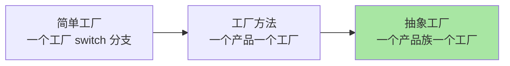
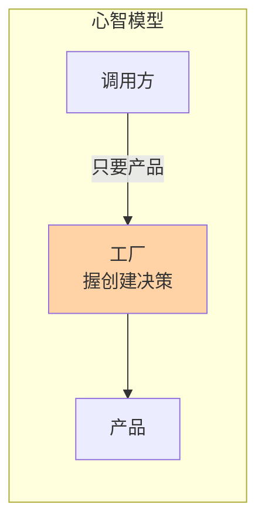
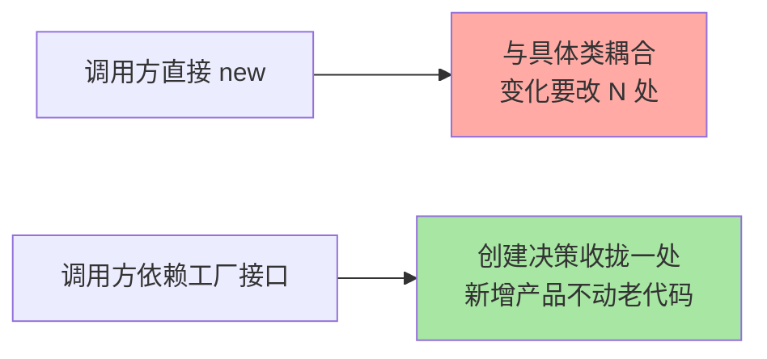

# 深入理解工厂模式系列

> 简单工厂 / 工厂方法 / 抽象工厂——工厂家族的价值不在「少 new 一个对象」，而在「把创建的决策收拢到一处」。本系列讲清三代的演进逻辑与真实工程定位。

## 这个目录讲什么

工厂模式解决的是「对象创建与使用耦合」：调用方依赖具体类，扩展就要改调用方。本系列正文按三代演 进拆解——简单工厂（一个工厂 switch 分支）、工厂方法（一个产品一个工厂）、抽象工厂（一个产品族一个工厂）——每代解决上一代什么痛点、付出什么代价。

## 这个目录下有哪些文章

| 篇目 | 类型 | 一句话重点 |
|---|---|---|
| 1_工厂模式-特性 | 特性 | 三代工厂演进逻辑；与策略/模板的协作；Spring BeanFactory 的工厂思想 |
## 我能得到什么

- 说清三代工厂的演进逻辑：每代解决什么、代价是什么
- 判断「该用工厂还是直接 new」的决策标准（创建决策是否需要收拢）
- 看懂 Spring IoC 容器里工厂模式的工业化形态

## 我想看哪一篇

- **按方向**：系统学习 → 通读篇 1 三代演进主线
- **按问题**：「工厂和策略什么关系」→ 篇 1 协作节；「Spring 怎么用工厂」→ 篇 1 BeanFactory 节
- **按阶段**：快速回顾 → 篇 1 三代对比表 + 追问链

## 📌 维护说明

新增文章必须同步更新本导航表，并在「我想看哪一篇」中补充对应阅读路径。

## 选型一览与 Trade-off

工厂把创建决策收拢后，跨系统模块只依赖工厂接口即可协作。Trade-off：类数量与间接层是即时成本，换的是「新增产品不动老代码」的跨期收益——代码量到千万行量级的仓库里，这个取舍几乎单向成立。
这是工厂在 IoC 架构里升级为容器的原因。

## 📌 数据与事实声明

- 写于 2026-09-15（系列导读）；模式机制描述以 GoF《设计模式》与 JDK/Spring 官方文档公开口径为准
- 免责：框架行为以实际版本源码为准

## 📚 参考资料

| 类型 | 标题 | 来源 |
|---|---|---|
| 经典书 | 《设计模式：可复用面向对象软件的基础》（GoF） | 公开出版 |
| 官方文档 | Spring Framework AOP / Core | docs.spring.io |
