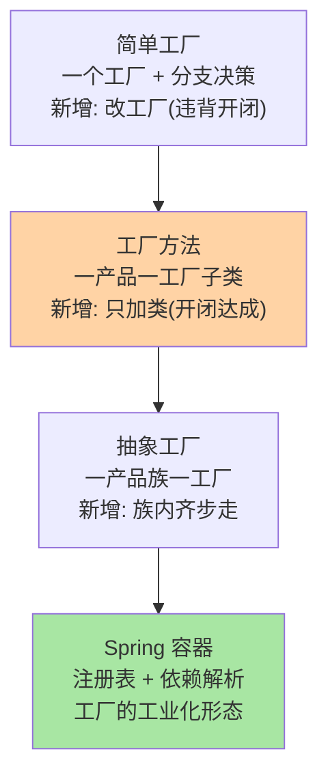
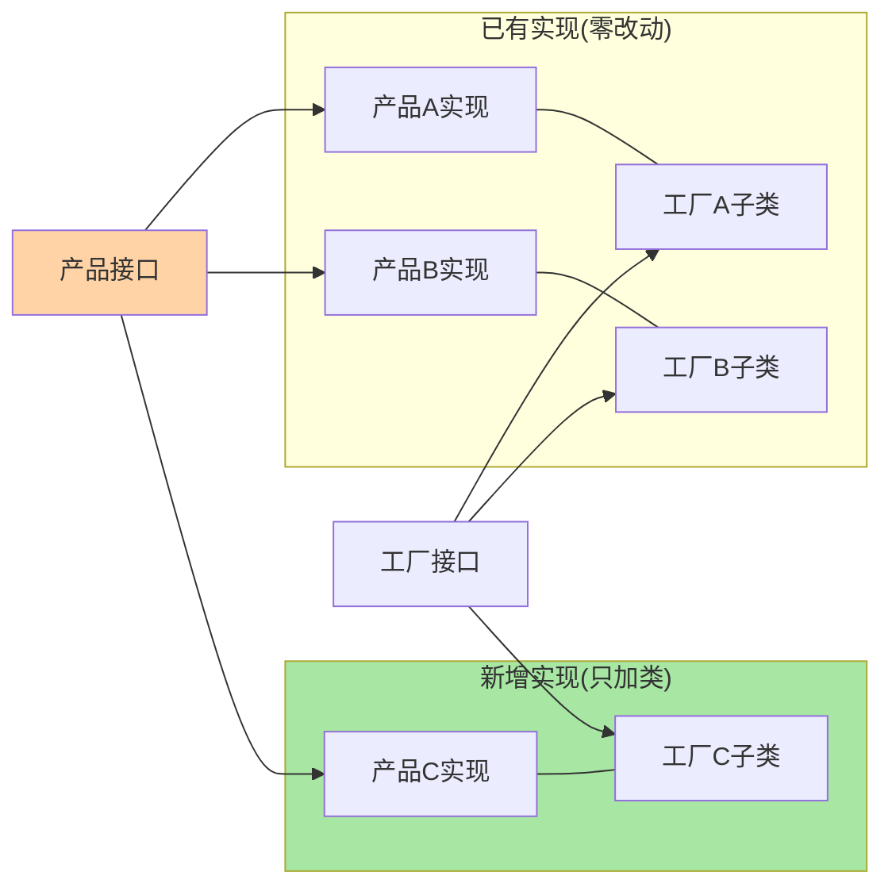
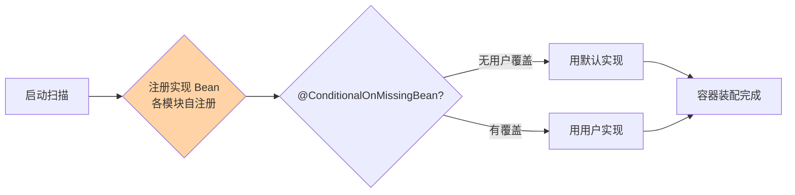

# 工厂模式：三代演进、Spring 工业形态与创建收拢的边界

> 工厂模式最容易被讲成「少 new 一个对象」——这是误读。它的真实价值是**把「创建哪个实现」的决策从调用方收拢到一处**：决策点收敛了，扩展才不用改老代码。本篇按三代演进（简单工厂 → 工厂方法 → 抽象工厂）拆每代解决的痛点与引入的代价，再落到 Spring BeanFactory 的工业化形态与「该不该用工厂」的判定口诀。

> **本文核心**：工厂的机制本质是「决策外置 + 装配收拢」——调用方只依赖产品接口与工厂接口，「选哪个实现」的知识被隔离进工厂；三代演进是决策知识组织方式的演进（单点分支 → 一产品一工厂 → 一产品族一工厂）。判断要不要工厂只问一句：**「新增一个实现时，理想的改动范围是多大？」**——答案是「只加一个类」才值得引入工厂，答案是「要改 if-else」说明决策还散在调用方。

## 一句话摘要

工厂模式家族解决「对象创建与使用耦合」：调用方硬编码具体类，新增实现就要改调用方。简单工厂用一个工厂类的分支语句集中选择，新增实现要改工厂（违背开闭但结构最简）；工厂方法为每个产品配一个工厂子类，新增实现 = 新增一对产品/工厂类，零改动老代码；抽象工厂面向产品族（一套相关产品一起换），工厂接口声明族内全部产品。Spring IoC 容器是工厂思想的工业化形态：Bean 定义即「产品注册」，容器按类型/名字解析依赖——工厂方法模式里「新增不改老代码」的性质，被容器放大成「配置驱动装配」。

## 🎯 本文核心（机制坐标）

三代工厂的决策组织方式：

## 一、源码关键路径：三代的结构与决策位置

**简单工厂**（严格说是惯用法不是 GoF 模式）：静态方法 + 分支。决策知识（「什么条件建什么」）写死在工厂内，调用方干净了，但工厂自己成为所有变更的汇合点。**工厂方法**：定义「产品接口 + 工厂接口」，每代实现各配工厂子类——决策知识按产品切分进各子类，新增产品不动任何老类，代价是类数量翻倍。**抽象工厂**：工厂接口声明一族产品（如 `DbFactory.createConnection() + createCommand()`），换数据库 = 换工厂实现，族内产品保证配套——族结构是它的价值也是它的枷锁（族内加新产品要动全部工厂接口）。

Spring 的 BeanFactory 路径：Bean 定义注册（`registerBeanDefinition`）→ 依赖解析（按类型/名称查注册表）→ 实例化与装配（构造器注入走 `createBeanInstance` 的候选构造器解析）。它把「决策知识」外置成**配置与注解**（@Component 扫描、@Conditional 条件装配），决策粒度从「代码分支」升级为「声明式条件」——`@ConditionalOnMissingBean` 这类条件就是「可覆盖的默认决策」，这是容器超越三代工厂的地方。

工厂方法的结构与新增路径：

## 二、与策略模式、模板方法的区别辨析

| 维度 | 工厂 | 策略 | 模板方法 |
|---|---|---|---|
| 解决什么 | 「创建哪个实现」的决策收拢 | 「用哪个算法」的运行期切换 | 流程骨架固定、细节子类填 |
| 变化轴 | 实现的构造 | 实现的行为 | 流程中的步骤 |
| 典型搭档 | 常与策略搭配：工厂建策略，调用方用策略 | — | 钩子方法 |

三者的分工一句话：**工厂管「生」，策略管「用哪个」，模板管「按什么顺序用」**。混淆的典型是把策略选择写成工厂分支——判断依据是「选择是否随请求变化」：每次调用可能不同（按渠道、按租户）是策略问题；启动期确定、长期不变的是装配问题，归工厂/容器。

Spring 条件装配把决策外置成声明：

## 三、典型使用场景

- **多渠道路由**：支付渠道、消息通道按配置装配实现，新增渠道加一对类 + 一段配置
- **跨环境装配**：开发/测试/生产的实现不同（内存版/真连版），工厂按环境装配——容器里就是 profile + conditional
- **驱动/连接器族**：抽象工厂的标准领地（JDBC 的 Connection/Statement 族、跨库方言族）
- **复杂构造收敛**：构造参数多、装配步骤多（重试器、连接池），工厂/Builder 收拢构造知识，调用方免于记参数

## 四、误区与不适用

- ❌ **「用了工厂就是好架构」**：只有一个实现且看不到第二个时，工厂是纯中介层——决策收拢的价值来自「确实会多实现」，投机性工厂让代码多跳一层只为了 new
- ❌ **「简单工厂的分支是坏味道，必须改成工厂方法」**：分支稳定的场景（产品集合长期不变）改造成对是类数量膨胀——开闭原则服务可变性，可变性不存在时强上开闭是过度设计
- ❌ **「抽象工厂先建好族框架」**：族需求（配套约束）没出现时提前建族，接口会被第一个实现绑架——族结构从第二套实现出现时再抽象，来得及
- ❌ **「工厂里做业务逻辑」**：工厂的职责边界是「构造与装配」，塞进业务判断后它同时是工厂和策略，双重职责让它两边都无法独立演进

## 五、事故叙事两则

**叙事一：工厂分支越界，一次「新增渠道」改崩三个老渠道。**某聚合支付模块用简单工厂装配渠道实现，新增渠道时同事顺手把「渠道手续费计算」也塞进工厂分支——分支从装配决策膨胀成业务决策，改一处逻辑回归三个老渠道（分支共享了局部变量与默认值）。上线后老渠道手续费错算，资损告警。复盘沉淀：**工厂分支只做装配决策，装配决策与业务决策的分界要进评审清单**；该模块随后改造成工厂方法 + 各渠道自持费率，装配与业务解耦。

**叙事二：抽象工厂的族接口被第一个实现绑架。**某存储网关提前设计了抽象工厂（Connection/Query/Transaction 三方法族），第一个实现接入某云存储时发现其事务语义特殊，需要第四个方法——改族接口，三个已实现类全部跟着改，波及发版。复盘沉淀：**族接口在单实现阶段不冻结**；用内部接口 + 第二套实现立项时再收拢族结构，「从具体中抽象」比「先抽象后适配」便宜。

## 六、追问链：把「开闭原则」问穿一层

- **追问一：工厂方法「新增不改老代码」，但类数量翻倍——这笔账什么时候划算？**——按实现的预期数量与变更频率算：实现 ≥3 个或半年内持续新增，类翻倍的成本被「不改老代码」的回归成本节省覆盖；实现恒为两个且稳定，简单工厂的分支更诚实。**开闭是手段不是目标**，目标是「变更的物理范围小」。
- **再追问：容器时代还有「工厂方法模式」的位置吗？**——容器接管了「装配决策」的绝大部分（扫描 + 条件装配），手写工厂退守到三个位置：运行期动态选择（按请求参数选实现，容器做不到）、非托管对象的构造（线程内工具、第三方对象）、装配知识需要显式表达的复杂构造。**容器管静态装配，手写工厂管动态选择**——这个分界比「容器过时了工厂」或「工厂过时了」都更接近实况。
- **打破砂锅：按请求参数选择实现，是不是就该写 if-else？**——参数维度少且稳定可以；维度多或持续新增时，选择逻辑自己就成了「需要工厂的创建物」——策略注册表（Map<维度, 实现>）+ 注册期校验是收敛解。判断口径：**选择逻辑本身是否需要独立演进**，需要就把它对象化，不需要就 if-_else 诚实放着。

## 七、反方案分析：不引入工厂的替代路线

- **直接 new + 变更时改调用方**：实现少、调用方少时最直白；把「重构到工厂」留给第一次真正的多实现需求（Rule of Three 的应用）——过早抽象的成本在每次阅读都付，延迟抽象的成本只在重构时付一次
- **静态工具方法替代工厂类**：无状态构造场景（`Pools.newFixed(n)`）静态工厂方法足够——它收拢了构造知识但没有多态装配诉求，上工厂接口是空转
- **Builder 替代抽象工厂**：参数爆炸但单实现时，Builder 管构造可读性；抽象工厂管多实现族配套——两者解决不同问题，参数多 + 实现多才同时上

## 八、设计思想：决策知识的归属设计

三代演进的底层思想是**决策知识放在离变化最近的地方**：变化集中在「新增实现」，工厂方法就把「选我」的知识放进新实现自带的工厂子类——新增即完备，老代码零感知。容器再进一步把知识外置为声明（注解/配置），让「不写代码的变更」成为可能。这套思想与依赖倒置同源：**上层依赖抽象，具象的知识由下层自带，装配层只做粘合**。判断一个工厂设计好坏的透视镜：新增实现时，需要触碰的文件里有几个是「别人的」？理想答案是零。

## 九、不同量级的思考：装配复杂度的演进

- **十万级 QPS / 单体应用**：约束来源是代码可读性——容器扫描 + 少量手动装配即可，装配层越薄越好。这一档的核心问题是「装配知识是否显式」，而不是「扩展点是否完备」
- **百万级 QPS / 多模块**：约束来源是模块边界——跨模块的实现互相不可见，装配必须经接口与注册机制（SPI/自动装配），实现自带装配声明。这一档的核心问题是「装配决策的物理归属」，解法是各模块自注册，聚合层零硬编码
- **千万级 QPS / 平台化**：约束来源是第三方扩展——平台不可能替所有业务写实现，装配决策开放给业务方（插件机制 + 条件装配 + 隔离加载）。这一档的核心问题是「开放装配的治理」，解法是插件契约、装配校验与隔离类加载

**自下而上与触发升级**：先数实现数量与变更频率（年新增几次），决定装配层厚度；触发升级的信号是「新增实现要改 N 个文件」「跨模块装配开始出现硬编码」——约束从可读性迁到边界再迁到开放治理时，装配机制跟着换挡，不在原结构上加 if-else 硬扛。

### SPI：装配决策的标准化外置

JDK 的 ServiceLoader（SPI）把「实现发现」标准化：接口约定 → 实现方在 `META-INF/services` 声明 → 加载方按接口发现全部实现。它正是「各模块自注册、聚合层零硬编码」的平台化形态——JDBC 驱动发现、Dubbo SPI（增强版：按 key 定向获取、自适应扩展、IOC/AOP 化）都是这条路线。SPI 的工程纪律两条：发现结果是**全量加载**（要过滤与延迟实例化，Dubbo 为此做了按 key 懒加载）；实现声明与接口版本要一起演进（声明了不存在的接口方法，运行期才炸）。Spring Boot 自动装配是同一思想的能力加强版：条件化 + 排序 + 覆盖语义，把 SPI 的「全量平等」升级为「有优先级的协商装配」——从 JDK SPI 读到 Spring 自动装配，能看清「装配决策外置」这条主线的完整进化。

## 十、业内惯例

- JDK 里的教科书：`Executors`（静态工厂方法收拢线程池构造知识）、`java.text.NumberFormat.getInstance`（工厂方法按环境返回实现）、`javax.xml.parsers` 族（抽象工厂 + SPI 发现）
- Spring 生态惯例：实现类用 @Component 自注册、聚合处 @ConditionalOnMissingBean 留覆盖位——「默认可覆盖」是条件装配的核心惯例
- 团队规范常见收敛：工厂只做装配、策略注册表带启动校验、抽象工厂等第二实现出现再抽象——三条都指向同一个方向：**决策知识显式化、变更范围物理化**

## 你们可能会问

**Q1：工厂方法每产品一个工厂类，类爆炸怎么办？**
先核对实现数量预期：预期 ≤3 且稳定就不该用工厂方法（简单工厂）。确实持续新增时，类翻倍是「新增自完备」的定价——Java 生态里常用「实现类自带注册」（静态块注册到注册表）把两个类合成一个文件，类数量心智减半。

**Q2：Spring 里 @Bean 方法算工厂方法吗？**
算——配置类的方法就是「工厂」，容器调用它产产品。它与 GoF 工厂方法的差别在决策位置：@Bean 的决策在配置集中（集中式装配），GoF 工厂方法的决策分散在各子类（分布式装配）。小项目集中式可读性好，插件式扩展必须分布式。

**Q3：抽象工厂和「配置组合」怎么选？**（补充：两者可以渐进过渡——先用配置组合表达族关系，等约束复杂到配置说不清，再把配置组收拢成抽象工厂接口，迁移路径平滑，不必一步到位。）
产品族的「配套约束」能被配置表达（一组开关/实现类名）就用配置组合——容器条件装配天然支持；配套约束需要行为保证（族内方法互相依赖内部契约）才上抽象工厂。配置表达不了的约束才值得用类型系统表达。

## 十一、什么时候用 / 不用

- ✅ 用：多实现且持续新增（渠道、驱动、连接器），装配决策需要收拢
- ✅ 用：复杂构造知识需要收拢（多参数、多步骤、依赖组装）——工厂/Builder 均可，看是否多实现
- ❌ 不用：单实现且无第二实现预期——直接构造，留重构余地
- ❌ 不用：运行期按请求切换实现——那是策略问题，工厂只负责把策略们造出来
- ❌ 不用：容器已管的静态装配再手写一层工厂——双轨装配，改配置不生效的事故来源

## Trade-off：变更范围与结构厚度的交换

工厂家族的全部 Trade-off 集中在一条轴上：**决策知识越收拢，新增实现的改动范围越小，但结构（类数量/间接层）越厚**。三代就是这条轴上的三个档位，容器是第四档（结构最薄但依赖容器心智）。正确的档位由「实现的预期数量 × 变更频率」决定，而不是由「架构先进性」决定——档位选错的方向通常不是「太薄」，是「在可变性证据出现前就把结构建厚」。

## 开放问题

- GraalVM 原生镜像约束下，运行期反射装配转向构建期确定（AOT 装配元数据），「声明式装配」的动态性边界在重划
- 插件化平台的装配隔离（独立类加载器、版本共存）在头部平台成型，「装配决策」正在从应用内概念扩展为跨应用治理概念

## 💡 实战提示

- 💡 引入工厂前先回答「新增实现的理想改动范围」——答案是「只加类」才引入，答案是「改分支」说明还在简单工厂阶段，别硬升
- 💡 工厂分支只做装配决策，业务决策进产品实现——分界进评审清单
- 💡 容器管静态装配，手写工厂管运行期动态选择——双轨并存时写清各自边界
- 💡 抽象工厂等第二套实现立项再抽象——族接口不被第一个实现绑架
- 💡 策略注册表必须带启动期重复注册校验与未注册告警——装配错误在启动期炸，不在运行期飘

### 一个组合案例：渠道工厂的完整形态

把本篇机制拼成一个真实形态：渠道实现自注册进注册表（工厂方法思想的注册变体）→ 启动期校验注册完整性（重复/缺失当场炸）→ 运行期按「渠道维度 + 健康度」选择（决策可观测）→ 失败熔断到渠道粒度（治理兜底）。注意这个形态里「工厂」已经拆成三个组件：注册表（创建收拢）、路由器（选择）、熔断器（治理）——**GoF 的一个工厂类在生产环境会长成一个子系统**，这是正常演化而不是设计走样；关键是在每个演化阶段，决策知识与治理件的边界都保持显式。

## 自测三问

1. 三代工厂的决策知识各放在哪里？各自的变更代价是什么？
2. 容器时代手写工厂退守到哪三个位置？
3. 「决策知识放在离变化最近的地方」如何透视一个工厂设计的好坏？

## 🎯 核心带走

- **核心一句话**：工厂 = 创建决策的收拢——三代演进是决策知识组织方式的演进（单点分支 → 按产品分散 → 按族分散），容器是它的声明式第四代
- **判定口诀**：新增实现理想改动范围 = 只加类，才值得上工厂方法；族约束出现第二套实现才上抽象工厂
- **哪里会坏**：工厂分支混业务决策、族接口被首实现绑架、投机性工厂空转一层
- **边界**：工厂管「生」，策略管「用哪个」，模板管「顺序」；运行期动态选择不归容器
- **量级迁移**：十万级问显式、百万级问归属、千万级问开放治理

### 多实现共存的运行期治理

实现多了之后，运行期的治理问题跟着来：①**选择可观测**——每次按维度选实现要留决策日志（选了哪个、为什么），否则「为什么走了这条渠道」成了悬案；②**实现隔离**——单个实现抛异常不能拖垮选择器（装配层的防御性 try 与降级位），渠道级的失败要能熔断到渠道粒度；③**健康度反馈**——各实现的调用成功率回流到选择器（优先健康实现），装配决策从静态配置升级为带反馈的动态路由。到这一步，工厂已经不是「创建模式」，而是「路由决策系统」——这正是平台化团队的工厂终态：**创建、选择、治理三层合一**。识别自己的工厂走到哪一层，决定接下来要补的是治理件还是保持简单。

## 📌 数据与事实声明

- 写于 2026-09-15；三代工厂定义以 GoF《设计模式》为准；Spring BeanFactory 装配路径以官方文档与源码公开口径为准
- 事故叙事为业内高频架构缺陷模式的匿名化叙事，非特定公司事件
- 免责：框架行为以对应版本文档为准

## 📚 参考资料

| 类型 | 标题 | 来源 |
|---|---|---|
| 经典书 | GoF《设计模式》（Factory Method / Abstract Factory 章） | 公开出版 |
| 官方文档 | Spring Framework Core（BeanFactory 与条件装配） | docs.spring.io |
| 官方源码 | spring-framework（DefaultListableBeanFactory） | github.com/spring-projects/spring-framework |
| 系列内 | 0_系列导读（三代演进心智图） | 本目录 |
| 关联系列 | 策略与观察者系列（选择逻辑的对象化） | 特性层同目录 |
