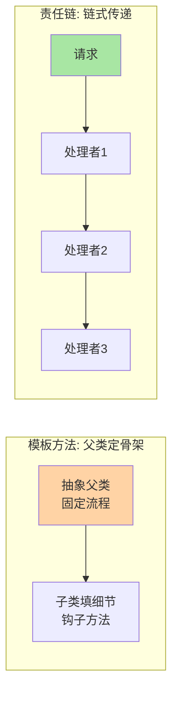
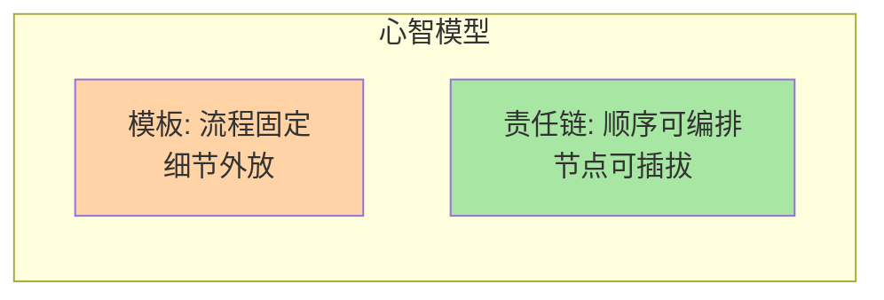
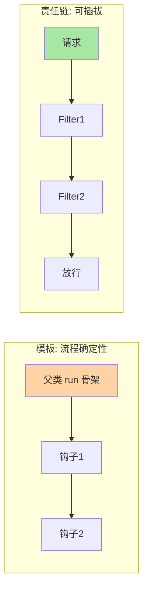

# 深入理解模板方法与责任链系列

> 模板方法固定骨架开放细节，责任链让请求穿过一串处理者——一个是「父类定流程」，一个是「链式传递」。框架源码里出镜率最高的两个行为型模式。

## 这个目录讲什么

模板方法用「父类定骨架、子类填细节」固化流程（Servlet service、JdbcTemplate、Spring run 方法）；责任链把多个处理者串成链逐个判断能否处理（Filter 链、Interceptor 链、网关过滤器链）。正文拆两模式的机制、框架中的真实形态与设计代价（模板的继承约束、链的顺序敏感性）。

## 这个目录下有哪些文章

| 篇目 | 类型 | 一句话重点 |
|---|---|---|
| 1_模板方法与责任链-特性 | 特性 | 钩子方法设计；Servlet/JdbcTemplate 骨架源码；Filter 链顺序敏感性与治理 |
## 我能得到什么

- 理解「 Hollywood Principle」：流程控制权在父类，细节实现留给子类
- 看懂 Filter/Interceptor 责任链在框架中的真实实现与执行顺序规则
- 识别两模式的代价：模板的继承刚性、链的顺序依赖与调试困难

## 我想看哪一篇

- **按方向**：系统学习 → 通读篇 1，两模式各占一半
- **按问题**：「框架的 run 流程怎么被扩展」→ 篇 1 模板节；「Filter 执行顺序错乱」→ 篇 1 责任链治理节
- **按阶段**：快速回顾 → 篇 1 追问链 + 框架源码对照

## 📌 维护说明

新增文章必须同步更新本导航表（本系列正文扩篇时同步补充），并在「我想看哪一篇」中补充对应阅读路径。

## 选型一览与 Trade-off

两模式的扩展点都长在框架的跨系统链路上（Servlet、RPC、网关过滤器）。Trade-off：模板方法用继承刚性换流程确定性，责任链用顺序敏感换可插拔——链超过五层后排查成本跨期放大，量级到每秒十万级请求的入口，链要按职能分层收敛。
这是两模式在框架架构里无处不在的原因。

## 📌 数据与事实声明

- 写于 2026-09-15（系列导读）；模式机制描述以 GoF《设计模式》与 JDK/Spring 官方文档公开口径为准
- 免责：框架行为以实际版本源码为准

## 📚 参考资料

| 类型 | 标题 | 来源 |
|---|---|---|
| 经典书 | 《设计模式：可复用面向对象软件的基础》（GoF） | 公开出版 |
| 官方文档 | Spring Framework AOP / Core | docs.spring.io |
